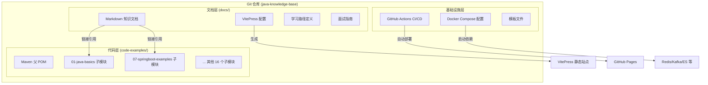
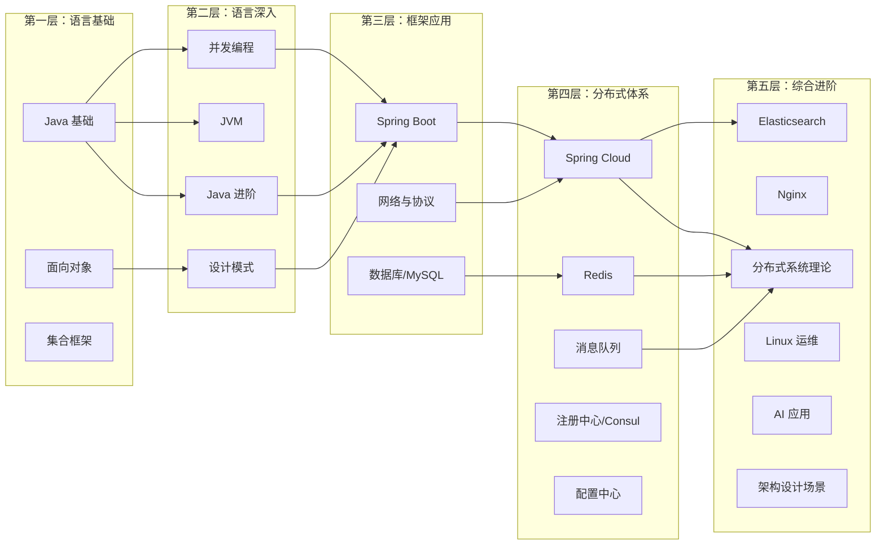
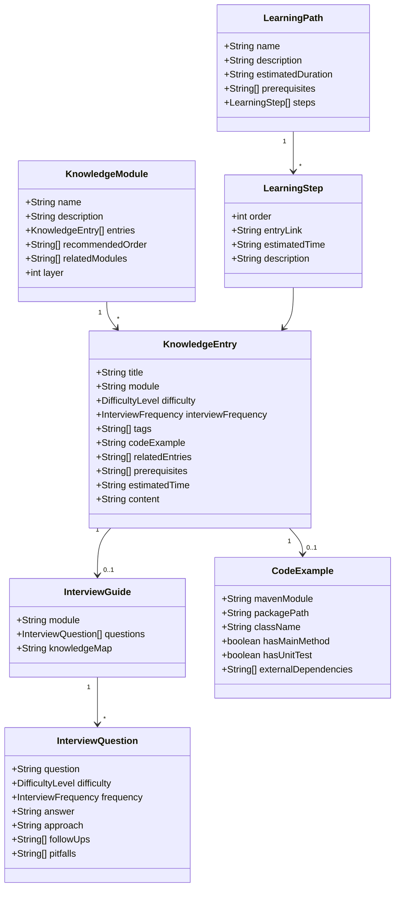
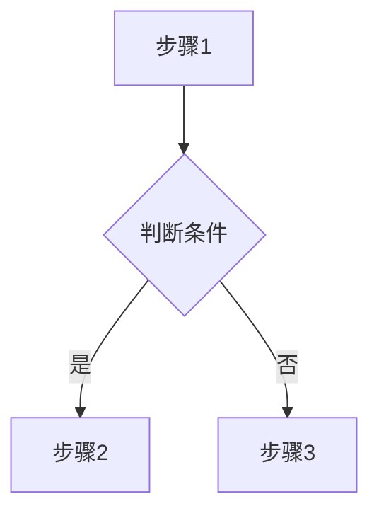

# 技术设计文档：Java 个人知识库

## 概述

本设计文档描述 Java 个人知识库系统的技术架构与实现方案。项目采用**方式四混合方案**：Markdown 知识文档 + Maven 多模块代码项目 + VitePress 静态站点，三者通过 Git 统一管理，托管在 GitHub 上。

### 设计目标

1. **循序渐进的学习体验**：内容组织遵循认知规律，从具体到抽象、从简单到复杂
2. **面试导向**：每个知识点都关联面试高频题，支持快速复习
3. **代码可运行**：所有代码示例可独立编译运行，通过实践加深理解
4. **低维护成本**：纯静态方案，零运维，专注内容本身
5. **注册中心优先 Consul**：微服务相关内容以 Consul 为主线展开

### 设计决策

| 决策项 | 选择 | 理由 |
|--------|------|------|
| 静态站点生成器 | VitePress | Vue 生态、内置搜索、Markdown 扩展丰富、构建速度快 |
| 代码项目构建工具 | Maven | Java 生态标准、多模块支持成熟、面试中常被问到 |
| 版本控制 | Git + GitHub | 免费托管、GitHub Pages 部署、CI/CD 支持 |
| 注册中心主线 | Consul | CP 模型更适合生产环境、功能全面（服务发现+健康检查+KV） |
| 文档语言 | 中文 | 面向中文开发者，降低学习门槛 |
| 部署方式 | GitHub Pages | 免费、自动化、无需服务器 |

---

## 架构

### 整体架构

项目由三个核心层组成，通过 Git 仓库统一管理：



### 学习路径架构（循序渐进设计）

知识模块按照**认知负荷理论**组织，遵循以下学习层次：



这种分层设计的核心理念：
- **第一层**：打牢 Java 语言基础，这是一切的根基
- **第二层**：深入语言底层原理，理解"为什么"
- **第三层**：掌握主流框架和工具，解决"怎么用"
- **第四层**：进入分布式领域，理解微服务架构
- **第五层**：综合运用，面向实际场景和面试

---

## 组件与接口

### 1. 文档组件 (docs/)

文档层是知识库的核心，负责所有知识内容的组织和呈现。

#### 目录结构

```
docs/
├── .vitepress/
│   ├── config.mts          # VitePress 主配置
│   ├── theme/
│   │   └── index.ts        # 自定义主题扩展
│   └── sidebar.mts         # 侧边栏配置（自动生成或手动维护）
├── index.md                # 首页
├── guide/
│   ├── getting-started.md  # 快速开始
│   └── how-to-use.md       # 使用指南
├── java-basics/            # Java 基础模块
│   ├── index.md            # 模块概述
│   ├── data-types.md       # 数据类型与包装类
│   ├── string-deep-dive.md # String 深入
│   ├── oop.md              # 面向对象
│   ├── collections.md      # 集合框架
│   ├── exceptions.md       # 异常处理
│   ├── generics.md         # 泛型
│   ├── reflection.md       # 反射
│   ├── annotations.md      # 注解
│   ├── io-streams.md       # 文件与流处理
│   ├── lambda-stream.md    # Lambda 与 Stream API
│   ├── new-features.md     # JDK 版本特性演进（JDK8/17/21）
│   └── interview.md        # 面试指南
├── java-advanced/          # Java 进阶模块
├── concurrent/             # 并发编程模块
├── jvm/                    # JVM 模块
├── design-patterns/        # 设计模式模块
├── network/                # 网络与协议模块
├── springboot/             # Spring Boot 模块
├── springcloud/            # Spring Cloud 模块
├── redis/                  # Redis 模块
├── mq/                     # 消息队列模块
├── elasticsearch/          # Elasticsearch 模块
├── database/               # 数据库模块
├── nginx/                  # Nginx 模块
├── config-center/          # 配置中心模块
├── registry/               # 注册中心模块
├── distributed/            # 分布式系统理论模块
├── linux/                  # Linux 运维基础模块
├── ai/                     # AI 应用模块
├── architecture/           # 架构设计场景模块
├── algorithm/              # 数据结构与算法模块
├── docker-k8s/             # Docker 与 Kubernetes 模块
├── learning-paths/         # 学习路径
│   ├── beginner.md         # Java 初学者路径
│   ├── intermediate.md     # Java 中级进阶路径
│   ├── advanced.md         # Java 高级深入路径
│   ├── interview-sprint.md # 面试突击路径
│   └── architect.md        # 架构师成长路径
├── interview/              # 面试汇总
│   ├── by-company.md       # 按公司类型分类
│   └── knowledge-map.md    # 面试知识图谱
└── templates/
    └── entry-template.md   # 知识条目模板
```

#### 知识条目接口（Markdown Frontmatter）

每个知识条目通过 YAML frontmatter 定义元数据：

```yaml
---
title: HashMap 扩容机制与红黑树转换
module: java-basics           # 所属模块
difficulty: intermediate      # 初级 | 中级 | 高级
interviewFrequency: high      # 高频 | 中频 | 低频
tags:
  - 集合框架
  - 源码分析
  - 面试高频
codeExample: 01-java-basics/src/main/java/com/example/collections/HashMapDemo.java
relatedEntries:
  - /java-advanced/hashmap-source
  - /concurrent/concurrent-hashmap
prerequisites:
  - /java-basics/collections
estimatedTime: 45min          # 建议学习时间
---
```

### 2. 代码示例组件 (code-examples/)

#### Maven 多模块结构

```
code-examples/
├── pom.xml                              # 根 POM（Java 21, Spring Boot 3.2.5）
│
├── 01-java-core/                        # Java 核心分组
│   ├── pom.xml                          # 分组 POM（packaging: pom）
│   ├── java-basics/                     # Java 基础示例
│   │   ├── pom.xml
│   │   └── src/main/java/com/example/basics/
│   │       ├── datatypes/               # 数据类型示例
│   │       ├── string/                  # String 相关示例
│   │       ├── oop/                     # 面向对象示例
│   │       ├── collections/             # 集合框架示例
│   │       ├── generics/                # 泛型示例
│   │       ├── reflection/              # 反射示例
│   │       ├── io/                      # IO 流示例
│   │       └── stream/                  # Stream API 示例
│   ├── java-advanced/                   # Java 进阶示例
│   ├── concurrent-programming/          # 并发编程示例
│   ├── jvm-deep-dive/                   # JVM 示例
│   └── design-patterns/                 # 设计模式示例
│
├── 02-framework/                        # 框架层分组
│   ├── pom.xml
│   ├── springboot-examples/             # Spring Boot 示例
│   ├── springcloud-examples/            # Spring Cloud 示例
│   └── network-programming/             # 网络编程示例
│
├── 03-data-store/                       # 数据存储分组
│   ├── pom.xml
│   ├── database-examples/               # 数据库示例
│   ├── redis-examples/                  # Redis 示例
│   ├── elasticsearch-examples/          # Elasticsearch 示例
│   ├── mongodb-examples/                # MongoDB 示例（新增）
│   └── minio-examples/                  # MinIO 示例（新增）
│
├── 04-middleware/                        # 中间件分组
│   ├── pom.xml
│   ├── mq-rabbitmq-examples/            # RabbitMQ 示例
│   ├── mq-kafka-examples/               # Kafka 示例
│   ├── mq-mqtt-examples/                # MQTT 示例（新增）
│   ├── config-center-examples/          # 配置中心示例
│   ├── registry-examples/               # 注册中心示例（从 springcloud 独立）
│   └── nginx-examples/                  # Nginx 配置示例（无 POM）
│       └── conf/                        # Nginx 配置文件
│
├── 05-distributed/                      # 分布式分组
│   ├── pom.xml
│   └── distributed-examples/            # 分布式示例
│
├── 06-devops/                           # DevOps 运维分组
│   ├── pom.xml
│   ├── docker-k8s-examples/             # Docker/K8s 示例（新增独立）
│   ├── cicd-examples/                   # CI/CD 示例（新增）
│   └── monitoring-examples/             # 监控示例（新增）
│
└── 07-ai/                               # AI 应用分组
    ├── pom.xml
    └── ai-examples/                     # AI 应用示例
```

#### 父 POM 接口设计

```xml
<!-- 关键配置项 -->
<properties>
    <java.version>21</java.version>
    <spring-boot.version>3.2.5</spring-boot.version>
    <spring-cloud.version>2023.0.1</spring-cloud.version>
</properties>
```

每个子模块 POM 只声明自身需要的依赖，通过父 POM 统一管理版本号。子模块之间无相互依赖，确保可独立编译。

### 3. VitePress 配置组件

#### 核心配置接口 (.vitepress/config.mts)

```typescript
// 关键配置项
export default defineConfig({
  title: 'Java 知识库',
  description: 'Java 开发者的个人知识库',
  lang: 'zh-CN',
  themeConfig: {
    nav: [...],           // 顶部导航
    sidebar: {...},       // 侧边栏（按模块组织）
    search: {
      provider: 'local'  // 内置本地搜索
    },
    socialLinks: [...]
  },
  markdown: {
    mermaid: true,        // 支持 Mermaid 流程图
    lineNumbers: true     // 代码行号
  }
})
```

### 4. CI/CD 组件 (.github/)

```yaml
# GitHub Actions 工作流接口
# 触发条件：push 到 main 分支
# 步骤：
#   1. checkout 代码
#   2. 安装 Node.js + pnpm
#   3. 构建 VitePress 站点
#   4. 部署到 GitHub Pages
# 可选步骤：
#   - 检查 Markdown 断链
#   - 编译 Maven 项目验证代码示例
```

### 5. Docker 组件 (docker/)

```
docker/
├── docker-compose.yml          # 基础中间件（Redis、MySQL）
├── docker-compose.mq.yml       # 消息队列（RabbitMQ、Kafka）
├── docker-compose.es.yml       # Elasticsearch
├── docker-compose.consul.yml   # Consul
├── docker-compose.apollo.yml   # Apollo 配置中心
└── docker-compose.nginx.yml    # Nginx
```

按需启动，避免一次性启动所有服务占用过多资源。

---

## 数据模型

### 知识条目数据模型



### 难度级别枚举

| 值 | 含义 | 面试场景 |
|----|------|----------|
| `beginner` | 初级 - 基础概念和用法 | 校招/初级岗位 |
| `intermediate` | 中级 - 原理和源码分析 | 中级岗位/大厂初面 |
| `advanced` | 高级 - 底层实现和架构设计 | 高级岗位/大厂深面 |

### 面试频率枚举

| 值 | 含义 | 建议 |
|----|------|------|
| `high` | 高频 - 几乎每次面试都会问 | 必须掌握，优先复习 |
| `medium` | 中频 - 经常出现 | 应该掌握 |
| `low` | 低频 - 偶尔出现 | 了解即可 |

### 标签分类体系

```yaml
# 技术领域标签
domain:
  - Java 基础
  - 并发编程
  - JVM
  - Spring
  - 中间件
  - 数据库
  - 分布式
  - 架构设计

# 知识类型标签
type:
  - 概念      # 理论知识
  - 原理      # 底层原理分析
  - 实战      # 实际应用场景
  - 面试      # 面试专项
  - 源码      # 源码分析

# 难度级别标签
difficulty:
  - 初级
  - 中级
  - 高级
```

### 知识条目 Markdown 模板

```markdown
---
title: [知识点标题]
module: [所属模块]
difficulty: [beginner|intermediate|advanced]
interviewFrequency: [high|medium|low]
tags: [标签列表]
codeExample: [代码示例路径]
relatedEntries: [相关条目链接列表]
prerequisites: [前置知识链接列表]
estimatedTime: [建议学习时间]
---

# [知识点标题]

## 概念说明
[用通俗易懂的语言解释这个知识点是什么、解决什么问题]

## 核心原理
[深入分析底层原理，配合图表说明]

<!-- 如果涉及复杂流程，必须包含 Mermaid 流程图 -->


## 代码示例
[关键代码片段 + 指向 code-examples 中完整可运行代码的链接]

> 💻 完整可运行代码：[code-examples/模块名/路径](链接)
> ⚠️ 每个知识点必须有对应的可运行代码示例

## 常见面试题

### Q1: [面试题目]
**难度**：⭐⭐⭐ | **频率**：🔥🔥🔥

**答题思路**：
[分步骤的答题思路]

**标准答案**：
[完整答案]

**深入追问**：
- [追问1]
- [追问2]

**易错点**：
- [易错点1]

## 参考资料
- [资料1](链接)
```

---

## 关于正确性属性（Correctness Properties）

本项目的核心产出是 Markdown 知识文档、Maven 项目配置、VitePress 静态站点配置和 CI/CD 流水线，属于**内容创作 + 静态站点配置 + 基础设施配置**的范畴。项目不包含自定义业务逻辑、数据转换函数或算法实现，因此**属性基测试（Property-Based Testing）不适用于本项目**。

不适用的原因：
- Markdown 文档是静态内容，不是有输入输出的函数
- VitePress 配置是声明式配置，不是可测试的逻辑
- Maven POM 是项目结构定义，不涉及运行时行为
- Docker Compose 是基础设施编排，适合用集成测试验证
- GitHub Actions 是 CI/CD 流水线，适合用端到端测试验证

替代测试策略在下方"测试策略"章节中详细说明。

---

## 错误处理

### 1. 构建阶段错误处理

| 错误场景 | 处理方式 |
|----------|----------|
| Markdown 文件存在断链（引用不存在的文件或锚点） | VitePress 构建时通过 `deadLinks` 配置输出警告，CI 流水线中记录到构建日志 |
| Maven 子模块编译失败 | CI 流水线中单独编译各子模块，失败时输出具体模块名和错误信息，不阻塞文档站点部署 |
| VitePress 构建失败（配置错误、Markdown 语法错误） | GitHub Actions 中捕获构建错误，发送失败通知，阻止部署 |
| Docker Compose 服务启动失败 | 各 Compose 文件独立，提供健康检查配置，启动脚本中加入超时重试机制 |

### 2. 内容质量错误预防

| 场景 | 预防措施 |
|------|----------|
| 知识条目缺少必要字段 | 提供 Markdown 模板文件，通过 CI 脚本校验 frontmatter 必填字段 |
| 代码示例与文档不同步 | 文档中使用相对路径链接代码文件，CI 中检查链接有效性 |
| 代码示例无法编译 | CI 流水线中执行 `mvn compile` 验证所有子模块 |
| 标签/分类不规范 | 定义标签白名单，CI 脚本校验 frontmatter 中的标签值 |

### 3. 运行时错误处理（代码示例）

对于依赖外部服务的代码示例：

```java
// 代码示例中的错误处理模式
// 1. 检查外部服务可用性
// 2. 提供清晰的错误提示，引导用户启动 Docker Compose
// 3. 提供 Mock 模式，无需外部服务也能演示核心逻辑
```

每个依赖外部服务的子模块 README 中说明：
- 需要哪些外部服务
- 如何通过 Docker Compose 启动
- 如果不启动外部服务，哪些示例仍可运行

---

## 测试策略

由于本项目是内容型知识库项目（非业务应用），测试策略侧重于**内容质量保证**和**构建正确性验证**，不涉及属性基测试。

### 1. 内容校验测试（CI 自动化脚本）

通过 CI 流水线中的脚本自动校验：

| 校验项 | 方式 | 触发时机 |
|--------|------|----------|
| Frontmatter 必填字段完整性 | Node.js 脚本解析 YAML frontmatter | 每次 PR / Push |
| 标签值合法性 | 脚本校验标签是否在白名单内 | 每次 PR / Push |
| Markdown 断链检查 | VitePress `deadLinks: 'warn'` 配置 + 自定义脚本 | 构建时 |
| 代码示例链接有效性 | 脚本检查文档中引用的代码文件是否存在 | 每次 PR / Push |

### 2. 代码编译测试

```yaml
# CI 中验证所有 Maven 子模块可编译
- name: Compile code examples
  run: |
    cd code-examples
    mvn compile -pl 01-java-basics,02-java-advanced,05-design-patterns,03-concurrent-programming -T 4
```

- 不依赖外部服务的子模块：每次 CI 执行 `mvn compile`
- 依赖外部服务的子模块：仅编译验证，不执行集成测试（避免 CI 环境复杂度）

### 3. 站点构建测试

```yaml
# CI 中验证 VitePress 站点可正常构建
- name: Build VitePress site
  run: |
    cd docs
    pnpm install
    pnpm run build
```

验证项：
- VitePress 构建成功，无错误
- 断链检查通过（或仅产生警告）
- 生成的静态文件目录结构正确

### 4. Docker Compose 冒烟测试（可选，手动执行）

对于依赖外部服务的代码示例，提供手动冒烟测试脚本：

```bash
#!/bin/bash
# 启动基础中间件
docker compose -f docker/docker-compose.yml up -d
# 等待服务就绪
sleep 10
# 运行 Redis 示例测试
cd code-examples && mvn test -pl 10-redis-examples
# 清理
docker compose -f docker/docker-compose.yml down
```

### 5. 单元测试（代码示例内部）

每个 Maven 子模块中的代码示例应包含单元测试，用于：
- 验证示例代码的正确性
- 作为知识点的可执行文档
- 面试时展示测试能力

测试框架：JUnit 5 + AssertJ

```java
// 示例：HashMap 扩容机制的单元测试
@Test
@DisplayName("HashMap 在元素超过阈值时触发扩容")
void shouldResizeWhenExceedingThreshold() {
    HashMap<Integer, String> map = new HashMap<>(4, 0.75f);
    // 添加超过阈值的元素，验证扩容行为
    for (int i = 0; i < 4; i++) {
        map.put(i, "value" + i);
    }
    assertEquals(4, map.size());
    // 通过反射验证内部数组长度已扩容
}
```

### 测试覆盖优先级

| 优先级 | 测试类型 | 覆盖范围 |
|--------|----------|----------|
| P0 | VitePress 构建测试 | 站点能正常生成 |
| P0 | Maven 编译测试 | 代码示例能编译通过 |
| P1 | Frontmatter 校验 | 知识条目元数据完整 |
| P1 | 断链检查 | 文档内链接有效 |
| P2 | 代码示例单元测试 | 示例代码逻辑正确 |
| P3 | Docker 冒烟测试 | 中间件集成示例可运行 |
