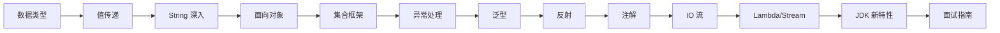

# Java 基础

## 模块概述

Java 基础是整个 Java 技术体系的根基。本模块涵盖了 Java 语言最核心的知识点，从数据类型、面向对象到集合框架、泛型、反射、IO 流、Lambda/Stream 以及 JDK 新特性。无论是日常开发还是面试准备，这些内容都是必须扎实掌握的。

本模块的目标：
- **快速回忆**：每个知识点都有简洁的概念说明，适合面试前快速复习
- **深入理解**：核心原理部分深入底层，帮助你理解"为什么"
- **动手实践**：每个知识点都有对应的可运行代码示例
- **面试导向**：每个知识点都关联高频面试题，包含答题思路和追问链路

## 知识点列表

| 序号 | 知识点 | 难度 | 面试频率 | 建议时间 |
|------|--------|------|----------|----------|
| 1 | [数据类型与包装类](./01-data-types.md) | ⭐ 初级 | 🔥🔥🔥 高频 | 30min |
| 2 | [值传递与引用传递](./02-value-passing.md) | ⭐ 初级 | 🔥🔥🔥 高频 | 20min |
| 3 | [String 深入](./03-string-deep-dive.md) | ⭐⭐ 中级 | 🔥🔥🔥 高频 | 40min |
| 4 | [面向对象](./04-oop.md) | ⭐⭐ 中级 | 🔥🔥🔥 高频 | 60min |
| 5 | [集合框架](./05-collections.md) | ⭐⭐ 中级 | 🔥🔥🔥 高频 | 60min |
| 6 | [异常处理](./06-exceptions.md) | ⭐ 初级 | 🔥🔥 中频 | 20min |
| 7 | [泛型](./07-generics.md) | ⭐⭐ 中级 | 🔥🔥 中频 | 30min |
| 8 | [反射](./08-reflection.md) | ⭐⭐ 中级 | 🔥🔥 中频 | 30min |
| 9 | [注解](./09-annotations.md) | ⭐⭐ 中级 | 🔥🔥 中频 | 25min |
| 10 | [文件与 IO 流](./10-io-streams.md) | ⭐⭐ 中级 | 🔥🔥 中频 | 45min |
| 11 | [Lambda 与 Stream API](./11-lambda-stream.md) | ⭐⭐ 中级 | 🔥🔥🔥 高频 | 40min |
| 12 | [JDK 版本新特性](./12-new-features.md) | ⭐⭐ 中级 | 🔥🔥 中频 | 45min |
| 13 | [Java 基础面试指南](./99-interview.md) | — | 🔥🔥🔥 高频 | 60min |

## 推荐学习顺序

建议按照上述顺序学习，每个知识点都建立在前一个的基础之上：

1. **数据类型 → 值传递 → String**：先理解 Java 的类型系统和内存模型基础
2. **面向对象**：掌握 Java 的核心编程范式
3. **集合框架**：日常开发和面试中最高频的知识点
4. **异常处理 → 泛型**：编写健壮代码的必备知识
5. **反射 → 注解**：理解框架底层原理的基础
6. **IO 流**：文件操作和网络编程的基础
7. **Lambda/Stream → JDK 新特性**：现代 Java 开发必备
8. **面试指南**：汇总复习，查漏补缺

## 相关模块

- [Java 进阶](/1-java-core/1.2-java-advanced/) — 集合源码分析、动态代理、SPI、序列化等深入主题
- [并发编程](/1-java-core/1.3-concurrent/) — 线程、锁、线程池、并发工具类
- [JVM](/1-java-core/1.4-jvm/) — 内存模型、垃圾回收、类加载、调优
- [设计模式](/1-java-core/1.5-design-patterns/) — 23 种设计模式及在 Spring 中的应用
