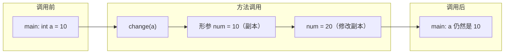
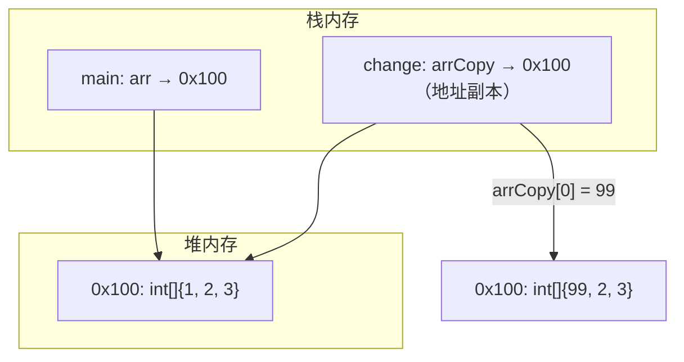

# 值传递与引用传递

## 概念说明

这是 Java 面试中的经典问题。很多人会说"基本类型是值传递，引用类型是引用传递"，但这个说法是**错误的**。

**Java 中只有值传递（Pass by Value），没有引用传递。**

- **值传递**：方法接收的是实参值的**副本**，对副本的修改不影响原始变量
- **引用传递**：方法接收的是实参本身的**引用**（别名），对参数的修改直接影响原始变量

Java 中传递对象时，传递的是**引用的副本**（即对象地址的拷贝），而不是引用本身。所以你可以通过这个副本修改对象的内容，但不能让原始引用指向另一个对象。

## 核心原理

### 基本类型的值传递



```java
public static void change(int num) {
    num = 20; // 修改的是副本
}

public static void main(String[] args) {
    int a = 10;
    change(a);
    System.out.println(a); // 10，未改变
}
```

### 引用类型的值传递

传递的是**引用（地址）的副本**，形参和实参指向同一个对象。



```java
public static void change(int[] arr) {
    arr[0] = 99; // 通过副本引用修改对象内容 → 生效
}

public static void main(String[] args) {
    int[] arr = {1, 2, 3};
    change(arr);
    System.out.println(arr[0]); // 99，对象内容被修改
}
```

### 关键区别：修改内容 vs 重新赋值

```java
// 场景1：修改对象内容 → 生效
public static void changeContent(StringBuilder sb) {
    sb.append(" World"); // 通过引用副本修改对象内容
}

// 场景2：重新赋值引用 → 不生效
public static void changeReference(StringBuilder sb) {
    sb = new StringBuilder("New"); // 只是让副本指向新对象，原引用不受影响
}

public static void main(String[] args) {
    StringBuilder sb = new StringBuilder("Hello");

    changeContent(sb);
    System.out.println(sb); // "Hello World" ✅ 内容被修改

    changeReference(sb);
    System.out.println(sb); // "Hello World" ✅ 引用未改变
}
```

### 经典的 swap 问题

```java
public static void swap(Integer a, Integer b) {
    Integer temp = a;
    a = b;
    b = temp;
    // 只是交换了两个副本的指向，原始引用不受影响
}

public static void main(String[] args) {
    Integer x = 1, y = 2;
    swap(x, y);
    System.out.println("x=" + x + ", y=" + y); // x=1, y=2，交换失败
}
```

> 💡 这就是为什么 Java 无法像 C++ 那样写一个简单的 swap 函数——因为 Java 没有引用传递。

## 代码示例

```java
public class ValuePassingDemo {
    public static void main(String[] args) {
        // 1. 基本类型：值传递
        int num = 10;
        changeInt(num);
        System.out.println("基本类型: " + num); // 10

        // 2. 引用类型：传递引用的副本
        int[] arr = {1, 2, 3};
        changeArray(arr);
        System.out.println("数组修改: " + arr[0]); // 99

        // 3. String 的特殊性（不可变）
        String str = "Hello";
        changeString(str);
        System.out.println("String: " + str); // "Hello"

        // 4. 对象引用重新赋值
        StringBuilder sb = new StringBuilder("Hello");
        reassign(sb);
        System.out.println("重新赋值: " + sb); // "Hello"
    }

    static void changeInt(int n) { n = 20; }
    static void changeArray(int[] a) { a[0] = 99; }
    static void changeString(String s) { s = "World"; } // String 不可变，= 创建新对象
    static void reassign(StringBuilder sb) { sb = new StringBuilder("New"); }
}
```

> 💻 完整可运行代码：[code-examples/01-java-core/java-basics/src/main/java/com/example/basics/datatypes/](https://github.com/skyhe58/guide-java/tree/main/code-examples/01-java-core/java-basics/src/main/java/com/example/basics/datatypes/)
> <!-- 本地路径：code-examples/01-java-core/java-basics/src/main/java/com/example/basics/datatypes/ -->

## 常见面试题

### Q1: Java 是值传递还是引用传递？

**难度**：⭐⭐ | **频率**：🔥🔥🔥

**答题思路**：

1. 明确结论：Java 只有值传递
2. 解释基本类型传递值的副本
3. 解释引用类型传递引用（地址）的副本
4. 用 swap 例子证明不是引用传递

**标准答案**：

Java 中只有值传递。对于基本类型，传递的是值的副本；对于引用类型，传递的是引用（对象地址）的副本。因此，在方法内可以通过引用副本修改对象的内容（如修改数组元素、调用对象的 setter），但不能让原始引用指向另一个对象（如在方法内 `obj = new Object()` 不会影响调用方的变量）。这也是为什么 Java 无法实现简单的 swap 函数。

**深入追问**：

- 为什么说传递对象时不是引用传递？（因为方法内重新赋值不影响原引用）
- C++ 的引用传递和 Java 有什么区别？（C++ 的引用是变量的别名，修改引用等于修改原变量）
- String 作为参数传递后在方法内修改，为什么原值不变？（String 不可变，`=` 创建了新对象）

**易错点**：

- 误以为"基本类型值传递，引用类型引用传递"
- 混淆"修改对象内容"和"重新赋值引用"
- 忘记 String 的不可变性导致的特殊表现

### Q2: 为什么 Java 不能实现 swap 函数？

**难度**：⭐⭐ | **频率**：🔥🔥

**答题思路**：

1. 因为 Java 是值传递，方法内交换的是引用的副本
2. 原始引用不受影响
3. 如果需要交换，可以通过数组或包装对象间接实现

**标准答案**：

因为 Java 是值传递，方法参数接收的是引用的副本。在 swap 方法内交换两个参数，只是交换了两个副本的指向，调用方的原始引用不受影响。如果确实需要交换两个变量的值，可以通过传入数组（交换数组元素）或使用包装对象（交换对象内部的字段）来间接实现。

**深入追问**：

- 如何用数组实现 swap？
- 反射能否实现 swap？（理论上可以修改 Integer 内部的 value 字段，但不推荐）

**易错点**：

- 以为用包装类就能实现 swap（包装类也是值传递）

## 参考资料

- [Java Language Specification - Method Invocation](https://docs.oracle.com/javase/specs/jls/se21/html/jls-15.html#jls-15.12)
- [Is Java "pass-by-reference" or "pass-by-value"? - Stack Overflow](https://stackoverflow.com/questions/40480/is-java-pass-by-reference-or-pass-by-value)
