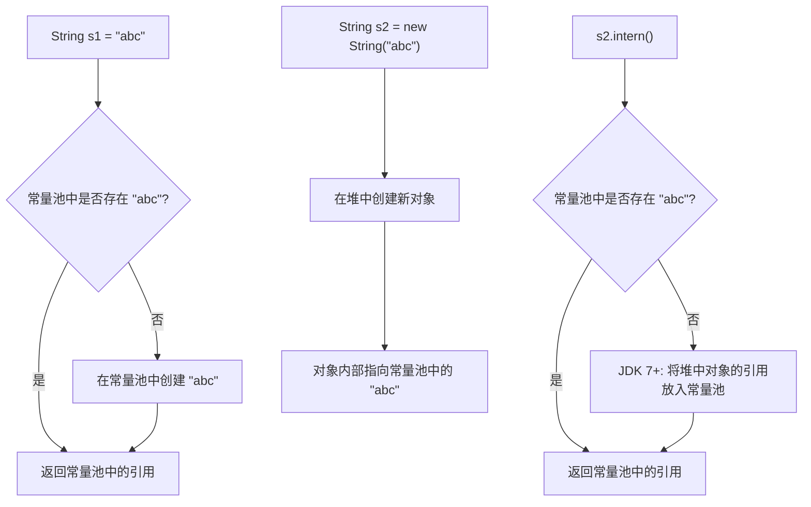
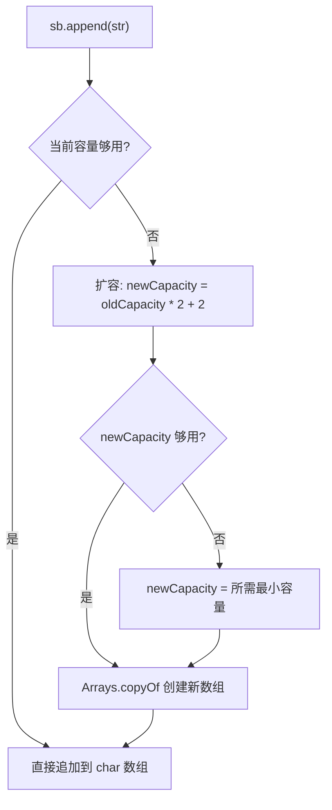

# String 深入

## 概念说明

String 是 Java 中最常用的类，也是面试中的高频考点。理解 String 需要掌握三个核心概念：

1. **不可变性（Immutability）**：String 对象一旦创建，其内容不可修改
2. **字符串常量池（String Pool）**：JVM 维护的一个特殊内存区域，用于缓存字符串字面量
3. **String vs StringBuilder vs StringBuffer**：三者的区别和使用场景

## 核心原理

### String 的不可变性

String 类被声明为 `final`，内部的 `char[]`（JDK 9+ 改为 `byte[]`）也是 `final` 的，且没有提供修改方法。

```java
// JDK 8 的 String 源码
public final class String implements java.io.Serializable, Comparable<String>, CharSequence {
    private final char[] value; // final 数组，引用不可变
    private int hash;           // 缓存 hashCode
}

// JDK 9+ 的 String 源码（Compact Strings 优化）
public final class String implements java.io.Serializable, Comparable<String>, CharSequence {
    private final byte[] value; // 使用 byte[] 节省内存
    private final byte coder;   // LATIN1(0) 或 UTF16(1)
    private int hash;
}
```

**不可变的原因**：
1. `String` 类是 `final` 的，不能被继承
2. `value` 数组是 `private final` 的，引用不可变
3. String 类没有暴露修改 `value` 数组的方法
4. 所有看似"修改"的方法（如 `substring`、`replace`）都返回新的 String 对象

**不可变的好处**：
- **线程安全**：不可变对象天然线程安全，无需同步
- **安全性**：作为 HashMap 的 key 时，hashCode 不会变
- **字符串常量池**：不可变才能安全地共享
- **hashCode 缓存**：计算一次后可以缓存，提高 HashMap 性能

### 字符串常量池（String Pool）



**字符串常量池的位置变迁**：
- JDK 6 及之前：在方法区（永久代 PermGen）中
- JDK 7+：移到了堆（Heap）中（因为永久代空间有限，容易 OOM）

**经典面试题：`String s = new String("abc")` 创建了几个对象？**

答案：1 个或 2 个。
- 如果常量池中已有 `"abc"`：只在堆中创建 1 个 String 对象
- 如果常量池中没有 `"abc"`：先在常量池创建 `"abc"`，再在堆中创建 1 个 String 对象，共 2 个

### intern() 方法

`intern()` 方法会将字符串放入常量池（如果不存在的话），并返回常量池中的引用。

```java
String s1 = new String("abc");
String s2 = s1.intern(); // 返回常量池中 "abc" 的引用
String s3 = "abc";       // 直接使用常量池中的引用

System.out.println(s1 == s2); // false（s1 在堆上，s2 在常量池）
System.out.println(s2 == s3); // true（都指向常量池中的同一个对象）
```

**JDK 6 vs JDK 7+ 的 intern() 区别**：

```java
String s = new String("a") + new String("b"); // 堆上创建 "ab"，常量池中没有 "ab"
s.intern(); // JDK 6: 复制 "ab" 到常量池；JDK 7+: 将堆中 "ab" 的引用放入常量池
String s2 = "ab";
System.out.println(s == s2); // JDK 6: false; JDK 7+: true
```

### String vs StringBuilder vs StringBuffer

| 特性 | String | StringBuilder | StringBuffer |
|------|--------|---------------|--------------|
| 可变性 | 不可变 | 可变 | 可变 |
| 线程安全 | 是（不可变） | 否 | 是（synchronized） |
| 性能 | 拼接慢 | 最快 | 较快 |
| 使用场景 | 少量字符串操作 | 单线程大量拼接 | 多线程大量拼接 |

**StringBuilder 内部原理**：

```java
// 默认容量 16
StringBuilder sb = new StringBuilder(); // char[16]

// 扩容机制：当前容量 * 2 + 2
// 如果仍不够，直接使用所需容量
```



### 字符串拼接的编译器优化

```java
// 编译器优化：字面量拼接在编译期完成
String s1 = "a" + "b" + "c"; // 编译后等价于 String s1 = "abc";

// 变量拼接：JDK 9+ 使用 invokedynamic + StringConcatFactory
String s2 = a + b; // JDK 8: new StringBuilder().append(a).append(b).toString()
                    // JDK 9+: invokedynamic 优化
```

## 代码示例

```java
public class StringDemo {
    public static void main(String[] args) {
        // 1. 字符串常量池
        String s1 = "hello";
        String s2 = "hello";
        String s3 = new String("hello");
        System.out.println(s1 == s2);      // true（常量池同一对象）
        System.out.println(s1 == s3);      // false（堆上新对象）
        System.out.println(s1.equals(s3)); // true（内容相同）

        // 2. intern()
        String s4 = s3.intern();
        System.out.println(s1 == s4);      // true

        // 3. StringBuilder 性能对比
        long start = System.currentTimeMillis();
        String result = "";
        for (int i = 0; i < 100000; i++) {
            result += i; // 每次创建新 String 对象，极慢
        }
        System.out.println("String +: " + (System.currentTimeMillis() - start) + "ms");

        start = System.currentTimeMillis();
        StringBuilder sb = new StringBuilder();
        for (int i = 0; i < 100000; i++) {
            sb.append(i);
        }
        String result2 = sb.toString();
        System.out.println("StringBuilder: " + (System.currentTimeMillis() - start) + "ms");
    }
}
```

> 💻 完整可运行代码：[code-examples/01-java-core/java-basics/src/main/java/com/example/basics/string/](../../../code-examples/01-java-core/java-basics/src/main/java/com/example/basics/string/)

## 常见面试题

### Q1: String 为什么是不可变的？不可变有什么好处？

**难度**：⭐⭐ | **频率**：🔥🔥🔥

**答题思路**：

1. 从源码角度说明不可变的实现（final 类、private final char[]、无修改方法）
2. 列举不可变的好处（线程安全、常量池、hashCode 缓存、安全性）

**标准答案**：

String 不可变是通过三重保障实现的：类声明为 final 不可继承，内部 char 数组声明为 private final，且没有暴露修改数组内容的方法。不可变的好处包括：（1）天然线程安全，多线程共享无需同步；（2）可以安全地实现字符串常量池，节省内存；（3）hashCode 可以缓存，作为 HashMap 的 key 时性能更好；（4）安全性，如作为类加载器的参数、网络连接的 URL 等不会被篡改。

**深入追问**：

- 能否通过反射修改 String 的内容？（可以，但不推荐，会破坏常量池的安全性）
- JDK 9 为什么把 char[] 改成 byte[]？（Compact Strings 优化，Latin1 字符只用 1 字节）

**易错点**：

- 误以为 `final char[]` 意味着数组内容不可变（final 只保证引用不可变）
- 忘记提到 String 类本身是 final 的

### Q2: `String s = new String("abc")` 创建了几个对象？

**难度**：⭐⭐⭐ | **频率**：🔥🔥🔥

**答题思路**：

1. 分两种情况讨论
2. 说明常量池和堆的关系

**标准答案**：

取决于常量池中是否已存在 `"abc"`。如果常量池中没有，则创建 2 个对象：一个在常量池中（字面量 `"abc"`），一个在堆中（new 出来的 String 对象）。如果常量池中已有 `"abc"`，则只创建 1 个堆上的对象。

**深入追问**：

- `String s = "a" + "b"` 创建了几个对象？（编译期优化为 `"ab"`，1 个常量池对象）
- `String s = new String("a") + new String("b")` 创建了几个对象？（最多 6 个：常量池 "a"、"b"，堆上 2 个 new String，1 个 StringBuilder，1 个最终的 "ab"）

**易错点**：

- 忘记考虑常量池中是否已存在该字符串
- 混淆字面量和 new 创建的区别

### Q3: String、StringBuilder、StringBuffer 的区别？

**难度**：⭐⭐ | **频率**：🔥🔥🔥

**答题思路**：

1. 从可变性、线程安全、性能三个维度对比
2. 给出使用场景建议

**标准答案**：

String 不可变，每次"修改"都创建新对象；StringBuilder 可变，非线程安全，性能最好；StringBuffer 可变，线程安全（方法加了 synchronized），性能略低于 StringBuilder。使用建议：少量字符串操作用 String，单线程大量拼接用 StringBuilder，多线程大量拼接用 StringBuffer（实际开发中很少用到 StringBuffer，因为字符串拼接很少需要多线程共享）。

**深入追问**：

- StringBuilder 的默认容量和扩容机制？（默认 16，扩容为 oldCapacity * 2 + 2）
- JDK 9+ 的字符串拼接优化了什么？（使用 invokedynamic + StringConcatFactory 替代 StringBuilder）

**易错点**：

- 以为 StringBuffer 比 StringBuilder 安全就应该优先使用（实际上大多数场景不需要线程安全）

## 参考资料

- [Java String 源码](https://github.com/openjdk/jdk/blob/master/src/java.base/share/classes/java/lang/String.java)
- [JEP 254: Compact Strings](https://openjdk.org/jeps/254)
- [JEP 280: Indify String Concatenation](https://openjdk.org/jeps/280)
