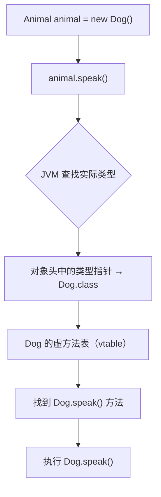
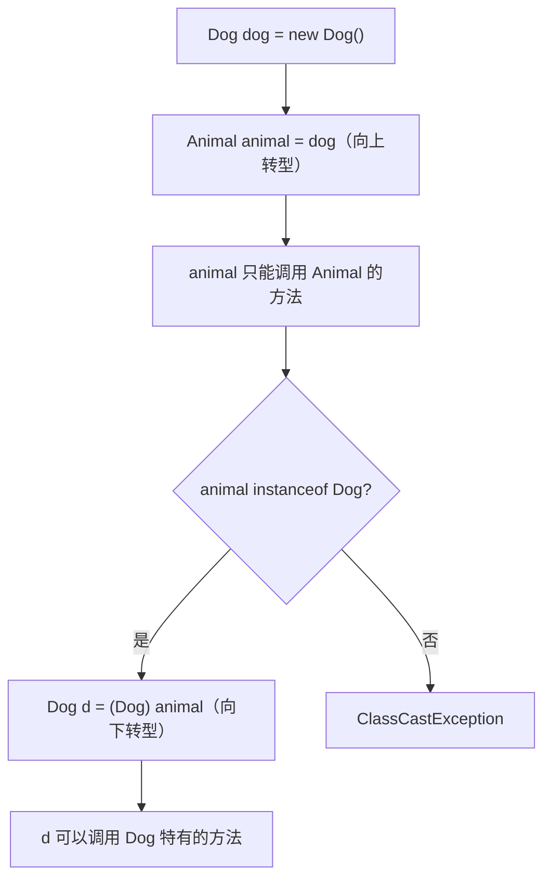

# 面向对象

## 概念说明

面向对象编程（OOP）是 Java 的核心编程范式，围绕三大特性展开：**封装、继承、多态**。理解 OOP 不仅是写好 Java 代码的基础，也是理解设计模式、Spring 框架等高级主题的前提。

## 核心原理

### 一、封装（Encapsulation）

封装是将数据（属性）和操作数据的方法绑定在一起，通过访问控制符限制外部直接访问内部实现。

**四种访问控制符**：

| 修饰符 | 同类 | 同包 | 子类 | 其他包 |
|--------|------|------|------|--------|
| `private` | ✅ | ❌ | ❌ | ❌ |
| `default`（缺省） | ✅ | ✅ | ❌ | ❌ |
| `protected` | ✅ | ✅ | ✅ | ❌ |
| `public` | ✅ | ✅ | ✅ | ✅ |

> ⚠️ `protected` 的子类访问：不同包的子类可以访问父类的 protected 成员，但不能通过父类实例访问，只能通过 `this` 或子类实例访问。

### 二、继承（Inheritance）与方法重写

Java 只支持**单继承**（一个类只能有一个直接父类），但可以实现多个接口。

**方法重写（Override）规则**：

| 规则 | 说明 |
|------|------|
| 方法签名 | 方法名和参数列表必须完全相同 |
| 返回类型 | 可以是父类返回类型的子类（协变返回类型） |
| 访问权限 | 不能比父类更严格（可以更宽松） |
| 异常 | 不能抛出比父类更多的 checked 异常 |
| static/final/private | 不能被重写 |

```java
class Animal {
    protected Animal create() { return new Animal(); }
}

class Dog extends Animal {
    @Override
    protected Dog create() { // 协变返回类型：Dog 是 Animal 的子类
        return new Dog();
    }
}
```

**重写 vs 重载**：

| 对比项 | 重写（Override） | 重载（Overload） |
|--------|-----------------|-----------------|
| 发生位置 | 子类与父类之间 | 同一个类中 |
| 方法名 | 相同 | 相同 |
| 参数列表 | 相同 | 不同 |
| 返回类型 | 相同或协变 | 无要求 |
| 绑定时机 | 运行时（动态绑定） | 编译时（静态绑定） |

### 三、多态（Polymorphism）

多态是指同一个方法调用，根据对象的实际类型执行不同的实现。Java 的多态通过**虚方法表（vtable）**实现。



**虚方法表（vtable）原理**：

- 每个类在加载时会创建一个虚方法表，存储该类所有可被动态调用的方法的入口地址
- 子类的 vtable 继承父类的 vtable，重写的方法会替换对应的入口地址
- 调用虚方法时，JVM 通过对象头中的类型指针找到实际类的 vtable，再查找方法入口

```java
Animal animal = new Dog(); // 编译时类型：Animal，运行时类型：Dog
animal.speak();            // 运行时根据实际类型 Dog 调用 Dog.speak()
```

**多态的条件**：
1. 继承或实现接口
2. 方法重写
3. 父类引用指向子类对象

### 四、抽象类与接口

| 对比项 | 抽象类（abstract class） | 接口（interface） |
|--------|------------------------|-------------------|
| 实例化 | 不能 | 不能 |
| 构造方法 | 有 | 无 |
| 成员变量 | 任意 | 默认 `public static final` |
| 方法 | 可以有抽象和具体方法 | JDK 8+: default/static 方法 |
| 继承/实现 | 单继承 | 多实现 |
| 设计理念 | "is-a" 关系 | "has-a" 能力 |

**JDK 8+ 接口的变化**：

```java
public interface Flyable {
    // 抽象方法
    void fly();

    // 默认方法（JDK 8+）
    default void land() {
        System.out.println("Landing...");
    }

    // 静态方法（JDK 8+）
    static void info() {
        System.out.println("Flyable interface");
    }

    // 私有方法（JDK 9+）
    private void helper() {
        System.out.println("Helper method");
    }
}
```

### 五、内部类

Java 有四种内部类：

| 类型 | 位置 | 持有外部类引用 | 可访问外部类成员 | 使用场景 |
|------|------|--------------|----------------|---------|
| 成员内部类 | 类内部 | 是 | 所有成员 | 与外部类紧密关联 |
| 静态内部类 | 类内部（static） | 否 | 仅静态成员 | 独立于外部类实例 |
| 局部内部类 | 方法内部 | 是 | 所有成员 + effectively final 局部变量 | 很少使用 |
| 匿名内部类 | 表达式中 | 是 | 所有成员 + effectively final 局部变量 | 回调、事件处理 |

```java
public class Outer {
    private int x = 10;

    // 成员内部类
    class Inner {
        void show() { System.out.println(x); } // 可以访问外部类私有成员
    }

    // 静态内部类
    static class StaticInner {
        void show() { /* 不能访问 x，因为没有外部类实例 */ }
    }
}

// 使用
Outer.Inner inner = new Outer().new Inner();       // 成员内部类需要外部类实例
Outer.StaticInner si = new Outer.StaticInner();    // 静态内部类不需要
```

> 💡 **最佳实践**：优先使用静态内部类。成员内部类会隐式持有外部类引用，可能导致内存泄漏（如 Android 中的 Handler）。

### 六、Object 常用方法

Object 是所有类的根类，其核心方法：

| 方法 | 说明 | 重写要求 |
|------|------|---------|
| `equals(Object)` | 判断对象是否相等 | 重写 equals 必须同时重写 hashCode |
| `hashCode()` | 返回对象的哈希码 | 与 equals 保持一致 |
| `toString()` | 返回对象的字符串表示 | 建议重写 |
| `clone()` | 创建对象的副本 | 需实现 Cloneable 接口 |
| `finalize()` | GC 前调用（已废弃） | 不建议使用 |
| `getClass()` | 返回运行时类 | 不可重写（final） |
| `wait()/notify()/notifyAll()` | 线程通信 | 不可重写（final） |

**equals 和 hashCode 的契约**：

```java
// 规则：
// 1. equals 相等的对象，hashCode 必须相等
// 2. hashCode 相等的对象，equals 不一定相等
// 3. 重写 equals 必须重写 hashCode

@Override
public boolean equals(Object o) {
    if (this == o) return true;
    if (o == null || getClass() != o.getClass()) return false;
    Person person = (Person) o;
    return age == person.age && Objects.equals(name, person.name);
}

@Override
public int hashCode() {
    return Objects.hash(name, age);
}
```

### 七、向上转型与向下转型

```java
// 向上转型（自动，安全）
Animal animal = new Dog(); // Dog → Animal

// 向下转型（强制，可能 ClassCastException）
Dog dog = (Dog) animal;    // 需要确保 animal 实际是 Dog

// 安全的向下转型
if (animal instanceof Dog d) { // JDK 16+ Pattern Matching
    d.fetch(); // 安全使用
}
```



## 代码示例

```java
// 多态示例
abstract class Shape {
    abstract double area();

    @Override
    public String toString() {
        return getClass().getSimpleName() + ": area=" + area();
    }
}

class Circle extends Shape {
    private double radius;
    Circle(double radius) { this.radius = radius; }

    @Override
    double area() { return Math.PI * radius * radius; }
}

class Rectangle extends Shape {
    private double width, height;
    Rectangle(double w, double h) { this.width = w; this.height = h; }

    @Override
    double area() { return width * height; }
}

// 使用多态
Shape[] shapes = { new Circle(5), new Rectangle(3, 4) };
for (Shape s : shapes) {
    System.out.println(s); // 自动调用各自的 toString() 和 area()
}
```

> 💻 完整可运行代码：[code-examples/01-java-core/java-basics/src/main/java/com/example/basics/oop/](https://github.com/skyhe58/guide-java/tree/main/code-examples/01-java-core/java-basics/src/main/java/com/example/basics/oop/)
> <!-- 本地路径：code-examples/01-java-core/java-basics/src/main/java/com/example/basics/oop/ -->

## 常见面试题

### Q1: Java 多态的实现原理是什么？

**难度**：⭐⭐⭐ | **频率**：🔥🔥🔥

**答题思路**：

1. 说明多态的三个条件
2. 解释虚方法表（vtable）机制
3. 说明 JVM 如何在运行时确定调用哪个方法

**标准答案**：

Java 多态通过虚方法表（vtable）实现。每个类在加载时会创建一个虚方法表，存储所有可被动态调用的方法的入口地址。子类的 vtable 继承父类的，重写的方法会替换对应的入口。当通过父类引用调用方法时，JVM 通过对象头中的类型指针找到实际类的 vtable，再查找方法入口执行。这就是为什么 `Animal a = new Dog(); a.speak()` 会调用 Dog 的 speak 方法。

**深入追问**：

- static 方法能实现多态吗？（不能，static 方法是静态绑定）
- private 方法能被重写吗？（不能，private 方法对子类不可见）
- 构造方法中调用虚方法会怎样？（会调用子类的实现，但此时子类可能还未初始化完成，很危险）

**易错点**：

- 混淆重写和重载的绑定时机
- 忘记 final/static/private 方法不参与多态

### Q2: 抽象类和接口的区别？什么时候用哪个？

**难度**：⭐⭐ | **频率**：🔥🔥🔥

**答题思路**：

1. 从语法层面对比（构造方法、成员变量、方法类型、继承方式）
2. 从设计层面对比（is-a vs has-a）
3. 给出选择建议

**标准答案**：

语法上：抽象类可以有构造方法、任意成员变量和具体方法，只能单继承；接口的变量默认 public static final，JDK 8 前只能有抽象方法，JDK 8+ 可以有 default 和 static 方法，支持多实现。设计上：抽象类表示 "is-a" 关系（如 Dog is an Animal），接口表示 "has-a" 能力（如 Dog has Flyable ability）。选择建议：如果需要共享代码或定义模板方法，用抽象类；如果需要定义行为契约或实现多重继承，用接口。

**深入追问**：

- JDK 8 的 default 方法解决了什么问题？（接口演进问题，新增方法不破坏已有实现）
- 接口的 default 方法冲突怎么解决？（实现类必须重写冲突的方法）

**易错点**：

- 忘记 JDK 8+ 接口可以有 default 方法
- 误以为抽象类不能有构造方法

### Q3: 重写 equals 为什么必须重写 hashCode？

**难度**：⭐⭐⭐ | **频率**：🔥🔥🔥

**答题思路**：

1. 说明 equals 和 hashCode 的契约
2. 用 HashMap 的例子说明不重写的后果
3. 给出正确的重写方式

**标准答案**：

根据 Java 规范，equals 相等的两个对象，hashCode 必须相等。如果只重写 equals 不重写 hashCode，会导致 HashMap/HashSet 等基于哈希的集合出现问题。例如，两个 equals 相等的对象可能被放入 HashMap 的不同桶中，导致 get 时找不到之前 put 的值。正确做法是使用 `Objects.hash()` 方法，将参与 equals 比较的所有字段都纳入 hashCode 计算。

**深入追问**：

- hashCode 相等，equals 一定相等吗？（不一定，哈希冲突）
- 如何写一个好的 hashCode？（使用 31 作为乘数因子，或直接用 Objects.hash()）

**易错点**：

- 只重写 equals 不重写 hashCode
- hashCode 中使用了可变字段（对象作为 HashMap key 后修改字段会导致找不到）

## 参考资料

- [Java Language Specification - Classes](https://docs.oracle.com/javase/specs/jls/se21/html/jls-8.html)
- [Effective Java - Item 10: Obey the general contract when overriding equals](https://www.oreilly.com/library/view/effective-java/9780134686097/)
- [JVM Internals - Virtual Method Table](https://blog.jamesdbloom.com/JVMInternals.html)
