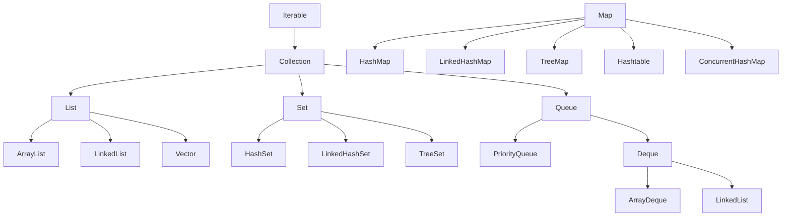
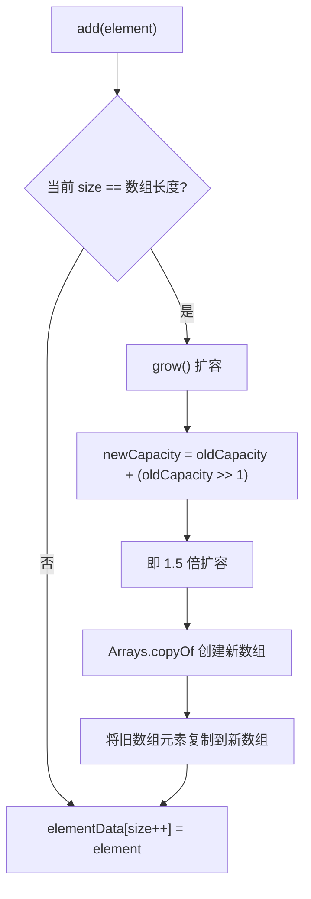
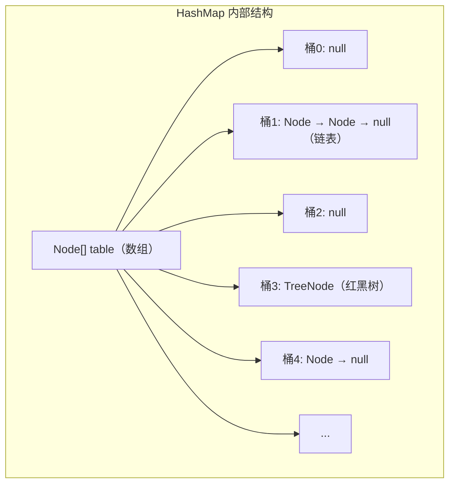
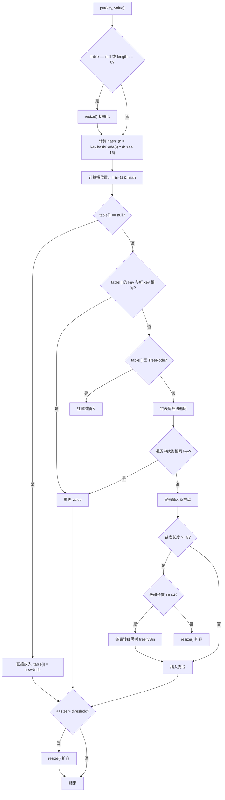
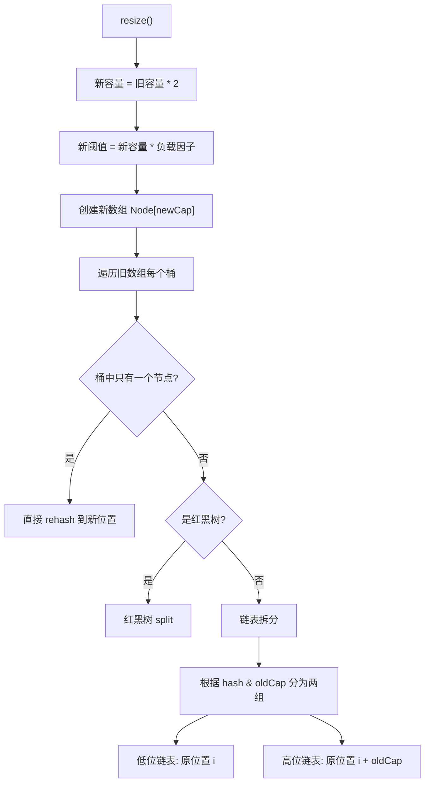

# 集合框架

## 概念说明

Java 集合框架（Java Collections Framework）是 Java 中最常用的 API 之一，提供了一套统一的接口和实现来存储和操作对象集合。集合框架是面试中出现频率最高的知识点之一，尤其是 HashMap。

集合框架的核心接口层次：



## 核心原理

### 一、ArrayList vs LinkedList

| 对比项 | ArrayList | LinkedList |
|--------|-----------|------------|
| 底层结构 | 动态数组（Object[]） | 双向链表 |
| 随机访问 | O(1) | O(n) |
| 头部插入 | O(n)（需要移动元素） | O(1) |
| 尾部插入 | 均摊 O(1) | O(1) |
| 内存占用 | 连续内存，可能有空闲空间 | 每个节点额外存储前后指针 |
| 实现接口 | List, RandomAccess | List, Deque |

> 💡 **实际开发中 ArrayList 几乎总是更好的选择**，因为 CPU 缓存对连续内存更友好，LinkedList 的节点分散在堆中，缓存命中率低。

### ArrayList 扩容机制



**关键源码**：

```java
// JDK 17 ArrayList 源码
private void grow(int minCapacity) {
    int oldCapacity = elementData.length;
    // 新容量 = 旧容量 * 1.5（右移1位相当于除以2）
    int newCapacity = oldCapacity + (oldCapacity >> 1);
    if (newCapacity - minCapacity < 0)
        newCapacity = minCapacity;
    if (newCapacity - MAX_ARRAY_SIZE > 0)
        newCapacity = hugeCapacity(minCapacity);
    elementData = Arrays.copyOf(elementData, newCapacity);
}
```

- 默认初始容量：10（首次 add 时创建）
- 扩容因子：1.5 倍
- 扩容操作涉及数组复制，代价较高
- **最佳实践**：如果能预估大小，使用 `new ArrayList<>(expectedSize)` 避免多次扩容

### 二、HashSet 去重原理

HashSet 底层就是一个 HashMap，元素作为 key，value 是一个固定的 `PRESENT` 对象。

```java
// HashSet 源码
private transient HashMap<E, Object> map;
private static final Object PRESENT = new Object();

public boolean add(E e) {
    return map.put(e, PRESENT) == null; // 利用 HashMap 的 key 唯一性去重
}
```

**去重依赖 hashCode() 和 equals()**：
1. 先计算 hashCode 确定桶位置
2. 如果桶中已有元素，用 equals 逐一比较
3. 如果 equals 返回 true，认为重复，不插入

> ⚠️ 自定义对象放入 HashSet 时，必须同时重写 hashCode() 和 equals()，否则去重失效。

### 三、HashMap 核心原理（重点）

HashMap 是面试中最高频的集合类，必须深入理解。

**底层结构**：数组 + 链表 + 红黑树（JDK 8+）



**HashMap put 流程**：



**关键参数**：

| 参数 | 默认值 | 说明 |
|------|--------|------|
| 初始容量 | 16 | 必须是 2 的幂 |
| 负载因子 | 0.75 | 空间和时间的平衡 |
| 树化阈值 | 8 | 链表长度 ≥ 8 时考虑转红黑树 |
| 树化最小容量 | 64 | 数组长度 ≥ 64 才真正树化 |
| 退化阈值 | 6 | 红黑树节点 ≤ 6 时退化为链表 |

**为什么容量必须是 2 的幂？**

因为计算桶位置时使用 `(n-1) & hash` 代替 `hash % n`，位运算更快。只有 n 是 2 的幂时，`(n-1) & hash` 才等价于 `hash % n`。

**hash 扰动函数**：

```java
// 高 16 位与低 16 位异或，让高位也参与运算，减少碰撞
static final int hash(Object key) {
    int h;
    return (key == null) ? 0 : (h = key.hashCode()) ^ (h >>> 16);
}
```

### HashMap 扩容（resize）流程



**JDK 8 的优化**：扩容时不需要重新计算 hash，只需要看 `hash & oldCap` 的结果：
- 如果为 0：元素留在原位置
- 如果为 1：元素移到 `原位置 + oldCap`

### 四、LinkedHashMap 实现 LRU 缓存

LinkedHashMap 在 HashMap 的基础上维护了一个双向链表，可以保持插入顺序或访问顺序。

```java
// 实现 LRU 缓存
public class LRUCache<K, V> extends LinkedHashMap<K, V> {
    private final int maxSize;

    public LRUCache(int maxSize) {
        super(maxSize, 0.75f, true); // accessOrder=true 按访问顺序排列
        this.maxSize = maxSize;
    }

    @Override
    protected boolean removeEldestEntry(Map.Entry<K, V> eldest) {
        return size() > maxSize; // 超过容量时移除最久未访问的元素
    }
}
```

### 五、TreeMap 排序原理

TreeMap 基于红黑树实现，key 按自然顺序或自定义 Comparator 排序。

```java
// 自然顺序
TreeMap<String, Integer> map = new TreeMap<>();

// 自定义排序
TreeMap<String, Integer> map = new TreeMap<>(Comparator.reverseOrder());
```

### 六、遍历删除陷阱（ConcurrentModificationException）

```java
// ❌ 错误：增强 for 循环中删除元素
List<String> list = new ArrayList<>(Arrays.asList("a", "b", "c"));
for (String s : list) {
    if ("b".equals(s)) {
        list.remove(s); // ConcurrentModificationException!
    }
}

// ✅ 正确方式1：使用 Iterator
Iterator<String> it = list.iterator();
while (it.hasNext()) {
    if ("b".equals(it.next())) {
        it.remove(); // 安全删除
    }
}

// ✅ 正确方式2：使用 removeIf（JDK 8+）
list.removeIf("b"::equals);

// ✅ 正确方式3：倒序遍历删除（仅限 ArrayList）
for (int i = list.size() - 1; i >= 0; i--) {
    if ("b".equals(list.get(i))) {
        list.remove(i);
    }
}
```

**原理**：增强 for 循环底层使用 Iterator，ArrayList 维护了一个 `modCount` 计数器，每次结构性修改（add/remove）都会 +1。Iterator 在创建时记录 `expectedModCount`，每次 `next()` 时检查两者是否一致，不一致就抛出 `ConcurrentModificationException`。这是一种 **fail-fast** 机制。

## 代码示例

```java
public class CollectionsDemo {
    public static void main(String[] args) {
        // 1. ArrayList 扩容观察
        ArrayList<Integer> list = new ArrayList<>(4);
        for (int i = 0; i < 10; i++) {
            list.add(i);
            // 可通过反射观察内部数组长度变化
        }

        // 2. HashMap 基本操作
        Map<String, Integer> map = new HashMap<>();
        map.put("Java", 1);
        map.put("Python", 2);
        map.getOrDefault("Go", 0); // 不存在时返回默认值

        // 3. LRU 缓存
        LRUCache<String, String> lru = new LRUCache<>(3);
        lru.put("a", "1");
        lru.put("b", "2");
        lru.put("c", "3");
        lru.get("a");       // 访问 a，a 移到最后
        lru.put("d", "4");  // 超出容量，移除最久未访问的 b

        // 4. 安全遍历删除
        List<String> names = new ArrayList<>(List.of("Alice", "Bob", "Charlie"));
        names.removeIf(name -> name.startsWith("B"));
    }
}
```

> 💻 完整可运行代码：[code-examples/01-java-core/java-basics/src/main/java/com/example/basics/collections/](../../../code-examples/01-java-core/java-basics/src/main/java/com/example/basics/collections/)

## 常见面试题

### Q1: HashMap 的 put 流程是怎样的？

**难度**：⭐⭐⭐ | **频率**：🔥🔥🔥

**答题思路**：

1. 计算 hash（扰动函数）
2. 确定桶位置
3. 处理冲突（链表/红黑树）
4. 判断是否需要扩容

**标准答案**：

（1）对 key 的 hashCode 进行扰动处理（高 16 位异或低 16 位），然后通过 `(n-1) & hash` 计算桶位置。（2）如果桶为空，直接放入新节点。（3）如果桶不为空，先判断第一个节点的 key 是否相同（hash 相等且 equals 为 true），相同则覆盖 value。（4）如果是红黑树节点，调用红黑树的插入方法。（5）如果是链表，遍历到尾部插入（JDK 8 尾插法），遍历过程中如果找到相同 key 则覆盖。插入后如果链表长度 ≥ 8 且数组长度 ≥ 64，则转为红黑树。（6）最后判断 size 是否超过阈值，超过则扩容。

**深入追问**：

- 为什么 JDK 8 改用尾插法？（JDK 7 头插法在多线程扩容时会形成环形链表导致死循环）
- 为什么树化阈值是 8？（泊松分布，链表长度达到 8 的概率极低，约千万分之六）
- HashMap 是线程安全的吗？多线程下应该用什么？（不安全，用 ConcurrentHashMap）

**易错点**：

- 忘记扰动函数的作用
- 混淆 JDK 7（头插法）和 JDK 8（尾插法）
- 忘记树化还需要数组长度 ≥ 64 的条件

### Q2: HashMap 的扩容机制是怎样的？

**难度**：⭐⭐⭐ | **频率**：🔥🔥🔥

**答题思路**：

1. 触发条件：size > capacity * loadFactor
2. 新容量 = 旧容量 * 2
3. rehash 过程（JDK 8 的优化）

**标准答案**：

当元素数量超过阈值（容量 × 负载因子，默认 16 × 0.75 = 12）时触发扩容。新容量为旧容量的 2 倍。扩容时需要将所有元素重新分配到新数组中。JDK 8 优化了 rehash 过程：不需要重新计算 hash，只需要看 `hash & oldCap` 的结果，为 0 则留在原位置，为 1 则移到 `原位置 + oldCap`。链表会被拆分为两个子链表，分别放到新数组的两个位置。

**深入追问**：

- 为什么负载因子默认是 0.75？（时间和空间的折中，太小浪费空间，太大碰撞增多）
- 扩容时红黑树怎么处理？（split 方法拆分，如果拆分后节点数 ≤ 6 则退化为链表）

**易错点**：

- 误以为扩容时需要重新计算所有元素的 hash
- 忘记容量必须是 2 的幂

### Q3: ArrayList 和 LinkedList 的区别？什么时候用哪个？

**难度**：⭐⭐ | **频率**：🔥🔥🔥

**答题思路**：

1. 底层数据结构不同
2. 时间复杂度对比
3. 实际使用建议

**标准答案**：

ArrayList 底层是动态数组，支持 O(1) 随机访问，尾部插入均摊 O(1)，中间插入 O(n)。LinkedList 底层是双向链表，不支持随机访问（O(n)），头尾插入 O(1)。实际开发中几乎总是优先选择 ArrayList，因为：（1）CPU 缓存对连续内存更友好；（2）LinkedList 每个节点需要额外的前后指针，内存开销更大；（3）即使是中间插入，ArrayList 的数组复制在现代 CPU 上也很快。只有在需要频繁在头部插入/删除，且不需要随机访问时，才考虑 LinkedList。

**深入追问**：

- ArrayList 的扩容机制？（1.5 倍扩容，Arrays.copyOf）
- 如何让 ArrayList 线程安全？（Collections.synchronizedList 或 CopyOnWriteArrayList）

**易错点**：

- 以为 LinkedList 在所有插入场景都比 ArrayList 快（实际上定位到插入位置也需要 O(n)）

## 参考资料

- [HashMap 源码](https://github.com/openjdk/jdk/blob/master/src/java.base/share/classes/java/util/HashMap.java)
- [ArrayList 源码](https://github.com/openjdk/jdk/blob/master/src/java.base/share/classes/java/util/ArrayList.java)
- [Java Collections Framework Overview](https://docs.oracle.com/en/java/javase/21/docs/api/java.base/java/util/doc-files/coll-overview.html)
