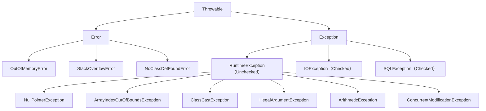

# 异常处理

## 概念说明

Java 的异常处理机制是保证程序健壮性的重要手段。异常体系以 `Throwable` 为根类，分为 `Error` 和 `Exception` 两大分支。理解异常分类和处理最佳实践，是写出健壮代码的基础。

## 核心原理

### 异常体系结构



### Checked vs Unchecked 异常

| 类型 | 父类 | 编译器检查 | 处理要求 | 典型示例 |
|------|------|-----------|---------|---------|
| Checked 异常 | Exception（非 RuntimeException） | 是 | 必须 try-catch 或 throws | IOException, SQLException |
| Unchecked 异常 | RuntimeException | 否 | 不强制处理 | NullPointerException, ClassCastException |
| Error | Error | 否 | 不应该捕获 | OutOfMemoryError, StackOverflowError |

**设计理念**：
- **Checked 异常**：可预见的、可恢复的异常（如文件不存在、网络超时），强制调用方处理
- **Unchecked 异常**：编程错误导致的异常（如空指针、数组越界），应该通过修复代码来避免
- **Error**：JVM 级别的严重错误，程序无法处理

### 自定义异常

```java
// 自定义 Checked 异常
public class BusinessException extends Exception {
    private final String errorCode;

    public BusinessException(String errorCode, String message) {
        super(message);
        this.errorCode = errorCode;
    }

    public BusinessException(String errorCode, String message, Throwable cause) {
        super(message, cause);
        this.errorCode = errorCode;
    }

    public String getErrorCode() { return errorCode; }
}

// 自定义 Unchecked 异常（更常用）
public class ServiceException extends RuntimeException {
    private final int code;

    public ServiceException(int code, String message) {
        super(message);
        this.code = code;
    }

    public int getCode() { return code; }
}
```

### 异常处理最佳实践

**1. 不要捕获 Exception 或 Throwable**：

```java
// ❌ 错误：过于宽泛
try {
    // ...
} catch (Exception e) {
    e.printStackTrace();
}

// ✅ 正确：捕获具体异常
try {
    // ...
} catch (FileNotFoundException e) {
    log.error("文件不存在: {}", filePath, e);
} catch (IOException e) {
    log.error("IO 异常", e);
}
```

**2. 不要用异常控制流程**：

```java
// ❌ 错误：用异常代替条件判断
try {
    int value = Integer.parseInt(str);
} catch (NumberFormatException e) {
    value = 0;
}

// ✅ 正确：先检查再操作
if (str != null && str.matches("\\d+")) {
    int value = Integer.parseInt(str);
}
```

**3. finally 中不要 return**：

```java
// ❌ 危险：finally 中的 return 会覆盖 try/catch 中的 return
try {
    return 1;
} finally {
    return 2; // 最终返回 2，try 中的 return 被吞掉
}
```

**4. try-with-resources（JDK 7+）**：

```java
// ✅ 自动关闭资源
try (InputStream is = new FileInputStream("file.txt");
     BufferedReader br = new BufferedReader(new InputStreamReader(is))) {
    String line = br.readLine();
} // 自动调用 close()，即使发生异常
```

**5. 异常链（Cause Chain）**：

```java
try {
    // 底层操作
} catch (SQLException e) {
    // 包装为业务异常，保留原始异常信息
    throw new ServiceException(500, "数据库操作失败", e);
}
```

## 代码示例

```java
public class ExceptionDemo {
    // 自定义异常
    static class InsufficientBalanceException extends RuntimeException {
        private final double balance;
        private final double amount;

        InsufficientBalanceException(double balance, double amount) {
            super(String.format("余额不足: 当前余额 %.2f, 取款金额 %.2f", balance, amount));
            this.balance = balance;
            this.amount = amount;
        }
    }

    // 使用自定义异常
    static double withdraw(double balance, double amount) {
        if (amount <= 0) {
            throw new IllegalArgumentException("取款金额必须大于 0");
        }
        if (amount > balance) {
            throw new InsufficientBalanceException(balance, amount);
        }
        return balance - amount;
    }

    public static void main(String[] args) {
        try {
            withdraw(100, 200);
        } catch (InsufficientBalanceException e) {
            System.out.println("业务异常: " + e.getMessage());
        } catch (IllegalArgumentException e) {
            System.out.println("参数异常: " + e.getMessage());
        }
    }
}
```

> 💻 完整可运行代码：[code-examples/01-java-core/java-basics/src/main/java/com/example/basics/exceptions/](https://github.com/skyhe58/guide-java/tree/main/code-examples/01-java-core/java-basics/src/main/java/com/example/basics/exceptions/)
> <!-- 本地路径：code-examples/01-java-core/java-basics/src/main/java/com/example/basics/exceptions/ -->

## 常见面试题

### Q1: Checked 异常和 Unchecked 异常的区别？

**难度**：⭐⭐ | **频率**：🔥🔥🔥

**答题思路**：

1. 继承关系不同
2. 编译器检查不同
3. 使用场景不同

**标准答案**：

Checked 异常继承自 Exception（但不是 RuntimeException），编译器强制要求处理（try-catch 或 throws），适用于可预见的、可恢复的异常场景，如 IOException、SQLException。Unchecked 异常继承自 RuntimeException，编译器不强制处理，通常是编程错误导致的，如 NullPointerException、ClassCastException。实际开发中，自定义业务异常通常继承 RuntimeException（Unchecked），因为 Checked 异常会污染方法签名，增加调用方负担。

**深入追问**：

- Spring 的事务默认只对哪种异常回滚？（RuntimeException 和 Error）
- 为什么越来越多的框架倾向于使用 Unchecked 异常？（减少样板代码，不污染接口）

**易错点**：

- 误以为 RuntimeException 不是 Exception 的子类
- 忘记 Error 也是 Unchecked 的

### Q2: try-catch-finally 的执行顺序？finally 一定会执行吗？

**难度**：⭐⭐ | **频率**：🔥🔥

**答题思路**：

1. 正常执行顺序
2. finally 不执行的特殊情况
3. finally 中 return 的陷阱

**标准答案**：

正常情况下，try 块执行完后执行 finally，如果 try 中有异常则先执行 catch 再执行 finally。finally 几乎总是会执行，但有三种情况不会：（1）`System.exit()` 终止 JVM；（2）线程被 kill；（3）CPU 关闭。需要注意的是，finally 中的 return 会覆盖 try/catch 中的 return 值，这是一个常见陷阱，应该避免在 finally 中 return。

**深入追问**：

- try-with-resources 和 try-finally 有什么区别？（前者更简洁，且能正确处理 close 时的异常）
- 如果 try 和 finally 都抛出异常，哪个会被抛出？（finally 的异常会覆盖 try 的，try-with-resources 会将 close 的异常作为 suppressed exception）

**易错点**：

- 以为 finally 中的 return 不会影响结果
- 忘记 try-with-resources 中 close 异常的处理

### Q3: 异常处理的最佳实践有哪些？

**难度**：⭐⭐ | **频率**：🔥🔥

**答题思路**：

1. 捕获具体异常
2. 不要吞掉异常
3. 使用 try-with-resources
4. 异常链

**标准答案**：

（1）捕获具体异常而非 Exception；（2）不要吞掉异常（空 catch 块），至少要记录日志；（3）使用 try-with-resources 管理资源；（4）抛出异常时保留原始异常链（cause）；（5）不要用异常控制业务流程；（6）自定义异常要有意义的错误码和消息；（7）在合适的层级处理异常，不要在底层全部捕获。

**深入追问**：

- Spring Boot 中如何统一处理异常？（@ControllerAdvice + @ExceptionHandler）

**易错点**：

- 在循环中频繁 try-catch（应该把 try-catch 放在循环外面）

## 参考资料

- [Java Language Specification - Exceptions](https://docs.oracle.com/javase/specs/jls/se21/html/jls-11.html)
- [Effective Java - Item 69-77: Exceptions](https://www.oreilly.com/library/view/effective-java/9780134686097/)
