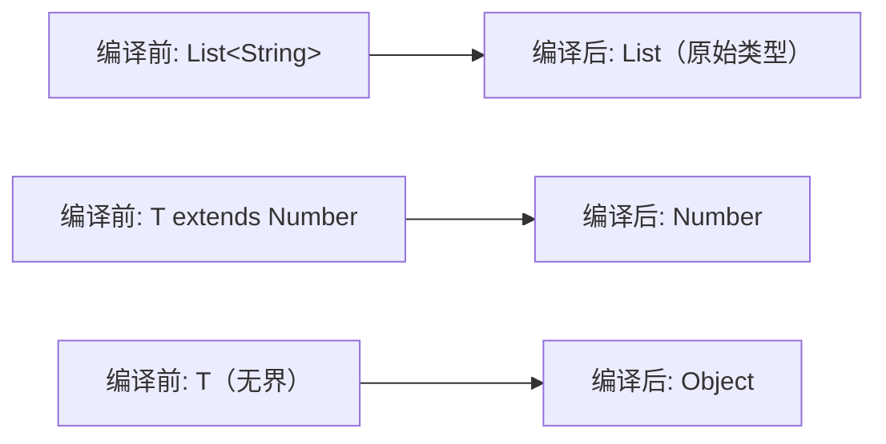
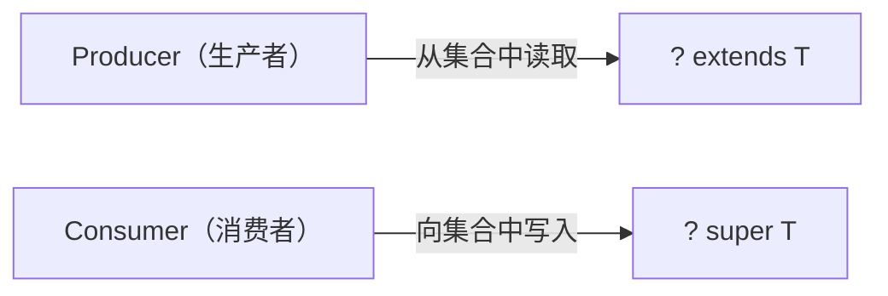

# 泛型

## 概念说明

泛型（Generics）是 JDK 5 引入的特性，允许在定义类、接口和方法时使用类型参数。泛型的核心目的是**类型安全**和**消除强制类型转换**。

```java
// 没有泛型（JDK 5 之前）
List list = new ArrayList();
list.add("hello");
String s = (String) list.get(0); // 需要强制转换，可能 ClassCastException

// 使用泛型
List<String> list = new ArrayList<>();
list.add("hello");
String s = list.get(0); // 无需强制转换，编译期类型检查
```

## 核心原理

### 类型擦除（Type Erasure）

Java 泛型是通过**类型擦除**实现的，这是 Java 泛型最重要的特性，也是很多"奇怪"行为的根源。

**类型擦除的规则**：
1. 无界泛型参数 `<T>` 擦除为 `Object`
2. 有上界的泛型参数 `<T extends Number>` 擦除为 `Number`
3. 编译器在必要的地方插入强制类型转换



```java
// 编译前
public class Box<T> {
    private T value;
    public T getValue() { return value; }
}

// 编译后（类型擦除）
public class Box {
    private Object value;
    public Object getValue() { return value; }
}

// 调用处，编译器自动插入强制转换
Box<String> box = new Box<>();
String s = box.getValue(); // 编译器插入: String s = (String) box.getValue();
```

**类型擦除的影响**：

```java
// 1. 运行时无法获取泛型类型
List<String> list = new ArrayList<>();
list instanceof ArrayList<String>; // 编译错误！
list.getClass() == ArrayList.class; // true，运行时只有 ArrayList

// 2. 不能创建泛型数组
T[] arr = new T[10]; // 编译错误！

// 3. 不能用基本类型作为泛型参数
List<int> list; // 编译错误！必须用 List<Integer>

// 4. 泛型类型不同的两个 List 是同一个 Class
List<String>.class == List<Integer>.class; // true
```

### 通配符（Wildcard）

| 通配符 | 含义 | 读写限制 |
|--------|------|---------|
| `<?>` | 无界通配符 | 只能读（返回 Object），不能写 |
| `` <? extends T> `` | 上界通配符 | 只能读（返回 T），不能写 |
| `` <? super T> `` | 下界通配符 | 可以写（写入 T 及其子类），读取返回 Object |

### PECS 原则（Producer Extends, Consumer Super）



```java
// Producer Extends：从集合中读取数据
public static double sum(List<? extends Number> list) {
    double sum = 0;
    for (Number n : list) { // 可以安全地读取为 Number
        sum += n.doubleValue();
    }
    return sum;
}
// 可以传入 List<Integer>、List<Double> 等
sum(List.of(1, 2, 3));       // OK
sum(List.of(1.0, 2.0, 3.0)); // OK

// Consumer Super：向集合中写入数据
public static void addNumbers(List<? super Integer> list) {
    list.add(1);   // 可以安全地写入 Integer
    list.add(2);
}
// 可以传入 List<Integer>、List<Number>、List<Object>
```

### 上界与下界

```java
// 上界：T 必须是 Number 或其子类
public <T extends Number> double sum(List<T> list) { ... }

// 多重上界：T 必须同时满足多个约束
public <T extends Comparable<T> & Serializable> void sort(List<T> list) { ... }

// 下界（只能用在通配符中，不能用在类型参数中）
List<? super Integer> list; // 可以是 List<Integer>、List<Number>、List<Object>
```

### 泛型方法

```java
// 泛型方法：类型参数声明在返回类型之前
public static <T> T getFirst(List<T> list) {
    return list.isEmpty() ? null : list.get(0);
}

// 调用时类型推断
String first = getFirst(List.of("a", "b")); // T 推断为 String
```

### 获取泛型类型信息（绕过类型擦除）

虽然运行时泛型信息被擦除，但在某些场景下可以通过反射获取：

```java
// 1. 通过子类获取父类的泛型参数
public abstract class TypeReference<T> {
    Type getType() {
        return ((ParameterizedType) getClass().getGenericSuperclass())
                .getActualTypeArguments()[0];
    }
}

// 使用：创建匿名子类
TypeReference<List<String>> ref = new TypeReference<>() {};
System.out.println(ref.getType()); // java.util.List<java.lang.String>

// 2. 通过 Field 获取字段的泛型类型
Field field = MyClass.class.getDeclaredField("list");
ParameterizedType type = (ParameterizedType) field.getGenericType();
Type[] args = type.getActualTypeArguments(); // [String]
```

> 💡 这就是 Jackson 的 `TypeReference`、Gson 的 `TypeToken` 的实现原理。

## 代码示例

```java
public class GenericsDemo {
    // 泛型类
    static class Pair<K, V> {
        private K key;
        private V value;
        Pair(K key, V value) { this.key = key; this.value = value; }
        K getKey() { return key; }
        V getValue() { return value; }
    }

    // 泛型方法
    static <T extends Comparable<T>> T max(T a, T b) {
        return a.compareTo(b) >= 0 ? a : b;
    }

    // PECS 示例
    static <T> void copy(List<? extends T> src, List<? super T> dest) {
        for (T item : src) {
            dest.add(item);
        }
    }

    public static void main(String[] args) {
        Pair<String, Integer> pair = new Pair<>("age", 25);
        System.out.println(pair.getKey() + ": " + pair.getValue());

        System.out.println(max(3, 5));       // 5
        System.out.println(max("abc", "xyz")); // xyz
    }
}
```

> 💻 完整可运行代码：[code-examples/01-java-core/java-basics/src/main/java/com/example/basics/generics/](https://github.com/skyhe58/guide-java/tree/main/code-examples/01-java-core/java-basics/src/main/java/com/example/basics/generics/)
> <!-- 本地路径：code-examples/01-java-core/java-basics/src/main/java/com/example/basics/generics/ -->

## 常见面试题

### Q1: Java 泛型的类型擦除是什么？有什么影响？

**难度**：⭐⭐⭐ | **频率**：🔥🔥🔥

**答题思路**：

1. 解释类型擦除的机制
2. 列举类型擦除带来的限制
3. 说明如何绕过类型擦除

**标准答案**：

Java 泛型是通过类型擦除实现的，编译后泛型信息会被移除：无界类型参数擦除为 Object，有上界的擦除为上界类型。编译器在必要处插入强制类型转换。类型擦除的影响包括：（1）运行时无法获取泛型类型（`List<String>` 和 `List<Integer>` 运行时是同一个类）；（2）不能创建泛型数组；（3）不能用基本类型作为泛型参数；（4）不能对泛型类型使用 instanceof。可以通过匿名子类 + 反射（如 TypeReference）在特定场景下获取泛型信息。

**深入追问**：

- 为什么 Java 选择类型擦除而不是像 C# 那样的具化泛型？（向后兼容 JDK 5 之前的代码）
- Jackson/Gson 如何获取泛型类型？（TypeReference/TypeToken，利用匿名子类保留泛型信息）

**易错点**：

- 以为运行时可以获取泛型类型
- 忘记类型擦除后泛型方法可能产生桥接方法

### Q2: `<? extends T>` 和 `<? super T>` 的区别？什么是 PECS？

**难度**：⭐⭐⭐ | **频率**：🔥🔥

**答题思路**：

1. 分别解释上界和下界通配符
2. 说明读写限制
3. 解释 PECS 原则

**标准答案**：

`<? extends T>` 是上界通配符，表示类型是 T 或 T 的子类，只能读取（返回 T 类型），不能写入（因为不知道具体是哪个子类）。`<? super T>` 是下界通配符，表示类型是 T 或 T 的父类，可以写入 T 及其子类，读取只能返回 Object。PECS 原则：Producer Extends, Consumer Super——如果集合是数据的生产者（从中读取），用 extends；如果是消费者（向其写入），用 super。典型例子是 `Collections.copy(List<? super T> dest, List<? extends T> src)`。

**深入追问**：

- 为什么 `` List<? extends Number> `` 不能 add？（编译器不知道具体类型，add Integer 可能实际是 `List<Double>`）
- `List<?>` 和 `List<Object>` 有什么区别？（`List<?>` 可以接受任何泛型 List，`List<Object>` 只能接受 `List<Object>`）

**易错点**：

- 混淆 extends 和 super 的读写限制
- 忘记 PECS 原则

## 参考资料

- [Java Generics Tutorial](https://docs.oracle.com/javase/tutorial/java/generics/index.html)
- [Effective Java - Item 26-33: Generics](https://www.oreilly.com/library/view/effective-java/9780134686097/)
- [Java Language Specification - Generics](https://docs.oracle.com/javase/specs/jls/se21/html/jls-4.html#jls-4.5)
