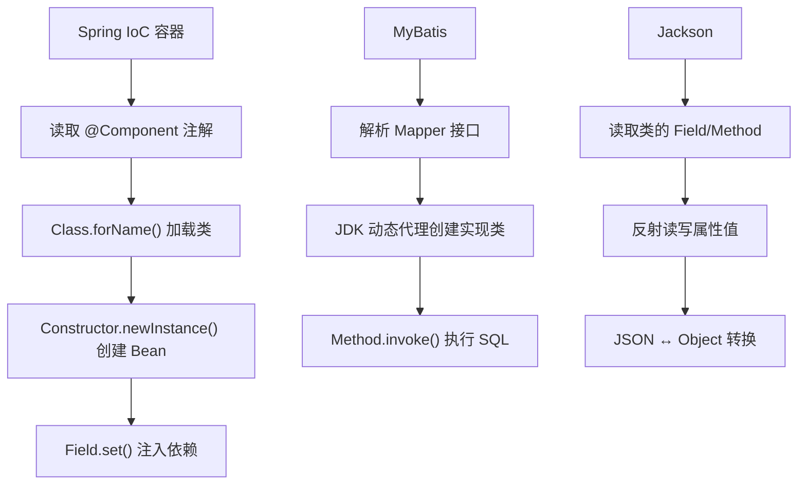

# 反射

## 概念说明

反射（Reflection）是 Java 在运行时动态获取类信息、创建对象、调用方法、访问字段的能力。反射是 Spring IoC、MyBatis、Jackson 等框架的底层基石。虽然日常业务代码很少直接使用反射，但理解反射对于理解框架原理至关重要。

## 核心原理

### 获取 Class 对象的三种方式

```java
// 方式1：类名.class（编译期确定）
Class<String> clazz1 = String.class;

// 方式2：对象.getClass()（运行时获取）
String str = "hello";
Class<?> clazz2 = str.getClass();

// 方式3：Class.forName()（动态加载，最常用于框架）
Class<?> clazz3 = Class.forName("java.lang.String");

// 三种方式获取的是同一个 Class 对象
System.out.println(clazz1 == clazz2); // true
System.out.println(clazz2 == clazz3); // true
```

> 💡 每个类在 JVM 中只有一个 Class 对象，由类加载器在首次使用时创建。

### Field 操作

```java
Class<?> clazz = Person.class;

// 获取所有公共字段（包括继承的）
Field[] publicFields = clazz.getFields();

// 获取所有声明的字段（包括私有的，不包括继承的）
Field[] allFields = clazz.getDeclaredFields();

// 获取指定字段
Field nameField = clazz.getDeclaredField("name");

// 访问私有字段
nameField.setAccessible(true); // 突破访问控制
Person person = new Person("Alice", 25);
String name = (String) nameField.get(person);  // 读取
nameField.set(person, "Bob");                   // 修改
```

### Method 操作

```java
Class<?> clazz = Person.class;

// 获取所有公共方法（包括继承的）
Method[] publicMethods = clazz.getMethods();

// 获取所有声明的方法（包括私有的）
Method[] allMethods = clazz.getDeclaredMethods();

// 获取指定方法（方法名 + 参数类型）
Method setName = clazz.getDeclaredMethod("setName", String.class);

// 调用方法
Person person = new Person("Alice", 25);
setName.invoke(person, "Bob"); // 等价于 person.setName("Bob")

// 调用私有方法
Method privateMethod = clazz.getDeclaredMethod("secretMethod");
privateMethod.setAccessible(true);
privateMethod.invoke(person);

// 调用静态方法
Method staticMethod = clazz.getDeclaredMethod("staticMethod");
staticMethod.invoke(null); // 静态方法不需要实例
```

### Constructor 操作

```java
Class<?> clazz = Person.class;

// 获取所有公共构造方法
Constructor<?>[] constructors = clazz.getConstructors();

// 获取指定构造方法
Constructor<?> constructor = clazz.getDeclaredConstructor(String.class, int.class);

// 创建实例
Person person = (Person) constructor.newInstance("Alice", 25);

// 无参构造
Person person2 = (Person) clazz.getDeclaredConstructor().newInstance();
```

### 反射性能优化

反射调用比直接调用慢 10-100 倍，主要开销在：
1. 安全检查（`setAccessible(true)` 可以跳过）
2. 参数装箱/拆箱
3. 方法查找

**优化策略**：

```java
// 1. 缓存 Method/Field 对象，避免重复查找
private static final Method METHOD_CACHE;
static {
    try {
        METHOD_CACHE = Person.class.getDeclaredMethod("getName");
        METHOD_CACHE.setAccessible(true); // 一次性设置
    } catch (NoSuchMethodException e) {
        throw new RuntimeException(e);
    }
}

// 2. 使用 MethodHandle（JDK 7+，性能接近直接调用）
MethodHandles.Lookup lookup = MethodHandles.lookup();
MethodHandle handle = lookup.findVirtual(Person.class, "getName",
    MethodType.methodType(String.class));
String name = (String) handle.invoke(person);

// 3. 使用 LambdaMetafactory（JDK 8+，性能最好）
// Spring 框架内部大量使用此方式
```

### 反射在框架中的应用



| 框架 | 反射用途 |
|------|---------|
| Spring IoC | 扫描注解、创建 Bean、注入依赖 |
| Spring AOP | 动态代理、方法拦截 |
| MyBatis | Mapper 接口代理、结果集映射 |
| Jackson/Gson | 对象与 JSON 互转 |
| JUnit | 发现和执行测试方法 |
| Hibernate | ORM 映射、延迟加载 |

## 代码示例

```java
public class ReflectionDemo {
    public static void main(String[] args) throws Exception {
        // 1. 获取 Class 对象
        Class<?> clazz = Class.forName("com.example.basics.reflection.Person");

        // 2. 创建实例
        Constructor<?> ctor = clazz.getDeclaredConstructor(String.class, int.class);
        Object person = ctor.newInstance("Alice", 25);

        // 3. 读取私有字段
        Field ageField = clazz.getDeclaredField("age");
        ageField.setAccessible(true);
        System.out.println("Age: " + ageField.get(person)); // 25

        // 4. 调用方法
        Method getName = clazz.getDeclaredMethod("getName");
        System.out.println("Name: " + getName.invoke(person)); // Alice

        // 5. 修改字段
        ageField.set(person, 30);
        System.out.println("New Age: " + ageField.get(person)); // 30

        // 6. 获取泛型信息
        Field listField = clazz.getDeclaredField("hobbies");
        ParameterizedType type = (ParameterizedType) listField.getGenericType();
        System.out.println("泛型类型: " + type.getActualTypeArguments()[0]); // String
    }
}
```

> 💻 完整可运行代码：[code-examples/01-java-core/java-basics/src/main/java/com/example/basics/reflection/](https://github.com/skyhe58/guide-java/tree/main/code-examples/01-java-core/java-basics/src/main/java/com/example/basics/reflection/)
> <!-- 本地路径：code-examples/01-java-core/java-basics/src/main/java/com/example/basics/reflection/ -->

## 常见面试题

### Q1: 获取 Class 对象有几种方式？有什么区别？

**难度**：⭐⭐ | **频率**：🔥🔥

**答题思路**：

1. 列举三种方式
2. 说明各自的使用场景
3. 强调它们返回的是同一个 Class 对象

**标准答案**：

三种方式：（1）`类名.class`，编译期确定，不会触发类初始化；（2）`对象.getClass()`，运行时获取，需要已有实例；（3）`Class.forName("全限定名")`，动态加载，会触发类初始化（执行 static 块），最常用于框架。三种方式获取的是同一个 Class 对象（JVM 中每个类只有一个 Class 实例）。

**深入追问**：

- `Class.forName()` 和 `ClassLoader.loadClass()` 有什么区别？（前者会初始化类，后者不会）
- 什么时候用哪种方式？（框架用 forName，工具方法用 .class，运行时判断用 getClass）

**易错点**：

- 误以为三种方式返回不同的 Class 对象
- 忘记 `Class.forName()` 会触发类初始化

### Q2: 反射的性能问题如何优化？

**难度**：⭐⭐⭐ | **频率**：🔥🔥

**答题思路**：

1. 说明反射慢的原因
2. 列举优化方案
3. 提到框架的做法

**标准答案**：

反射慢的原因：安全检查、参数装箱、方法查找。优化方案：（1）缓存 Method/Field/Constructor 对象，避免重复查找；（2）调用 `setAccessible(true)` 跳过安全检查；（3）使用 MethodHandle（JDK 7+），性能接近直接调用；（4）使用 LambdaMetafactory（JDK 8+），性能最好，Spring 框架内部大量使用。实际上，现代框架（如 Spring）在启动时通过反射完成初始化，运行时通过缓存和 MethodHandle 避免反射开销。

**深入追问**：

- MethodHandle 和 Method.invoke 有什么区别？
- Spring 是如何优化反射性能的？

**易错点**：

- 以为反射一定很慢（优化后性能可以接受）
- 忘记缓存反射对象

### Q3: 反射能访问私有成员吗？有什么安全隐患？

**难度**：⭐⭐ | **频率**：🔥🔥

**答题思路**：

1. 可以，通过 setAccessible(true)
2. 安全隐患
3. JDK 9+ 模块系统的限制

**标准答案**：

可以，通过 `setAccessible(true)` 可以突破 private 访问控制，访问和修改私有字段、调用私有方法。安全隐患包括：破坏封装性、可能修改不可变对象（如 String 的内部 value 数组）、绕过安全检查。JDK 9 引入模块系统后，跨模块的反射访问受到限制，需要在 module-info.java 中使用 `opens` 指令开放包，或在启动时添加 `--add-opens` 参数。

**深入追问**：

- 如何通过反射修改 final 字段？（JDK 12 之前可以，之后受限）
- JDK 9 模块系统对反射有什么影响？

**易错点**：

- 忘记 JDK 9+ 模块系统的限制

## 参考资料

- [Java Reflection Tutorial](https://docs.oracle.com/javase/tutorial/reflect/index.html)
- [MethodHandle API](https://docs.oracle.com/en/java/javase/21/docs/api/java.base/java/lang/invoke/MethodHandle.html)
- [Effective Java - Item 65: Prefer interfaces to reflection](https://www.oreilly.com/library/view/effective-java/9780134686097/)
