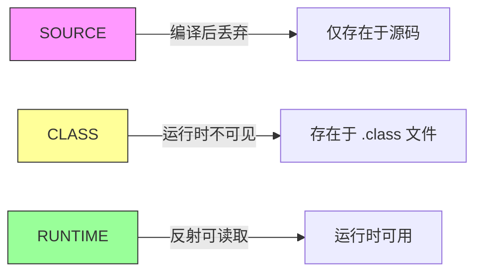
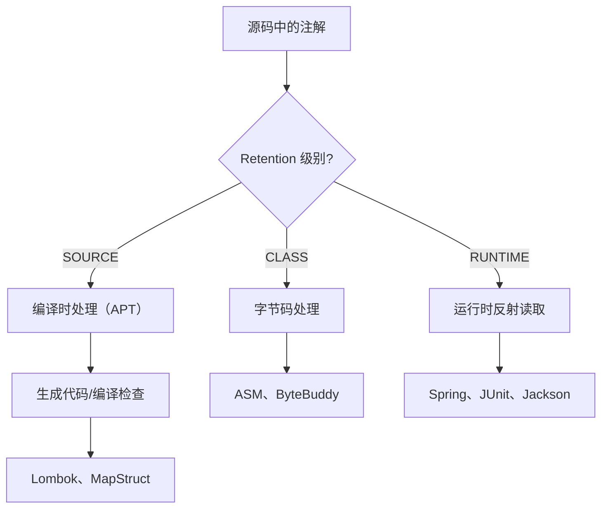

# 注解

## 概念说明

注解（Annotation）是 JDK 5 引入的元数据机制，用于为代码添加额外信息。注解本身不影响程序逻辑，但可以被编译器、框架或工具在编译时或运行时读取和处理。Spring 框架大量使用注解（如 `@Component`、`@Autowired`、`@Transactional`），理解注解机制是理解 Spring 的基础。

## 核心原理

### 内置注解

| 注解 | 作用 |
|------|------|
| `@Override` | 标记方法重写，编译器检查 |
| `@Deprecated` | 标记已废弃的元素 |
| `@SuppressWarnings` | 抑制编译器警告 |
| `@FunctionalInterface` | 标记函数式接口（JDK 8+） |

### 元注解（Meta-Annotation）

元注解是用来注解注解的注解，定义注解的行为。

| 元注解 | 作用 | 常用值 |
|--------|------|--------|
| `@Target` | 注解可以用在哪里 | TYPE, METHOD, FIELD, PARAMETER, CONSTRUCTOR |
| `@Retention` | 注解保留到什么阶段 | SOURCE, CLASS, RUNTIME |
| `@Documented` | 是否包含在 Javadoc 中 | — |
| `@Inherited` | 子类是否继承父类的注解 | — |
| `@Repeatable` | 是否可重复使用（JDK 8+） | — |

**@Retention 的三个级别**：



| 级别 | 说明 | 典型示例 |
|------|------|---------|
| `SOURCE` | 仅在源码中，编译后丢弃 | `@Override`, `@SuppressWarnings` |
| `CLASS` | 保留到 .class 文件，运行时不可见（默认） | Lombok 注解 |
| `RUNTIME` | 运行时可通过反射读取 | Spring 的 `@Component`, `@Autowired` |

### 自定义注解

```java
// 定义注解
@Target(ElementType.METHOD)           // 只能用在方法上
@Retention(RetentionPolicy.RUNTIME)   // 运行时可读取
@Documented
public @interface RateLimit {
    int value() default 100;          // 每秒最大请求数，默认 100
    String key() default "";          // 限流 key
    String message() default "请求过于频繁"; // 提示信息
}

// 使用注解
public class UserController {
    @RateLimit(value = 10, key = "login")
    public Result login(String username, String password) {
        // ...
    }
}
```

### 注解处理器

**运行时注解处理（反射）**：

```java
// 通过反射读取注解
public class RateLimitInterceptor {
    public void intercept(Method method) {
        // 检查方法是否有 @RateLimit 注解
        if (method.isAnnotationPresent(RateLimit.class)) {
            RateLimit rateLimit = method.getAnnotation(RateLimit.class);
            int maxRequests = rateLimit.value();
            String key = rateLimit.key();
            // 执行限流逻辑...
        }
    }
}
```

**编译时注解处理（APT - Annotation Processing Tool）**：

```java
// 编译时注解处理器（如 Lombok、MapStruct 的实现方式）
@SupportedAnnotationTypes("com.example.MyAnnotation")
@SupportedSourceVersion(SourceVersion.RELEASE_21)
public class MyAnnotationProcessor extends AbstractProcessor {

    @Override
    public boolean process(Set<? extends TypeElement> annotations,
                          RoundEnvironment roundEnv) {
        for (Element element : roundEnv.getElementsAnnotatedWith(MyAnnotation.class)) {
            // 在编译期生成代码或进行检查
            processingEnv.getMessager().printMessage(
                Diagnostic.Kind.NOTE,
                "Processing: " + element.getSimpleName()
            );
        }
        return true;
    }
}
```



### Spring 中注解的工作原理

```java
// Spring 启动时的注解处理流程（简化）
// 1. 扫描指定包下所有类
// 2. 检查类上是否有 @Component 及其派生注解
// 3. 通过反射创建 Bean 实例
// 4. 检查字段/方法上的 @Autowired，通过反射注入依赖
// 5. 检查方法上的 @Transactional，通过 AOP 创建代理
```

## 代码示例

```java
// 自定义注解：方法执行时间统计
@Target(ElementType.METHOD)
@Retention(RetentionPolicy.RUNTIME)
public @interface Timer {
    String value() default "";
}

// 注解处理（简化版，实际用 AOP）
public class TimerProcessor {
    public static void process(Object target) throws Exception {
        for (Method method : target.getClass().getDeclaredMethods()) {
            if (method.isAnnotationPresent(Timer.class)) {
                Timer timer = method.getAnnotation(Timer.class);
                long start = System.nanoTime();
                method.invoke(target);
                long elapsed = System.nanoTime() - start;
                String name = timer.value().isEmpty() ? method.getName() : timer.value();
                System.out.printf("%s 执行耗时: %.2fms%n", name, elapsed / 1_000_000.0);
            }
        }
    }
}
```

> 💻 完整可运行代码：[code-examples/01-java-core/java-basics/src/main/java/com/example/basics/annotations/](../../../code-examples/01-java-core/java-basics/src/main/java/com/example/basics/annotations/)

## 常见面试题

### Q1: 注解的原理是什么？运行时注解是如何工作的？

**难度**：⭐⭐ | **频率**：🔥🔥

**答题思路**：

1. 注解本质是接口
2. 运行时通过反射读取
3. 举例说明 Spring 的注解处理

**标准答案**：

注解本质上是继承了 `java.lang.annotation.Annotation` 接口的特殊接口。编译后注解信息存储在 .class 文件的属性表中。运行时注解（`@Retention(RUNTIME)`）可以通过反射 API（如 `getAnnotation()`、`isAnnotationPresent()`）读取。Spring 框架在启动时扫描指定包下的类，通过反射检查类/方法/字段上的注解，根据注解类型执行相应的逻辑（如创建 Bean、注入依赖、创建代理等）。

**深入追问**：

- 编译时注解处理器（APT）和运行时反射有什么区别？（APT 在编译期处理，不影响运行时性能）
- Lombok 是如何工作的？（编译时注解处理 + AST 修改）

**易错点**：

- 以为注解本身有逻辑（注解只是元数据，逻辑在处理器中）
- 混淆三种 Retention 级别

### Q2: @Target 和 @Retention 的作用？

**难度**：⭐⭐ | **频率**：🔥🔥

**答题思路**：

1. @Target 控制注解的使用位置
2. @Retention 控制注解的生命周期
3. 举例说明

**标准答案**：

`@Target` 指定注解可以标注在哪些元素上，如 TYPE（类/接口）、METHOD（方法）、FIELD（字段）、PARAMETER（参数）等。`@Retention` 指定注解保留到什么阶段：SOURCE（仅源码，编译后丢弃，如 @Override）、CLASS（保留到 .class 文件，运行时不可见，如 Lombok 注解）、RUNTIME（运行时可通过反射读取，如 Spring 的 @Component）。大多数框架注解使用 RUNTIME 级别。

**深入追问**：

- @Inherited 有什么作用？（子类继承父类的类级别注解，方法级别不受影响）
- @Repeatable 怎么用？（允许同一个注解在同一位置使用多次）

**易错点**：

- 忘记 @Retention 默认是 CLASS 而不是 RUNTIME

## 参考资料

- [Java Annotations Tutorial](https://docs.oracle.com/javase/tutorial/java/annotations/index.html)
- [Annotation Processing API](https://docs.oracle.com/en/java/javase/21/docs/api/java.compiler/javax/annotation/processing/package-summary.html)
