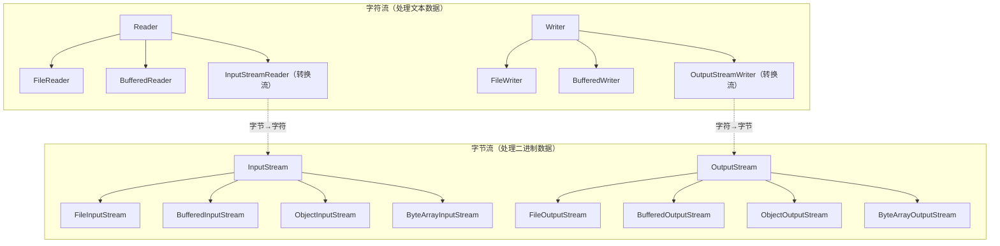
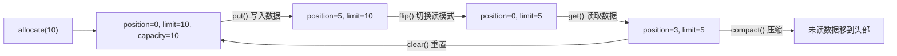

# 文件与 IO 流

## 概念说明

Java 的 IO 体系分为两大部分：
- **传统 IO（java.io）**：基于流（Stream）的阻塞式 IO，JDK 1.0 引入
- **NIO（java.nio）**：基于通道（Channel）和缓冲区（Buffer）的非阻塞式 IO，JDK 1.4 引入，JDK 7 增强为 NIO.2

## 核心原理

### IO 流继承体系



### 字节流 vs 字符流

| 对比项 | 字节流 | 字符流 |
|--------|--------|--------|
| 基类 | InputStream / OutputStream | Reader / Writer |
| 处理单位 | 字节（byte, 8 bit） | 字符（char, 16 bit） |
| 适用场景 | 图片、视频、二进制文件 | 文本文件 |
| 编码处理 | 不处理编码 | 自动处理编码转换 |

### 缓冲流

缓冲流在内部维护一个缓冲区（默认 8KB），减少实际的 IO 操作次数，显著提升性能。

```java
// 不使用缓冲：每次读写都是一次系统调用
FileInputStream fis = new FileInputStream("file.txt");
int b;
while ((b = fis.read()) != -1) { // 每次读 1 字节，效率极低
    // ...
}

// 使用缓冲：批量读写
BufferedInputStream bis = new BufferedInputStream(new FileInputStream("file.txt"));
int b;
while ((b = bis.read()) != -1) { // 从缓冲区读，缓冲区空了才真正读磁盘
    // ...
}
```

### 转换流

转换流是字节流和字符流之间的桥梁，可以指定编码。

```java
// 字节流 → 字符流（指定编码）
InputStreamReader isr = new InputStreamReader(
    new FileInputStream("file.txt"), StandardCharsets.UTF_8);

// 字符流 → 字节流
OutputStreamWriter osw = new OutputStreamWriter(
    new FileOutputStream("file.txt"), StandardCharsets.UTF_8);
```

### 对象流（序列化）

```java
// 序列化：对象 → 字节流
ObjectOutputStream oos = new ObjectOutputStream(new FileOutputStream("data.ser"));
oos.writeObject(new Person("Alice", 25));

// 反序列化：字节流 → 对象
ObjectInputStream ois = new ObjectInputStream(new FileInputStream("data.ser"));
Person person = (Person) ois.readObject();
```

> ⚠️ 序列化的类必须实现 `Serializable` 接口，`transient` 字段不会被序列化。

### try-with-resources（JDK 7+）

```java
// JDK 7 之前：手动关闭资源
InputStream is = null;
try {
    is = new FileInputStream("file.txt");
    // 使用 is
} catch (IOException e) {
    e.printStackTrace();
} finally {
    if (is != null) {
        try { is.close(); } catch (IOException e) { /* 忽略 */ }
    }
}

// JDK 7+：自动关闭（实现了 AutoCloseable 接口的资源）
try (InputStream is = new FileInputStream("file.txt");
     BufferedReader br = new BufferedReader(new InputStreamReader(is))) {
    String line = br.readLine();
} // 自动调用 close()，关闭顺序与声明顺序相反
```

### NIO 核心组件

NIO 的三大核心：**Channel（通道）**、**Buffer（缓冲区）**、**Selector（选择器）**。

| 组件 | 说明 | 类比 |
|------|------|------|
| Channel | 双向数据通道 | 铁路 |
| Buffer | 数据缓冲区 | 火车车厢 |
| Selector | 多路复用器 | 调度中心 |

**NIO Files/Path API（JDK 7+）**：

```java
// Path：替代 File 的路径表示
Path path = Path.of("src", "main", "resources", "file.txt");
Path path2 = Paths.get("/home/user/file.txt");

// Files：强大的文件操作工具类
// 读取所有行
List<String> lines = Files.readAllLines(path, StandardCharsets.UTF_8);

// 读取所有字节
byte[] bytes = Files.readAllBytes(path);

// 写入文件
Files.writeString(path, "Hello World", StandardCharsets.UTF_8);

// 复制文件
Files.copy(source, target, StandardCopyOption.REPLACE_EXISTING);

// 遍历目录
try (Stream<Path> stream = Files.walk(Path.of("src"), 3)) {
    stream.filter(Files::isRegularFile)
          .forEach(System.out::println);
}

// 查找文件
try (Stream<Path> stream = Files.find(Path.of("src"), 5,
        (p, attr) -> p.toString().endsWith(".java"))) {
    stream.forEach(System.out::println);
}
```

### Channel 和 Buffer

```java
// FileChannel 读写
try (FileChannel channel = FileChannel.open(path, StandardOpenOption.READ)) {
    ByteBuffer buffer = ByteBuffer.allocate(1024);
    while (channel.read(buffer) != -1) {
        buffer.flip();  // 切换为读模式
        while (buffer.hasRemaining()) {
            System.out.print((char) buffer.get());
        }
        buffer.clear(); // 切换为写模式
    }
}
```

**Buffer 的核心概念**：



### 大文件读写与内存映射（MappedByteBuffer）

对于大文件（GB 级别），传统 IO 需要多次系统调用，效率低。内存映射文件（Memory-Mapped File）将文件直接映射到内存，通过操作内存来读写文件。

```java
// 内存映射文件读取（适合大文件）
try (FileChannel channel = FileChannel.open(Path.of("large-file.dat"),
        StandardOpenOption.READ)) {
    // 将文件映射到内存
    MappedByteBuffer buffer = channel.map(
        FileChannel.MapMode.READ_ONLY, 0, channel.size());

    // 直接操作内存，无需系统调用
    while (buffer.hasRemaining()) {
        byte b = buffer.get();
        // 处理数据
    }
}
```

**大文件读写方案对比**：

| 方案 | 适用场景 | 优点 | 缺点 |
|------|---------|------|------|
| BufferedInputStream | 中小文件 | 简单易用 | 大文件内存不够 |
| FileChannel + Buffer | 中大文件 | 性能好 | 代码稍复杂 |
| MappedByteBuffer | 超大文件 | 性能最好，零拷贝 | 映射大小受限于虚拟内存 |
| Files.lines() | 大文本文件逐行处理 | 惰性加载，内存友好 | 仅适用于文本 |

## 代码示例

```java
public class IODemo {
    public static void main(String[] args) throws Exception {
        Path path = Path.of("test.txt");

        // 1. NIO Files 写入
        Files.writeString(path, "Hello, NIO!\n第二行内容", StandardCharsets.UTF_8);

        // 2. NIO Files 读取
        String content = Files.readString(path, StandardCharsets.UTF_8);
        System.out.println(content);

        // 3. 逐行读取（大文件友好）
        try (Stream<String> lines = Files.lines(path, StandardCharsets.UTF_8)) {
            lines.filter(line -> !line.isEmpty())
                 .forEach(System.out::println);
        }

        // 4. 缓冲流复制文件
        try (BufferedInputStream bis = new BufferedInputStream(new FileInputStream("source.txt"));
             BufferedOutputStream bos = new BufferedOutputStream(new FileOutputStream("target.txt"))) {
            byte[] buffer = new byte[8192];
            int len;
            while ((len = bis.read(buffer)) != -1) {
                bos.write(buffer, 0, len);
            }
        }

        // 清理
        Files.deleteIfExists(path);
    }
}
```

> 💻 完整可运行代码：[code-examples/01-java-core/java-basics/src/main/java/com/example/basics/io/](https://github.com/skyhe58/guide-java/tree/main/code-examples/01-java-core/java-basics/src/main/java/com/example/basics/io/)
> <!-- 本地路径：code-examples/01-java-core/java-basics/src/main/java/com/example/basics/io/ -->

## 常见面试题

### Q1: BIO、NIO、AIO 的区别？

**难度**：⭐⭐⭐ | **频率**：🔥🔥🔥

**答题思路**：

1. 分别解释三种 IO 模型
2. 对比优缺点
3. 说明使用场景

**标准答案**：

BIO（Blocking IO）是同步阻塞 IO，每个连接需要一个线程处理，适合连接数少的场景。NIO（Non-blocking IO）是同步非阻塞 IO，基于 Channel/Buffer/Selector，一个线程可以管理多个连接（多路复用），适合连接数多但每个连接数据量不大的场景（如聊天服务器）。AIO（Asynchronous IO）是异步非阻塞 IO，基于回调机制，操作系统完成 IO 后通知应用，适合连接数多且 IO 操作重的场景。实际开发中，Netty 基于 NIO 实现，是最常用的网络框架。

**深入追问**：

- NIO 的 Selector 是如何实现多路复用的？（底层使用 epoll/kqueue）
- 为什么 Netty 不使用 AIO？（Linux 的 AIO 实现不成熟，Netty 的 NIO 已经足够高效）

**易错点**：

- 混淆 NIO 的 "Non-blocking" 和 "New"
- 以为 AIO 一定比 NIO 好

### Q2: Files.readAllBytes() 和 MappedByteBuffer 的区别？什么时候用哪个？

**难度**：⭐⭐ | **频率**：🔥🔥

**答题思路**：

1. readAllBytes 一次性读入内存
2. MappedByteBuffer 内存映射
3. 使用场景建议

**标准答案**：

`Files.readAllBytes()` 将整个文件读入 byte 数组，简单方便但文件过大会 OOM。`MappedByteBuffer` 将文件映射到虚拟内存，不需要将整个文件加载到 JVM 堆中，通过操作系统的页面缓存按需加载，适合大文件。小文件（< 几十 MB）用 `Files.readAllBytes()` 或 `Files.readString()`；大文件逐行处理用 `Files.lines()`；超大文件随机访问用 `MappedByteBuffer`。

**深入追问**：

- MappedByteBuffer 的内存在哪里？（堆外内存，由操作系统管理）
- 如何处理超过 2GB 的文件？（MappedByteBuffer 的 size 参数是 long，但单次映射最大 Integer.MAX_VALUE，需要分段映射）

**易错点**：

- 用 readAllBytes 读取大文件导致 OOM

### Q3: try-with-resources 的原理是什么？

**难度**：⭐⭐ | **频率**：🔥🔥

**答题思路**：

1. 编译器语法糖
2. AutoCloseable 接口
3. Suppressed Exception 处理

**标准答案**：

try-with-resources 是 JDK 7 引入的语法糖，编译器会自动在 finally 块中调用资源的 `close()` 方法。资源必须实现 `AutoCloseable` 接口。如果 try 块和 close() 都抛出异常，close() 的异常会作为 suppressed exception 附加到 try 块的异常上（通过 `getSuppressed()` 获取），不会丢失。多个资源的关闭顺序与声明顺序相反。

**深入追问**：

- AutoCloseable 和 Closeable 有什么区别？（Closeable 的 close() 声明抛出 IOException，AutoCloseable 抛出 Exception）

**易错点**：

- 忘记资源需要实现 AutoCloseable
- 不知道 suppressed exception 机制

## 参考资料

- [Java IO Tutorial](https://docs.oracle.com/javase/tutorial/essential/io/index.html)
- [Java NIO Tutorial](https://docs.oracle.com/javase/tutorial/essential/io/fileio.html)
- [Files API](https://docs.oracle.com/en/java/javase/21/docs/api/java.base/java/nio/file/Files.html)
