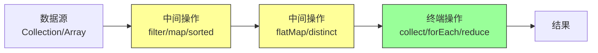

# Lambda 与 Stream API

## 概念说明

Lambda 表达式和 Stream API 是 JDK 8 引入的最重要的特性，彻底改变了 Java 的编程风格。Lambda 让 Java 支持函数式编程，Stream 提供了声明式的集合处理方式。

- **Lambda 表达式**：匿名函数，简化函数式接口的实现
- **Stream API**：对集合的声明式、链式操作，支持并行处理

## 核心原理

### Lambda 表达式

```java
// 传统匿名内部类
Comparator<String> comp1 = new Comparator<String>() {
    @Override
    public int compare(String a, String b) {
        return a.length() - b.length();
    }
};

// Lambda 表达式
Comparator<String> comp2 = (a, b) -> a.length() - b.length();

// 方法引用
Comparator<String> comp3 = Comparator.comparingInt(String::length);
```

**Lambda 语法**：

```java
// 完整形式
(Type param1, Type param2) -> { statements; return result; }

// 简化形式
(param1, param2) -> expression          // 单表达式，自动 return
param -> expression                      // 单参数，省略括号
() -> expression                         // 无参数
```

**函数式接口（Functional Interface）**：只有一个抽象方法的接口。

| 接口 | 方法 | 用途 | 示例 |
|------|------|------|------|
| `Function<T,R>` | `R apply(T t)` | 转换 | `s -> s.length()` |
| `Predicate<T>` | `boolean test(T t)` | 判断 | `s -> s.isEmpty()` |
| `Consumer<T>` | `void accept(T t)` | 消费 | `s -> System.out.println(s)` |
| `Supplier<T>` | `T get()` | 生产 | `() -> new ArrayList<>()` |
| `BiFunction<T,U,R>` | `R apply(T t, U u)` | 双参转换 | `(a, b) -> a + b` |
| `UnaryOperator<T>` | `T apply(T t)` | 一元运算 | `s -> s.toUpperCase()` |
| `BinaryOperator<T>` | `T apply(T t1, T t2)` | 二元运算 | `(a, b) -> a + b` |

**方法引用的四种形式**：

| 形式 | 语法 | 等价 Lambda |
|------|------|------------|
| 静态方法引用 | `Integer::parseInt` | `s -> Integer.parseInt(s)` |
| 实例方法引用 | `System.out::println` | `s -> System.out.println(s)` |
| 任意对象方法引用 | `String::length` | `s -> s.length()` |
| 构造方法引用 | `ArrayList::new` | `() -> new ArrayList<>()` |

### Stream API

Stream 不是数据结构，而是对数据源的一系列操作管道。



**Stream 的特点**：
1. **惰性求值**：中间操作不会立即执行，只有终端操作触发时才执行
2. **一次性使用**：Stream 只能被消费一次
3. **不修改源数据**：操作不会改变原始集合

### 常用操作

**中间操作（返回 Stream，惰性求值）**：

```java
List<String> names = List.of("Alice", "Bob", "Charlie", "David", "Eve");

names.stream()
    .filter(s -> s.length() > 3)        // 过滤：保留长度 > 3 的
    .map(String::toUpperCase)            // 映射：转大写
    .sorted()                            // 排序
    .distinct()                          // 去重
    .limit(3)                            // 限制数量
    .skip(1)                             // 跳过前 N 个
    .peek(System.out::println)           // 调试：查看中间结果
    .collect(Collectors.toList());       // 终端操作：收集结果
```

**flatMap：扁平化映射**：

```java
// 将嵌套集合展平
List<List<Integer>> nested = List.of(List.of(1, 2), List.of(3, 4), List.of(5));
List<Integer> flat = nested.stream()
    .flatMap(Collection::stream)  // [[1,2],[3,4],[5]] → [1,2,3,4,5]
    .collect(Collectors.toList());
```

**终端操作**：

```java
// collect：收集到集合
List<String> list = stream.collect(Collectors.toList());
Set<String> set = stream.collect(Collectors.toSet());
Map<String, Integer> map = stream.collect(Collectors.toMap(s -> s, String::length));

// reduce：归约
int sum = IntStream.rangeClosed(1, 100).reduce(0, Integer::sum);

// forEach：遍历
stream.forEach(System.out::println);

// count / min / max / findFirst / findAny / anyMatch / allMatch / noneMatch
long count = stream.count();
Optional<String> first = stream.findFirst();
boolean hasLong = stream.anyMatch(s -> s.length() > 10);
```

### Collector 自定义

```java
// 常用 Collectors
Collectors.toList()
Collectors.toSet()
Collectors.toMap(keyMapper, valueMapper)
Collectors.joining(", ")                    // 字符串拼接
Collectors.groupingBy(String::length)       // 分组
Collectors.partitioningBy(s -> s.length() > 3) // 分区（true/false 两组）
Collectors.counting()                       // 计数
Collectors.summarizingInt(String::length)   // 统计（count/sum/min/max/avg）

// 自定义 Collector
Collector<String, StringBuilder, String> joiner = Collector.of(
    StringBuilder::new,                     // supplier：创建容器
    (sb, s) -> sb.append(s).append(", "),  // accumulator：累加
    (sb1, sb2) -> sb1.append(sb2),         // combiner：合并（并行流用）
    sb -> sb.length() > 2 ? sb.substring(0, sb.length() - 2) : "" // finisher：最终转换
);
```

### 并行流（Parallel Stream）

```java
// 创建并行流
List<Integer> numbers = List.of(1, 2, 3, 4, 5, 6, 7, 8, 9, 10);
int sum = numbers.parallelStream()
    .filter(n -> n % 2 == 0)
    .mapToInt(Integer::intValue)
    .sum();

// 或从顺序流转换
numbers.stream().parallel().forEach(System.out::println);
```

**并行流注意事项**：

| 注意点 | 说明 |
|--------|------|
| 线程安全 | 不要在并行流中修改共享变量 |
| 有序性 | `forEach` 不保证顺序，用 `forEachOrdered` |
| 性能 | 数据量小时并行流反而更慢（线程切换开销） |
| 数据源 | ArrayList 适合并行，LinkedList 不适合（不支持高效分割） |
| 线程池 | 默认使用 ForkJoinPool.commonPool() |

```java
// ❌ 错误：并行流中修改共享变量
List<Integer> result = new ArrayList<>(); // 非线程安全！
numbers.parallelStream().forEach(result::add); // 可能丢失数据或异常

// ✅ 正确：使用 collect
List<Integer> result = numbers.parallelStream()
    .collect(Collectors.toList());
```

## 代码示例

```java
public class StreamDemo {
    record Employee(String name, String dept, double salary) {}

    public static void main(String[] args) {
        List<Employee> employees = List.of(
            new Employee("Alice", "Engineering", 8000),
            new Employee("Bob", "Engineering", 9000),
            new Employee("Charlie", "Marketing", 7000),
            new Employee("David", "Marketing", 7500),
            new Employee("Eve", "Engineering", 10000)
        );

        // 1. 按部门分组，计算平均薪资
        Map<String, Double> avgSalary = employees.stream()
            .collect(Collectors.groupingBy(
                Employee::dept,
                Collectors.averagingDouble(Employee::salary)
            ));
        System.out.println("部门平均薪资: " + avgSalary);

        // 2. 找出薪资最高的员工
        employees.stream()
            .max(Comparator.comparingDouble(Employee::salary))
            .ifPresent(e -> System.out.println("最高薪资: " + e));

        // 3. 薪资 > 7500 的员工姓名，按薪资降序
        List<String> highPaid = employees.stream()
            .filter(e -> e.salary() > 7500)
            .sorted(Comparator.comparingDouble(Employee::salary).reversed())
            .map(Employee::name)
            .collect(Collectors.toList());
        System.out.println("高薪员工: " + highPaid);

        // 4. 薪资总和
        double totalSalary = employees.stream()
            .mapToDouble(Employee::salary)
            .sum();
        System.out.println("薪资总和: " + totalSalary);
    }
}
```

> 💻 完整可运行代码：[code-examples/01-java-core/java-basics/src/main/java/com/example/basics/stream/](../../../code-examples/01-java-core/java-basics/src/main/java/com/example/basics/stream/)

## 常见面试题

### Q1: Stream 的中间操作和终端操作有什么区别？

**难度**：⭐⭐ | **频率**：🔥🔥🔥

**答题思路**：

1. 中间操作返回 Stream，惰性求值
2. 终端操作触发执行，返回结果
3. 举例说明

**标准答案**：

中间操作（如 filter、map、sorted）返回一个新的 Stream，不会立即执行，只是记录操作管道。终端操作（如 collect、forEach、reduce）触发整个管道的执行，产生最终结果或副作用。Stream 只能有一个终端操作，执行后 Stream 就被消费了，不能再使用。这种惰性求值的设计可以优化执行效率，比如 `filter().limit(3)` 不需要遍历所有元素。

**深入追问**：

- Stream 的惰性求值是如何实现的？（通过 Pipeline 链式记录操作，终端操作时统一执行）
- `peek()` 是中间操作还是终端操作？（中间操作，常用于调试）

**易错点**：

- 忘记 Stream 只能消费一次
- 以为中间操作会立即执行

### Q2: 并行流什么时候用？有什么注意事项？

**难度**：⭐⭐⭐ | **频率**：🔥🔥

**答题思路**：

1. 适用场景：数据量大、计算密集、无共享状态
2. 注意事项：线程安全、有序性、数据源
3. 默认线程池

**标准答案**：

并行流适用于数据量大（万级以上）、计算密集型、无共享可变状态的场景。注意事项：（1）不要在并行流中修改共享变量，用 collect 代替；（2）forEach 不保证顺序，需要顺序用 forEachOrdered；（3）数据源要支持高效分割（ArrayList 好，LinkedList 差）；（4）默认使用 ForkJoinPool.commonPool()，可能影响其他任务；（5）IO 密集型操作不适合并行流。数据量小时并行流反而更慢，因为线程创建和切换有开销。

**深入追问**：

- 如何自定义并行流的线程池？（在自定义 ForkJoinPool 中提交任务）
- 并行流和 CompletableFuture 有什么区别？（并行流适合数据并行，CompletableFuture 适合任务编排）

**易错点**：

- 以为并行流总是更快
- 在并行流中使用非线程安全的集合

### Q3: map 和 flatMap 的区别？

**难度**：⭐⭐ | **频率**：🔥🔥

**答题思路**：

1. map 是一对一映射
2. flatMap 是一对多映射 + 扁平化
3. 举例说明

**标准答案**：

`map` 将每个元素映射为另一个元素（一对一），如 `Stream<String>` 经过 `map(String::length)` 变为 `Stream<Integer>`。`flatMap` 将每个元素映射为一个 Stream，然后将所有 Stream 合并为一个（一对多 + 扁平化），如 `Stream<List<String>>` 经过 `flatMap(Collection::stream)` 变为 `Stream<String>`。典型场景：处理嵌套集合、将一行文本拆分为单词等。

**深入追问**：

- Optional 的 map 和 flatMap 有什么区别？（map 返回 `Optional<Optional<T>>`，flatMap 返回 `Optional<T>`）

**易错点**：

- 混淆 map 和 flatMap 的返回类型

## 参考资料

- [Stream API Javadoc](https://docs.oracle.com/en/java/javase/21/docs/api/java.base/java/util/stream/Stream.html)
- [Collectors Javadoc](https://docs.oracle.com/en/java/javase/21/docs/api/java.base/java/util/stream/Collectors.html)
- [Java Stream Tutorial](https://docs.oracle.com/javase/tutorial/collections/streams/index.html)
