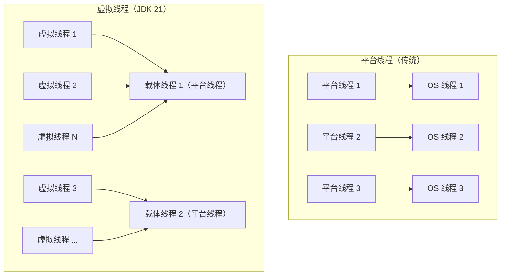

# JDK 版本新特性

## 概念说明

Java 自 JDK 9 开始采用每 6 个月发布一个版本的节奏，其中 LTS（Long-Term Support）版本每 2 年发布一次。面试中最常考的是 JDK 8、JDK 17 和 JDK 21 三个 LTS 版本的核心特性。

| 版本 | 发布时间 | 类型 | 重要程度 |
|------|---------|------|---------|
| JDK 8 | 2014.03 | LTS | ⭐⭐⭐⭐⭐ 目前使用最广泛 |
| JDK 11 | 2018.09 | LTS | ⭐⭐⭐ |
| JDK 17 | 2021.09 | LTS | ⭐⭐⭐⭐ 新项目推荐 |
| JDK 21 | 2023.09 | LTS | ⭐⭐⭐⭐⭐ 最新 LTS |

## 核心原理

### 一、JDK 8 核心特性

JDK 8 是 Java 历史上最重要的版本之一，引入了函数式编程支持。

#### 1. Lambda 表达式

详见 [Lambda 与 Stream API](./11-lambda-stream.md)。

#### 2. Stream API

详见 [Lambda 与 Stream API](./11-lambda-stream.md)。

#### 3. Optional

Optional 是一个容器类，用于优雅地处理可能为 null 的值，避免 NullPointerException。

```java
// 创建 Optional
Optional<String> opt1 = Optional.of("hello");       // 非 null 值
Optional<String> opt2 = Optional.ofNullable(null);   // 可能为 null
Optional<String> opt3 = Optional.empty();             // 空 Optional

// 使用 Optional
String result = opt2
    .filter(s -> s.length() > 3)       // 过滤
    .map(String::toUpperCase)          // 转换
    .orElse("default");                // 默认值

// 链式调用避免 NPE
String city = Optional.ofNullable(user)
    .map(User::getAddress)
    .map(Address::getCity)
    .orElse("Unknown");

// JDK 9+: ifPresentOrElse
opt1.ifPresentOrElse(
    System.out::println,               // 有值时
    () -> System.out.println("empty")  // 无值时
);

// JDK 9+: or
Optional<String> result = opt2.or(() -> Optional.of("fallback"));

// JDK 11+: isEmpty
boolean empty = opt2.isEmpty();
```

> ⚠️ **Optional 最佳实践**：
> - 用于方法返回值，不要用于字段或方法参数
> - 不要用 `Optional.get()` 而不检查（用 `orElse`/`orElseGet`/`orElseThrow`）
> - 不要用 `Optional.of(null)`（会 NPE，用 `ofNullable`）

#### 4. Date-Time API（java.time）

```java
// 替代旧的 Date/Calendar API
LocalDate date = LocalDate.now();                    // 2024-01-15
LocalTime time = LocalTime.now();                    // 14:30:00
LocalDateTime dateTime = LocalDateTime.now();        // 2024-01-15T14:30:00
ZonedDateTime zoned = ZonedDateTime.now();           // 带时区

// 创建指定日期
LocalDate birthday = LocalDate.of(1990, 6, 15);

// 日期计算
LocalDate nextWeek = date.plusWeeks(1);
LocalDate lastMonth = date.minusMonths(1);

// 日期间隔
Period period = Period.between(birthday, date);      // 年月日间隔
Duration duration = Duration.between(time1, time2);  // 时分秒间隔

// 格式化
DateTimeFormatter formatter = DateTimeFormatter.ofPattern("yyyy-MM-dd HH:mm:ss");
String formatted = dateTime.format(formatter);
LocalDateTime parsed = LocalDateTime.parse("2024-01-15 14:30:00", formatter);
```

#### 5. 接口默认方法

```java
public interface Collection<E> {
    // 抽象方法
    boolean add(E e);

    // 默认方法（JDK 8+）：有默认实现，子类可以不重写
    default Stream<E> stream() {
        return StreamSupport.stream(spliterator(), false);
    }

    // 静态方法（JDK 8+）
    static <T> Collection<T> emptyCollection() {
        return Collections.emptyList();
    }
}
```

### 二、JDK 17 LTS 特性

#### 1. Sealed Classes（密封类）

限制哪些类可以继承/实现某个类/接口。

```java
// 只有 Circle、Rectangle、Triangle 可以继承 Shape
public sealed class Shape permits Circle, Rectangle, Triangle {
    // ...
}

public final class Circle extends Shape { ... }           // final：不能再被继承
public sealed class Rectangle extends Shape permits Square { ... } // 可以继续密封
public non-sealed class Triangle extends Shape { ... }    // 开放继承
```

#### 2. Pattern Matching for instanceof

```java
// JDK 16 之前
if (obj instanceof String) {
    String s = (String) obj;
    System.out.println(s.length());
}

// JDK 16+：模式匹配
if (obj instanceof String s) {
    System.out.println(s.length()); // 直接使用 s，无需强制转换
}

// 可以在条件中使用
if (obj instanceof String s && s.length() > 5) {
    System.out.println(s);
}
```

#### 3. Records（记录类）

不可变数据载体，自动生成构造方法、getter、equals、hashCode、toString。

```java
// 传统 POJO 需要大量样板代码
// Record 一行搞定
public record Point(int x, int y) {}

// 使用
Point p = new Point(1, 2);
System.out.println(p.x());     // 1（注意：不是 getX()）
System.out.println(p.y());     // 2
System.out.println(p);         // Point[x=1, y=2]

// 自定义构造方法（紧凑构造方法）
public record Range(int min, int max) {
    public Range {
        if (min > max) throw new IllegalArgumentException("min > max");
    }
}

// Record 可以实现接口
public record NamedPoint(String name, int x, int y) implements Serializable {}
```

#### 4. Text Blocks（文本块）

```java
// JDK 15+：多行字符串
String json = """
        {
            "name": "Alice",
            "age": 25,
            "city": "Beijing"
        }
        """;

String sql = """
        SELECT id, name, age
        FROM users
        WHERE age > 18
        ORDER BY name
        """;
```

#### 5. Switch 表达式

```java
// 传统 switch
String result;
switch (day) {
    case MONDAY: case FRIDAY:
        result = "工作日";
        break;
    default:
        result = "其他";
}

// JDK 14+：Switch 表达式
String result = switch (day) {
    case MONDAY, FRIDAY -> "工作日";
    case SATURDAY, SUNDAY -> "周末";
    default -> "其他";
};

// yield 返回值（多行逻辑）
int numLetters = switch (day) {
    case MONDAY, FRIDAY, SUNDAY -> 6;
    case TUESDAY -> 7;
    default -> {
        String s = day.toString();
        yield s.length(); // 使用 yield 返回值
    }
};
```

### 三、JDK 21 LTS 特性

#### 1. Virtual Threads（虚拟线程）

虚拟线程是 JDK 21 最重要的特性，极大简化了高并发编程。

```java
// 创建虚拟线程
Thread vThread = Thread.ofVirtual().start(() -> {
    System.out.println("Running in virtual thread: " + Thread.currentThread());
});

// 使用 Executors
try (var executor = Executors.newVirtualThreadPerTaskExecutor()) {
    // 可以轻松创建百万级虚拟线程
    for (int i = 0; i < 1_000_000; i++) {
        executor.submit(() -> {
            Thread.sleep(Duration.ofSeconds(1));
            return "done";
        });
    }
}
```



**虚拟线程 vs 平台线程**：

| 对比项 | 平台线程 | 虚拟线程 |
|--------|---------|---------|
| 创建成本 | 高（~1MB 栈内存） | 极低（~几 KB） |
| 数量限制 | 通常几千个 | 可达百万级 |
| 调度 | OS 调度 | JVM 调度 |
| 适用场景 | CPU 密集型 | IO 密集型 |
| 池化 | 需要线程池 | 不需要池化 |

#### 2. Structured Concurrency（结构化并发，预览）

```java
// 结构化并发：子任务的生命周期绑定到父作用域
try (var scope = new StructuredTaskScope.ShutdownOnFailure()) {
    Subtask<String> user = scope.fork(() -> fetchUser(id));
    Subtask<String> order = scope.fork(() -> fetchOrder(id));

    scope.join();           // 等待所有子任务完成
    scope.throwIfFailed();  // 如果有失败则抛出异常

    return new Response(user.get(), order.get());
}
```

#### 3. Record Patterns（记录模式）

```java
// 解构 Record
record Point(int x, int y) {}

// JDK 21：在 instanceof 和 switch 中解构
if (obj instanceof Point(int x, int y)) {
    System.out.println("x=" + x + ", y=" + y);
}

// 嵌套解构
record Line(Point start, Point end) {}
if (obj instanceof Line(Point(int x1, int y1), Point(int x2, int y2))) {
    double length = Math.sqrt(Math.pow(x2 - x1, 2) + Math.pow(y2 - y1, 2));
}

// Switch 中使用
String describe(Object obj) {
    return switch (obj) {
        case Point(int x, int y) when x == 0 && y == 0 -> "原点";
        case Point(int x, int y) -> "点(%d, %d)".formatted(x, y);
        default -> "未知";
    };
}
```

#### 4. Sequenced Collections（有序集合）

```java
// JDK 21：统一的有序集合接口
SequencedCollection<String> list = new ArrayList<>(List.of("a", "b", "c"));
list.getFirst();    // "a"
list.getLast();     // "c"
list.addFirst("z"); // 头部添加
list.addLast("d");  // 尾部添加
list.reversed();    // 反转视图

SequencedMap<String, Integer> map = new LinkedHashMap<>();
map.firstEntry();   // 第一个键值对
map.lastEntry();    // 最后一个键值对
map.pollFirstEntry(); // 移除并返回第一个
```

### 版本迁移注意事项

| 迁移路径 | 主要注意点 |
|---------|-----------|
| JDK 8 → 17 | 模块系统（JPMS）、移除 JavaEE 模块（需添加 jakarta 依赖）、强封装内部 API |
| JDK 17 → 21 | 虚拟线程替代线程池（IO 密集型场景）、Record Patterns、Sequenced Collections |
| 通用 | 检查废弃 API、更新第三方库版本、测试兼容性 |

## 代码示例

```java
public class NewFeaturesDemo {
    // Record（JDK 16+）
    record User(String name, int age, String email) {}

    // Sealed Class（JDK 17+）
    sealed interface Shape permits Circle, Rect {}
    record Circle(double radius) implements Shape {}
    record Rect(double width, double height) implements Shape {}

    public static void main(String[] args) {
        // 1. Pattern Matching + Switch
        Shape shape = new Circle(5.0);
        String desc = switch (shape) {
            case Circle(double r) -> "圆形，半径: " + r;
            case Rect(double w, double h) -> "矩形，面积: " + (w * h);
        };
        System.out.println(desc);

        // 2. Text Block
        String json = """
                {"name": "Alice", "age": 25}
                """;

        // 3. Optional 链式调用
        Optional.ofNullable(new User("Alice", 25, "alice@example.com"))
            .map(User::email)
            .filter(e -> e.contains("@"))
            .ifPresent(e -> System.out.println("Email: " + e));

        // 4. Virtual Thread（JDK 21+）
        Thread.ofVirtual().start(() ->
            System.out.println("Virtual thread: " + Thread.currentThread())
        );
    }
}
```

> 💻 完整可运行代码：[code-examples/01-java-core/java-basics/src/main/java/com/example/basics/features/](../../../code-examples/01-java-core/java-basics/src/main/java/com/example/basics/features/)

## 常见面试题

### Q1: JDK 8 有哪些重要的新特性？

**难度**：⭐⭐ | **频率**：🔥🔥🔥

**答题思路**：

1. Lambda + Stream（最重要）
2. Optional
3. Date-Time API
4. 接口默认方法

**标准答案**：

JDK 8 最重要的特性包括：（1）Lambda 表达式和函数式接口，让 Java 支持函数式编程；（2）Stream API，提供声明式的集合处理方式，支持并行流；（3）Optional 类，优雅处理 null 值；（4）全新的 Date-Time API（java.time 包），替代旧的 Date/Calendar；（5）接口默认方法和静态方法，解决接口演进问题；（6）方法引用和构造器引用。

**深入追问**：

- 为什么需要新的 Date-Time API？（旧 API 线程不安全、设计混乱、月份从 0 开始等）
- Lambda 的底层实现原理？（invokedynamic + LambdaMetafactory，不是匿名内部类）

**易错点**：

- 忘记 Optional 和 Date-Time API

### Q2: 虚拟线程和平台线程有什么区别？什么场景适合用虚拟线程？

**难度**：⭐⭐⭐ | **频率**：🔥🔥

**答题思路**：

1. 创建成本和数量差异
2. 调度方式不同
3. 适用场景

**标准答案**：

平台线程是 OS 线程的包装，创建成本高（约 1MB 栈内存），数量受限（通常几千个），由 OS 调度。虚拟线程是 JVM 管理的轻量级线程，创建成本极低（几 KB），可以创建百万级，由 JVM 调度，在 IO 阻塞时自动让出载体线程。虚拟线程适合 IO 密集型场景（如 Web 服务器处理大量并发请求），不适合 CPU 密集型场景（因为最终还是由有限的载体线程执行）。使用虚拟线程时不需要线程池，每个任务一个虚拟线程即可。

**深入追问**：

- 虚拟线程能完全替代线程池吗？（IO 密集型可以，CPU 密集型不行）
- 虚拟线程有什么限制？（synchronized 会 pin 住载体线程，建议用 ReentrantLock）

**易错点**：

- 以为虚拟线程适合所有场景
- 忘记 synchronized 的 pinning 问题

### Q3: Record 和普通类有什么区别？

**难度**：⭐⭐ | **频率**：🔥🔥

**答题思路**：

1. Record 的特点（不可变、自动生成方法）
2. 限制
3. 使用场景

**标准答案**：

Record 是 JDK 16 引入的不可变数据载体，自动生成构造方法、getter（不带 get 前缀）、equals、hashCode、toString。Record 是 final 的，不能被继承；字段是 final 的，不可修改；不能声明实例字段（只能有组件字段）。Record 可以实现接口、定义静态字段和方法、自定义紧凑构造方法。适用场景：DTO、值对象、多值返回、Map 的 key 等需要不可变数据的场景。

**深入追问**：

- Record 能和 JPA/Hibernate 一起用吗？（不能直接作为 Entity，因为需要无参构造和可变字段）
- Record 和 Lombok 的 @Value 有什么区别？（Record 是语言级别的，Lombok 是编译时代码生成）

**易错点**：

- 以为 Record 的 getter 有 get 前缀（实际是 `name()` 而不是 `getName()`）

## 参考资料

- [JDK 8 Release Notes](https://www.oracle.com/java/technologies/javase/8-whats-new.html)
- [JDK 17 Release Notes](https://openjdk.org/projects/jdk/17/)
- [JDK 21 Release Notes](https://openjdk.org/projects/jdk/21/)
- [JEP 444: Virtual Threads](https://openjdk.org/jeps/444)
- [JEP 395: Records](https://openjdk.org/jeps/395)
- [JEP 409: Sealed Classes](https://openjdk.org/jeps/409)
