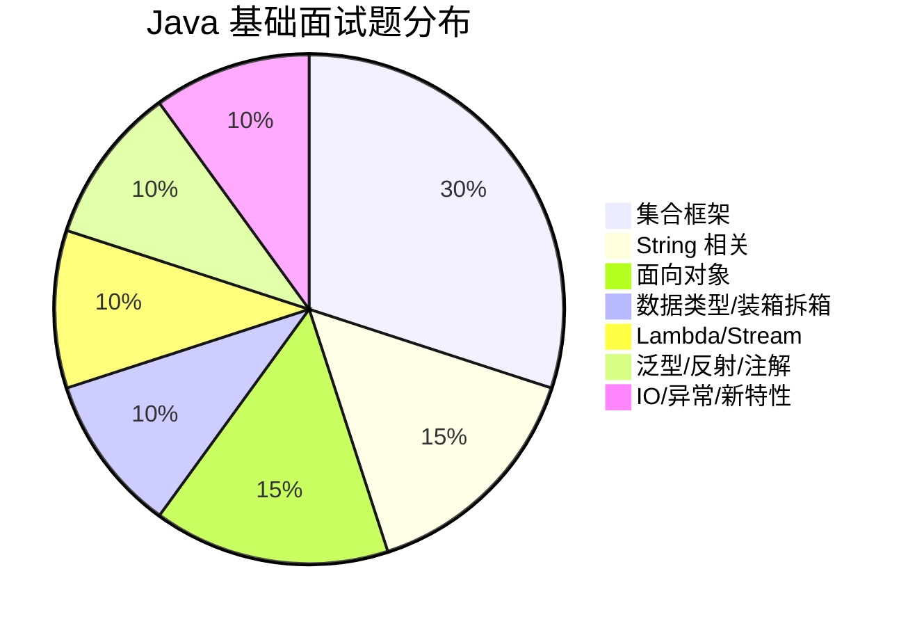
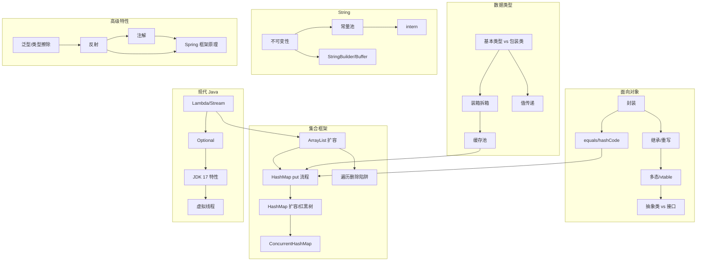

# Java 基础面试指南

## 概述

本指南汇总了 Java 基础模块中所有高频面试题，按照面试出现频率排序。建议在学习完各知识点后，用本指南进行系统复习和查漏补缺。

> 💡 **使用建议**：先快速浏览所有题目，标记不熟悉的，然后回到对应知识点深入学习。

## 面试题频率分布

---

## 🔥🔥🔥 高频面试题（必须掌握）

### 1. HashMap 的 put 流程是怎样的？

**来源**：[集合框架](./05-collections.md) | **难度**：⭐⭐⭐

**答题要点**：
1. 计算 hash（扰动函数：高 16 位异或低 16 位）
2. 通过 `(n-1) & hash` 确定桶位置
3. 桶为空直接放入；不为空则判断 key 是否相同
4. 链表尾插法（JDK 8），链表长度 ≥ 8 且数组长度 ≥ 64 时转红黑树
5. 插入后判断是否需要扩容（size > capacity × loadFactor）

**追问链路**：
- 为什么用尾插法？→ JDK 7 头插法多线程扩容会形成环形链表
- 为什么树化阈值是 8？→ 泊松分布，链表长度达到 8 的概率极低
- HashMap 线程安全吗？→ 不安全，用 ConcurrentHashMap

---

### 2. HashMap 的扩容机制？

**来源**：[集合框架](./05-collections.md) | **难度**：⭐⭐⭐

**答题要点**：
1. 触发条件：size > capacity × loadFactor（默认 12）
2. 新容量 = 旧容量 × 2
3. JDK 8 优化：通过 `hash & oldCap` 判断元素新位置（0 留原位，1 移到原位 + oldCap）
4. 链表拆分为高低位两个子链表

**追问链路**：
- 为什么容量必须是 2 的幂？→ `(n-1) & hash` 等价于 `hash % n`，位运算更快
- 负载因子为什么是 0.75？→ 时间和空间的折中

---

### 3. ArrayList 和 LinkedList 的区别？

**来源**：[集合框架](./05-collections.md) | **难度**：⭐⭐

**答题要点**：
- ArrayList：动态数组，O(1) 随机访问，1.5 倍扩容
- LinkedList：双向链表，O(1) 头尾插入，O(n) 随机访问
- 实际开发几乎总是选 ArrayList（CPU 缓存友好）

---

### 4. String 为什么是不可变的？

**来源**：[String 深入](./03-string-deep-dive.md) | **难度**：⭐⭐

**答题要点**：
- final 类 + private final char[] + 无修改方法
- 好处：线程安全、常量池共享、hashCode 缓存、安全性

**追问链路**：
- `new String("abc")` 创建几个对象？→ 1 或 2 个
- JDK 9 为什么改用 byte[]？→ Compact Strings 优化

---

### 5. String、StringBuilder、StringBuffer 的区别？

**来源**：[String 深入](./03-string-deep-dive.md) | **难度**：⭐⭐

**答题要点**：
- String 不可变，StringBuilder 可变非线程安全，StringBuffer 可变线程安全
- 单线程拼接用 StringBuilder，多线程用 StringBuffer（实际很少用）
- StringBuilder 默认容量 16，扩容 oldCap × 2 + 2

---

### 6. Java 是值传递还是引用传递？

**来源**：[值传递与引用传递](./02-value-passing.md) | **难度**：⭐⭐

**答题要点**：
- Java 只有值传递
- 基本类型传值的副本，引用类型传引用（地址）的副本
- 可以通过副本修改对象内容，但不能让原引用指向新对象
- swap 函数无法实现

---

### 7. 多态的实现原理？

**来源**：[面向对象](./04-oop.md) | **难度**：⭐⭐⭐

**答题要点**：
- 通过虚方法表（vtable）实现
- 每个类加载时创建 vtable，子类继承并覆盖父类的方法入口
- 运行时通过对象头的类型指针找到实际类的 vtable

**追问链路**：
- static/final/private 方法能多态吗？→ 不能，静态绑定
- 构造方法中调用虚方法？→ 危险，子类可能未初始化

---

### 8. 重写 equals 为什么必须重写 hashCode？

**来源**：[面向对象](./04-oop.md) | **难度**：⭐⭐⭐

**答题要点**：
- 契约：equals 相等 → hashCode 必须相等
- 不重写会导致 HashMap/HashSet 行为异常
- 用 `Objects.hash()` 重写

---

### 9. 抽象类和接口的区别？

**来源**：[面向对象](./04-oop.md) | **难度**：⭐⭐

**答题要点**：
- 抽象类：有构造方法、任意成员、单继承、is-a 关系
- 接口：默认 public static final 变量、JDK 8+ default 方法、多实现、has-a 能力
- 需要共享代码用抽象类，定义行为契约用接口

---

### 10. Integer 缓存池的范围？

**来源**：[数据类型](./01-data-types.md) | **难度**：⭐⭐

**答题要点**：
- 默认 -128 ~ 127，可通过 `-XX:AutoBoxCacheMax` 调整上限
- `Integer.valueOf()` 走缓存，`new Integer()` 不走
- Float/Double 没有缓存

---

### 11. 自动装箱和拆箱的原理和陷阱？

**来源**：[数据类型](./01-data-types.md) | **难度**：⭐⭐

**答题要点**：
- 装箱调用 `valueOf()`，拆箱调用 `xxxValue()`
- 陷阱：null 拆箱 NPE、循环中频繁装箱、三目运算符隐式拆箱

---

### 12. Stream 的中间操作和终端操作的区别？

**来源**：[Lambda 与 Stream](./11-lambda-stream.md) | **难度**：⭐⭐

**答题要点**：
- 中间操作返回 Stream，惰性求值（filter/map/sorted）
- 终端操作触发执行，返回结果（collect/forEach/reduce）
- Stream 只能消费一次

---

### 13. 泛型的类型擦除是什么？

**来源**：[泛型](./07-generics.md) | **难度**：⭐⭐⭐

**答题要点**：
- 编译后泛型信息被移除，无界擦除为 Object，有上界擦除为上界类型
- 影响：运行时无法获取泛型类型、不能创建泛型数组、不能用基本类型
- 绕过：TypeReference/TypeToken（匿名子类 + 反射）

---

## 🔥🔥 中频面试题（应该掌握）

### 14. Checked 和 Unchecked 异常的区别？

**来源**：[异常处理](./06-exceptions.md) | **难度**：⭐⭐

**答题要点**：
- Checked：编译器强制处理，IOException/SQLException
- Unchecked：RuntimeException 子类，NullPointerException/ClassCastException
- 自定义业务异常通常继承 RuntimeException

---

### 15. `<? extends T>` 和 `<? super T>` 的区别？

**来源**：[泛型](./07-generics.md) | **难度**：⭐⭐⭐

**答题要点**：
- extends：上界，只能读（Producer）
- super：下界，可以写（Consumer）
- PECS 原则：Producer Extends, Consumer Super

---

### 16. 反射的原理和性能优化？

**来源**：[反射](./08-reflection.md) | **难度**：⭐⭐⭐

**答题要点**：
- 三种获取 Class 的方式：.class / getClass() / Class.forName()
- 性能优化：缓存 Method/Field、setAccessible(true)、MethodHandle
- 框架应用：Spring IoC、MyBatis、Jackson

---

### 17. BIO、NIO、AIO 的区别？

**来源**：[IO 流](./10-io-streams.md) | **难度**：⭐⭐⭐

**答题要点**：
- BIO：同步阻塞，一连接一线程
- NIO：同步非阻塞，Channel/Buffer/Selector 多路复用
- AIO：异步非阻塞，回调机制
- Netty 基于 NIO

---

### 18. 并行流什么时候用？注意事项？

**来源**：[Lambda 与 Stream](./11-lambda-stream.md) | **难度**：⭐⭐⭐

**答题要点**：
- 适用：数据量大、计算密集、无共享状态
- 注意：不要修改共享变量、forEach 不保证顺序、数据源要支持高效分割
- 默认使用 ForkJoinPool.commonPool()

---

### 19. JDK 8 有哪些重要新特性？

**来源**：[JDK 新特性](./12-new-features.md) | **难度**：⭐⭐

**答题要点**：
- Lambda + Stream + Optional + Date-Time API + 接口默认方法

---

### 20. 虚拟线程和平台线程的区别？

**来源**：[JDK 新特性](./12-new-features.md) | **难度**：⭐⭐⭐

**答题要点**：
- 虚拟线程：JVM 管理，极低创建成本，百万级，适合 IO 密集型
- 平台线程：OS 线程包装，~1MB 栈内存，通常几千个
- 虚拟线程不需要池化

---

### 21. try-with-resources 的原理？

**来源**：[异常处理](./06-exceptions.md) | **难度**：⭐⭐

**答题要点**：
- 编译器语法糖，自动在 finally 中调用 close()
- 资源需实现 AutoCloseable
- close() 异常作为 suppressed exception

---

### 22. 注解的原理？@Retention 的三个级别？

**来源**：[注解](./09-annotations.md) | **难度**：⭐⭐

**答题要点**：
- 注解本质是接口，运行时通过反射读取
- SOURCE（编译后丢弃）、CLASS（.class 文件中）、RUNTIME（运行时可读）
- Spring 注解都是 RUNTIME 级别

---

### 23. ConcurrentModificationException 是什么？如何避免？

**来源**：[集合框架](./05-collections.md) | **难度**：⭐⭐

**答题要点**：
- 增强 for 循环中修改集合触发 fail-fast 机制
- 解决：Iterator.remove()、removeIf()、CopyOnWriteArrayList

---

### 24. LinkedHashMap 如何实现 LRU 缓存？

**来源**：[集合框架](./05-collections.md) | **难度**：⭐⭐⭐

**答题要点**：
- 构造时 accessOrder=true，按访问顺序排列
- 重写 removeEldestEntry()，超过容量时移除最久未访问的元素

---

## 🔥 低频面试题（了解即可）

### 25. Record 和普通类的区别？

**来源**：[JDK 新特性](./12-new-features.md) | **难度**：⭐⭐

- 不可变数据载体，自动生成构造方法/getter/equals/hashCode/toString
- final 类，字段 final，不能声明实例字段

### 26. Sealed Classes 的作用？

**来源**：[JDK 新特性](./12-new-features.md) | **难度**：⭐⭐

- 限制哪些类可以继承/实现
- permits 子句指定允许的子类

### 27. 内部类有几种？静态内部类和成员内部类的区别？

**来源**：[面向对象](./04-oop.md) | **难度**：⭐⭐

- 四种：成员内部类、静态内部类、局部内部类、匿名内部类
- 静态内部类不持有外部类引用，优先使用

### 28. MappedByteBuffer 是什么？什么时候用？

**来源**：[IO 流](./10-io-streams.md) | **难度**：⭐⭐

- 内存映射文件，将文件映射到虚拟内存
- 适合超大文件随机访问，零拷贝

---

## 面试知识图谱

## 面试技巧

1. **HashMap 是必考题**：put 流程、扩容机制、红黑树转换条件，必须烂熟于心
2. **String 三连问**：不可变性 → 常量池 → StringBuilder 区别，准备好追问链路
3. **值传递**：用 swap 例子一锤定音，Java 只有值传递
4. **源码级回答**：提到关键源码（如 `Integer.valueOf()`、`HashMap.putVal()`）会加分
5. **对比回答**：ArrayList vs LinkedList、Checked vs Unchecked、抽象类 vs 接口，用表格思维组织答案
6. **新特性加分**：提到 JDK 17/21 的新特性（Record、虚拟线程）展示技术敏感度

## 参考资料

- [Java 面试指南 - JavaGuide](https://javaguide.cn/)
- [Effective Java（第三版）](https://www.oreilly.com/library/view/effective-java/9780134686097/)
- [Java 核心技术面试精讲](https://time.geekbang.org/column/intro/82)
