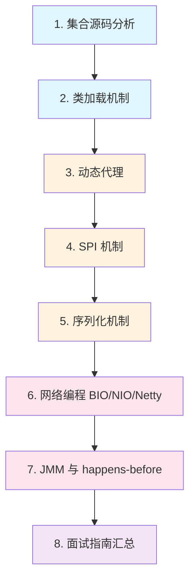

# Java 进阶

## 模块概述

Java 进阶模块是连接"会用"和"精通"的桥梁。本模块深入 JDK 核心源码和底层机制，涵盖集合源码分析、类加载机制、动态代理、SPI、序列化、网络编程（BIO/NIO/Netty）以及 Java 内存模型（JMM）等高频面试主题。

本模块的目标：
- **源码级理解**：深入 HashMap、ConcurrentHashMap 等核心类的实现细节
- **原理透彻**：理解双亲委派、动态代理、SPI 等机制的设计思想
- **面试高频**：每个知识点都是大厂面试的常客，配有完整追问链路
- **代码可运行**：每个知识点都有对应的可执行代码示例

## 知识点列表

| 序号 | 知识点 | 难度 | 面试频率 | 建议时间 |
|------|--------|------|----------|----------|
| 1 | [集合源码分析](./01-collections-source.md) | ⭐⭐⭐ 高级 | 🔥🔥🔥 高频 | 90min |
| 2 | [类加载机制](./02-classloader.md) | ⭐⭐⭐ 高级 | 🔥🔥🔥 高频 | 60min |
| 3 | [动态代理](./03-dynamic-proxy.md) | ⭐⭐⭐ 高级 | 🔥🔥🔥 高频 | 60min |
| 4 | [SPI 机制](./04-spi.md) | ⭐⭐ 中级 | 🔥🔥 中频 | 30min |
| 5 | [序列化机制](./05-serialization.md) | ⭐⭐ 中级 | 🔥🔥 中频 | 45min |
| 6 | [网络编程 BIO/NIO/Netty](./06-network-programming.md) | ⭐⭐⭐ 高级 | 🔥🔥🔥 高频 | 90min |
| 7 | [JMM 与 happens-before](./07-jmm.md) | ⭐⭐⭐ 高级 | 🔥🔥🔥 高频 | 60min |
| 8 | [Java 进阶面试指南](./99-interview.md) | — | 🔥🔥🔥 高频 | 60min |

## 推荐学习顺序

**学习路线说明**：
- 🔵 **源码层**（1-2）：从集合源码入手，再理解类加载机制，建立源码阅读能力
- 🟠 **机制层**（3-5）：掌握动态代理、SPI、序列化等 Java 核心机制
- 🔴 **网络层**（6-7）：深入网络编程模型和内存模型，理解高性能通信原理
- 🟣 **面试层**（8）：系统复习，查漏补缺

## 相关模块链接

- [Java 基础](/1-java-core/1.1-java-basics/) — 集合框架、反射、IO 流等基础知识
- [并发编程](/1-java-core/1.3-concurrent/) — synchronized、volatile、线程池等并发主题
- [JVM](/1-java-core/1.4-jvm/) — 内存区域、GC、类加载过程
- [设计模式](/1-java-core/1.5-design-patterns/) — 代理模式、策略模式等设计模式
- [Spring Boot](/springboot/) — AOP 代理选择、自动配置中的 SPI 应用

## 参考资料

- [JDK 21 源码](https://github.com/openjdk/jdk)
- [Java Language Specification](https://docs.oracle.com/javase/specs/jls/se21/html/index.html)
- [Netty 官方文档](https://netty.io/wiki/)
