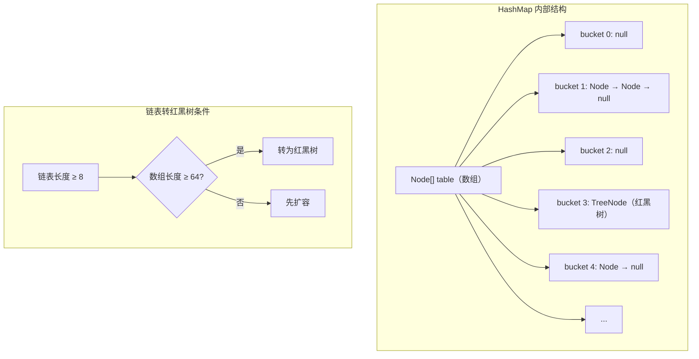
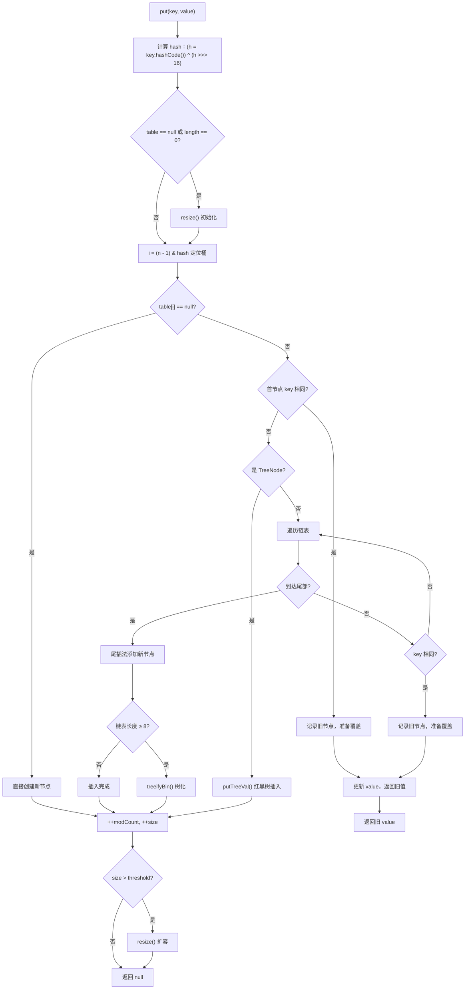
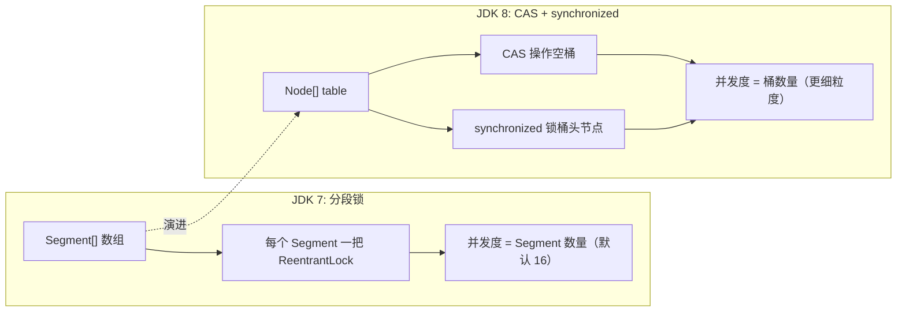
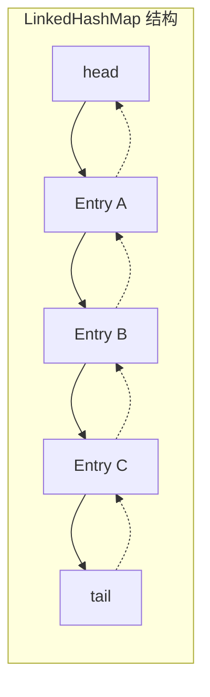

# 集合源码分析

## 概念说明

集合框架是 Java 中使用最频繁的 API，面试中对集合源码的考察几乎是必考项。本节深入分析 HashMap、ConcurrentHashMap、LinkedHashMap、TreeMap 四大核心 Map 实现的源码，重点关注数据结构、核心算法和并发安全机制。

理解集合源码的意义：
- **面试必考**：HashMap 的 put 流程、扩容机制、红黑树转换是大厂面试的标配题目
- **性能调优**：理解底层实现才能在实际开发中做出正确的集合选型
- **并发安全**：理解 ConcurrentHashMap 的设计思想，避免并发 Bug

## 核心原理

### 1. HashMap 源码分析（JDK 8+）

#### 数据结构

HashMap 底层采用 **数组 + 链表 + 红黑树** 的结构：



#### putVal 方法源码级分析



#### hash 扰动函数

```java
// HashMap 的 hash 方法 —— 扰动函数
static final int hash(Object key) {
    int h;
    // 高 16 位与低 16 位异或，让高位也参与索引计算
    // 减少哈希冲突
    return (key == null) ? 0 : (h = key.hashCode()) ^ (h >>> 16);
}

// 定位桶的位置：(n - 1) & hash
// 等价于 hash % n（当 n 是 2 的幂时）
// 位运算比取模运算快得多
```

#### 红黑树转换条件

| 条件 | 阈值 | 说明 |
|------|------|------|
| 链表 → 红黑树 | `TREEIFY_THRESHOLD = 8` | 链表长度 ≥ 8 且数组长度 ≥ 64 |
| 红黑树 → 链表 | `UNTREEIFY_THRESHOLD = 6` | 扩容后树节点数 ≤ 6 时退化 |
| 最小树化容量 | `MIN_TREEIFY_CAPACITY = 64` | 数组长度 < 64 时优先扩容 |

**为什么是 8？** 根据泊松分布，链表长度达到 8 的概率约为 0.00000006，属于极端情况。选择 8 是在时间和空间之间的平衡。

#### resize 扩容流程

```java
// 扩容核心逻辑
// 1. 新容量 = 旧容量 * 2
// 2. 遍历旧数组每个桶
// 3. 对每个节点重新计算位置：
//    - (e.hash & oldCap) == 0 → 位置不变
//    - (e.hash & oldCap) != 0 → 位置 = 原位置 + oldCap
```

### 2. ConcurrentHashMap 源码分析（JDK 8+）

#### 并发安全机制演进



#### put 流程

```java
// ConcurrentHashMap.putVal() 核心流程
// 1. 计算 hash（spread 函数）
// 2. 自旋循环：
//    a. table 未初始化 → initTable()（CAS 竞争初始化权）
//    b. 桶为空 → CAS 直接放入（无锁）
//    c. 桶正在扩容（hash == MOVED）→ helpTransfer() 协助扩容
//    d. 桶非空 → synchronized(桶头节点) {链表/红黑树插入}
// 3. addCount() 更新计数（LongAdder 思想）
```

#### size() 实现

ConcurrentHashMap 的 `size()` 使用了类似 LongAdder 的分段计数思想：

```java
// baseCount + 各 CounterCell 之和
// 写操作时：先 CAS 更新 baseCount，失败则更新 CounterCell
// 读操作时：sumCount() = baseCount + Σ counterCells[i].value
```

### 3. LinkedHashMap 源码分析

#### 双向链表维护顺序



#### LRU 缓存实现

```java
// accessOrder = true 时，每次 get/put 都会将节点移到链表尾部
// 重写 removeEldestEntry 即可实现 LRU
public class LRUCache<K, V> extends LinkedHashMap<K, V> {
    private final int maxSize;

    public LRUCache(int maxSize) {
        super(maxSize, 0.75f, true); // accessOrder = true
        this.maxSize = maxSize;
    }

    @Override
    protected boolean removeEldestEntry(Map.Entry<K, V> eldest) {
        return size() > maxSize; // 超过容量移除最老元素
    }
}
```

### 4. TreeMap 红黑树

TreeMap 基于红黑树实现，保证 key 有序。红黑树的五个性质：

1. 节点是红色或黑色
2. 根节点是黑色
3. 叶子节点（NIL）是黑色
4. 红色节点的子节点必须是黑色
5. 从任一节点到叶子的所有路径包含相同数量的黑色节点

## 代码示例

```java
// HashMap put 流程跟踪
Map<String, String> map = new HashMap<>(4, 0.75f);
map.put("key1", "value1"); // 直接放入空桶
map.put("key2", "value2"); // 可能产生哈希冲突

// ConcurrentHashMap 并发安全验证
ConcurrentHashMap<String, Integer> concurrentMap = new ConcurrentHashMap<>();
// 多线程并发写入，验证数据一致性

// LinkedHashMap LRU 缓存
LRUCache<String, String> lru = new LRUCache<>(3);
lru.put("a", "1");
lru.put("b", "2");
lru.put("c", "3");
lru.get("a");       // 访问 a，a 移到尾部
lru.put("d", "4");  // 超过容量，移除最久未使用的 b
```

> 💻 完整可运行代码：[CollectionSourceDemo.java](../../../code-examples/01-java-core/java-advanced/src/main/java/com/example/advanced/collections/CollectionSourceDemo.java)

## 常见面试题

### Q1: HashMap 的 put 方法执行流程是什么？

**难度**：⭐⭐⭐ | **频率**：🔥🔥🔥

**答题思路**：

1. 计算 key 的 hash 值（扰动函数）
2. 判断 table 是否为空，为空则 resize 初始化
3. 根据 hash 定位桶位置 `(n-1) & hash`
4. 桶为空直接插入；不为空则判断首节点 key 是否相同
5. 不同则遍历链表或红黑树插入
6. 链表长度 ≥ 8 且数组长度 ≥ 64 时转红黑树
7. 插入后判断是否需要扩容

**标准答案**：

HashMap 的 put 方法首先通过扰动函数 `(h = key.hashCode()) ^ (h >>> 16)` 计算 hash 值，高 16 位与低 16 位异或以减少冲突。然后通过 `(n-1) & hash` 定位桶位置。如果桶为空直接创建新节点；如果不为空，先检查首节点 key 是否相同（先比较 hash，再用 == 和 equals），相同则覆盖。否则判断是否为红黑树节点，是则调用 putTreeVal；不是则遍历链表尾插。链表长度达到 8 且数组长度 ≥ 64 时转为红黑树。最后检查 size 是否超过阈值，超过则扩容。

**深入追问**：

- 为什么用扰动函数而不是直接用 hashCode？
- 为什么链表转红黑树的阈值是 8？
- JDK 7 和 JDK 8 的 HashMap 有什么区别？（头插法 vs 尾插法、链表 vs 红黑树）

**易错点**：

- JDK 7 头插法在并发扩容时会形成环形链表导致死循环
- 红黑树转换不仅要链表长度 ≥ 8，还要数组长度 ≥ 64

### Q2: ConcurrentHashMap 在 JDK 7 和 JDK 8 中的实现有什么区别？

**难度**：⭐⭐⭐ | **频率**：🔥🔥🔥

**答题思路**：

1. 数据结构变化：Segment 数组 → Node 数组
2. 锁机制变化：ReentrantLock → CAS + synchronized
3. 并发度变化：固定 16 → 桶数量
4. hash 算法变化

**标准答案**：

JDK 7 使用 Segment 分段锁，每个 Segment 继承 ReentrantLock，默认 16 个 Segment，并发度固定为 16。JDK 8 摒弃了 Segment，直接使用 Node 数组 + CAS + synchronized。对于空桶使用 CAS 无锁插入，非空桶使用 synchronized 锁住桶头节点。并发度等于桶数量，粒度更细。此外 JDK 8 引入了红黑树优化长链表查询，size() 方法使用类似 LongAdder 的分段计数。

**深入追问**：

- ConcurrentHashMap 的 size() 是如何保证准确性的？
- 为什么 JDK 8 用 synchronized 而不继续用 ReentrantLock？
- ConcurrentHashMap 能完全替代 Hashtable 吗？

**易错点**：

- ConcurrentHashMap 的 key 和 value 都不允许为 null
- synchronized 在 JDK 6 之后经过大量优化，性能已不输 ReentrantLock

### Q3: LinkedHashMap 如何实现 LRU 缓存？

**难度**：⭐⭐ | **频率**：🔥🔥

**答题思路**：

1. 构造函数设置 accessOrder = true
2. 重写 removeEldestEntry 方法
3. 解释双向链表维护访问顺序的原理

**标准答案**：

LinkedHashMap 继承自 HashMap，内部维护了一个双向链表记录插入或访问顺序。当构造函数的 accessOrder 参数设为 true 时，每次 get 或 put 操作都会将被访问的节点移到链表尾部（afterNodeAccess）。重写 removeEldestEntry 方法，当 size 超过指定容量时返回 true，HashMap 在 put 后会调用此方法自动移除链表头部（最久未访问）的元素，从而实现 LRU 缓存。

**深入追问**：

- LinkedHashMap 的 accessOrder 和 insertionOrder 有什么区别？
- 如何实现一个线程安全的 LRU 缓存？
- LRU 缓存在实际项目中有哪些应用场景？

## 参考资料

- [JDK 21 HashMap 源码](https://github.com/openjdk/jdk/blob/master/src/java.base/share/classes/java/util/HashMap.java)
- [JDK 21 ConcurrentHashMap 源码](https://github.com/openjdk/jdk/blob/master/src/java.base/share/classes/java/util/1-java-core/1.3-concurrent/ConcurrentHashMap.java)
