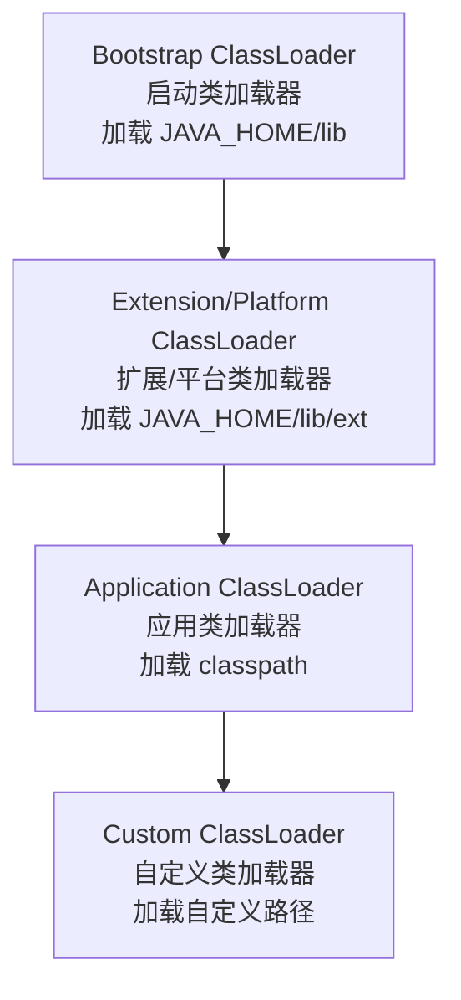
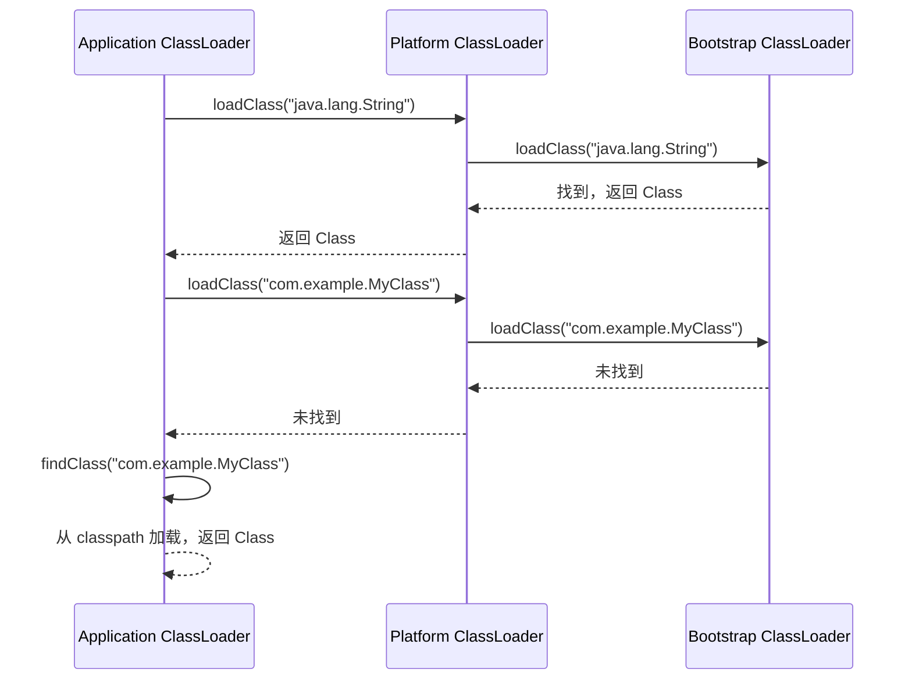
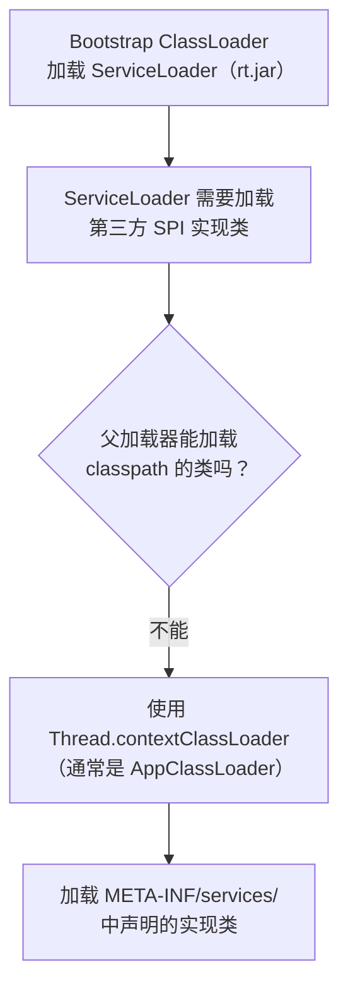
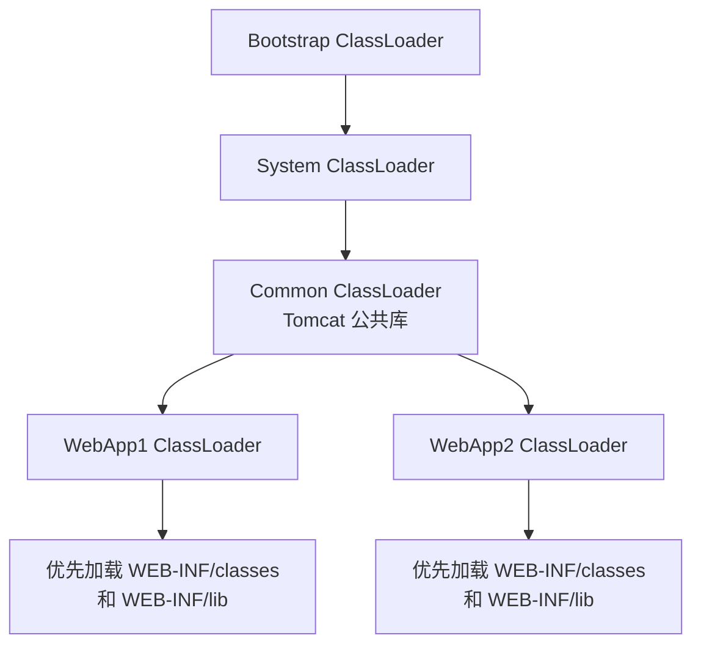

# 类加载机制

## 概念说明

Java 的类加载机制是 JVM 的核心组成部分，负责将 `.class` 文件加载到内存并转换为 `Class` 对象。双亲委派模型是类加载的核心设计，保证了 Java 核心类库的安全性和一致性。理解类加载机制是掌握 SPI、热部署、模块化等高级特性的基础。

## 核心原理

### 1. 类加载器层次结构



| 类加载器 | 加载路径 | 实现语言 |
|----------|----------|----------|
| Bootstrap ClassLoader | `JAVA_HOME/lib`（rt.jar 等） | C++ |
| Platform ClassLoader（JDK 9+） | `JAVA_HOME/lib/ext` | Java |
| Application ClassLoader | classpath | Java |
| 自定义 ClassLoader | 自定义路径 | Java |

### 2. 双亲委派模型



**双亲委派的核心逻辑**（ClassLoader.loadClass）：

```java
protected Class<?> loadClass(String name, boolean resolve) {
    // 1. 检查是否已加载
    Class<?> c = findLoadedClass(name);
    if (c == null) {
        try {
            // 2. 委派给父加载器
            if (parent != null) {
                c = parent.loadClass(name, false);
            } else {
                c = findBootstrapClassOrNull(name);
            }
        } catch (ClassNotFoundException e) {
            // 父加载器无法加载
        }
        if (c == null) {
            // 3. 父加载器无法加载，自己加载
            c = findClass(name);
        }
    }
    return c;
}
```

**双亲委派的优点**：
- **安全性**：防止核心类被篡改（如自定义 java.lang.String）
- **唯一性**：保证同一个类只被加载一次
- **层次性**：类加载器之间有清晰的职责划分

### 3. 打破双亲委派的三种场景

#### 场景一：SPI 机制（线程上下文类加载器）



典型案例：JDBC 驱动加载。`DriverManager` 在 rt.jar 中由 Bootstrap ClassLoader 加载，但 MySQL 驱动在 classpath 中，需要通过线程上下文类加载器加载。

#### 场景二：Tomcat WebAppClassLoader

Tomcat 为每个 Web 应用创建独立的 `WebAppClassLoader`，**优先加载自己的类**，打破了双亲委派的"先委派父加载器"规则：



#### 场景三：OSGi 模块化

OSGi 实现了更复杂的类加载网络，每个 Bundle 有自己的 ClassLoader，可以精确控制包的导入导出，形成网状而非树状的类加载结构。

### 4. 自定义 ClassLoader

```java
/**
 * 自定义类加载器 —— 从指定目录加载 .class 文件
 */
public class FileClassLoader extends ClassLoader {
    private final String classDir;

    public FileClassLoader(String classDir) {
        this.classDir = classDir;
    }

    @Override
    protected Class<?> findClass(String name) throws ClassNotFoundException {
        String fileName = classDir + "/" + name.replace('.', '/') + ".class";
        try {
            byte[] data = Files.readAllBytes(Path.of(fileName));
            return defineClass(name, data, 0, data.length);
        } catch (IOException e) {
            throw new ClassNotFoundException(name, e);
        }
    }
}
```

## 代码示例

```java
// 验证双亲委派
ClassLoader appLoader = ClassLoaderDemo.class.getClassLoader();
ClassLoader platformLoader = appLoader.getParent();
ClassLoader bootstrapLoader = platformLoader.getParent(); // null

// 自定义 ClassLoader 加载类
FileClassLoader loader = new FileClassLoader("/path/to/classes");
Class<?> clazz = loader.loadClass("com.example.MyClass");

// SPI 加载演示
ServiceLoader<Driver> drivers = ServiceLoader.load(Driver.class);
```

> 💻 完整可运行代码：[ClassLoaderDemo.java](../../../code-examples/01-java-core/java-advanced/src/main/java/com/example/advanced/classloader/ClassLoaderDemo.java)

## 常见面试题

### Q1: 什么是双亲委派模型？为什么需要它？

**难度**：⭐⭐⭐ | **频率**：🔥🔥🔥

**答题思路**：

1. 解释委派流程：先委派父加载器，父加载器无法加载再自己加载
2. 说明三个优点：安全性、唯一性、层次性
3. 举例说明：如果没有双亲委派，自定义 java.lang.String 会怎样

**标准答案**：

双亲委派模型要求除了顶层的启动类加载器外，其余类加载器都应有自己的父加载器。当一个类加载器收到加载请求时，首先委派给父加载器尝试加载，只有父加载器无法加载时才自己加载。这保证了 Java 核心类库的安全性（防止核心类被篡改）和类的唯一性（同一个类不会被不同加载器重复加载）。

**深入追问**：

- 如何打破双亲委派？有哪些实际场景？
- 线程上下文类加载器是什么？为什么需要它？
- Tomcat 为什么要打破双亲委派？

### Q2: 如何自定义一个 ClassLoader？

**难度**：⭐⭐⭐ | **频率**：🔥🔥

**答题思路**：

1. 继承 ClassLoader
2. 重写 findClass 方法（不建议重写 loadClass，会破坏双亲委派）
3. 读取字节码，调用 defineClass

**标准答案**：

自定义 ClassLoader 需要继承 `java.lang.ClassLoader`，重写 `findClass` 方法。在 findClass 中读取 .class 文件的字节数组，然后调用 `defineClass` 将字节数组转换为 Class 对象。不建议重写 loadClass 方法，因为那样会破坏双亲委派模型。如果确实需要打破双亲委派（如热部署场景），才考虑重写 loadClass。

**深入追问**：

- findClass 和 loadClass 的区别是什么？
- 如何实现类的热加载？
- 同一个类被不同 ClassLoader 加载后是同一个 Class 对象吗？

### Q3: SPI 机制是如何打破双亲委派的？

**难度**：⭐⭐⭐ | **频率**：🔥🔥

**答题思路**：

1. 解释 SPI 的场景：核心接口在 rt.jar，实现在 classpath
2. Bootstrap ClassLoader 无法加载 classpath 的类
3. 通过线程上下文类加载器解决

**标准答案**：

Java SPI 机制中，接口定义在核心类库（如 `java.sql.Driver`），由 Bootstrap ClassLoader 加载。但接口的实现类（如 MySQL 驱动）在 classpath 中，Bootstrap ClassLoader 无法加载。为了解决这个问题，`ServiceLoader` 使用 `Thread.currentThread().getContextClassLoader()` 获取线程上下文类加载器（通常是 Application ClassLoader），用它来加载 SPI 实现类。这就打破了双亲委派的"只能向上委派"的规则，实现了"父加载器请求子加载器加载"。

**深入追问**：

- 线程上下文类加载器默认是哪个？可以修改吗？
- JDBC 4.0 之后还需要 Class.forName 吗？

## 参考资料

- [JDK ClassLoader 源码](https://github.com/openjdk/jdk/blob/master/src/java.base/share/classes/java/lang/ClassLoader.java)
- [深入理解 Java 虚拟机（第 3 版）](https://book.douban.com/subject/34907497/) — 第 7 章
