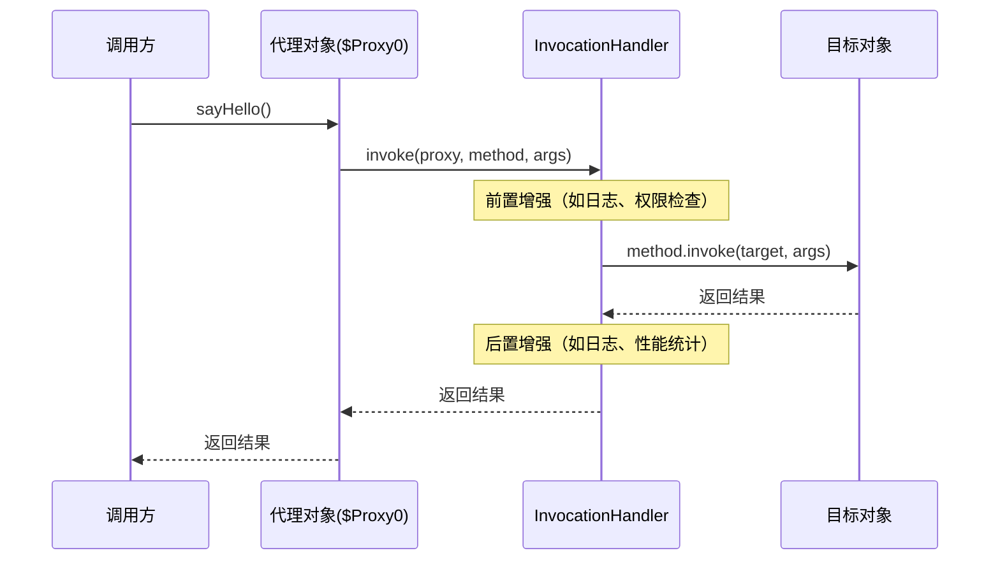
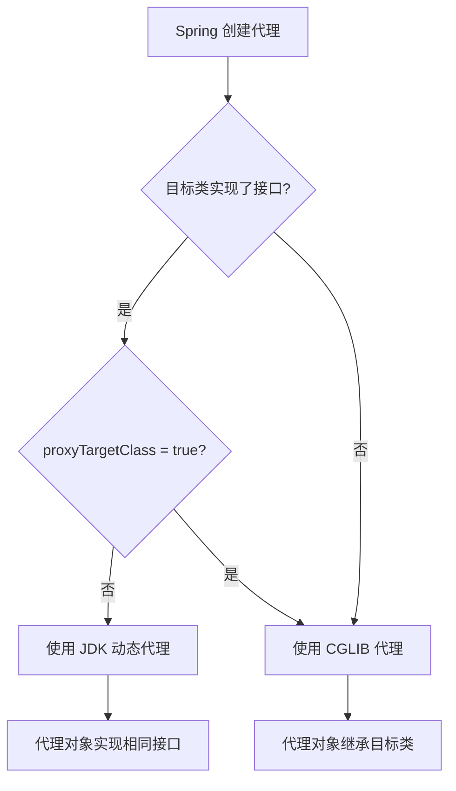

# 动态代理

## 概念说明

动态代理是 Java 中实现 AOP（面向切面编程）的核心技术。与静态代理在编译期确定代理类不同，动态代理在运行时动态生成代理类，无需为每个被代理类手写代理代码。Spring AOP、MyBatis Mapper、RPC 框架等都大量使用动态代理。

Java 生态中主要有四种动态代理方案：

| 方案 | 原理 | 限制 | 性能 |
|------|------|------|------|
| JDK 动态代理 | 基于接口，Proxy + InvocationHandler | 只能代理接口 | 中等 |
| CGLIB | 基于继承，生成子类 | 不能代理 final 类/方法 | 较快 |
| Javassist | 字节码操作库 | API 较复杂 | 快 |
| ByteBuddy | 现代字节码操作库 | 依赖较大 | 最快 |

## 核心原理

### 1. JDK 动态代理



**JDK 动态代理完整实现**：

```java
// 1. 定义接口
public interface UserService {
    String findUser(String name);
    void saveUser(String name);
}

// 2. 实现类
public class UserServiceImpl implements UserService {
    @Override
    public String findUser(String name) {
        return "User: " + name;
    }
    @Override
    public void saveUser(String name) {
        System.out.println("Saving user: " + name);
    }
}

// 3. InvocationHandler
public class LoggingHandler implements InvocationHandler {
    private final Object target;

    public LoggingHandler(Object target) {
        this.target = target;
    }

    @Override
    public Object invoke(Object proxy, Method method, Object[] args) throws Throwable {
        System.out.println("[LOG] 调用方法: " + method.getName());
        long start = System.currentTimeMillis();
        Object result = method.invoke(target, args);
        long cost = System.currentTimeMillis() - start;
        System.out.println("[LOG] 方法耗时: " + cost + "ms");
        return result;
    }
}

// 4. 创建代理
UserService proxy = (UserService) Proxy.newProxyInstance(
    UserService.class.getClassLoader(),
    new Class[]{UserService.class},
    new LoggingHandler(new UserServiceImpl())
);
proxy.findUser("张三"); // 自动触发日志增强
```

### 2. CGLIB 代理

```mermaid
classDiagram
    class UserServiceImpl {
        +findUser(name) String
        +saveUser(name) void
    }
    class UserServiceImpl$$EnhancerByCGLIB extends UserServiceImpl {
        -MethodInterceptor interceptor
        +findUser(name) String
        +saveUser(name) void
    }
    class LoggingInterceptor {
        <<MethodInterceptor>>
        +intercept(obj, method, args, proxy) Object
    }
    UserServiceImpl$$EnhancerByCGLIB --> LoggingInterceptor : 委托
```

**CGLIB 代理完整实现**：

```java
// CGLIB 通过继承方式代理，不需要接口
public class CglibLoggingInterceptor implements MethodInterceptor {
    @Override
    public Object intercept(Object obj, Method method, Object[] args,
                            MethodProxy proxy) throws Throwable {
        System.out.println("[CGLIB LOG] 调用方法: " + method.getName());
        long start = System.currentTimeMillis();
        // 调用父类方法（即原始方法）
        Object result = proxy.invokeSuper(obj, args);
        long cost = System.currentTimeMillis() - start;
        System.out.println("[CGLIB LOG] 方法耗时: " + cost + "ms");
        return result;
    }
}

// 创建 CGLIB 代理
Enhancer enhancer = new Enhancer();
enhancer.setSuperclass(UserServiceImpl.class);
enhancer.setCallback(new CglibLoggingInterceptor());
UserServiceImpl proxy = (UserServiceImpl) enhancer.create();
proxy.findUser("李四");
```

### 3. Javassist vs ByteBuddy 对比

| 特性 | Javassist | ByteBuddy |
|------|-----------|-----------|
| API 风格 | 字符串拼接字节码 | 流式 API |
| 学习曲线 | 中等 | 较低 |
| 性能 | 快 | 最快 |
| 维护状态 | 维护中 | 活跃 |
| 使用场景 | Hibernate、MyBatis | Mockito、Byte Buddy Agent |

### 4. Spring AOP 代理选择策略



**Spring Boot 2.x 默认使用 CGLIB 代理**（`spring.aop.proxy-target-class=true`），因为 CGLIB 代理不要求目标类实现接口，使用更方便。

## 代码示例

```java
// JDK 动态代理
UserService jdkProxy = (UserService) Proxy.newProxyInstance(
    UserService.class.getClassLoader(),
    new Class[]{UserService.class},
    new LoggingHandler(new UserServiceImpl())
);

// CGLIB 代理
Enhancer enhancer = new Enhancer();
enhancer.setSuperclass(UserServiceImpl.class);
enhancer.setCallback(new CglibLoggingInterceptor());
UserServiceImpl cglibProxy = (UserServiceImpl) enhancer.create();
```

> 💻 完整可运行代码：[DynamicProxyDemo.java](../../../code-examples/01-java-core/java-advanced/src/main/java/com/example/advanced/proxy/DynamicProxyDemo.java)

## 常见面试题

### Q1: JDK 动态代理和 CGLIB 代理有什么区别？

**难度**：⭐⭐⭐ | **频率**：🔥🔥🔥

**答题思路**：

1. 实现原理：接口 vs 继承
2. 限制条件：只能代理接口 vs 不能代理 final
3. 性能差异
4. Spring 中的选择策略

**标准答案**：

JDK 动态代理基于接口实现，通过 `Proxy.newProxyInstance` 在运行时生成实现了目标接口的代理类，只能代理实现了接口的类。CGLIB 基于继承实现，通过 ASM 字节码框架在运行时生成目标类的子类作为代理，可以代理没有实现接口的类，但不能代理 final 类和 final 方法。性能方面，CGLIB 生成代理类的速度较慢，但方法调用速度较快。Spring AOP 默认策略：目标类实现了接口用 JDK 代理，否则用 CGLIB；Spring Boot 2.x 默认使用 CGLIB。

**深入追问**：

- 为什么 Spring Boot 2.x 默认改用 CGLIB？
- JDK 动态代理生成的代理类长什么样？
- 如何选择使用哪种代理方式？

**易错点**：

- JDK 动态代理不是不能代理类，而是只能代理接口
- CGLIB 代理的 final 方法不会被增强，但不会报错

### Q2: Spring AOP 是如何选择代理方式的？

**难度**：⭐⭐⭐ | **频率**：🔥🔥🔥

**答题思路**：

1. 默认策略
2. proxyTargetClass 配置
3. Spring Boot 的默认行为

**标准答案**：

Spring AOP 的代理选择策略：如果目标类实现了接口且 `proxyTargetClass=false`（Spring Framework 默认），使用 JDK 动态代理；如果目标类没有实现接口，或者 `proxyTargetClass=true`，使用 CGLIB 代理。Spring Boot 2.x 开始默认设置 `spring.aop.proxy-target-class=true`，即默认使用 CGLIB 代理，这样可以避免因为注入实现类而非接口导致的类型转换异常。

**深入追问**：

- @Transactional 注解失效的场景有哪些？和代理有什么关系？
- 自调用为什么会导致 AOP 失效？

### Q3: 动态代理在实际项目中有哪些应用？

**难度**：⭐⭐ | **频率**：🔥🔥

**答题思路**：

1. Spring AOP（事务、日志、权限）
2. MyBatis Mapper 接口
3. RPC 框架（Dubbo、Feign）
4. Mock 框架（Mockito）

**标准答案**：

动态代理在 Java 生态中应用广泛：Spring AOP 使用动态代理实现事务管理、日志记录、权限校验等横切关注点；MyBatis 的 Mapper 接口没有实现类，通过 JDK 动态代理在运行时生成实现；Dubbo、OpenFeign 等 RPC 框架通过动态代理将接口调用转换为网络请求；Mockito 使用 ByteBuddy 生成 Mock 对象。

**深入追问**：

- MyBatis 的 Mapper 接口是如何通过动态代理实现的？
- Dubbo 的服务引用是如何使用代理的？

## 参考资料

- [JDK Proxy 源码](https://github.com/openjdk/jdk/blob/master/src/java.base/share/classes/java/lang/reflect/Proxy.java)
- [CGLIB GitHub](https://github.com/cglib/cglib)
- [ByteBuddy 官方文档](https://bytebuddy.net/)
