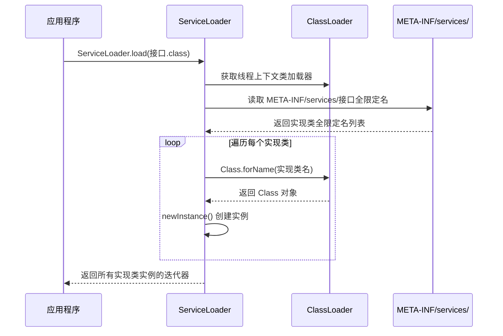
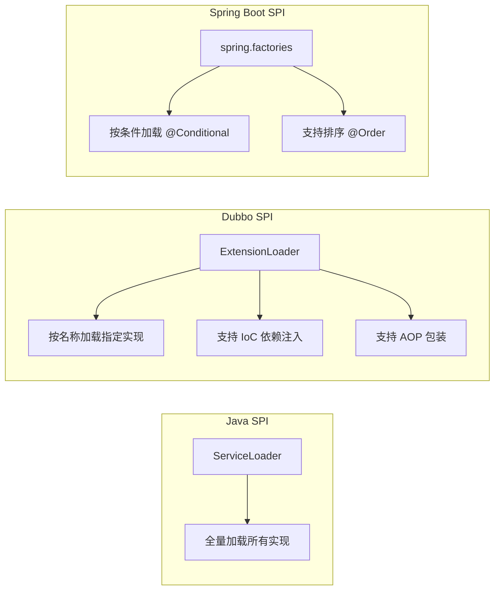

# SPI 机制

## 概念说明

SPI（Service Provider Interface，服务提供者接口）是 Java 内置的一种服务发现机制。它允许第三方为接口提供实现，框架在运行时自动发现并加载这些实现，实现了接口与实现的解耦。SPI 是 JDBC 驱动加载、日志框架绑定、Dubbo 扩展点等众多框架的基础。

**核心思想**：面向接口编程 + 配置驱动 + 运行时发现

## 核心原理

### 1. Java SPI 工作流程



### 2. 使用步骤

```
项目结构：
├── src/main/java/
│   ├── com/example/spi/
│   │   ├── Logger.java              # 接口定义
│   │   ├── ConsoleLogger.java       # 实现类 1
│   │   └── FileLogger.java          # 实现类 2
│   └── ...
├── src/main/resources/
│   └── META-INF/services/
│       └── com.example.spi.Logger   # 配置文件（文件名 = 接口全限定名）
```

配置文件内容（每行一个实现类全限定名）：
```
com.example.spi.ConsoleLogger
com.example.spi.FileLogger
```

### 3. SPI 在主流框架中的应用

| 框架 | SPI 应用 | 说明 |
|------|----------|------|
| JDBC | `java.sql.Driver` | 数据库驱动自动发现，无需 Class.forName |
| SLF4J | `org.slf4j.spi.SLF4JServiceProvider` | 日志实现绑定 |
| Dubbo | 自定义 SPI（@SPI 注解） | 扩展点加载，支持按名称加载 |
| Spring Boot | `spring.factories` / `AutoConfiguration.imports` | 自动配置类发现 |

### 4. Java SPI 的缺点与改进

| 缺点 | 说明 | 改进方案 |
|------|------|----------|
| 全量加载 | 无法按需加载指定实现 | Dubbo SPI 支持按名称加载 |
| 无法排序 | 不支持实现类优先级 | Spring 的 `@Order` 注解 |
| 无依赖注入 | 实现类无法注入依赖 | Dubbo SPI 支持 IoC |
| 线程不安全 | ServiceLoader 非线程安全 | 加锁或每次创建新实例 |
| 异常处理差 | 某个实现加载失败影响全部 | Dubbo SPI 单独捕获异常 |



## 代码示例

```java
// 定义 SPI 接口
public interface Serializer {
    byte[] serialize(Object obj);
    <T> T deserialize(byte[] data, Class<T> clazz);
}

// 使用 ServiceLoader 加载所有实现
ServiceLoader<Serializer> loaders = ServiceLoader.load(Serializer.class);
for (Serializer serializer : loaders) {
    System.out.println("发现实现: " + serializer.getClass().getName());
}
```

> 💻 完整可运行代码：[SPIDemo.java](https://github.com/skyhe58/guide-java/tree/main/code-examples/01-java-core/java-advanced/src/main/java/com/example/advanced/spi/SPIDemo.java)
> <!-- 本地路径：code-examples/01-java-core/java-advanced/src/main/java/com/example/advanced/spi/SPIDemo.java -->

## 常见面试题

### Q1: 什么是 Java SPI？它的工作原理是什么？

**难度**：⭐⭐ | **频率**：🔥🔥

**答题思路**：

1. 定义：服务提供者接口，一种服务发现机制
2. 三要素：接口、实现类、配置文件
3. 核心类：ServiceLoader
4. 加载流程

**标准答案**：

Java SPI 是一种服务发现机制，允许第三方为接口提供实现。使用时需要在 `META-INF/services/` 目录下创建以接口全限定名命名的文件，文件内容为实现类的全限定名。通过 `ServiceLoader.load(接口.class)` 即可自动发现并加载所有实现。ServiceLoader 内部使用线程上下文类加载器读取配置文件，通过反射实例化实现类。

**深入追问**：

- ServiceLoader 为什么使用线程上下文类加载器？
- Java SPI 和 Dubbo SPI 有什么区别？
- Spring Boot 的自动配置是如何利用 SPI 思想的？

### Q2: Java SPI 有什么缺点？Dubbo 是如何改进的？

**难度**：⭐⭐⭐ | **频率**：🔥🔥

**答题思路**：

1. 列举 Java SPI 的缺点
2. Dubbo SPI 的改进点
3. 对比两者的使用方式

**标准答案**：

Java SPI 的主要缺点：全量加载所有实现（无法按需加载）、不支持排序和优先级、无依赖注入能力、ServiceLoader 非线程安全。Dubbo 自定义了 SPI 机制（ExtensionLoader），改进包括：支持按名称加载指定实现（key=value 配置格式）、支持 IoC 依赖注入、支持 AOP 包装（Wrapper 机制）、支持 @Activate 条件激活、单独捕获每个实现的加载异常。

**深入追问**：

- Dubbo SPI 的 @Adaptive 注解是什么作用？
- Spring Boot 的 spring.factories 和 Java SPI 有什么关系？

### Q3: JDBC 驱动是如何通过 SPI 自动加载的？

**难度**：⭐⭐ | **频率**：🔥🔥

**答题思路**：

1. JDBC 4.0 之前需要 Class.forName
2. JDBC 4.0 之后通过 SPI 自动发现
3. DriverManager 的静态初始化块

**标准答案**：

JDBC 4.0 之后，数据库驱动 jar 包中包含 `META-INF/services/java.sql.Driver` 文件，声明了驱动实现类。`DriverManager` 在静态初始化块中通过 `ServiceLoader.load(Driver.class)` 自动发现并注册所有驱动，无需手动调用 `Class.forName`。这就是为什么现在只需要在 classpath 中添加驱动 jar 包，就能自动使用对应的数据库驱动。

**深入追问**：

- DriverManager 是由 Bootstrap ClassLoader 加载的，它如何加载 classpath 中的驱动？

## 参考资料

- [JDK ServiceLoader 源码](https://github.com/openjdk/jdk/blob/master/src/java.base/share/classes/java/util/ServiceLoader.java)
- [Dubbo SPI 文档](https://dubbo.apache.org/zh/docs/concepts/extensibility/)
