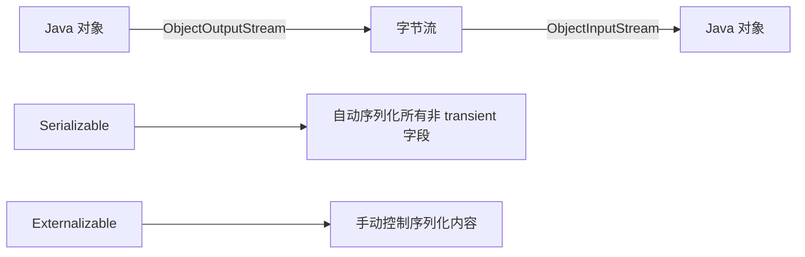
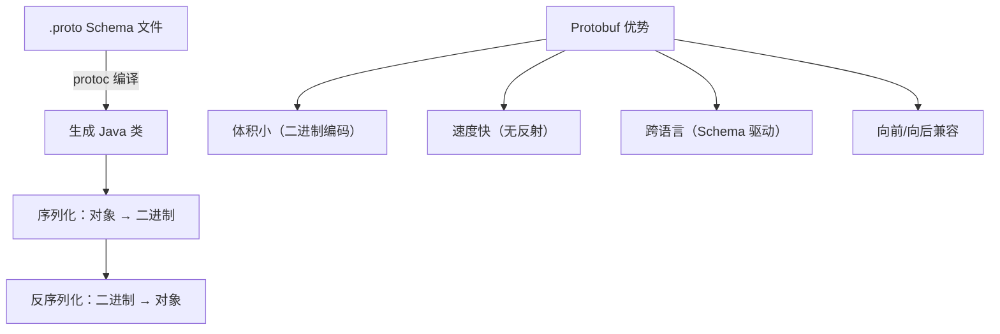
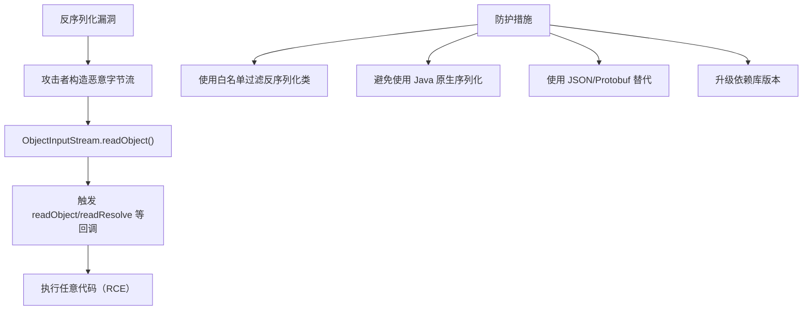

# 序列化机制

## 概念说明

序列化是将对象转换为字节序列的过程，反序列化则是将字节序列恢复为对象。序列化在网络传输、持久化存储、分布式系统通信中无处不在。Java 提供了多种序列化方案，各有优劣，选择合适的序列化方案对系统性能和安全性至关重要。

## 核心原理

### 1. Java 原生序列化



#### Serializable vs Externalizable

| 特性 | Serializable | Externalizable |
|------|-------------|----------------|
| 序列化方式 | 自动（反射） | 手动（writeExternal/readExternal） |
| 性能 | 较慢 | 较快 |
| 灵活性 | 低（transient 排除字段） | 高（完全自定义） |
| 默认构造器 | 不需要 | 必须有无参构造器 |

#### serialVersionUID 的作用

```java
public class User implements Serializable {
    // 显式声明 serialVersionUID
    // 如果不声明，JVM 会根据类结构自动生成
    // 类结构变化后自动生成的 UID 会变，导致反序列化失败
    private static final long serialVersionUID = 1L;
    
    private String name;
    private transient String password; // transient 字段不参与序列化
}
```

### 2. JSON 序列化对比

| 特性 | Jackson | Gson | Fastjson |
|------|---------|------|----------|
| 性能 | ⭐⭐⭐⭐ | ⭐⭐⭐ | ⭐⭐⭐⭐⭐ |
| 安全性 | ⭐⭐⭐⭐⭐ | ⭐⭐⭐⭐ | ⭐⭐（历史漏洞多） |
| 功能丰富度 | ⭐⭐⭐⭐⭐ | ⭐⭐⭐ | ⭐⭐⭐⭐ |
| Spring 默认 | ✅ | ❌ | ❌ |
| 社区活跃度 | ⭐⭐⭐⭐⭐ | ⭐⭐⭐ | ⭐⭐⭐ |

**推荐**：优先使用 Jackson（Spring 生态默认），其次 Gson（轻量场景）。Fastjson 因历史安全漏洞较多，生产环境慎用。

### 3. Protobuf 序列化



#### 序列化方案性能对比

| 方案 | 序列化大小 | 序列化速度 | 反序列化速度 | 跨语言 |
|------|-----------|-----------|-------------|--------|
| Java 原生 | 大 | 慢 | 慢 | ❌ |
| JSON (Jackson) | 中 | 中 | 中 | ✅ |
| Protobuf | 小 | 快 | 快 | ✅ |
| Hessian | 中 | 中 | 中 | ✅ |
| Kryo | 小 | 快 | 快 | ❌ |

### 4. 序列化安全问题



**著名漏洞案例**：Apache Commons Collections 反序列化漏洞、Fastjson autoType 漏洞。

## 代码示例

```java
// Java 原生序列化
ByteArrayOutputStream bos = new ByteArrayOutputStream();
ObjectOutputStream oos = new ObjectOutputStream(bos);
oos.writeObject(user);
byte[] bytes = bos.toByteArray();

// Jackson JSON 序列化
ObjectMapper mapper = new ObjectMapper();
String json = mapper.writeValueAsString(user);
User deserialized = mapper.readValue(json, User.class);
```

> 💻 完整可运行代码：[SerializationDemo.java](../../../code-examples/01-java-core/java-advanced/src/main/java/com/example/advanced/serialization/SerializationDemo.java)

## 常见面试题

### Q1: Java 序列化中 serialVersionUID 的作用是什么？

**难度**：⭐⭐ | **频率**：🔥🔥🔥

**答题思路**：

1. 版本控制的作用
2. 不声明的后果
3. 最佳实践

**标准答案**：

serialVersionUID 是序列化版本号，用于验证序列化和反序列化的类版本一致性。反序列化时，JVM 会比较字节流中的 serialVersionUID 和本地类的 serialVersionUID，不一致则抛出 `InvalidClassException`。如果不显式声明，JVM 会根据类名、字段、方法等自动计算，类结构任何变化都会导致 UID 改变。最佳实践是显式声明 serialVersionUID，这样即使类结构发生兼容性变化（如新增字段），也不会导致反序列化失败。

**深入追问**：

- transient 关键字的作用是什么？
- Serializable 和 Externalizable 的区别？
- 如何自定义序列化过程？（writeObject/readObject）

### Q2: 为什么不推荐使用 Java 原生序列化？

**难度**：⭐⭐ | **频率**：🔥🔥

**答题思路**：

1. 安全问题
2. 性能问题
3. 跨语言问题
4. 替代方案

**标准答案**：

Java 原生序列化存在三大问题：一是安全风险，反序列化漏洞可导致远程代码执行（RCE），Apache Commons Collections 等库的反序列化漏洞影响广泛；二是性能差，序列化后体积大、速度慢，不适合高性能场景；三是不支持跨语言，只能在 Java 生态内使用。推荐替代方案：HTTP API 使用 JSON（Jackson），RPC 通信使用 Protobuf，Java 内部高性能场景使用 Kryo。

**深入追问**：

- Fastjson 的 autoType 漏洞是怎么回事？
- Protobuf 为什么比 JSON 快？

### Q3: Jackson、Gson、Fastjson 如何选择？

**难度**：⭐⭐ | **频率**：🔥🔥

**答题思路**：

1. 各自优缺点
2. 适用场景
3. 安全性考量

**标准答案**：

Jackson 是 Spring 生态默认的 JSON 库，功能最丰富，性能优秀，安全性好，是首选方案。Gson 由 Google 开发，API 简洁，适合轻量级场景和 Android 开发。Fastjson 性能最好但历史安全漏洞较多（autoType 远程代码执行），生产环境需谨慎使用，如果使用建议升级到 Fastjson2 并关闭 autoType。总结：Spring 项目用 Jackson，轻量场景用 Gson，对性能极致要求且能接受安全风险的用 Fastjson2。

**深入追问**：

- Jackson 的 @JsonProperty、@JsonIgnore 等常用注解有哪些？
- 如何处理 JSON 中的日期格式？

## 参考资料

- [Jackson 官方文档](https://github.com/FasterXML/jackson)
- [Protocol Buffers 官方文档](https://protobuf.dev/)
- [Java 反序列化漏洞分析](https://paper.seebug.org/312/)
