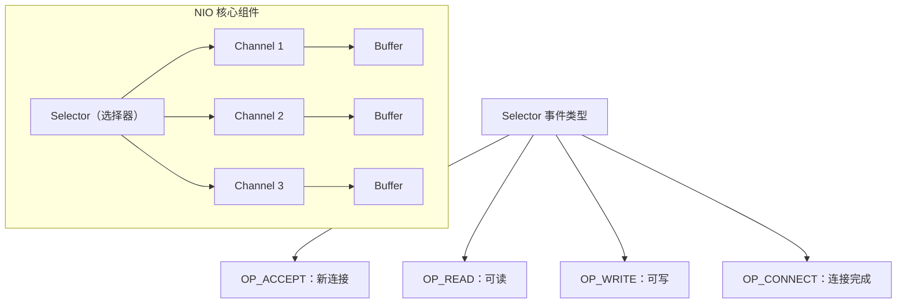
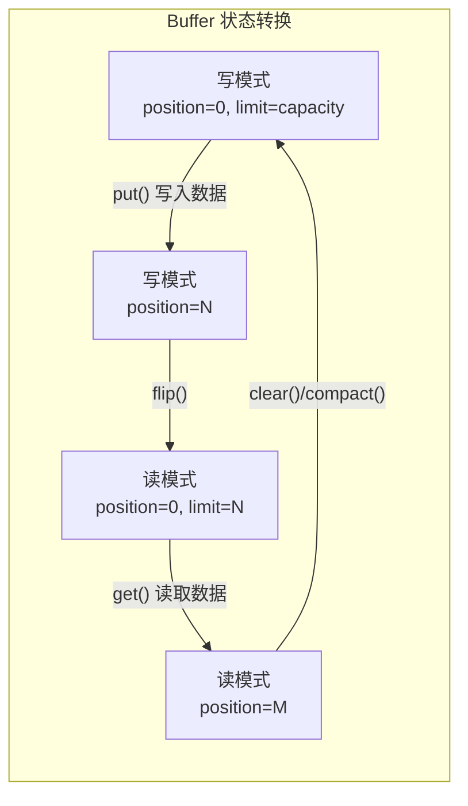
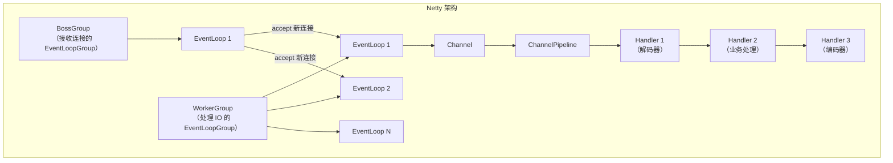
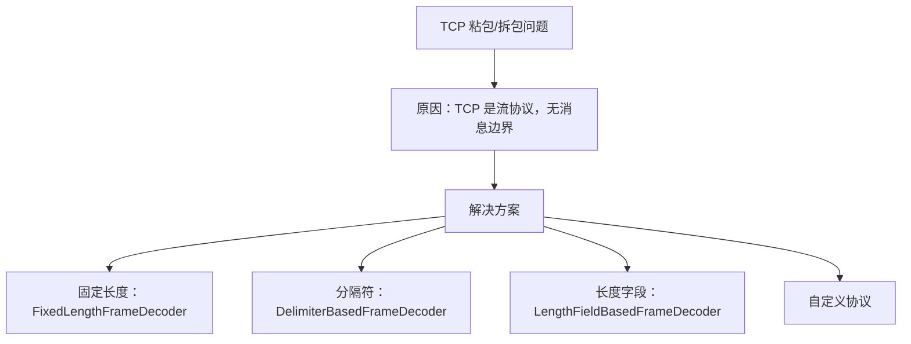
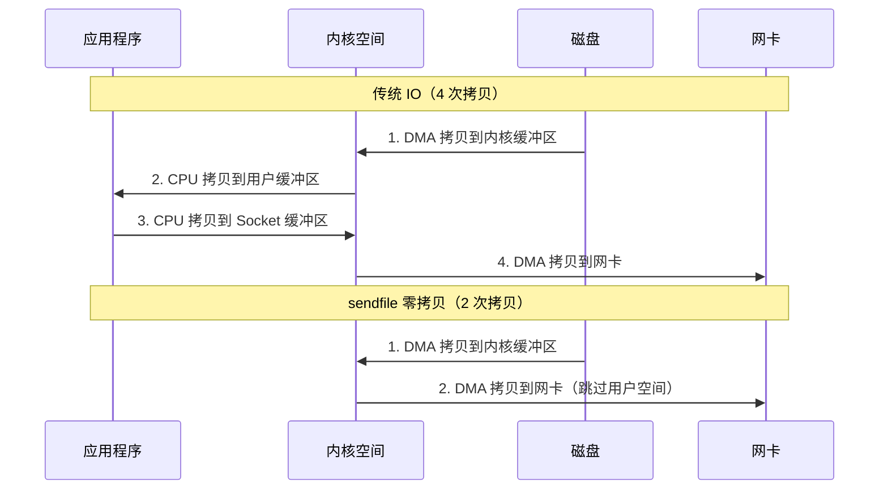

# 网络编程 BIO/NIO/AIO/Netty

## 概念说明

Java 网络编程经历了从 BIO 到 NIO 再到 AIO 的演进，每一代模型都在解决上一代的性能瓶颈。Netty 作为基于 NIO 的高性能网络框架，是 Dubbo、gRPC、Elasticsearch 等众多中间件的通信基础。理解 IO 模型和 Netty 原理是 Java 后端开发者的必备技能。

## 核心原理

### 1. BIO/NIO/AIO 模型对比

```mermaid
graph TD
    subgraph "BIO（同步阻塞）"
        A1["客户端请求"] --> B1["服务端 accept()（阻塞）"]
        B1 --> C1["创建新线程处理"]
        C1 --> D1["read()（阻塞等待数据）"]
        D1 --> E1["处理业务"]
        E1 --> F1["write()（阻塞）"]
    end

    subgraph "NIO（同步非阻塞）"
        A2["多个客户端"] --> B2["Selector 多路复用"]
        B2 --> C2["轮询就绪事件"]
        C2 --> D2["处理就绪的 Channel"]
    end

    subgraph "AIO（异步非阻塞）"
        A3["客户端请求"] --> B3["OS 异步处理 IO"]
        B3 --> C3["IO 完成后回调通知"]
    end
```



| 特性 | BIO | NIO | AIO |
|------|-----|-----|-----|
| IO 模型 | 同步阻塞 | 同步非阻塞 | 异步非阻塞 |
| 线程模型 | 一连接一线程 | 一线程管理多连接 | 回调/Future |
| 适用场景 | 连接数少、固定 | 连接数多、短连接 | 连接数多、长连接 |
| 复杂度 | 低 | 高 | 最高 |
| JDK 版本 | JDK 1.0 | JDK 1.4 | JDK 1.7 |
| 典型框架 | Tomcat BIO | Netty、Tomcat NIO | 较少使用 |

### 2. BIO 服务器实现

```java
// BIO 服务器 —— 每个连接一个线程
ServerSocket serverSocket = new ServerSocket(8080);
while (true) {
    Socket socket = serverSocket.accept(); // 阻塞等待连接
    new Thread(() -> {
        try (InputStream in = socket.getInputStream();
             OutputStream out = socket.getOutputStream()) {
            byte[] buffer = new byte[1024];
            int len = in.read(buffer); // 阻塞等待数据
            String request = new String(buffer, 0, len);
            out.write(("Echo: " + request).getBytes());
        } catch (IOException e) {
            e.printStackTrace();
        }
    }).start();
}
```

**BIO 的问题**：每个连接需要一个线程，当并发连接数增加时，线程数量暴增，导致线程切换开销大、内存占用高。

### 3. NIO 三大核心组件



#### NIO 服务器实现

```java
// NIO 服务器 —— Selector 多路复用
Selector selector = Selector.open();
ServerSocketChannel serverChannel = ServerSocketChannel.open();
serverChannel.bind(new InetSocketAddress(8080));
serverChannel.configureBlocking(false);
serverChannel.register(selector, SelectionKey.OP_ACCEPT);

while (true) {
    selector.select(); // 阻塞等待就绪事件
    Iterator<SelectionKey> keys = selector.selectedKeys().iterator();
    while (keys.hasNext()) {
        SelectionKey key = keys.next();
        keys.remove();
        if (key.isAcceptable()) {
            // 处理新连接
            SocketChannel client = serverChannel.accept();
            client.configureBlocking(false);
            client.register(selector, SelectionKey.OP_READ);
        } else if (key.isReadable()) {
            // 处理读事件
            SocketChannel client = (SocketChannel) key.channel();
            ByteBuffer buffer = ByteBuffer.allocate(1024);
            int len = client.read(buffer);
            if (len > 0) {
                buffer.flip();
                // 处理数据...
            }
        }
    }
}
```

#### Buffer 核心操作



### 4. Netty 核心架构



#### Netty 核心组件

| 组件 | 作用 |
|------|------|
| EventLoopGroup | 线程池，包含多个 EventLoop |
| EventLoop | 事件循环，绑定一个线程，处理多个 Channel 的 IO 事件 |
| Channel | 网络连接的抽象（NioSocketChannel 等） |
| ChannelPipeline | Handler 链，处理入站/出站事件 |
| ChannelHandler | 事件处理器（编解码、业务逻辑） |
| ByteBuf | Netty 自定义的缓冲区，比 NIO ByteBuffer 更强大 |

### 5. Netty 编解码与粘包拆包



### 6. 零拷贝原理



**零拷贝的实现方式**：
- **mmap**：将文件映射到内存，减少一次拷贝
- **sendfile**：直接在内核空间传输，不经过用户空间
- **Netty 的零拷贝**：CompositeByteBuf 组合缓冲区、FileRegion 文件传输

## 代码示例

```java
// BIO 服务器
ServerSocket server = new ServerSocket(8080);
Socket client = server.accept();

// NIO 服务器
Selector selector = Selector.open();
ServerSocketChannel channel = ServerSocketChannel.open();
channel.configureBlocking(false);
channel.register(selector, SelectionKey.OP_ACCEPT);
```

> 💻 完整可运行代码：[NIODemo.java](https://github.com/skyhe58/guide-java/tree/main/code-examples/01-java-core/java-advanced/src/main/java/com/example/advanced/network/NIODemo.java)
> <!-- 本地路径：code-examples/01-java-core/java-advanced/src/main/java/com/example/advanced/network/NIODemo.java -->

## 常见面试题

### Q1: BIO、NIO、AIO 的区别是什么？

**难度**：⭐⭐⭐ | **频率**：🔥🔥🔥

**答题思路**：

1. 从 IO 模型角度：同步阻塞/同步非阻塞/异步非阻塞
2. 从线程模型角度：一连接一线程/多路复用/回调
3. 从适用场景角度

**标准答案**：

BIO 是同步阻塞 IO，每个连接需要一个线程处理，accept 和 read 都会阻塞，适合连接数少且固定的场景。NIO 是同步非阻塞 IO，通过 Selector 多路复用，一个线程可以管理多个连接，只在有就绪事件时才处理，适合高并发短连接场景。AIO 是异步非阻塞 IO，IO 操作由操作系统完成后通过回调通知应用，适合高并发长连接场景，但在 Linux 上实现不够成熟（基于 epoll 模拟），实际使用较少。

**深入追问**：

- NIO 的 Selector 底层是用什么实现的？（Linux epoll、macOS kqueue）
- 为什么 Netty 不使用 AIO？
- epoll 和 select/poll 的区别？

**易错点**：

- NIO 的"非阻塞"指的是 Channel 可以设置为非阻塞，但 Selector.select() 本身是阻塞的
- AIO 在 Linux 上并非真正的异步 IO，而是基于 epoll 模拟的

### Q2: Netty 的线程模型是什么？

**难度**：⭐⭐⭐ | **频率**：🔥🔥🔥

**答题思路**：

1. Reactor 模型
2. BossGroup 和 WorkerGroup
3. EventLoop 与 Channel 的绑定关系

**标准答案**：

Netty 采用主从 Reactor 多线程模型。BossGroup（主 Reactor）负责接收客户端连接，通常只有一个线程。WorkerGroup（从 Reactor）负责处理 IO 读写和业务逻辑，包含多个 EventLoop 线程。每个 EventLoop 绑定一个线程，负责处理多个 Channel 的 IO 事件。一个 Channel 在其生命周期内只绑定一个 EventLoop，保证了线程安全。Channel 的 IO 事件通过 ChannelPipeline 中的 Handler 链依次处理。

**深入追问**：

- Netty 如何解决 JDK NIO 的 epoll 空轮询 Bug？
- EventLoop 的任务队列有什么作用？
- 如何在 Netty 中处理耗时的业务逻辑？

### Q3: 什么是零拷贝？Netty 中如何实现？

**难度**：⭐⭐⭐ | **频率**：🔥🔥

**答题思路**：

1. 传统 IO 的 4 次拷贝
2. sendfile/mmap 的优化
3. Netty 层面的零拷贝

**标准答案**：

零拷贝是指减少数据在内核空间和用户空间之间的拷贝次数。传统 IO 需要 4 次拷贝（磁盘→内核缓冲区→用户缓冲区→Socket 缓冲区→网卡），sendfile 系统调用可以直接在内核空间传输数据，减少到 2 次拷贝。Netty 的零拷贝体现在：CompositeByteBuf 将多个 Buffer 组合为一个逻辑 Buffer 避免内存拷贝；FileRegion 通过 transferTo 实现文件零拷贝传输；slice 操作共享底层数组避免拷贝。

**深入追问**：

- mmap 和 sendfile 的区别？
- Netty 的 ByteBuf 和 JDK 的 ByteBuffer 有什么区别？

## 参考资料

- [Netty 官方文档](https://netty.io/wiki/)
- [Netty in Action](https://www.manning.com/books/netty-in-action)
- [Linux IO 模型详解](https://man7.org/linux/man-pages/man2/select.2.html)
