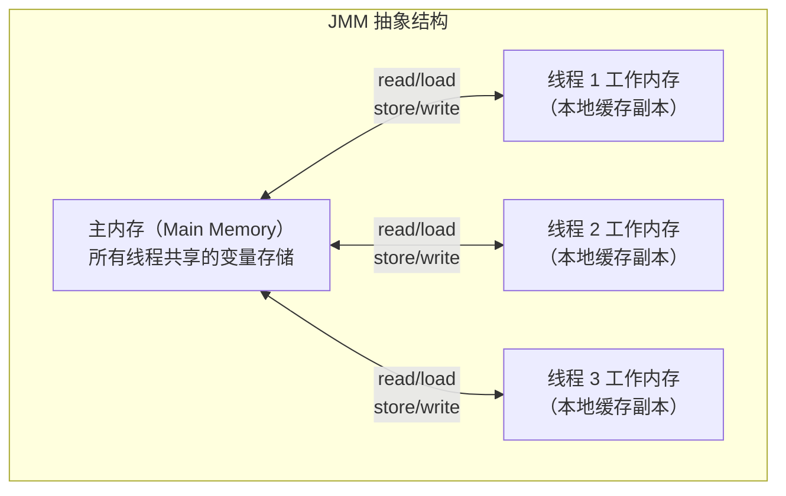
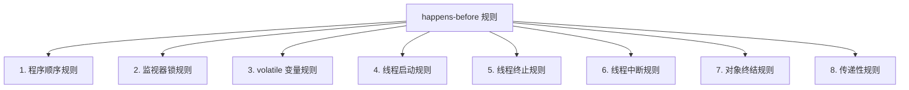
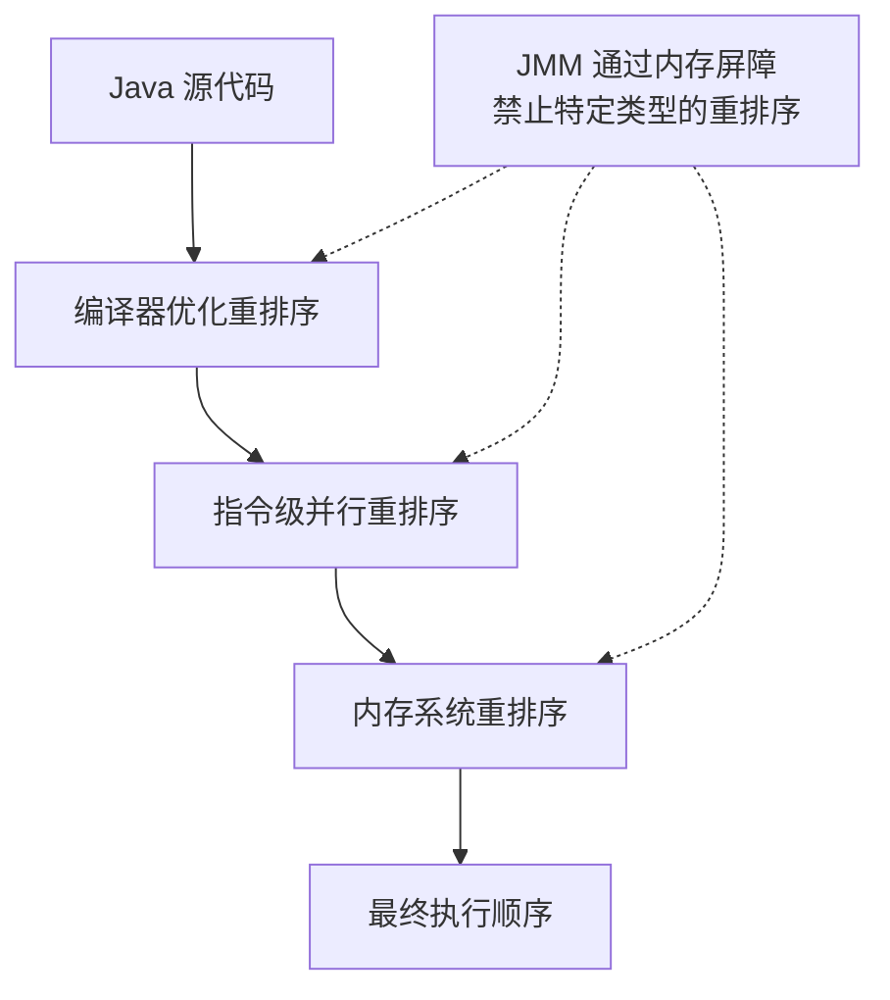

# JMM 与 happens-before

## 概念说明

Java 内存模型（Java Memory Model，JMM）定义了多线程环境下变量的访问规则，是理解并发编程的理论基础。JMM 通过 happens-before 规则来保证多线程间的可见性和有序性，是 volatile、synchronized、final 等关键字语义的底层支撑。

**注意区分**：JMM 是抽象的并发编程规范，不是 JVM 内存区域（堆、栈、方法区）。

## 核心原理

### 1. JMM 抽象模型



**JMM 的 8 种内存交互操作**：

| 操作 | 作用域 | 说明 |
|------|--------|------|
| lock | 主内存 | 标识变量为线程独占 |
| unlock | 主内存 | 释放变量的独占状态 |
| read | 主内存 | 将变量值传输到工作内存 |
| load | 工作内存 | 将 read 的值放入工作内存副本 |
| use | 工作内存 | 将值传递给执行引擎 |
| assign | 工作内存 | 将执行引擎的值赋给工作内存副本 |
| store | 工作内存 | 将工作内存的值传输到主内存 |
| write | 主内存 | 将 store 的值写入主内存变量 |

### 2. JMM 与 JVM 内存区域的区别

| 维度 | JMM（Java Memory Model） | JVM 内存区域 |
|------|--------------------------|-------------|
| 层面 | 抽象规范（并发语义） | 具体实现（运行时数据区） |
| 关注点 | 多线程可见性、有序性 | 数据存储位置 |
| 组成 | 主内存 + 工作内存 | 堆、栈、方法区、PC 等 |
| 对应关系 | 主内存 ≈ 堆 + 方法区 | 工作内存 ≈ CPU 缓存 + 寄存器 |

### 3. happens-before 八大规则



| 规则 | 说明 | 示例 |
|------|------|------|
| **程序顺序规则** | 同一线程中，前面的操作 happens-before 后面的操作 | `a = 1; b = a;` a 的赋值对 b 可见 |
| **监视器锁规则** | unlock 操作 happens-before 后续的 lock 操作 | synchronized 块内的修改对下一个获取锁的线程可见 |
| **volatile 变量规则** | volatile 写 happens-before 后续的 volatile 读 | volatile 变量的修改对所有线程立即可见 |
| **线程启动规则** | Thread.start() happens-before 线程中的任何操作 | 主线程设置的变量对新线程可见 |
| **线程终止规则** | 线程中的所有操作 happens-before Thread.join() 返回 | 子线程的修改在 join 后对主线程可见 |
| **线程中断规则** | interrupt() 调用 happens-before 被中断线程检测到中断 | |
| **对象终结规则** | 构造函数完成 happens-before finalize() 开始 | |
| **传递性规则** | 如果 A hb B，B hb C，则 A hb C | 可以组合多条规则推导可见性 |

### 4. 指令重排序



**经典重排序问题**：

```java
// 线程 1
a = 1;      // 操作 1
flag = true; // 操作 2（volatile 写）

// 线程 2
if (flag) {  // 操作 3（volatile 读）
    int b = a; // 操作 4
    // 如果 flag 不是 volatile，操作 1 和 2 可能重排序
    // 导致 b 可能读到 0
}
```

### 5. 内存屏障

| 屏障类型 | 说明 | 作用 |
|----------|------|------|
| LoadLoad | Load1; LoadLoad; Load2 | 确保 Load1 在 Load2 之前完成 |
| StoreStore | Store1; StoreStore; Store2 | 确保 Store1 在 Store2 之前刷新到主内存 |
| LoadStore | Load1; LoadStore; Store2 | 确保 Load1 在 Store2 之前完成 |
| StoreLoad | Store1; StoreLoad; Load2 | 确保 Store1 刷新到主内存后再执行 Load2 |

**volatile 的内存屏障插入策略**：
- volatile 写之前插入 StoreStore 屏障
- volatile 写之后插入 StoreLoad 屏障
- volatile 读之后插入 LoadLoad + LoadStore 屏障

### 6. as-if-serial 语义

as-if-serial 语义保证：不管怎么重排序，**单线程**程序的执行结果不能被改变。编译器和处理器不会对存在数据依赖关系的操作进行重排序。

```java
// 以下代码中，操作 1 和 2 可以重排序（无数据依赖）
// 但操作 3 不能排到 1 或 2 之前（有数据依赖）
int a = 1;     // 操作 1
int b = 2;     // 操作 2
int c = a + b; // 操作 3（依赖 a 和 b）
```

## 代码示例

```java
// 可见性问题演示
private static boolean running = true; // 非 volatile
// 线程 A 修改 running = false，线程 B 可能永远看不到

// volatile 保证可见性
private static volatile boolean flag = false;
// 线程 A 写 flag = true，线程 B 立即可见

// happens-before 验证
Thread t = new Thread(() -> { /* 操作 */ });
t.start(); // start() happens-before 线程内操作
t.join();  // 线程内操作 happens-before join() 返回
```

> 💻 完整可运行代码：[JMMDemo.java](../../../code-examples/01-java-core/java-advanced/src/main/java/com/example/advanced/jmm/JMMDemo.java)

## 常见面试题

### Q1: 什么是 Java 内存模型（JMM）？它和 JVM 内存区域有什么区别？

**难度**：⭐⭐⭐ | **频率**：🔥🔥🔥

**答题思路**：

1. JMM 的定义和作用
2. 主内存和工作内存
3. 与 JVM 内存区域的区别

**标准答案**：

JMM 是 Java 语言规范中定义的一套抽象规则，规定了多线程环境下变量的访问方式。JMM 将内存抽象为主内存（所有线程共享）和工作内存（每个线程私有的缓存副本）。线程对变量的操作必须在工作内存中进行，不能直接操作主内存。JMM 通过 happens-before 规则保证可见性和有序性。JMM 和 JVM 内存区域是不同层面的概念：JMM 是并发编程的抽象规范，关注可见性和有序性；JVM 内存区域是运行时数据区的具体划分（堆、栈、方法区等），关注数据存储位置。

**深入追问**：

- JMM 的 8 种内存交互操作是什么？
- 为什么需要工作内存？直接操作主内存不行吗？
- JMM 如何保证原子性、可见性、有序性？

### Q2: happens-before 规则有哪些？

**难度**：⭐⭐⭐ | **频率**：🔥🔥🔥

**答题思路**：

1. 列举 8 条规则
2. 重点解释 volatile、synchronized、线程启动/终止规则
3. 传递性的应用

**标准答案**：

happens-before 有 8 条规则：程序顺序规则（同一线程内前面的操作 hb 后面的）、监视器锁规则（unlock hb 后续 lock）、volatile 变量规则（volatile 写 hb 后续 volatile 读）、线程启动规则（start() hb 线程内操作）、线程终止规则（线程操作 hb join() 返回）、线程中断规则、对象终结规则、传递性规则。其中最常用的是 volatile 规则、锁规则和传递性规则的组合，可以推导出复杂场景下的可见性保证。

**深入追问**：

- happens-before 是否意味着时间上的先后？
- 如何利用 happens-before 规则分析并发程序的正确性？

### Q3: 什么是指令重排序？如何防止？

**难度**：⭐⭐⭐ | **频率**：🔥🔥

**答题思路**：

1. 三种重排序来源
2. as-if-serial 语义
3. 内存屏障的作用
4. volatile 和 synchronized 如何防止重排序

**标准答案**：

指令重排序有三个来源：编译器优化重排序、CPU 指令级并行重排序、内存系统重排序。重排序遵循 as-if-serial 语义，保证单线程结果不变，但在多线程环境下可能导致问题。JMM 通过内存屏障（LoadLoad、StoreStore、LoadStore、StoreLoad）禁止特定类型的重排序。volatile 写前插入 StoreStore 屏障、写后插入 StoreLoad 屏障，读后插入 LoadLoad 和 LoadStore 屏障。synchronized 通过 lock/unlock 操作隐式插入内存屏障。

**深入追问**：

- 双重检查锁定（DCL）为什么需要 volatile？
- StoreLoad 屏障为什么是最重的？

## 参考资料

- [JSR-133: Java Memory Model and Thread Specification](https://www.cs.umd.edu/~pugh/java/memoryModel/jsr133.pdf)
- [Java Concurrency in Practice](https://jcip.net/) — 第 16 章
- [深入理解 Java 虚拟机（第 3 版）](https://book.douban.com/subject/34907497/) — 第 12 章
