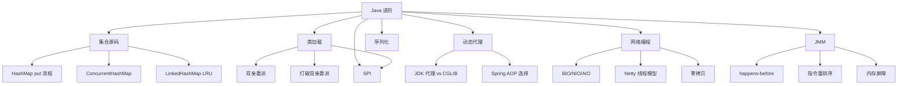

# Java 进阶面试指南

## 概念说明

本文汇总 Java 进阶模块的高频面试题，按出现频率排序。建议在学习完各知识点后，用本指南进行系统复习和查漏补缺。每道题都标注了难度和频率，并提供追问链路帮助你应对面试官的深入追问。

## 高频面试题汇总（按频率排序）

### 🔥🔥🔥 必考题（几乎每次面试都会问）

#### Q1: HashMap 的底层实现原理？put 方法的执行流程？

**难度**：⭐⭐⭐ | **频率**：🔥🔥🔥 | **详细解析**：[集合源码分析](./01-collections-source.md)

**答题要点**：
1. 数据结构：数组 + 链表 + 红黑树（JDK 8+）
2. hash 扰动函数：`(h = key.hashCode()) ^ (h >>> 16)`
3. 定位桶：`(n-1) & hash`
4. put 流程：空桶直接插入 → 首节点 key 相同则覆盖 → 红黑树插入 → 链表尾插
5. 链表长度 ≥ 8 且数组 ≥ 64 转红黑树
6. size 超过阈值则扩容（容量翻倍）

**追问链路**：
- → 为什么用扰动函数？ → 为什么阈值是 8？ → JDK 7 和 8 的区别？ → 头插法为什么会死循环？ → HashMap 线程不安全的表现？

---

#### Q2: ConcurrentHashMap 的实现原理？JDK 7 和 8 的区别？

**难度**：⭐⭐⭐ | **频率**：🔥🔥🔥 | **详细解析**：[集合源码分析](./01-collections-source.md)

**答题要点**：
1. JDK 7：Segment 分段锁（ReentrantLock），并发度 16
2. JDK 8：CAS + synchronized 锁桶头节点，并发度 = 桶数量
3. size() 使用 LongAdder 思想的分段计数
4. key 和 value 都不允许 null

**追问链路**：
- → 为什么 JDK 8 用 synchronized 而不是 ReentrantLock？ → size() 如何保证准确？ → 和 Hashtable 的区别？

---

#### Q3: JDK 动态代理和 CGLIB 代理的区别？Spring 如何选择？

**难度**：⭐⭐⭐ | **频率**：🔥🔥🔥 | **详细解析**：[动态代理](./03-dynamic-proxy.md)

**答题要点**：
1. JDK 代理：基于接口，Proxy + InvocationHandler
2. CGLIB 代理：基于继承，生成子类，不能代理 final
3. Spring 选择策略：有接口用 JDK，无接口用 CGLIB
4. Spring Boot 2.x 默认 CGLIB

**追问链路**：
- → Spring Boot 为什么默认改用 CGLIB？ → @Transactional 失效场景？ → 自调用为什么 AOP 失效？

---

#### Q4: 什么是 JMM？happens-before 规则有哪些？

**难度**：⭐⭐⭐ | **频率**：🔥🔥🔥 | **详细解析**：[JMM 与 happens-before](./07-jmm.md)

**答题要点**：
1. JMM 定义多线程变量访问规则（主内存 + 工作内存）
2. 8 条 happens-before 规则
3. 重点：volatile 规则、锁规则、传递性
4. JMM ≠ JVM 内存区域

**追问链路**：
- → JMM 和 JVM 内存区域的区别？ → 什么是指令重排序？ → volatile 如何防止重排序？ → DCL 为什么需要 volatile？

---

#### Q5: BIO、NIO、AIO 的区别？Netty 的线程模型？

**难度**：⭐⭐⭐ | **频率**：🔥🔥🔥 | **详细解析**：[网络编程](./06-network-programming.md)

**答题要点**：
1. BIO：同步阻塞，一连接一线程
2. NIO：同步非阻塞，Selector 多路复用
3. AIO：异步非阻塞，回调通知
4. Netty：主从 Reactor 模型，BossGroup + WorkerGroup

**追问链路**：
- → NIO 的 Selector 底层实现？ → epoll 和 select 的区别？ → Netty 如何解决 epoll 空轮询 Bug？ → 什么是零拷贝？

---

### 🔥🔥 高频题（经常出现）

#### Q6: 什么是双亲委派模型？如何打破？

**难度**：⭐⭐⭐ | **频率**：🔥🔥 | **详细解析**：[类加载机制](./02-classloader.md)

**答题要点**：
1. 委派流程：先委派父加载器，父无法加载再自己加载
2. 三个优点：安全性、唯一性、层次性
3. 打破场景：SPI（线程上下文类加载器）、Tomcat、OSGi

**追问链路**：
- → 如何自定义 ClassLoader？ → findClass 和 loadClass 的区别？ → JDBC 驱动如何通过 SPI 加载？

---

#### Q7: Java SPI 机制是什么？有什么缺点？

**难度**：⭐⭐ | **频率**：🔥🔥 | **详细解析**：[SPI 机制](./04-spi.md)

**答题要点**：
1. ServiceLoader + META-INF/services 配置
2. 应用：JDBC、SLF4J、Dubbo、Spring Boot
3. 缺点：全量加载、无排序、无依赖注入
4. Dubbo SPI 的改进

**追问链路**：
- → Dubbo SPI 和 Java SPI 的区别？ → Spring Boot 的 spring.factories 是什么？

---

#### Q8: Java 有哪些序列化方式？如何选择？

**难度**：⭐⭐ | **频率**：🔥🔥 | **详细解析**：[序列化机制](./05-serialization.md)

**答题要点**：
1. Java 原生：Serializable，性能差，安全风险
2. JSON：Jackson（推荐）、Gson、Fastjson
3. 二进制：Protobuf（高性能跨语言）、Kryo（Java 内部）
4. serialVersionUID 的作用

**追问链路**：
- → 为什么不推荐 Java 原生序列化？ → Fastjson 的安全问题？ → Protobuf 为什么比 JSON 快？

---

#### Q9: LinkedHashMap 如何实现 LRU 缓存？

**难度**：⭐⭐ | **频率**：🔥🔥 | **详细解析**：[集合源码分析](./01-collections-source.md)

**答题要点**：
1. accessOrder = true，按访问顺序排列
2. 重写 removeEldestEntry 方法
3. 双向链表维护顺序

**追问链路**：
- → 如何实现线程安全的 LRU？ → Redis 的 LRU 淘汰策略？

---

### 🔥 中频题（偶尔出现）

#### Q10: 什么是零拷贝？有哪些实现方式？

**难度**：⭐⭐⭐ | **频率**：🔥 | **详细解析**：[网络编程](./06-network-programming.md)

**答题要点**：
1. 传统 IO 4 次拷贝
2. sendfile：内核空间直接传输
3. mmap：内存映射
4. Netty 的零拷贝：CompositeByteBuf、FileRegion

---

#### Q11: 什么是内存屏障？volatile 如何使用内存屏障？

**难度**：⭐⭐⭐ | **频率**：🔥 | **详细解析**：[JMM 与 happens-before](./07-jmm.md)

**答题要点**：
1. 四种屏障：LoadLoad、StoreStore、LoadStore、StoreLoad
2. volatile 写前 StoreStore，写后 StoreLoad
3. volatile 读后 LoadLoad + LoadStore

---

## 面试知识图谱

## 面试技巧

1. **HashMap 系列**：从数据结构讲起，重点是 put 流程和扩容，主动提到 JDK 7/8 区别展示深度
2. **代理系列**：先讲区别，再讲 Spring 选择策略，主动关联 @Transactional 失效场景
3. **网络编程**：从 BIO 的问题引出 NIO，再引出 Netty，展示知识的连贯性
4. **JMM 系列**：先区分 JMM 和 JVM 内存区域，再讲 happens-before，用 volatile 举例

## 参考资料

- [Java 面试指南](https://javaguide.cn/)
- [小林 coding](https://xiaolincoding.com/)
