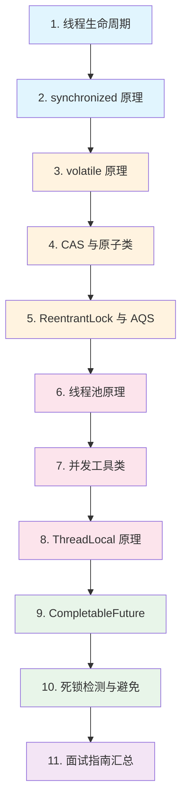

# 并发编程

## 概念说明

并发编程是 Java 面试中的**重灾区**，也是区分初级和高级开发者的关键领域。Java 从语言层面提供了丰富的并发支持，从最基础的 `synchronized` 关键字到 `java.util.concurrent` 包中的高级工具类，构成了一套完整的并发编程体系。

掌握并发编程不仅需要理解 API 的使用，更需要深入理解底层原理：线程调度、内存模型、锁机制、CAS 操作等。

## 知识点列表

| 序号 | 知识点 | 难度 | 面试频率 | 文档链接 |
|------|--------|------|----------|----------|
| 1 | 线程生命周期 | ⭐⭐ | 🔥🔥🔥 | [thread-lifecycle](./01-thread-lifecycle.md) |
| 2 | synchronized 原理 | ⭐⭐⭐ | 🔥🔥🔥 | [synchronized](./02-synchronized.md) |
| 3 | ReentrantLock 与 AQS | ⭐⭐⭐ | 🔥🔥🔥 | [reentrantlock-aqs](./03-reentrantlock-aqs.md) |
| 4 | volatile 原理 | ⭐⭐⭐ | 🔥🔥🔥 | [volatile](./04-volatile.md) |
| 5 | 线程池原理 | ⭐⭐⭐ | 🔥🔥🔥 | [thread-pool](./05-thread-pool.md) |
| 6 | 并发工具类 | ⭐⭐ | 🔥🔥 | [concurrent-tools](./06-concurrent-tools.md) |
| 7 | ThreadLocal 原理 | ⭐⭐⭐ | 🔥🔥🔥 | [threadlocal](./07-threadlocal.md) |
| 8 | CompletableFuture | ⭐⭐ | 🔥🔥 | [completable-future](./08-completable-future.md) |
| 9 | CAS 与原子类 | ⭐⭐⭐ | 🔥🔥🔥 | [cas-atomic](./09-cas-atomic.md) |
| 10 | 死锁检测与避免 | ⭐⭐ | 🔥🔥 | [deadlock](./10-deadlock.md) |
| 11 | 并发编程面试指南 | ⭐⭐⭐ | 🔥🔥🔥 | [interview](./99-interview.md) |

## 推荐学习顺序

**学习路线说明**：
- 🔵 **基础层**（1-2）：先理解线程和最基本的同步机制
- 🟠 **原理层**（3-5）：深入内存模型、CAS、AQS 等底层原理
- 🔴 **应用层**（6-8）：掌握线程池、并发工具、ThreadLocal 等实用工具
- 🟢 **进阶层**（9-10）：异步编程和问题排查
- 🟣 **面试层**（11）：系统复习，查漏补缺

## 相关模块链接

- [Java 基础](/1-java-core/1.1-java-basics/) — 并发编程的语言基础
- [JVM](/1-java-core/1.4-jvm/) — 内存模型、线程调度的底层支撑
- [Java 进阶](/1-java-core/1.2-java-advanced/) — JMM、happens-before 规则
- [Spring Boot](/springboot/) — 框架中的异步处理、线程池配置
- [分布式系统](/distributed/) — 分布式锁、分布式并发控制

## 参考资料

- [Java Concurrency in Practice](https://jcip.net/)
- [JDK 源码 - java.util.concurrent](https://docs.oracle.com/en/java/javase/21/docs/api/java.base/java/util/1-java-core/1.3-concurrent/package-summary.html)
- [The Art of Multiprocessor Programming](https://www.elsevier.com/books/the-art-of-multiprocessor-programming/herlihy/978-0-12-415950-1)
