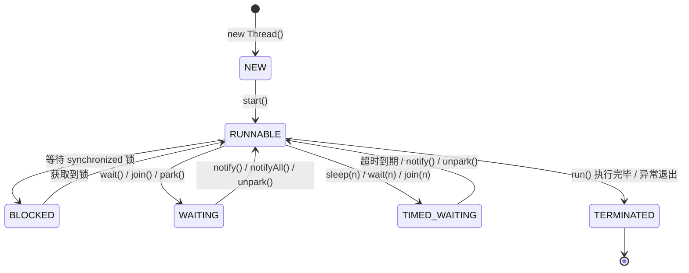

# 线程生命周期

## 概念说明

线程是操作系统调度的最小单位。Java 中的线程由 `java.lang.Thread` 类表示，每个线程都有自己的生命周期，在不同状态之间转换。理解线程的 6 种状态及其转换条件，是掌握并发编程的第一步。

Java 线程的状态定义在 `Thread.State` 枚举中，共 6 种状态（注意：不是操作系统层面的 5 种状态）。

## 核心原理

### 一、线程的 6 种状态

| 状态 | 枚举值 | 说明 |
|------|--------|------|
| 新建 | `NEW` | 线程对象已创建，但尚未调用 `start()` |
| 可运行 | `RUNNABLE` | 调用 `start()` 后，包含操作系统层面的 Ready 和 Running |
| 阻塞 | `BLOCKED` | 等待获取 synchronized 监视器锁 |
| 等待 | `WAITING` | 调用 `wait()`/`join()`/`LockSupport.park()` 后无限期等待 |
| 超时等待 | `TIMED_WAITING` | 调用 `sleep(n)`/`wait(n)`/`join(n)` 等带超时的方法 |
| 终止 | `TERMINATED` | 线程执行完毕或异常退出 |

> ⚠️ **易错点**：Java 的 RUNNABLE 状态对应操作系统的 Ready + Running 两个状态。当线程在进行 I/O 操作时，在 Java 层面仍然是 RUNNABLE 状态。

### 二、线程状态转换图



### 三、创建线程的 4 种方式对比

| 方式 | 实现 | 优点 | 缺点 | 适用场景 |
|------|------|------|------|----------|
| 继承 Thread | `extends Thread` | 简单直接 | 单继承限制，无法复用 | 简单场景 |
| 实现 Runnable | `implements Runnable` | 避免单继承限制，任务与线程分离 | 无返回值 | 不需要返回值的任务 |
| 实现 Callable | `implements Callable<V>` + FutureTask | 有返回值，可抛异常 | 使用稍复杂 | 需要返回值的任务 |
| 线程池 | `ExecutorService.submit()` | 复用线程，统一管理 | 需要理解线程池参数 | **生产环境推荐** |

> 💡 **面试要点**：严格来说，创建线程只有一种方式——`new Thread()`。Runnable/Callable 只是定义任务的方式，最终都需要通过 Thread 来执行。

### 四、关键方法对比

| 方法 | 所属类 | 是否释放锁 | 说明 |
|------|--------|-----------|------|
| `sleep(long)` | Thread | ❌ 不释放 | 当前线程休眠指定时间 |
| `wait()` | Object | ✅ 释放 | 必须在 synchronized 块中调用 |
| `join()` | Thread | ✅ 释放 | 等待目标线程执行完毕 |
| `yield()` | Thread | ❌ 不释放 | 提示调度器让出 CPU，不保证生效 |
| `interrupt()` | Thread | — | 设置中断标志位，不会强制停止线程 |

## 代码示例

```java
// 演示线程的 6 种状态转换
Thread thread = new Thread(() -> {
    try {
        // TIMED_WAITING 状态
        Thread.sleep(1000);
        // 进入 synchronized 块可能 BLOCKED
        synchronized (lock) {
            lock.wait(); // WAITING 状态
        }
    } catch (InterruptedException e) {
        Thread.currentThread().interrupt();
    }
});

System.out.println(thread.getState()); // NEW
thread.start();
System.out.println(thread.getState()); // RUNNABLE
```

> 💻 完整可运行代码：[ThreadLifecycleDemo.java](https://github.com/skyhe58/guide-java/tree/main/code-examples/01-java-core/concurrent-programming/src/main/java/com/example/concurrent/thread/ThreadLifecycleDemo.java)
> <!-- 本地路径：code-examples/01-java-core/concurrent-programming/src/main/java/com/example/concurrent/thread/ThreadLifecycleDemo.java -->

## 常见面试题

### Q1: Java 线程有几种状态？它们之间如何转换？

**难度**：⭐⭐ | **频率**：🔥🔥🔥

**答题思路**：

1. 先说 6 种状态（NEW、RUNNABLE、BLOCKED、WAITING、TIMED_WAITING、TERMINATED）
2. 画出状态转换图，说明每个转换的触发条件
3. 强调 RUNNABLE 包含 Ready 和 Running

**标准答案**：

Java 线程有 6 种状态，定义在 `Thread.State` 枚举中。NEW 是线程创建但未启动；RUNNABLE 是调用 start() 后的可运行状态（包含操作系统的 Ready 和 Running）；BLOCKED 是等待获取 synchronized 锁；WAITING 是调用 wait()/join()/park() 后的无限期等待；TIMED_WAITING 是带超时的等待；TERMINATED 是线程执行完毕。

**深入追问**：

- BLOCKED 和 WAITING 有什么区别？（BLOCKED 是等待锁，WAITING 是主动等待）
- 线程在进行 I/O 操作时是什么状态？（RUNNABLE，Java 层面不区分 I/O 阻塞）
- 如何优雅地停止一个线程？（interrupt() + 检查中断标志）

**易错点**：

- 不要说 5 种状态（那是操作系统层面的）
- sleep() 不释放锁，wait() 释放锁

### Q2: 创建线程有几种方式？

**难度**：⭐⭐ | **频率**：🔥🔥🔥

**答题思路**：

1. 列举 4 种方式：Thread、Runnable、Callable、线程池
2. 对比各自优缺点
3. 强调生产环境推荐使用线程池

**标准答案**：

常见的创建线程方式有 4 种：继承 Thread 类、实现 Runnable 接口、实现 Callable 接口配合 FutureTask、使用线程池。严格来说，创建线程只有一种方式就是 new Thread()，其他方式只是定义任务的不同方式。生产环境推荐使用线程池，因为可以复用线程、控制并发数、统一管理。

**深入追问**：

- Runnable 和 Callable 的区别？（返回值、异常）
- 为什么不推荐直接 new Thread()？（资源浪费、无法管理）

### Q3: sleep() 和 wait() 的区别？

**难度**：⭐⭐ | **频率**：🔥🔥🔥

**答题思路**：

1. 所属类不同
2. 是否释放锁
3. 使用场景

**标准答案**：

sleep() 是 Thread 的静态方法，不释放锁，到时间自动恢复；wait() 是 Object 的方法，会释放锁，必须在 synchronized 块中调用，需要 notify()/notifyAll() 唤醒。sleep() 用于暂停执行，wait() 用于线程间通信。

**深入追问**：

- 为什么 wait() 必须在 synchronized 块中调用？（防止 lost wake-up 问题）
- notify() 和 notifyAll() 的区别？（唤醒一个 vs 唤醒所有）

## 参考资料

- [Thread.State - JDK 21 API](https://docs.oracle.com/en/java/javase/21/docs/api/java.base/java/lang/Thread.State.html)
- [Java Concurrency in Practice - Chapter 5](https://jcip.net/)
