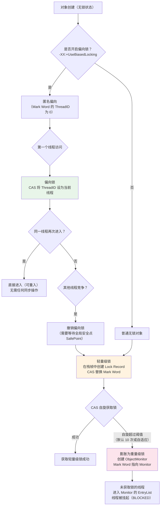

# synchronized 原理

## 概念说明

`synchronized` 是 Java 中最基本的同步机制，用于保证同一时刻只有一个线程可以执行某段代码。它是一个**可重入的、非公平的、悲观的**互斥锁。

JDK 6 之后，HotSpot 对 synchronized 进行了大量优化，引入了偏向锁、轻量级锁、锁消除、锁粗化等技术，使其性能大幅提升，在很多场景下不输 ReentrantLock。

## 核心原理

### 一、synchronized 的三种用法

| 用法 | 锁对象 | 示例 |
|------|--------|------|
| 修饰实例方法 | 当前实例 `this` | `public synchronized void method()` |
| 修饰静态方法 | 当前类的 Class 对象 | `public static synchronized void method()` |
| 修饰代码块 | 括号中指定的对象 | `synchronized(obj) { ... }` |

### 二、对象头 Mark Word 结构

每个 Java 对象在内存中由三部分组成：对象头（Header）、实例数据（Instance Data）、对齐填充（Padding）。

synchronized 的锁信息存储在对象头的 **Mark Word** 中（64 位 JVM 下占 8 字节）：

| 锁状态 | Mark Word（64 bit） | 标志位 |
|--------|---------------------|--------|
| 无锁 | `unused:25 | hashCode:31 | unused:1 | age:4 | biased:0` | `01` |
| 偏向锁 | `threadId:54 | epoch:2 | unused:1 | age:4 | biased:1` | `01` |
| 轻量级锁 | `ptr_to_lock_record:62` | `00` |
| 重量级锁 | `ptr_to_heavyweight_monitor:62` | `10` |
| GC 标记 | 空 | `11` |

> ⚠️ **关键细节**：偏向锁和无锁的标志位都是 `01`，通过 biased 位（第 3 bit）区分。偏向锁的 biased=1，无锁的 biased=0。

### 三、锁升级过程



### 四、锁升级详细过程

**1. 偏向锁（Biased Locking）**

- 目的：消除无竞争情况下的同步开销
- 原理：第一个获取锁的线程，通过 CAS 将 Mark Word 中的 ThreadID 设为自己。之后该线程再次进入同步块时，只需检查 ThreadID 是否匹配，无需任何 CAS 操作
- 撤销：当有其他线程竞争时，需要等到全局安全点（SafePoint），暂停持有偏向锁的线程，撤销偏向锁
- **JDK 15 后默认关闭偏向锁**（`-XX:-UseBiasedLocking`），因为偏向锁撤销的开销在现代应用中得不偿失

**2. 轻量级锁（Lightweight Locking）**

- 目的：在线程交替执行（无实际竞争）时避免重量级锁的开销
- 原理：在当前线程的栈帧中创建 Lock Record，通过 CAS 将对象 Mark Word 复制到 Lock Record 中（Displaced Mark Word），并将 Mark Word 替换为指向 Lock Record 的指针
- 自旋：如果 CAS 失败，说明有竞争，进行自旋等待（自适应自旋）

**3. 重量级锁（Heavyweight Locking）**

- 目的：处理真正的多线程竞争
- 原理：基于操作系统的 Mutex Lock 实现，通过 ObjectMonitor 管理
- ObjectMonitor 关键字段：`_owner`（持有锁的线程）、`_EntryList`（等待获取锁的线程队列）、`_WaitSet`（调用 wait() 的线程集合）、`_count`（重入计数）

### 五、锁优化技术

**锁消除（Lock Elimination）**

JIT 编译器通过逃逸分析，如果发现一个对象只在一个线程中使用，会消除对它的同步操作：

```java
// JIT 会消除这个 synchronized，因为 sb 不会逃逸
public String concat(String s1, String s2) {
    StringBuffer sb = new StringBuffer();
    sb.append(s1);
    sb.append(s2);
    return sb.toString();
}
```

**锁粗化（Lock Coarsening）**

如果一系列连续操作都对同一个对象加锁解锁，JIT 会将锁的范围扩大到整个操作序列：

```java
// 优化前：每次 append 都加锁解锁
for (int i = 0; i < 100; i++) {
    synchronized(lock) {
        // 操作
    }
}
// 优化后：JIT 粗化为一次加锁
synchronized(lock) {
    for (int i = 0; i < 100; i++) {
        // 操作
    }
}
```

## 代码示例

```java
public class SynchronizedDemo {
    private int count = 0;
    private final Object lock = new Object();

    // 实例方法锁 — 锁的是 this
    public synchronized void increment() {
        count++;
    }

    // 代码块锁 — 锁的是指定对象
    public void incrementWithBlock() {
        synchronized (lock) {
            count++;
        }
    }

    // 静态方法锁 — 锁的是 Class 对象
    public static synchronized void staticMethod() {
        // ...
    }
}
```

> 💻 完整可运行代码：[SynchronizedDemo.java](../../../code-examples/01-java-core/concurrent-programming/src/main/java/com/example/concurrent/sync/SynchronizedDemo.java)

## 常见面试题

### Q1: synchronized 的锁升级过程是怎样的？

**难度**：⭐⭐⭐ | **频率**：🔥🔥🔥

**答题思路**：

1. 先说对象头 Mark Word 的结构
2. 按顺序讲偏向锁 → 轻量级锁 → 重量级锁
3. 每种锁的适用场景和升级条件

**标准答案**：

synchronized 的锁信息存储在对象头的 Mark Word 中。锁升级过程：无锁 → 偏向锁 → 轻量级锁 → 重量级锁。偏向锁适用于只有一个线程访问的场景，通过 CAS 设置 ThreadID；当有第二个线程竞争时，撤销偏向锁升级为轻量级锁，通过 CAS 自旋获取；当自旋超过阈值时，膨胀为重量级锁，基于 OS 的 Mutex 实现，未获取锁的线程会被挂起。锁只能升级不能降级。

**深入追问**：

- 偏向锁的撤销过程？（需要等待 SafePoint，暂停持有偏向锁的线程）
- JDK 15 为什么默认关闭偏向锁？（撤销开销大，现代应用竞争多）
- 轻量级锁的自旋次数是固定的吗？（自适应自旋，根据上次自旋结果动态调整）

**易错点**：

- 锁升级是不可逆的（不能降级）
- 偏向锁和无锁的标志位都是 01，通过 biased 位区分

### Q2: synchronized 和 ReentrantLock 的区别？

**难度**：⭐⭐⭐ | **频率**：🔥🔥🔥

**答题思路**：

1. 从实现层面、功能特性、性能三个维度对比
2. 说明各自适用场景

**标准答案**：

synchronized 是 JVM 层面的关键字，自动加锁释放锁；ReentrantLock 是 API 层面的锁，需要手动 lock/unlock。功能上，ReentrantLock 支持公平锁、可中断、超时获取、多条件变量（Condition）；synchronized 不支持这些。性能上，JDK 6 之后 synchronized 经过优化，两者性能相当。一般场景用 synchronized 即可，需要高级功能时用 ReentrantLock。

**深入追问**：

- synchronized 的锁消除和锁粗化是什么？
- 什么场景必须用 ReentrantLock？（需要公平锁、可中断、tryLock）

### Q3: synchronized 修饰实例方法和静态方法有什么区别？

**难度**：⭐⭐ | **频率**：🔥🔥

**答题思路**：

1. 锁对象不同
2. 影响范围不同

**标准答案**：

修饰实例方法时，锁对象是当前实例 this，不同实例之间互不影响；修饰静态方法时，锁对象是当前类的 Class 对象，所有实例共享同一把锁。因此静态 synchronized 方法和实例 synchronized 方法可以同时执行，因为它们锁的是不同对象。

**深入追问**：

- 一个线程访问 synchronized 实例方法，另一个线程能访问同一对象的非 synchronized 方法吗？（可以）

## 参考资料

- [JEP 374: Deprecate and Disable Biased Locking](https://openjdk.org/jeps/374)
- [HotSpot Wiki - Synchronization](https://wiki.openjdk.org/display/HotSpot/Synchronization)
