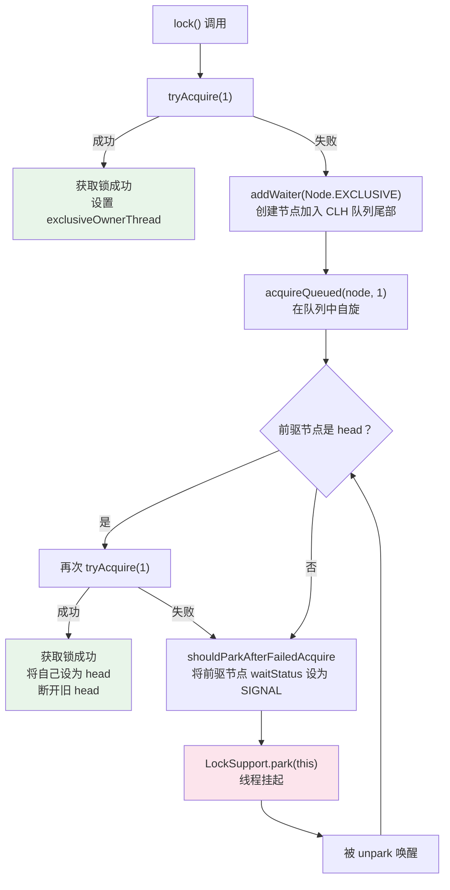

# ReentrantLock 与 AQS 源码分析

## 概念说明

`ReentrantLock` 是 `java.util.concurrent.locks` 包中的可重入互斥锁，基于 **AQS（AbstractQueuedSynchronizer）** 实现。AQS 是 JUC 包的基石，CountDownLatch、Semaphore、ReentrantReadWriteLock 等都基于它实现。

理解 AQS 的核心设计——**state 变量 + CLH 队列 + CAS 操作**，是掌握整个 JUC 包的关键。

## 核心原理

### 一、AQS 核心结构

AQS 维护了一个 `volatile int state` 和一个 **CLH（Craig, Landin, Hagersten）变体双向队列**：

```
AQS 内部结构：
┌─────────────────────────────────────────────┐
│  state: volatile int（锁状态，0=未锁，>0=重入次数）│
│  head ──→ [Node] ←→ [Node] ←→ [Node] ← tail │
│           (哨兵)    (等待线程1)  (等待线程2)      │
└─────────────────────────────────────────────┘

Node 节点关键字段：
- thread: 等待的线程
- waitStatus: 节点状态（SIGNAL=-1, CANCELLED=1, CONDITION=-2）
- prev: 前驱节点
- next: 后继节点
```

### 二、AQS 入队流程（acquire）



### 三、公平锁 vs 非公平锁

| 对比项 | 公平锁 (FairSync) | 非公平锁 (NonfairSync) |
|--------|-------------------|----------------------|
| 获取锁策略 | 先检查队列中是否有等待线程 | 直接 CAS 尝试获取，失败再排队 |
| 吞吐量 | 较低（频繁线程切换） | 较高（减少线程切换） |
| 饥饿问题 | 不会饥饿 | 可能饥饿 |
| 默认选择 | — | ✅ 默认 |

**非公平锁的 lock() 源码关键逻辑**：

```java
// NonfairSync.lock()
final void lock() {
    if (compareAndSetState(0, 1))  // 直接 CAS 抢锁（插队）
        setExclusiveOwnerThread(Thread.currentThread());
    else
        acquire(1);  // 失败则走 AQS 标准流程
}
```

**公平锁的 tryAcquire() 多了一个检查**：

```java
// FairSync.tryAcquire() 关键区别
if (!hasQueuedPredecessors() &&  // 队列中没有等待更久的线程
    compareAndSetState(0, acquires)) {
    setExclusiveOwnerThread(current);
    return true;
}
```

### 四、Condition 条件变量

Condition 是 synchronized 中 wait/notify 的替代品，支持多个等待队列：

```
ReentrantLock 的 Condition 机制：
┌──────────────────────────────────────┐
│  AQS 同步队列（CLH 队列）              │
│  head ←→ [Node1] ←→ [Node2] ← tail  │
└──────────────────────────────────────┘
         ↑ signal()        ↓ await()
┌──────────────────────────────────────┐
│  Condition 等待队列（单向链表）          │
│  firstWaiter → [Node3] → [Node4]    │
└──────────────────────────────────────┘
```

- `await()`：释放锁，将当前线程包装为 Node 加入 Condition 等待队列，挂起线程
- `signal()`：将 Condition 等待队列的第一个节点转移到 AQS 同步队列，等待获取锁

## 代码示例

```java
// 使用 ReentrantLock + Condition 实现生产者消费者
ReentrantLock lock = new ReentrantLock();
Condition notFull = lock.newCondition();
Condition notEmpty = lock.newCondition();

// 生产者
lock.lock();
try {
    while (queue.size() == capacity) {
        notFull.await();  // 队列满，等待
    }
    queue.offer(item);
    notEmpty.signal();    // 通知消费者
} finally {
    lock.unlock();
}
```

> 💻 完整可运行代码：[ReentrantLockDemo.java](../../../code-examples/01-java-core/concurrent-programming/src/main/java/com/example/concurrent/lock/ReentrantLockDemo.java)

## 常见面试题

### Q1: AQS 的核心原理是什么？

**难度**：⭐⭐⭐ | **频率**：🔥🔥🔥

**答题思路**：

1. state 变量 + CLH 队列 + CAS
2. 独占模式和共享模式
3. 模板方法设计模式

**标准答案**：

AQS 的核心是一个 volatile int state 变量和一个 CLH 变体的双向 FIFO 队列。获取锁时，先通过 CAS 尝试修改 state，成功则获取锁；失败则将线程包装为 Node 加入队列尾部，然后通过自旋 + park 等待。释放锁时，修改 state 并唤醒队列中的后继节点。AQS 采用模板方法模式，子类只需实现 tryAcquire/tryRelease 等方法。

**深入追问**：

- CLH 队列和普通队列有什么区别？（CLH 是自旋锁队列，每个节点监视前驱节点的状态）
- AQS 为什么用双向链表？（需要在取消时快速找到前驱节点）
- state 为什么用 volatile？（保证可见性，配合 CAS 保证原子性）

**易错点**：

- AQS 的队列不是纯 CLH 队列，是变体（增加了 next 指针和 park/unpark 机制）

### Q2: 公平锁和非公平锁的区别？为什么默认非公平？

**难度**：⭐⭐⭐ | **频率**：🔥🔥🔥

**答题思路**：

1. 获取锁的策略差异
2. 性能差异
3. 源码层面的区别

**标准答案**：

公平锁在获取锁时会先检查 AQS 队列中是否有等待更久的线程（hasQueuedPredecessors），有则排队；非公平锁直接 CAS 尝试获取，失败才排队。默认非公平是因为非公平锁吞吐量更高——减少了线程切换的开销，刚释放锁的线程再次获取锁的概率更大（CPU 缓存热度高）。

**深入追问**：

- 非公平锁会导致饥饿吗？（理论上会，但实际中很少发生）
- 什么场景需要公平锁？（对响应时间敏感、不允许饥饿的场景）

### Q3: ReentrantLock 的 Condition 和 synchronized 的 wait/notify 有什么区别？

**难度**：⭐⭐ | **频率**：🔥🔥

**答题思路**：

1. 功能对比
2. 使用方式对比

**标准答案**：

Condition 支持多个等待队列（一个锁可以创建多个 Condition），而 wait/notify 只有一个等待队列。Condition 支持不响应中断的等待（awaitUninterruptibly）、带超时的等待。Condition 的 signal() 可以精确唤醒指定队列的线程，而 notify() 是随机唤醒。

**深入追问**：

- Condition 的 await() 内部做了什么？（释放锁、加入条件队列、park）

## 参考资料

- [AQS 源码 - OpenJDK](https://github.com/openjdk/jdk/blob/master/src/java.base/share/classes/java/util/1-java-core/1.3-concurrent/locks/AbstractQueuedSynchronizer.java)
- [The java.util.concurrent Synchronizer Framework - Doug Lea](http://gee.cs.oswego.edu/dl/papers/aqs.pdf)
