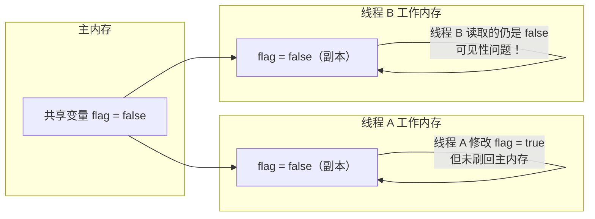
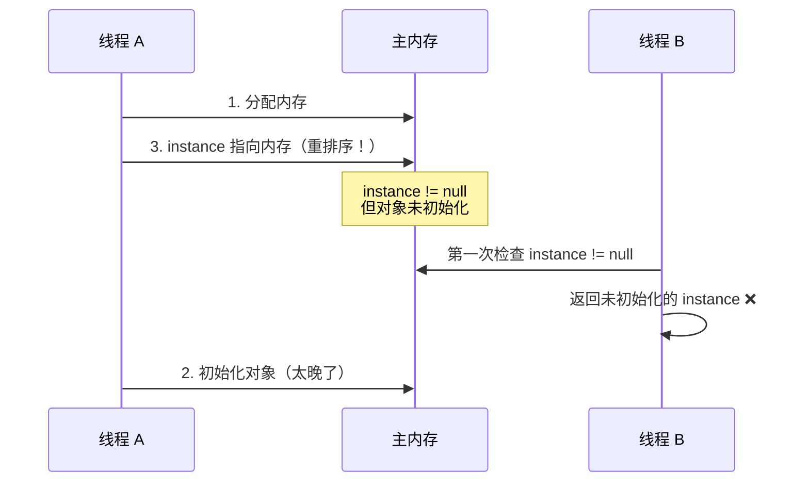

# volatile 原理

## 概念说明

`volatile` 是 Java 中最轻量级的同步机制，它保证了变量的**可见性**和**有序性**（禁止指令重排），但**不保证原子性**。volatile 的底层实现依赖于 CPU 的**内存屏障（Memory Barrier）**指令。

理解 volatile 需要先理解 Java 内存模型（JMM）：每个线程有自己的工作内存（CPU 缓存），共享变量存储在主内存中。

## 核心原理

### 一、JMM 与可见性问题



**volatile 的解决方案**：
- 写 volatile 变量时：立即刷新到主内存
- 读 volatile 变量时：从主内存重新读取

### 二、内存屏障

volatile 通过插入内存屏障来保证可见性和有序性：

| 屏障类型 | 插入位置 | 作用 |
|----------|----------|------|
| StoreStore | volatile 写之前 | 禁止上面的普通写与 volatile 写重排 |
| StoreLoad | volatile 写之后 | 禁止 volatile 写与下面的读/写重排（最重的屏障） |
| LoadLoad | volatile 读之后 | 禁止 volatile 读与下面的普通读重排 |
| LoadStore | volatile 读之后 | 禁止 volatile 读与下面的普通写重排 |

```
volatile 写操作的屏障插入：
    普通读/写操作
    ─── StoreStore 屏障 ───
    volatile 写
    ─── StoreLoad 屏障 ───
    后续读/写操作

volatile 读操作的屏障插入：
    volatile 读
    ─── LoadLoad 屏障 ───
    ─── LoadStore 屏障 ───
    后续读/写操作
```

### 三、DCL 单例中 volatile 的作用

双重检查锁定（Double-Checked Locking）单例模式是 volatile 最经典的应用场景：

```java
public class Singleton {
    // 必须加 volatile！
    private static volatile Singleton instance;

    public static Singleton getInstance() {
        if (instance == null) {              // 第一次检查（无锁）
            synchronized (Singleton.class) {
                if (instance == null) {      // 第二次检查（有锁）
                    instance = new Singleton(); // 问题所在！
                }
            }
        }
        return instance;
    }
}
```

**为什么必须加 volatile？**

`instance = new Singleton()` 这行代码实际上分三步：
1. 分配内存空间
2. 初始化对象
3. 将 instance 指向分配的内存

如果不加 volatile，JVM 可能将步骤 2 和 3 重排序为 1→3→2。此时另一个线程在第一次检查时看到 instance 不为 null，但对象尚未初始化完成，使用时会出错。



### 四、volatile vs synchronized

| 对比项 | volatile | synchronized |
|--------|----------|-------------|
| 可见性 | ✅ 保证 | ✅ 保证 |
| 原子性 | ❌ 不保证 | ✅ 保证 |
| 有序性 | ✅ 禁止重排 | ✅ 保证 |
| 阻塞 | 不会阻塞 | 会阻塞 |
| 性能 | 较高 | 较低 |
| 适用场景 | 状态标志、DCL | 复合操作 |

## 代码示例

```java
// 可见性问题演示
private static volatile boolean running = true;

// 线程 A
new Thread(() -> {
    while (running) {
        // 如果不加 volatile，这个循环可能永远不会停止
    }
    System.out.println("线程停止");
}).start();

// 线程 B
Thread.sleep(1000);
running = false; // 加了 volatile，线程 A 能立即看到变化
```

> 💻 完整可运行代码：[VolatileDemo.java](../../../code-examples/01-java-core/concurrent-programming/src/main/java/com/example/concurrent/04-volatile_demo/VolatileDemo.java)

## 常见面试题

### Q1: volatile 的作用是什么？它能保证原子性吗？

**难度**：⭐⭐⭐ | **频率**：🔥🔥🔥

**答题思路**：

1. 两个作用：可见性 + 有序性
2. 不保证原子性，举例说明
3. 底层实现：内存屏障

**标准答案**：

volatile 保证可见性（一个线程修改后其他线程立即可见）和有序性（禁止指令重排序），但不保证原子性。例如 `volatile int count; count++` 不是线程安全的，因为 count++ 是读-改-写三步操作。volatile 的底层通过 CPU 内存屏障指令实现，写操作后插入 StoreLoad 屏障，读操作后插入 LoadLoad 和 LoadStore 屏障。

**深入追问**：

- volatile 的内存屏障具体是什么？（StoreStore、StoreLoad、LoadLoad、LoadStore）
- 为什么 volatile 不能保证原子性？（只保证单次读/写的原子性，不保证复合操作）
- volatile 的 happens-before 规则？（volatile 写 happens-before 后续的 volatile 读）

**易错点**：

- volatile 只能保证单个变量的读/写原子性（long/double 在 32 位 JVM 上的原子性）
- volatile 不能替代 synchronized

### Q2: DCL 单例为什么要加 volatile？

**难度**：⭐⭐⭐ | **频率**：🔥🔥🔥

**答题思路**：

1. 对象创建的三个步骤
2. 指令重排序的问题
3. volatile 禁止重排序

**标准答案**：

`new Singleton()` 分三步：分配内存、初始化对象、赋值引用。JVM 可能将后两步重排序，导致其他线程看到一个未初始化完成的对象。volatile 通过内存屏障禁止这种重排序，确保对象完全初始化后才对其他线程可见。

**深入追问**：

- 除了 volatile DCL，还有哪些线程安全的单例实现？（静态内部类、枚举）
- 静态内部类单例为什么是线程安全的？（类加载机制保证）

### Q3: volatile 和 synchronized 的区别？

**难度**：⭐⭐ | **频率**：🔥🔥

**标准答案**：

volatile 是轻量级同步，只保证可见性和有序性，不保证原子性，不会阻塞线程；synchronized 是重量级同步，三者都保证，会阻塞线程。volatile 适用于状态标志等简单场景，synchronized 适用于复合操作。volatile 的性能优于 synchronized。

## 参考资料

- [JSR 133: Java Memory Model and Thread Specification](https://jcp.org/en/jsr/detail?id=133)
- [Java Memory Model - Doug Lea](http://gee.cs.oswego.edu/dl/jmm/cookbook.html)
