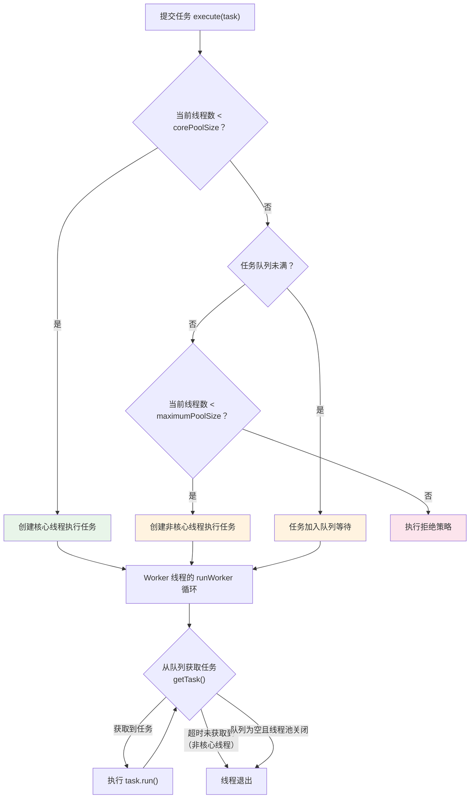

# 线程池原理

## 概念说明

线程池是并发编程中最重要的工具之一。它通过复用线程来避免频繁创建和销毁线程的开销，同时提供了任务队列、拒绝策略等机制来管理并发任务。

**为什么要用线程池？**
1. **降低资源消耗**：复用已创建的线程，减少线程创建/销毁的开销
2. **提高响应速度**：任务到达时无需等待线程创建
3. **提高可管理性**：统一管理线程，避免无限制创建线程导致 OOM

> ⚠️ **阿里巴巴开发手册**：线程池不允许使用 Executors 创建，而是通过 ThreadPoolExecutor 的方式，这样可以更加明确线程池的运行规则，避免资源耗尽的风险。

## 核心原理

### 一、7 个核心参数

```java
public ThreadPoolExecutor(
    int corePoolSize,        // 核心线程数（即使空闲也不会回收）
    int maximumPoolSize,     // 最大线程数
    long keepAliveTime,      // 非核心线程的空闲存活时间
    TimeUnit unit,           // 存活时间单位
    BlockingQueue<Runnable> workQueue,  // 任务队列
    ThreadFactory threadFactory,        // 线程工厂
    RejectedExecutionHandler handler    // 拒绝策略
)
```

| 参数 | 说明 | 建议值 |
|------|------|--------|
| corePoolSize | 核心线程数 | CPU 密集型：N+1；IO 密集型：2N |
| maximumPoolSize | 最大线程数 | 根据业务压测确定 |
| keepAliveTime | 非核心线程空闲存活时间 | 60s |
| workQueue | 任务队列 | LinkedBlockingQueue（有界！） |
| threadFactory | 线程工厂 | 自定义，设置有意义的线程名 |
| handler | 拒绝策略 | 根据业务选择 |

### 二、execute 执行流程



**关键源码 — Worker 的 runWorker 循环**：

```java
// ThreadPoolExecutor.Worker.runWorker() 简化版
final void runWorker(Worker w) {
    Runnable task = w.firstTask;
    w.firstTask = null;
    while (task != null || (task = getTask()) != null) {
        w.lock();
        try {
            beforeExecute(w.thread, task);  // 钩子方法
            task.run();                      // 执行任务
            afterExecute(task, null);        // 钩子方法
        } finally {
            task = null;
            w.completedTasks++;
            w.unlock();
        }
    }
    processWorkerExit(w, false);  // 线程退出处理
}
```

### 三、4 种拒绝策略

| 策略 | 行为 | 适用场景 |
|------|------|----------|
| AbortPolicy（默认） | 抛出 RejectedExecutionException | 关键业务，不允许丢弃任务 |
| CallerRunsPolicy | 由提交任务的线程执行 | 不允许丢弃，可接受降速 |
| DiscardPolicy | 静默丢弃任务 | 允许丢弃的非关键任务 |
| DiscardOldestPolicy | 丢弃队列中最老的任务 | 允许丢弃旧任务 |

> 💡 **生产实践**：通常自定义拒绝策略，记录日志 + 持久化到数据库/MQ + 告警通知。

### 四、动态调参

ThreadPoolExecutor 支持运行时动态调整参数：

```java
executor.setCorePoolSize(newCoreSize);      // 动态调整核心线程数
executor.setMaximumPoolSize(newMaxSize);     // 动态调整最大线程数
executor.setKeepAliveTime(time, unit);       // 动态调整空闲时间
```

**动态调参的实现原理**：
- 增大 corePoolSize：如果当前线程数小于新值，会立即创建新线程
- 减小 corePoolSize：多余的核心线程在下次空闲时被回收
- 配合配置中心（Apollo/Nacos）实现线上动态调参

### 五、线程池监控

```java
// 关键监控指标
executor.getPoolSize();          // 当前线程数
executor.getActiveCount();       // 活跃线程数
executor.getQueue().size();      // 队列中等待的任务数
executor.getCompletedTaskCount();// 已完成的任务数
executor.getLargestPoolSize();   // 历史最大线程数
executor.getTaskCount();         // 总任务数
```

### 六、Executors 工厂方法的坑

| 方法 | 问题 |
|------|------|
| `newFixedThreadPool` | LinkedBlockingQueue 无界，可能 OOM |
| `newSingleThreadExecutor` | LinkedBlockingQueue 无界，可能 OOM |
| `newCachedThreadPool` | maximumPoolSize = Integer.MAX_VALUE，可能创建大量线程 |
| `newScheduledThreadPool` | DelayedWorkQueue 无界，可能 OOM |

## 代码示例

```java
// 推荐的线程池创建方式
ThreadPoolExecutor executor = new ThreadPoolExecutor(
    4,                                    // 核心线程数
    8,                                    // 最大线程数
    60, TimeUnit.SECONDS,                 // 空闲存活时间
    new LinkedBlockingQueue<>(1000),      // 有界队列！
    new ThreadFactory() {                 // 自定义线程工厂
        private final AtomicInteger counter = new AtomicInteger(1);
        @Override
        public Thread newThread(Runnable r) {
            Thread t = new Thread(r, "biz-pool-" + counter.getAndIncrement());
            t.setDaemon(false);
            return t;
        }
    },
    new ThreadPoolExecutor.CallerRunsPolicy()  // 拒绝策略
);
```

> 💻 完整可运行代码：[ThreadPoolDemo.java](https://github.com/skyhe58/guide-java/tree/main/code-examples/01-java-core/concurrent-programming/src/main/java/com/example/concurrent/threadpool/ThreadPoolDemo.java)
> <!-- 本地路径：code-examples/01-java-core/concurrent-programming/src/main/java/com/example/concurrent/threadpool/ThreadPoolDemo.java -->

## 常见面试题

### Q1: 线程池的核心参数有哪些？execute 的执行流程？

**难度**：⭐⭐⭐ | **频率**：🔥🔥🔥

**答题思路**：

1. 7 个参数逐一说明
2. execute 三步判断流程
3. Worker 的 runWorker 循环

**标准答案**：

7 个核心参数：corePoolSize（核心线程数）、maximumPoolSize（最大线程数）、keepAliveTime（空闲存活时间）、unit（时间单位）、workQueue（任务队列）、threadFactory（线程工厂）、handler（拒绝策略）。execute 流程：先判断核心线程数是否已满，未满则创建核心线程；已满则尝试加入队列；队列满则创建非核心线程；超过最大线程数则执行拒绝策略。Worker 线程通过 runWorker 循环不断从队列获取任务执行。

**深入追问**：

- 核心线程数怎么设置？（CPU 密集型 N+1，IO 密集型 2N，最终靠压测）
- Worker 线程是如何复用的？（runWorker 中的 while 循环 + getTask() 从队列取任务）
- 线程池的 shutdown() 和 shutdownNow() 区别？（前者等待任务完成，后者中断所有线程）

**易错点**：

- 不是先放队列再创建非核心线程，而是队列满了才创建非核心线程

### Q2: 为什么不推荐使用 Executors 创建线程池？

**难度**：⭐⭐ | **频率**：🔥🔥🔥

**标准答案**：

Executors 创建的线程池存在 OOM 风险：newFixedThreadPool 和 newSingleThreadExecutor 使用无界的 LinkedBlockingQueue，任务堆积可能导致 OOM；newCachedThreadPool 的 maximumPoolSize 为 Integer.MAX_VALUE，可能创建大量线程导致 OOM。应该通过 ThreadPoolExecutor 手动创建，明确指定有界队列和合理的最大线程数。

### Q3: 线程池如何实现动态调参？

**难度**：⭐⭐⭐ | **频率**：🔥🔥

**标准答案**：

ThreadPoolExecutor 提供了 setCorePoolSize()、setMaximumPoolSize() 等方法支持运行时动态调整。配合配置中心（如 Apollo、Nacos），监听配置变更事件，实时调整线程池参数。增大核心线程数时会立即创建新线程，减小时多余线程在空闲后被回收。生产中还需要配合监控（线程数、队列大小、拒绝次数）来指导调参。

## 参考资料

- [ThreadPoolExecutor - JDK 21 API](https://docs.oracle.com/en/java/javase/21/docs/api/java.base/java/util/1-java-core/1.3-concurrent/ThreadPoolExecutor.html)
- [Java 线程池实现原理及其在美团业务中的实践](https://tech.meituan.com/2020/04/02/java-pooling-pratice-in-meituan.html)
