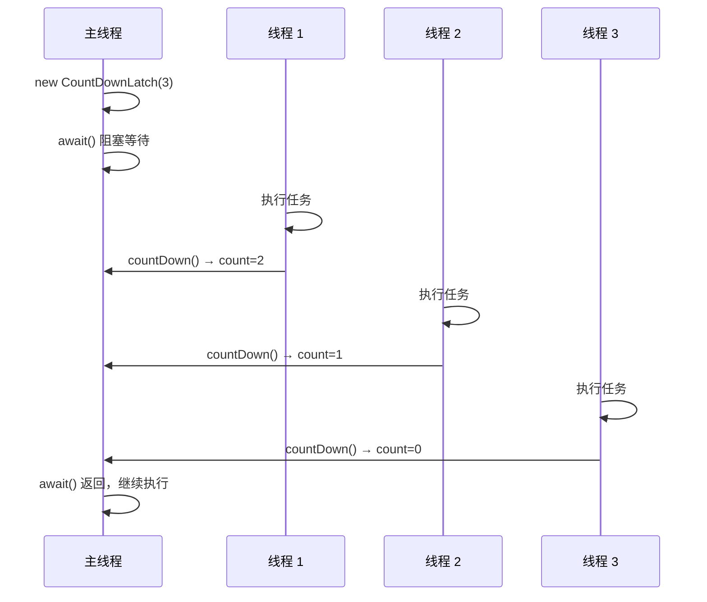
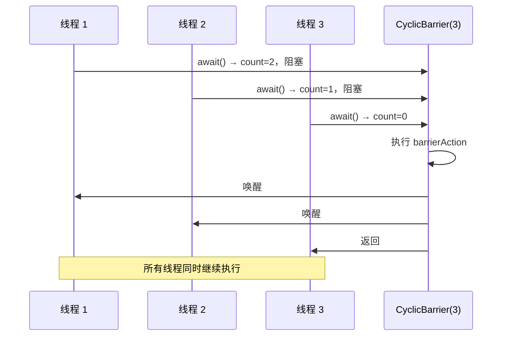

# 并发工具类

## 概念说明

JUC 包提供了一组强大的并发工具类，用于协调多个线程之间的执行顺序。它们都基于 AQS 实现，但各自解决不同的协调场景。

## 核心原理

### 一、五大工具类对比

| 工具类 | 作用 | 是否可重用 | 基于 AQS 模式 | 典型场景 |
|--------|------|-----------|--------------|----------|
| CountDownLatch | 等待 N 个事件完成 | ❌ 一次性 | 共享模式 | 主线程等待多个子任务完成 |
| CyclicBarrier | N 个线程互相等待到达屏障点 | ✅ 可重用 | ReentrantLock + Condition | 多线程分阶段并行计算 |
| Semaphore | 控制同时访问资源的线程数 | ✅ 可重用 | 共享模式 | 限流、连接池 |
| Phaser | 可动态注册的分阶段屏障 | ✅ 可重用 | 自实现 | 复杂的多阶段并行任务 |
| Exchanger | 两个线程交换数据 | ✅ 可重用 | 自实现 | 生产者-消费者变体 |

### 二、CountDownLatch

**原理**：内部维护一个 AQS state 计数器，`countDown()` 将 state 减 1，`await()` 阻塞直到 state 变为 0。



### 三、CyclicBarrier

**原理**：基于 ReentrantLock + Condition 实现。每个线程调用 `await()` 时计数器减 1，当计数器为 0 时唤醒所有等待线程，并重置计数器（可循环使用）。



### 四、CountDownLatch vs CyclicBarrier

| 对比项 | CountDownLatch | CyclicBarrier |
|--------|---------------|---------------|
| 计数方式 | 递减到 0 | 递减到 0 后重置 |
| 是否可重用 | 不可重用 | 可重用（reset） |
| 等待方 | 一个或多个线程等待其他线程 | 所有线程互相等待 |
| 回调 | 无 | 支持 barrierAction |
| 异常处理 | 无特殊处理 | 一个线程异常，其他线程收到 BrokenBarrierException |

### 五、Semaphore

**原理**：基于 AQS 共享模式，state 表示可用许可数。`acquire()` 减少许可，`release()` 增加许可。

```java
// 限流场景：同时最多 3 个线程访问
Semaphore semaphore = new Semaphore(3);

semaphore.acquire();    // 获取许可（state - 1）
try {
    // 访问共享资源
} finally {
    semaphore.release(); // 释放许可（state + 1）
}
```

## 代码示例

```java
// CountDownLatch：模拟多个微服务健康检查
CountDownLatch latch = new CountDownLatch(3);

executor.submit(() -> { checkService("用户服务"); latch.countDown(); });
executor.submit(() -> { checkService("订单服务"); latch.countDown(); });
executor.submit(() -> { checkService("支付服务"); latch.countDown(); });

latch.await(10, TimeUnit.SECONDS); // 等待所有服务检查完成
System.out.println("所有服务健康检查完成");
```

> 💻 完整可运行代码：[ConcurrentToolsDemo.java](https://github.com/skyhe58/guide-java/tree/main/code-examples/01-java-core/concurrent-programming/src/main/java/com/example/concurrent/tools/ConcurrentToolsDemo.java)
> <!-- 本地路径：code-examples/01-java-core/concurrent-programming/src/main/java/com/example/concurrent/tools/ConcurrentToolsDemo.java -->

## 常见面试题

### Q1: CountDownLatch 和 CyclicBarrier 的区别？

**难度**：⭐⭐ | **频率**：🔥🔥🔥

**标准答案**：

CountDownLatch 是一次性的，计数到 0 后不能重置，适用于一个线程等待多个线程完成；CyclicBarrier 是可循环使用的，适用于多个线程互相等待到达同一个屏障点后再一起继续。CountDownLatch 基于 AQS 共享模式，CyclicBarrier 基于 ReentrantLock + Condition。

**深入追问**：

- CountDownLatch 能不能实现 CyclicBarrier 的功能？（不能直接实现循环等待）
- CyclicBarrier 的 barrierAction 在哪个线程执行？（最后一个到达屏障的线程）

### Q2: Semaphore 的使用场景？

**难度**：⭐⭐ | **频率**：🔥🔥

**标准答案**：

Semaphore 用于控制同时访问某个资源的线程数量，常见场景：数据库连接池限流、接口限流、停车场车位管理。它基于 AQS 共享模式实现，支持公平和非公平两种模式。

### Q3: 如何实现让多个线程同时开始执行？

**难度**：⭐⭐ | **频率**：🔥🔥

**标准答案**：

可以使用 CountDownLatch(1)，所有线程先 await()，主线程 countDown() 后所有线程同时开始。也可以使用 CyclicBarrier(N)，所有线程 await() 后同时开始。

## 参考资料

- [java.util.concurrent - JDK 21 API](https://docs.oracle.com/en/java/javase/21/docs/api/java.base/java/util/1-java-core/1.3-concurrent/package-summary.html)
