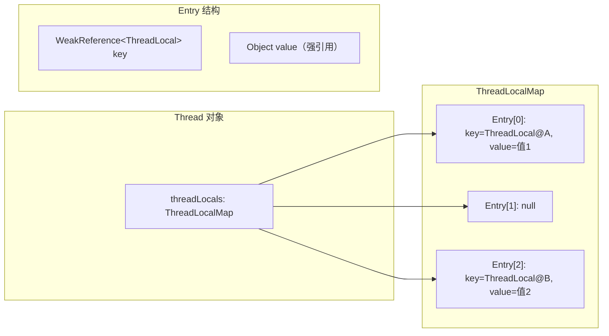
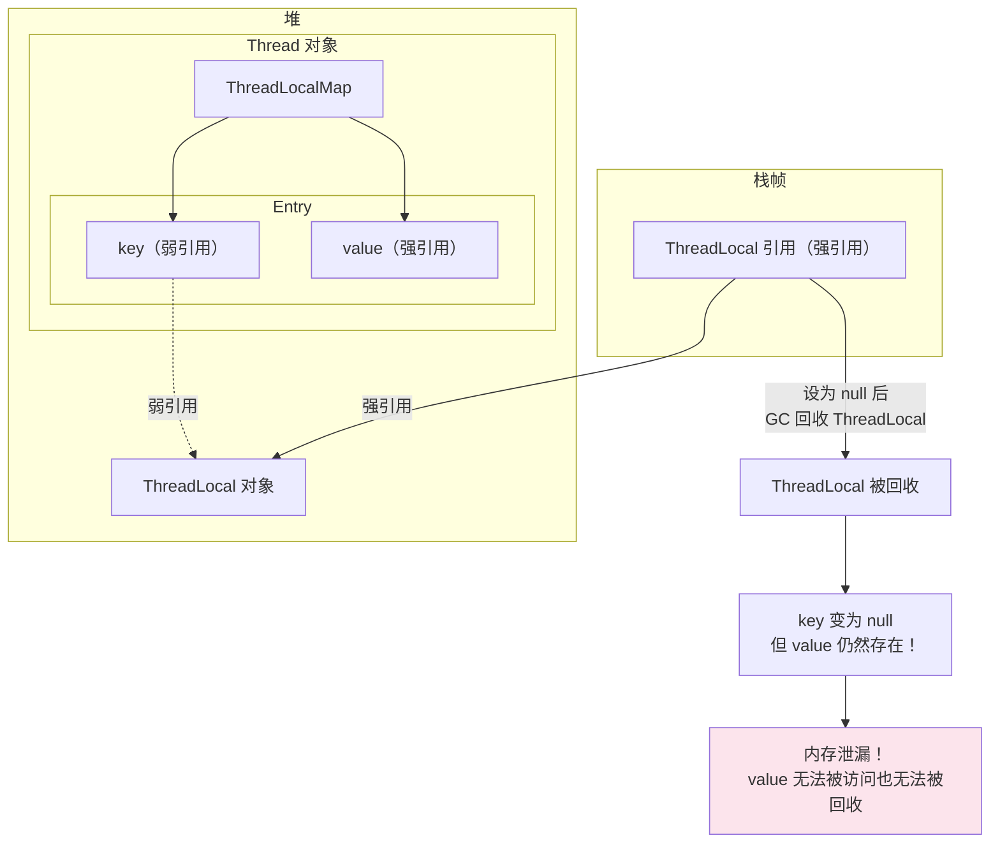

# ThreadLocal 原理

## 概念说明

ThreadLocal 提供了线程局部变量，每个线程都有自己独立的变量副本，互不干扰。它是一种以空间换时间的并发策略——避免了同步的开销，但每个线程都需要存储一份副本。

常见使用场景：数据库连接管理、用户会话信息传递、日期格式化（SimpleDateFormat 线程不安全）、Spring 的事务管理。

## 核心原理

### 一、ThreadLocal 内部结构



**关键设计**：
- 每个 Thread 对象内部持有一个 `ThreadLocal.ThreadLocalMap`
- ThreadLocalMap 是一个自定义的哈希表，使用**开放地址法**（线性探测）解决冲突
- Entry 的 key 是 ThreadLocal 的**弱引用**，value 是强引用

### 二、弱引用 Key 与内存泄漏



**内存泄漏的原因**：

1. ThreadLocal 引用被设为 null
2. GC 回收 ThreadLocal 对象（因为 Entry 的 key 是弱引用）
3. Entry 的 key 变为 null，但 value 仍然被 Entry 强引用
4. 如果线程长期存活（如线程池中的线程），这些 value 永远无法被回收

**解决方案**：

```java
// 使用完毕后必须调用 remove()
ThreadLocal<User> userContext = new ThreadLocal<>();
try {
    userContext.set(currentUser);
    // 业务逻辑
} finally {
    userContext.remove();  // 必须！防止内存泄漏
}
```

### 三、ThreadLocal 的自清理机制

ThreadLocalMap 在 `get()`、`set()`、`remove()` 操作时会顺带清理 key 为 null 的 Entry（expungeStaleEntry），但这不能完全避免内存泄漏，因为如果不再调用这些方法，过期 Entry 就不会被清理。

### 四、InheritableThreadLocal

普通 ThreadLocal 在父线程中设置的值，子线程无法获取。`InheritableThreadLocal` 解决了这个问题：

```java
InheritableThreadLocal<String> itl = new InheritableThreadLocal<>();
itl.set("父线程的值");

new Thread(() -> {
    System.out.println(itl.get()); // 能获取到 "父线程的值"
}).start();
```

**原理**：Thread 创建时，如果父线程的 `inheritableThreadLocals` 不为 null，会将其复制到子线程。

> ⚠️ **注意**：InheritableThreadLocal 在线程池场景下会失效，因为线程池复用线程，不会每次都创建新线程。解决方案：使用阿里的 [TransmittableThreadLocal](https://github.com/alibaba/transmittable-thread-local)。

## 代码示例

```java
// 典型用法：用户上下文传递
public class UserContext {
    private static final ThreadLocal<User> CURRENT_USER = new ThreadLocal<>();

    public static void set(User user) {
        CURRENT_USER.set(user);
    }

    public static User get() {
        return CURRENT_USER.get();
    }

    public static void clear() {
        CURRENT_USER.remove();
    }
}
```

> 💻 完整可运行代码：[ThreadLocalDemo.java](https://github.com/skyhe58/guide-java/tree/main/code-examples/01-java-core/concurrent-programming/src/main/java/com/example/concurrent/07-threadlocal/ThreadLocalDemo.java)
> <!-- 本地路径：code-examples/01-java-core/concurrent-programming/src/main/java/com/example/concurrent/07-threadlocal/ThreadLocalDemo.java -->

## 常见面试题

### Q1: ThreadLocal 的内存泄漏是怎么回事？如何避免？

**难度**：⭐⭐⭐ | **频率**：🔥🔥🔥

**答题思路**：

1. Entry 的 key 是弱引用，value 是强引用
2. ThreadLocal 被回收后 key 为 null，value 无法回收
3. 线程池场景下尤其严重

**标准答案**：

ThreadLocalMap 的 Entry 继承了 WeakReference，key 是 ThreadLocal 的弱引用。当 ThreadLocal 没有外部强引用时，GC 会回收它，导致 key 为 null，但 value 仍被 Entry 强引用无法回收。在线程池场景下，线程长期存活，这些无法回收的 value 会越积越多，造成内存泄漏。解决方案：使用完毕后在 finally 块中调用 remove()。

**深入追问**：

- 为什么 key 要用弱引用？（如果用强引用，即使 ThreadLocal 不再使用，也无法被 GC 回收）
- ThreadLocalMap 有自清理机制吗？（有，get/set/remove 时会清理 stale entry，但不够及时）

### Q2: ThreadLocal 和 synchronized 的区别？

**难度**：⭐⭐ | **频率**：🔥🔥

**标准答案**：

ThreadLocal 是空间换时间，每个线程一份副本，无需同步；synchronized 是时间换空间，多个线程共享一份数据，通过锁保证安全。ThreadLocal 适用于线程间数据隔离的场景，synchronized 适用于线程间数据共享的场景。

### Q3: InheritableThreadLocal 在线程池中为什么会失效？

**难度**：⭐⭐⭐ | **频率**：🔥🔥

**标准答案**：

InheritableThreadLocal 只在创建子线程时复制父线程的值。线程池中的线程是复用的，不会每次都创建新线程，所以后续提交的任务获取到的是线程池中线程之前的值，而不是当前提交任务的线程的值。解决方案是使用阿里的 TransmittableThreadLocal（TTL）。

## 参考资料

- [ThreadLocal - JDK 21 API](https://docs.oracle.com/en/java/javase/21/docs/api/java.base/java/lang/ThreadLocal.html)
- [TransmittableThreadLocal - Alibaba](https://github.com/alibaba/transmittable-thread-local)
