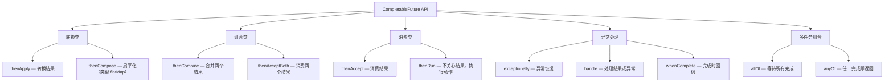
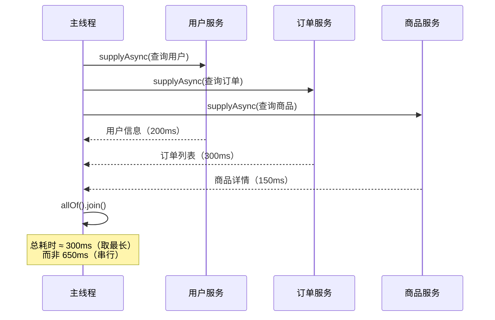

# CompletableFuture 异步编程

## 概念说明

`CompletableFuture` 是 JDK 8 引入的异步编程工具，它实现了 `Future` 和 `CompletionStage` 接口，支持链式调用、组合多个异步任务、异常处理等功能。相比传统的 Future，CompletableFuture 不需要阻塞等待结果，可以通过回调方式处理。

## 核心原理

### 一、创建异步任务

| 方法 | 返回值 | 线程池 |
|------|--------|--------|
| `supplyAsync(Supplier)` | 有返回值 | ForkJoinPool.commonPool() |
| `supplyAsync(Supplier, Executor)` | 有返回值 | 自定义线程池 |
| `runAsync(Runnable)` | 无返回值 | ForkJoinPool.commonPool() |
| `runAsync(Runnable, Executor)` | 无返回值 | 自定义线程池 |

> ⚠️ **生产建议**：不要使用默认的 ForkJoinPool.commonPool()，应该传入自定义线程池，便于监控和隔离。

### 二、核心 API 分类



### 三、thenApply vs thenCompose

```java
// thenApply：同步转换，类似 Stream.map()
CompletableFuture<String> future = CompletableFuture
    .supplyAsync(() -> getUserId())
    .thenApply(id -> "User-" + id);  // 返回 CompletableFuture<String>

// thenCompose：异步转换，类似 Stream.flatMap()
CompletableFuture<User> future = CompletableFuture
    .supplyAsync(() -> getUserId())
    .thenCompose(id -> queryUserAsync(id));  // 返回 CompletableFuture<User>
```

### 四、异常处理

```java
CompletableFuture<String> future = CompletableFuture
    .supplyAsync(() -> {
        if (error) throw new RuntimeException("出错了");
        return "success";
    })
    .exceptionally(ex -> "默认值")        // 异常时返回默认值
    .handle((result, ex) -> {             // 统一处理结果和异常
        if (ex != null) return "error";
        return result;
    })
    .whenComplete((result, ex) -> {       // 完成时回调（不改变结果）
        log.info("完成: result={}, error={}", result, ex);
    });
```

### 五、实战场景：多接口并行调用



## 代码示例

```java
// 多任务并行 + 结果合并
ExecutorService executor = Executors.newFixedThreadPool(3);

CompletableFuture<User> userFuture = CompletableFuture
    .supplyAsync(() -> userService.getUser(userId), executor);
CompletableFuture<List<Order>> orderFuture = CompletableFuture
    .supplyAsync(() -> orderService.getOrders(userId), executor);

CompletableFuture<UserDetail> result = userFuture
    .thenCombine(orderFuture, (user, orders) -> new UserDetail(user, orders));
```

> 💻 完整可运行代码：[CompletableFutureDemo.java](../../../code-examples/01-java-core/concurrent-programming/src/main/java/com/example/concurrent/future/CompletableFutureDemo.java)

## 常见面试题

### Q1: CompletableFuture 和 Future 的区别？

**难度**：⭐⭐ | **频率**：🔥🔥

**标准答案**：

Future 只能通过 get() 阻塞获取结果或 isDone() 轮询，不支持回调和链式调用。CompletableFuture 支持链式调用（thenApply/thenCompose）、多任务组合（allOf/anyOf）、异常处理（exceptionally/handle）、回调通知（whenComplete），是真正的异步编程工具。

**深入追问**：

- CompletableFuture 默认使用什么线程池？（ForkJoinPool.commonPool()）
- 为什么生产环境不建议用默认线程池？（共享线程池，可能被其他任务影响）

### Q2: thenApply 和 thenCompose 的区别？

**难度**：⭐⭐ | **频率**：🔥🔥

**标准答案**：

thenApply 接收一个同步函数，将结果转换为另一个值，类似 Stream 的 map()；thenCompose 接收一个返回 CompletableFuture 的函数，将结果扁平化，类似 Stream 的 flatMap()。如果转换函数本身是异步的，应该用 thenCompose 避免嵌套。

### Q3: CompletableFuture 如何处理异常？

**难度**：⭐⭐ | **频率**：🔥🔥

**标准答案**：

三种方式：exceptionally() 只处理异常，返回默认值；handle() 同时处理正常结果和异常；whenComplete() 完成时回调，不改变结果。推荐使用 handle() 统一处理，或者 exceptionally() 做异常兜底。

## 参考资料

- [CompletableFuture - JDK 21 API](https://docs.oracle.com/en/java/javase/21/docs/api/java.base/java/util/1-java-core/1.3-concurrent/CompletableFuture.html)
