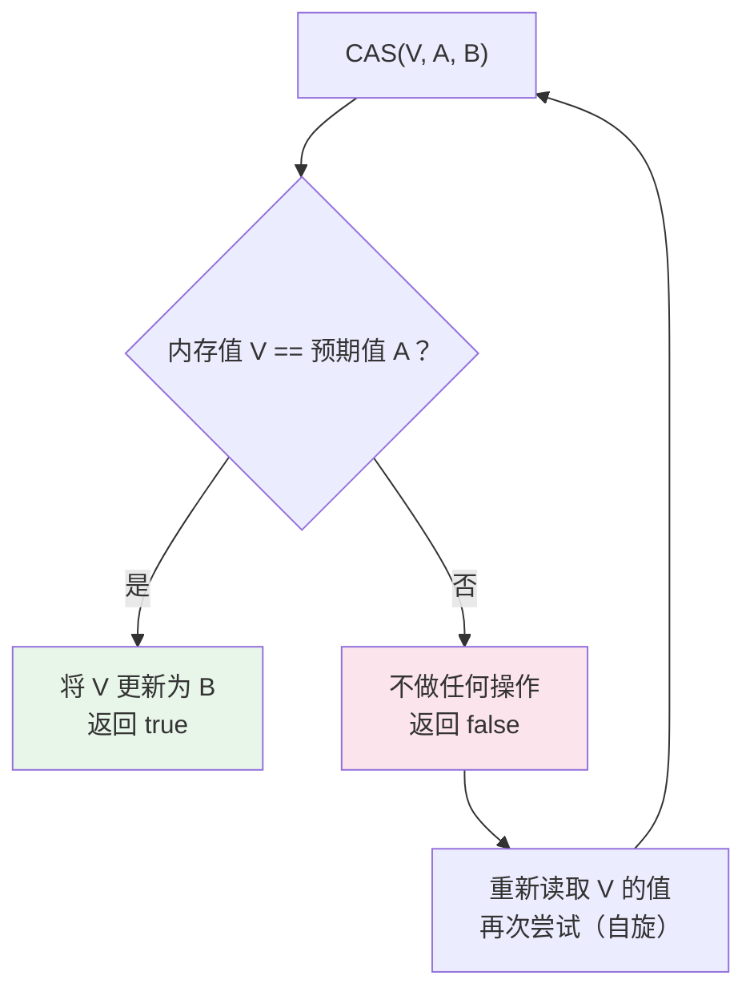
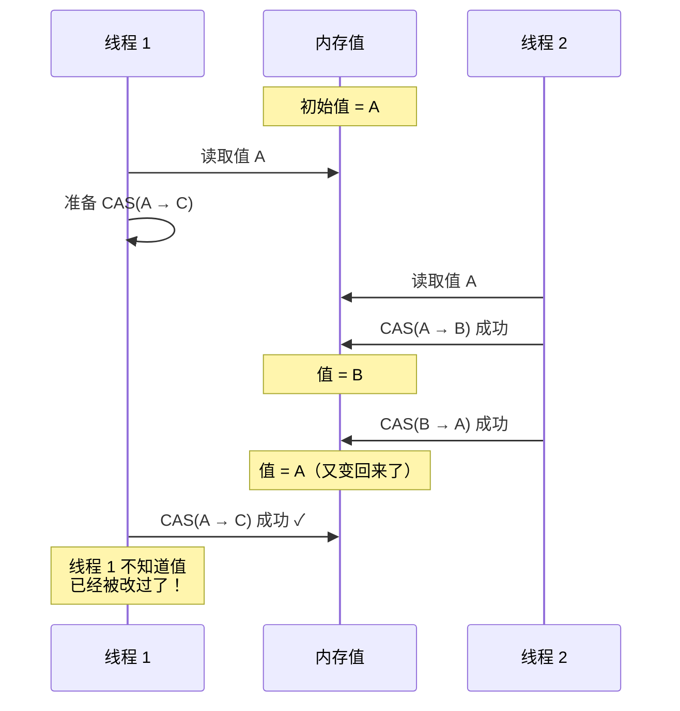

# CAS 与原子类

## 概念说明

CAS（Compare And Swap，比较并交换）是一种无锁的原子操作，是整个 JUC 包的基石。AQS、原子类、ConcurrentHashMap 等都依赖 CAS 实现。CAS 操作包含三个操作数：内存位置（V）、预期值（A）、新值（B）。只有当 V 的值等于 A 时，才将 V 更新为 B，否则不做任何操作。

## 核心原理

### 一、CAS 原理



**底层实现**：
- Java 层面：通过 `Unsafe` 类的 `compareAndSwapInt/Long/Object` 方法
- JVM 层面：调用 CPU 的原子指令（x86 的 `CMPXCHG` 指令 + `LOCK` 前缀）
- 硬件层面：通过总线锁或缓存锁保证原子性

### 二、ABA 问题



**ABA 问题的解决方案**：

| 方案 | 类 | 原理 |
|------|-----|------|
| 版本号 | `AtomicStampedReference` | 每次修改递增版本号，CAS 同时比较值和版本号 |
| 标记位 | `AtomicMarkableReference` | 用 boolean 标记是否被修改过 |

### 三、原子类家族

| 分类 | 类 | 说明 |
|------|-----|------|
| 基本类型 | AtomicInteger / AtomicLong / AtomicBoolean | 基本类型的原子操作 |
| 引用类型 | AtomicReference / AtomicStampedReference | 引用类型的原子操作 |
| 数组类型 | AtomicIntegerArray / AtomicLongArray | 数组元素的原子操作 |
| 字段更新器 | AtomicIntegerFieldUpdater | 对象字段的原子更新 |
| 累加器 | LongAdder / LongAccumulator | 高并发累加（JDK 8+） |

### 四、LongAdder vs AtomicLong

**AtomicLong 的问题**：高并发下，多个线程同时 CAS 同一个变量，大量线程自旋失败，性能下降。

**LongAdder 的解决方案**：分散热点，将一个变量拆分为多个 Cell，不同线程操作不同的 Cell，最后汇总。

```
AtomicLong：所有线程竞争同一个 value
┌─────────────────────────┐
│  value = 100             │ ← 所有线程 CAS 竞争
└─────────────────────────┘

LongAdder：分散到多个 Cell
┌──────┐ ┌──────┐ ┌──────┐ ┌──────┐
│base=0│ │Cell=30│ │Cell=40│ │Cell=30│
└──────┘ └──────┘ └──────┘ └──────┘
sum() = base + Cell[0] + Cell[1] + Cell[2] = 100
```

**Striped64 核心设计**：
- `base`：基础值，低竞争时直接 CAS 更新 base
- `Cell[]`：Cell 数组，高竞争时分散到不同 Cell
- Cell 使用 `@Contended` 注解避免伪共享（False Sharing）

| 对比项 | AtomicLong | LongAdder |
|--------|-----------|-----------|
| 实现 | 单个 volatile long | base + Cell[] |
| 高并发写性能 | 较差（CAS 竞争） | 优秀（分散热点） |
| 读取精确性 | 精确 | 最终一致（sum 时可能有并发写入） |
| 适用场景 | 需要精确值 | 统计计数（如 QPS 统计） |

## 代码示例

```java
// CAS 自旋实现
AtomicInteger count = new AtomicInteger(0);
int expected, newValue;
do {
    expected = count.get();
    newValue = expected + 1;
} while (!count.compareAndSet(expected, newValue));

// ABA 问题解决
AtomicStampedReference<Integer> ref = new AtomicStampedReference<>(1, 0);
int stamp = ref.getStamp();
ref.compareAndSet(1, 2, stamp, stamp + 1);

// LongAdder 高性能计数
LongAdder adder = new LongAdder();
adder.increment();
long total = adder.sum();
```

> 💻 完整可运行代码：[CASDemo.java](../../../code-examples/01-java-core/concurrent-programming/src/main/java/com/example/concurrent/cas/CASDemo.java)

## 常见面试题

### Q1: CAS 的原理是什么？有什么问题？

**难度**：⭐⭐⭐ | **频率**：🔥🔥🔥

**标准答案**：

CAS 是比较并交换，包含三个操作数：内存值 V、预期值 A、新值 B。只有 V==A 时才更新为 B。底层通过 CPU 的 CMPXCHG 原子指令实现。三个问题：ABA 问题（用 AtomicStampedReference 解决）、自旋开销大（高竞争时用 LongAdder）、只能保证一个变量的原子操作（多变量用锁或 AtomicReference 包装）。

**深入追问**：

- CAS 底层是怎么保证原子性的？（CPU 的 LOCK 前缀 + CMPXCHG 指令）
- ABA 问题在什么场景下会出问题？（链表操作、内存回收复用）

### Q2: LongAdder 为什么比 AtomicLong 快？

**难度**：⭐⭐⭐ | **频率**：🔥🔥🔥

**标准答案**：

AtomicLong 所有线程 CAS 竞争同一个 value，高并发下大量自旋失败。LongAdder 将热点分散到多个 Cell 中，不同线程操作不同的 Cell，减少了竞争。最终通过 sum() 汇总所有 Cell 的值。Cell 使用 @Contended 注解避免伪共享。代价是 sum() 的结果不是精确的实时值。

**深入追问**：

- 什么是伪共享？@Contended 怎么解决的？（CPU 缓存行 64 字节，@Contended 填充避免多个 Cell 在同一缓存行）
- LongAdder 的 sum() 为什么不精确？（sum 过程中可能有并发写入）

### Q3: AtomicInteger 的 incrementAndGet 是怎么实现的？

**难度**：⭐⭐ | **频率**：🔥🔥

**标准答案**：

内部通过 Unsafe 类的 getAndAddInt 方法实现，本质是一个 CAS 自旋循环：先读取当前值，计算新值，然后 CAS 更新，如果失败则重试。JDK 8 之后优化为直接调用 Unsafe.getAndAddInt，底层使用 CPU 的原子指令。

## 参考资料

- [AtomicInteger - JDK 21 API](https://docs.oracle.com/en/java/javase/21/docs/api/java.base/java/util/1-java-core/1.3-concurrent/atomic/AtomicInteger.html)
- [LongAdder - JDK 21 API](https://docs.oracle.com/en/java/javase/21/docs/api/java.base/java/util/1-java-core/1.3-concurrent/atomic/LongAdder.html)
