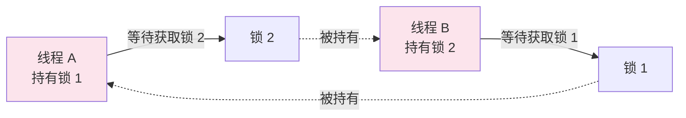

# 死锁检测与避免

## 概念说明

死锁是指两个或多个线程互相持有对方需要的锁，导致所有线程都无法继续执行的状态。死锁是并发编程中最严重的问题之一，一旦发生，程序将永久挂起。

## 核心原理

### 一、死锁的四个必要条件

| 条件 | 说明 | 破坏方式 |
|------|------|----------|
| 互斥 | 资源同一时刻只能被一个线程持有 | 无法破坏（锁的本质） |
| 持有并等待 | 线程持有资源的同时等待其他资源 | 一次性申请所有资源 |
| 不可剥夺 | 线程持有的资源不能被强制释放 | 使用 tryLock 超时机制 |
| 循环等待 | 线程之间形成环形等待链 | 按固定顺序获取锁 |

> 💡 **关键**：只要破坏四个条件中的任意一个，就可以避免死锁。

### 二、死锁示例



### 三、jstack 检测死锁

```bash
# 1. 找到 Java 进程 PID
jps -l

# 2. 使用 jstack 导出线程堆栈
jstack <PID>

# jstack 输出中会自动检测死锁：
# Found one Java-level deadlock:
# =============================
# "Thread-1":
#   waiting to lock monitor 0x00007f8b4c003f08 (object 0x000000076ab2c6a0, a java.lang.Object),
#   which is held by "Thread-0"
# "Thread-0":
#   waiting to lock monitor 0x00007f8b4c006358 (object 0x000000076ab2c6b0, a java.lang.Object),
#   which is held by "Thread-1"
```

**其他检测方式**：
- `jconsole`：图形化工具，线程 Tab 页可检测死锁
- `Arthas`：`thread -b` 命令直接定位死锁
- `ThreadMXBean`：编程方式检测

```java
ThreadMXBean mxBean = ManagementFactory.getThreadMXBean();
long[] deadlockedThreads = mxBean.findDeadlockedThreads();
if (deadlockedThreads != null) {
    ThreadInfo[] infos = mxBean.getThreadInfo(deadlockedThreads, true, true);
    for (ThreadInfo info : infos) {
        System.out.println(info);
    }
}
```

### 四、避免死锁的策略

| 策略 | 实现方式 | 适用场景 |
|------|----------|----------|
| 固定加锁顺序 | 按资源 ID 排序后加锁 | 多资源场景 |
| 超时获取锁 | `tryLock(timeout)` | 使用 ReentrantLock |
| 一次性获取所有锁 | 使用全局锁或锁管理器 | 资源数量有限 |
| 死锁检测 | 定期检测 + 回滚 | 数据库事务 |

### 五、活锁与饥饿

**活锁（Livelock）**：线程没有阻塞，但不断重试导致无法前进。例如两个人在走廊相遇，都想让对方先过，结果不断同时让步。

**饥饿（Starvation）**：线程因为优先级低或锁不公平，长时间无法获取资源。解决方案：使用公平锁。

## 代码示例

```java
// 死锁构造
Object lock1 = new Object(), lock2 = new Object();

new Thread(() -> {
    synchronized (lock1) {
        sleep(100);
        synchronized (lock2) { /* 永远到不了这里 */ }
    }
}).start();

new Thread(() -> {
    synchronized (lock2) {
        sleep(100);
        synchronized (lock1) { /* 永远到不了这里 */ }
    }
}).start();

// 避免死锁：固定加锁顺序
int id1 = System.identityHashCode(lock1);
int id2 = System.identityHashCode(lock2);
Object first = id1 < id2 ? lock1 : lock2;
Object second = id1 < id2 ? lock2 : lock1;
synchronized (first) {
    synchronized (second) { /* 安全 */ }
}
```

> 💻 完整可运行代码：[DeadlockDemo.java](https://github.com/skyhe58/guide-java/tree/main/code-examples/01-java-core/concurrent-programming/src/main/java/com/example/concurrent/10-deadlock/DeadlockDemo.java)
> <!-- 本地路径：code-examples/01-java-core/concurrent-programming/src/main/java/com/example/concurrent/10-deadlock/DeadlockDemo.java -->

## 常见面试题

### Q1: 什么是死锁？如何避免？

**难度**：⭐⭐ | **频率**：🔥🔥🔥

**标准答案**：

死锁是两个或多个线程互相持有对方需要的锁，导致所有线程永久阻塞。死锁需要同时满足四个条件：互斥、持有并等待、不可剥夺、循环等待。避免策略：按固定顺序获取锁（破坏循环等待）、使用 tryLock 超时（破坏不可剥夺）、一次性获取所有锁（破坏持有并等待）。

**深入追问**：

- 如何检测线上死锁？（jstack、Arthas thread -b、ThreadMXBean）
- 活锁和死锁的区别？（活锁线程没有阻塞但无法前进，死锁线程被阻塞）

### Q2: 如何用 jstack 排查死锁？

**难度**：⭐⭐ | **频率**：🔥🔥

**标准答案**：

先用 jps 找到 Java 进程 PID，然后执行 `jstack <PID>`。jstack 会自动检测死锁，在输出末尾显示 "Found one Java-level deadlock"，列出死锁的线程和它们等待的锁。也可以用 Arthas 的 `thread -b` 命令更方便地定位。

### Q3: 死锁和饥饿的区别？

**难度**：⭐⭐ | **频率**：🔥🔥

**标准答案**：

死锁是多个线程互相等待，所有线程都无法继续；饥饿是某个线程因为优先级低或锁不公平，长时间无法获取资源，但其他线程正常运行。死锁需要外部干预才能解除，饥饿可以通过公平锁等机制解决。

## 参考资料

- [jstack - JDK Tools](https://docs.oracle.com/en/java/javase/21/docs/specs/man/jstack.html)
- [Arthas - Alibaba](https://arthas.aliyun.com/)
