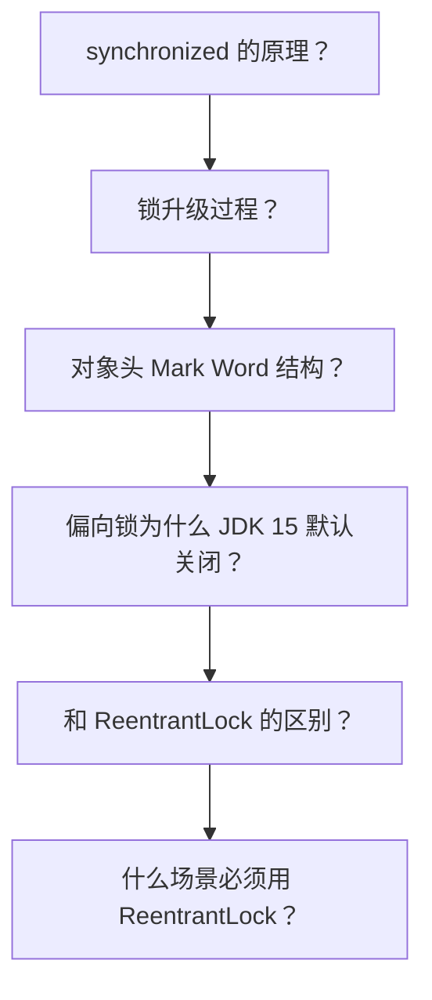
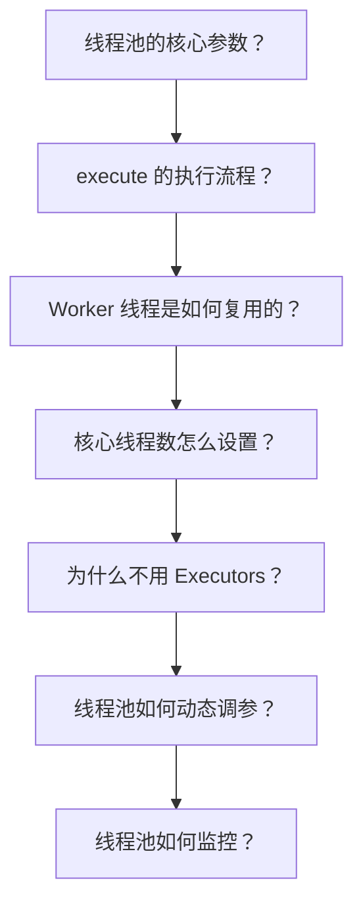
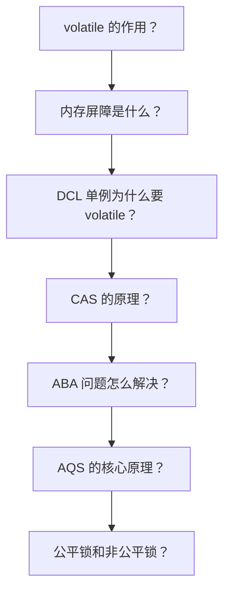
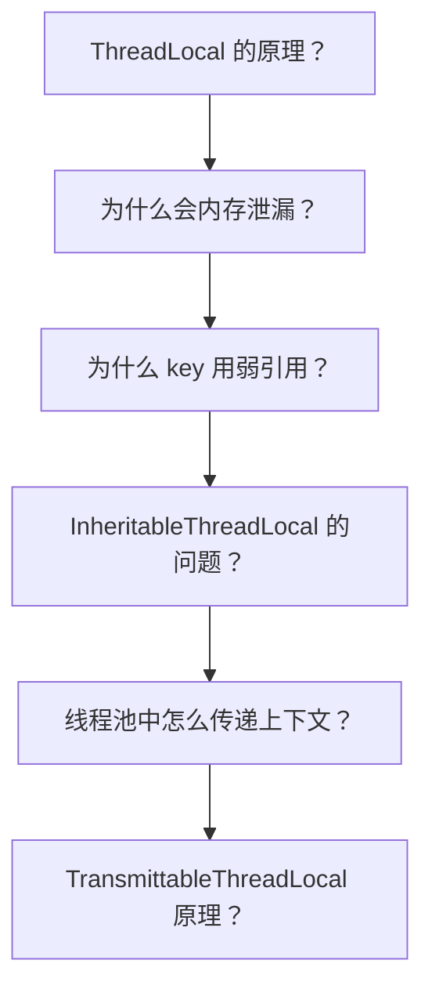

# 并发编程面试指南

## 概念说明

并发编程是 Java 面试中出现频率最高的模块之一，尤其在大厂面试中几乎必问。本指南按面试频率排序，汇总并发编程的高频面试题和追问链路。

## 高频面试题汇总（按频率排序）

### 🔥🔥🔥 超高频（几乎必问）

| 序号 | 面试题 | 关联知识点 | 详细解析 |
|------|--------|-----------|----------|
| 1 | synchronized 的锁升级过程 | [synchronized](./02-synchronized.md) | 偏向锁→轻量级锁→重量级锁 |
| 2 | 线程池的核心参数和执行流程 | [thread-pool](./05-thread-pool.md) | 7 参数 + execute 三步判断 |
| 3 | volatile 的作用和原理 | [volatile](./04-volatile.md) | 可见性 + 有序性 + 内存屏障 |
| 4 | CAS 原理和 ABA 问题 | [cas-atomic](./09-cas-atomic.md) | 比较并交换 + 版本号解决 |
| 5 | AQS 的核心原理 | [reentrantlock-aqs](./03-reentrantlock-aqs.md) | state + CLH 队列 + CAS |
| 6 | ThreadLocal 内存泄漏 | [threadlocal](./07-threadlocal.md) | 弱引用 key + 强引用 value |
| 7 | 线程的 6 种状态 | [thread-lifecycle](./01-thread-lifecycle.md) | NEW→RUNNABLE→BLOCKED/WAITING→TERMINATED |
| 8 | synchronized 和 ReentrantLock 区别 | [synchronized](./02-synchronized.md) | JVM vs API、功能差异 |
| 9 | 为什么不用 Executors 创建线程池 | [thread-pool](./05-thread-pool.md) | OOM 风险 |
| 10 | sleep() 和 wait() 的区别 | [thread-lifecycle](./01-thread-lifecycle.md) | 是否释放锁 |

### 🔥🔥 高频（经常出现）

| 序号 | 面试题 | 关联知识点 |
|------|--------|-----------|
| 11 | 公平锁和非公平锁的区别 | [reentrantlock-aqs](./03-reentrantlock-aqs.md) |
| 12 | CountDownLatch 和 CyclicBarrier 区别 | [concurrent-tools](./06-concurrent-tools.md) |
| 13 | LongAdder 为什么比 AtomicLong 快 | [cas-atomic](./09-cas-atomic.md) |
| 14 | 死锁的条件和避免策略 | [deadlock](./10-deadlock.md) |
| 15 | DCL 单例为什么要加 volatile | [volatile](./04-volatile.md) |
| 16 | CompletableFuture 的使用 | [completable-future](./08-completable-future.md) |
| 17 | 线程池的拒绝策略 | [thread-pool](./05-thread-pool.md) |
| 18 | 创建线程的几种方式 | [thread-lifecycle](./01-thread-lifecycle.md) |

### 🔥 中频（偶尔出现）

| 序号 | 面试题 | 关联知识点 |
|------|--------|-----------|
| 19 | Semaphore 的使用场景 | [concurrent-tools](./06-concurrent-tools.md) |
| 20 | InheritableThreadLocal 在线程池中的问题 | [threadlocal](./07-threadlocal.md) |
| 21 | 线程池如何动态调参 | [thread-pool](./05-thread-pool.md) |
| 22 | 活锁和饥饿 | [deadlock](./10-deadlock.md) |

## 面试追问链路

### 链路一：synchronized 深入

### 链路二：线程池深入

### 链路三：volatile + CAS + AQS

### 链路四：ThreadLocal 深入

## 按公司类型的面试重点

### 大厂（阿里、字节、美团等）

重点考察**原理和源码**：
- synchronized 锁升级的 Mark Word 变化
- AQS 源码（CLH 队列、Node 状态转换）
- 线程池 Worker 的 runWorker 循环
- LongAdder 的 Striped64 设计
- ConcurrentHashMap 的并发控制

### 中厂

重点考察**使用和场景**：
- 线程池参数配置和拒绝策略选择
- CompletableFuture 异步编排
- ThreadLocal 使用和内存泄漏避免
- 死锁排查方法

### 创业公司

重点考察**实际应用**：
- 线程池在项目中的使用
- 并发问题的排查经验
- 基本的线程安全意识

## 参考资料

- [Java Concurrency in Practice](https://jcip.net/)
- [美团技术团队 - Java 线程池实现原理](https://tech.meituan.com/2020/04/02/java-pooling-pratice-in-meituan.html)
- [The Art of Multiprocessor Programming](https://www.elsevier.com/books/the-art-of-multiprocessor-programming/herlihy/978-0-12-415950-1)
