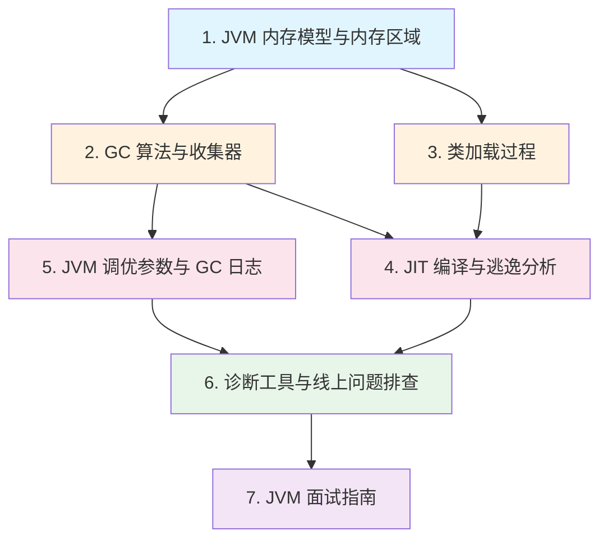

# JVM 深入

## 概念说明

JVM（Java Virtual Machine）是 Java 程序运行的基石，也是 Java 面试中**必考的核心模块**。理解 JVM 不仅能帮助你写出更高效的代码，更能在线上问题排查中快速定位根因。

JVM 知识体系涵盖内存管理、垃圾回收、类加载机制、即时编译优化、性能调优和诊断工具六大领域。掌握这些知识，是从"会写 Java"到"精通 Java"的关键跨越。

## 知识点列表

| 序号 | 知识点 | 难度 | 面试频率 | 文档链接 |
|------|--------|------|----------|----------|
| 1 | JVM 内存模型与内存区域 | ⭐⭐⭐ | 🔥🔥🔥 | [memory-model](./01-memory-model.md) |
| 2 | GC 算法与收集器 | ⭐⭐⭐ | 🔥🔥🔥 | [gc](./02-gc.md) |
| 3 | 类加载过程 | ⭐⭐⭐ | 🔥🔥🔥 | [classloading](./03-classloading.md) |
| 4 | JIT 编译与逃逸分析 | ⭐⭐⭐ | 🔥🔥 | [jit](./04-jit.md) |
| 5 | JVM 调优参数与 GC 日志分析 | ⭐⭐⭐ | 🔥🔥🔥 | [tuning](./05-tuning.md) |
| 6 | 诊断工具与线上问题排查 | ⭐⭐⭐ | 🔥🔥🔥 | [diagnostic](./06-diagnostic.md) |
| 7 | JVM 面试指南 | ⭐⭐⭐ | 🔥🔥🔥 | [interview](./99-interview.md) |

## 推荐学习顺序

**学习路线说明**：
- 🔵 **基础层**（1）：先理解 JVM 内存区域划分，这是一切的根基
- 🟠 **原理层**（2-3）：深入 GC 算法和类加载机制
- 🔴 **优化层**（4-5）：理解 JIT 编译优化和调优参数
- 🟢 **实战层**（6）：掌握诊断工具，能排查线上问题
- 🟣 **面试层**（7）：系统复习，查漏补缺

## 相关模块链接

- [Java 基础](/1-java-core/1.1-java-basics/) — 对象创建、内存分配的语言基础
- [并发编程](/1-java-core/1.3-concurrent/) — 线程栈、内存可见性与 JVM 内存模型的关系
- [Java 进阶](/1-java-core/1.2-java-advanced/) — JMM、类加载器、动态代理等深入主题
- [Spring Boot](/springboot/) — 框架启动过程中的类加载和 Bean 生命周期
- [Docker 与 K8s](/docker-k8s/) — 容器环境下的 JVM 调优

## 参考资料

- [深入理解 Java 虚拟机（第 3 版）— 周志明](https://book.douban.com/subject/34907497/)
- [JDK 21 JVM 规范](https://docs.oracle.com/javase/specs/jvms/se21/html/index.html)
- [OpenJDK HotSpot Wiki](https://wiki.openjdk.org/display/HotSpot)
