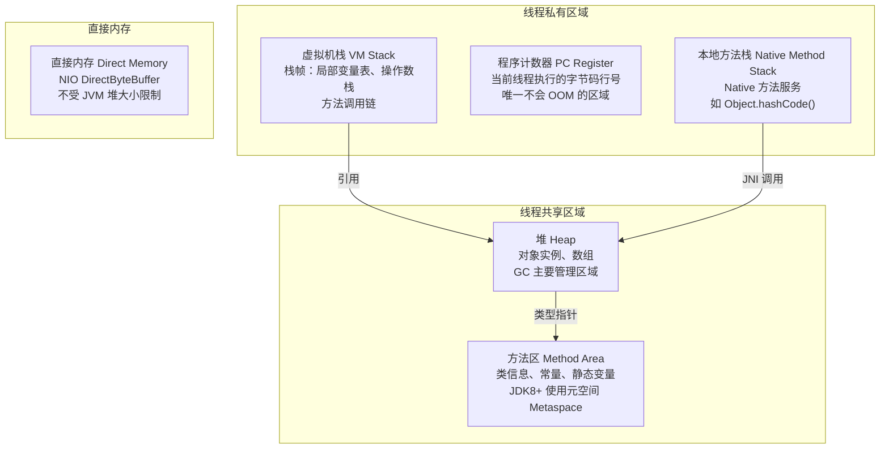
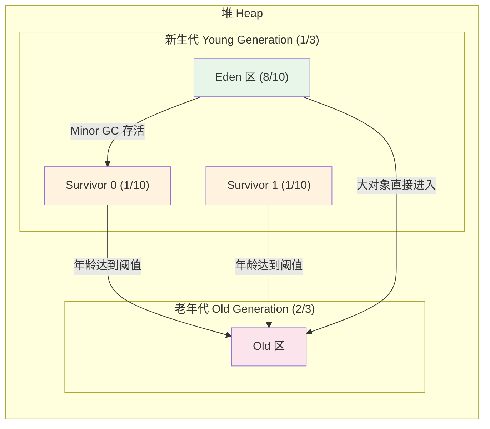
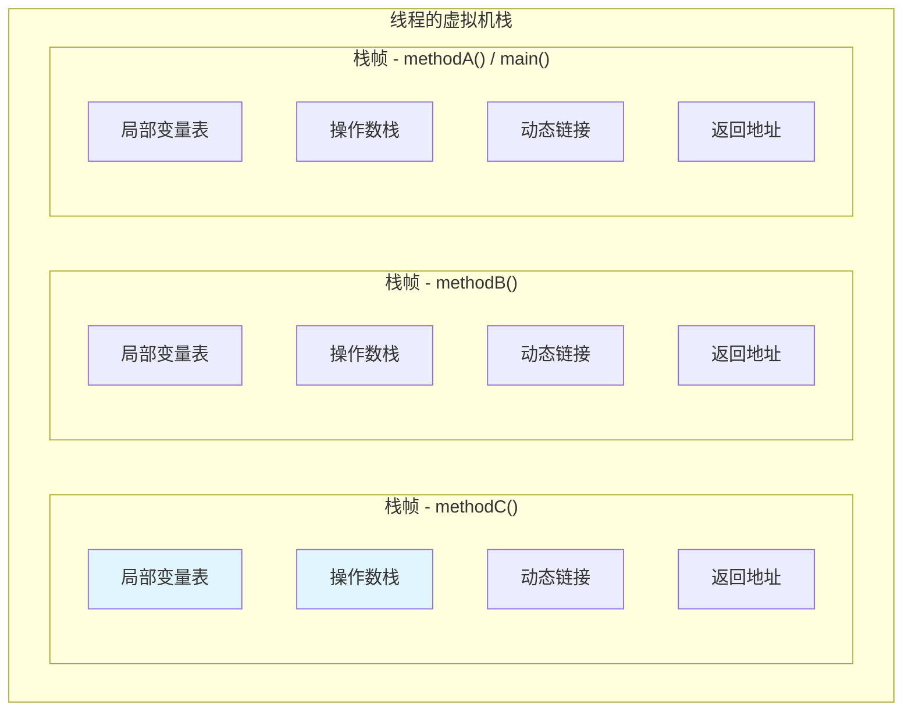
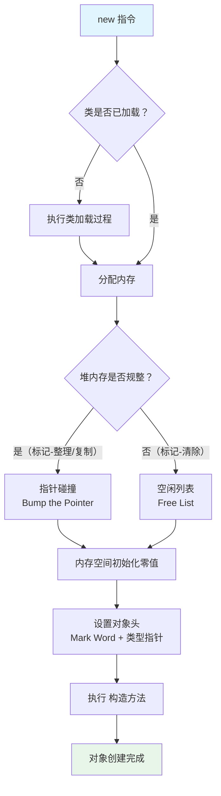

# JVM 内存模型与内存区域

## 概念说明

JVM 在执行 Java 程序时，会将其管理的内存划分为若干个不同的数据区域。理解这些区域的作用、生命周期和交互方式，是掌握 JVM 的第一步，也是面试中被问到频率最高的 JVM 知识点。

核心问题：**一个 Java 对象从创建到销毁，经历了哪些内存区域？**

## 核心原理

### JVM 运行时数据区

JVM 运行时数据区分为**线程共享**和**线程私有**两大类：



### 各区域详解

#### 1. 堆（Heap）— 最大的内存区域

堆是 JVM 管理的最大一块内存，所有**对象实例和数组**都在堆上分配（逃逸分析优化除外）。堆是 GC 的主要工作区域。

**分代结构**（G1 之前的经典分代）：



- **新生代**：新创建的对象优先在 Eden 区分配，经过 Minor GC 存活后进入 Survivor 区
- **老年代**：长期存活的对象、大对象直接进入老年代
- **默认比例**：新生代:老年代 = 1:2（`-XX:NewRatio=2`），Eden:S0:S1 = 8:1:1（`-XX:SurvivorRatio=8`）

#### 2. 虚拟机栈（VM Stack）— 方法执行的内存模型

每个线程创建时都会创建一个虚拟机栈，每个方法调用对应一个**栈帧（Stack Frame）**：



**栈帧四大组成部分**：

| 组成部分 | 作用 | 说明 |
|----------|------|------|
| 局部变量表 | 存储方法参数和局部变量 | 编译期确定大小，包含基本类型和对象引用 |
| 操作数栈 | 方法执行的工作区 | 字节码指令通过操作数栈进行运算 |
| 动态链接 | 指向运行时常量池的方法引用 | 支持多态（虚方法调用） |
| 返回地址 | 方法正常/异常退出后的恢复点 | 恢复上层方法的执行状态 |

**两种异常**：
- `StackOverflowError`：栈深度超过限制（如无限递归），通过 `-Xss` 设置栈大小
- `OutOfMemoryError`：无法申请到足够的栈内存（线程过多）

#### 3. 方法区（Method Area）— 类的元数据仓库

方法区存储已被 JVM 加载的**类信息、常量、静态变量、JIT 编译后的代码缓存**等。

**JDK 版本演进**：

| 版本 | 实现方式 | 内存位置 | 配置参数 |
|------|----------|----------|----------|
| JDK 7 及之前 | 永久代（PermGen） | JVM 堆内存 | `-XX:PermSize` / `-XX:MaxPermSize` |
| JDK 8 及之后 | 元空间（Metaspace） | 本地内存（Native Memory） | `-XX:MetaspaceSize` / `-XX:MaxMetaspaceSize` |

**为什么用元空间替代永久代？**
1. 永久代大小固定，容易 OOM（`java.lang.OutOfMemoryError: PermGen space`）
2. 元空间使用本地内存，默认不限制大小（受物理内存限制）
3. 字符串常量池在 JDK 7 已移到堆中，永久代存在的意义减弱
4. 合并 HotSpot 和 JRockit 的代码，JRockit 没有永久代概念

#### 4. 程序计数器（PC Register）

- 当前线程执行的字节码指令的行号指示器
- 线程私有，每个线程都有独立的程序计数器
- 如果执行的是 Native 方法，计数器值为空（Undefined）
- **唯一不会发生 OutOfMemoryError 的区域**

#### 5. 本地方法栈（Native Method Stack）

- 为 Native 方法（如 C/C++ 实现的方法）服务
- HotSpot 虚拟机将本地方法栈和虚拟机栈合二为一
- 也会抛出 `StackOverflowError` 和 `OutOfMemoryError`

### 对象创建过程

一个 `new` 指令触发的完整对象创建流程：



**并发安全问题**：多线程同时创建对象时，内存分配需要保证线程安全：
- **CAS + 失败重试**：乐观锁方式
- **TLAB（Thread Local Allocation Buffer）**：每个线程预先分配一小块 Eden 区内存，默认开启（`-XX:+UseTLAB`）

### 对象内存布局

HotSpot 虚拟机中，对象在堆内存中的布局分为三部分：

```
┌─────────────────────────────────────────────┐
│              对象头 (Object Header)            │
│  ┌─────────────────────────────────────────┐ │
│  │ Mark Word (64 bit)                      │ │
│  │ - 哈希码、GC 分代年龄、锁状态标志        │ │
│  │ - 线程持有的锁、偏向线程 ID              │ │
│  ├─────────────────────────────────────────┤ │
│  │ 类型指针 (Klass Pointer)                │ │
│  │ - 指向方法区中的类元数据                 │ │
│  │ - 开启压缩指针时为 32 bit               │ │
│  ├─────────────────────────────────────────┤ │
│  │ 数组长度 (仅数组对象)                    │ │
│  └─────────────────────────────────────────┘ │
├─────────────────────────────────────────────┤
│              实例数据 (Instance Data)          │
│  - 对象的字段值（包括父类继承的字段）         │
│  - 相同宽度的字段分配在一起                   │
│  - 父类字段在子类字段之前                     │
├─────────────────────────────────────────────┤
│              对齐填充 (Padding)                │
│  - HotSpot 要求对象大小必须是 8 字节的整数倍  │
│  - 不足时自动填充                             │
└─────────────────────────────────────────────┘
```

**Mark Word 在不同锁状态下的内容**（64 位 JVM）：

| 锁状态 | 存储内容 | 标志位 |
|--------|----------|--------|
| 无锁 | 对象 hashCode、分代年龄 | 01 |
| 偏向锁 | 偏向线程 ID、偏向时间戳、分代年龄 | 01 |
| 轻量级锁 | 指向栈中锁记录的指针 | 00 |
| 重量级锁 | 指向 Monitor 的指针 | 10 |
| GC 标记 | 空 | 11 |

## 代码示例

```java
/**
 * 堆溢出演示 — 不断创建对象直到 OOM
 * 运行参数：-Xms20m -Xmx20m -XX:+HeapDumpOnOutOfMemoryError
 */
public static void heapOOM() {
    List<byte[]> list = new ArrayList<>();
    while (true) {
        list.add(new byte[1024 * 1024]); // 每次分配 1MB
    }
    // 预期抛出：java.lang.OutOfMemoryError: Java heap space
}

/**
 * 栈溢出演示 — 无限递归
 * 运行参数：-Xss256k
 */
public static void stackOverflow() {
    stackOverflow(); // 无限递归
    // 预期抛出：java.lang.StackOverflowError
}

/**
 * 元空间溢出演示 — 动态生成大量类
 * 运行参数：-XX:MaxMetaspaceSize=10m
 */
// 使用动态代理或 CGLIB 不断生成新类，耗尽元空间
```

> 💻 完整可运行代码：[code-examples/01-java-core/jvm-deep-dive/.../memory/MemoryAreaDemo.java](../../../code-examples/01-java-core/jvm-deep-dive/src/main/java/com/example/jvm/memory/MemoryAreaDemo.java)

## 常见面试题

### Q1: 说说 JVM 的内存区域划分？

**难度**：⭐⭐⭐ | **频率**：🔥🔥🔥

**答题思路**：

1. 先分两大类：线程共享 vs 线程私有
2. 逐个介绍每个区域的作用
3. 重点说堆的分代结构和方法区的演进

**标准答案**：

JVM 运行时数据区分为 5 个部分：
- **线程共享**：堆（存放对象实例，GC 主要区域）、方法区（存放类信息、常量、静态变量，JDK 8 后用元空间实现）
- **线程私有**：虚拟机栈（方法调用的栈帧）、本地方法栈（Native 方法）、程序计数器（字节码行号指示器）

堆分为新生代（Eden + 2 个 Survivor）和老年代，默认比例 1:2。方法区在 JDK 8 后由元空间替代，使用本地内存而非 JVM 堆内存。

**深入追问**：
- 为什么要用元空间替代永久代？
- 对象一定在堆上分配吗？（逃逸分析 → 栈上分配）
- TLAB 是什么？为什么需要它？

**易错点**：
- 混淆 JVM 内存区域和 Java 内存模型（JMM）— 两者是不同概念
- 认为 JDK 8 之后没有方法区 — 方法区是规范，元空间是实现

### Q2: 对象的创建过程是怎样的？

**难度**：⭐⭐⭐ | **频率**：🔥🔥🔥

**答题思路**：

1. 类加载检查
2. 内存分配（指针碰撞 vs 空闲列表）
3. 内存初始化零值
4. 设置对象头
5. 执行构造方法

**标准答案**：

当 JVM 遇到 `new` 指令时：
1. **类加载检查**：检查类是否已加载、解析和初始化，如果没有则先执行类加载
2. **分配内存**：根据堆内存是否规整，选择指针碰撞（Serial/ParNew 等带压缩的收集器）或空闲列表（CMS 等标记-清除收集器）
3. **并发安全**：通过 CAS+失败重试 或 TLAB 保证线程安全
4. **零值初始化**：将分配的内存空间初始化为零值（保证字段不赋值也能使用）
5. **设置对象头**：写入 Mark Word（哈希码、GC 年龄、锁标志）和类型指针
6. **执行 `<init>`**：调用构造方法，按程序员意愿初始化对象

**深入追问**：
- 指针碰撞和空闲列表分别在什么场景下使用？
- Mark Word 中存储了哪些信息？不同锁状态下有什么变化？

**易错点**：
- 忘记提并发安全问题（TLAB）
- 混淆零值初始化和构造方法初始化的顺序

### Q3: 堆内存溢出和栈内存溢出的区别？

**难度**：⭐⭐ | **频率**：🔥🔥🔥

**答题思路**：

1. 分别说明触发条件
2. 对应的异常类型
3. 排查和解决方法

**标准答案**：

| 对比项 | 堆溢出 | 栈溢出 |
|--------|--------|--------|
| 异常类型 | `OutOfMemoryError: Java heap space` | `StackOverflowError` |
| 触发原因 | 对象过多/过大，堆空间不足 | 方法调用层级过深（如无限递归） |
| 影响范围 | 整个 JVM 进程 | 当前线程 |
| 调优参数 | `-Xms` / `-Xmx` | `-Xss` |
| 排查方式 | Heap Dump + MAT 分析 | 查看异常栈找到递归调用点 |

**深入追问**：
- 还有哪些类型的 OOM？（元空间、直接内存、GC overhead limit exceeded）
- 如何设置 JVM 在 OOM 时自动 dump？（`-XX:+HeapDumpOnOutOfMemoryError`）

## 参考资料

- [深入理解 Java 虚拟机（第 3 版）— 第 2 章](https://book.douban.com/subject/34907497/)
- [JVM Specification - Run-Time Data Areas](https://docs.oracle.com/javase/specs/jvms/se21/html/jvms-2.html#jvms-2.5)
- [JEP 122: Remove the Permanent Generation](https://openjdk.org/jeps/122)
