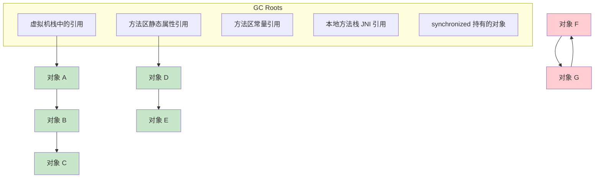
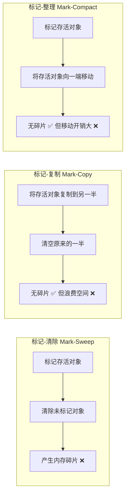
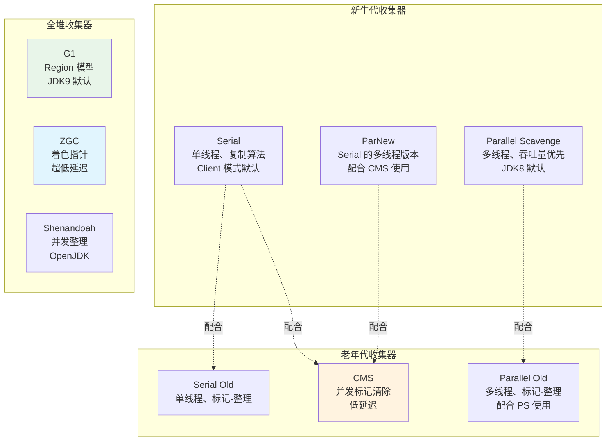
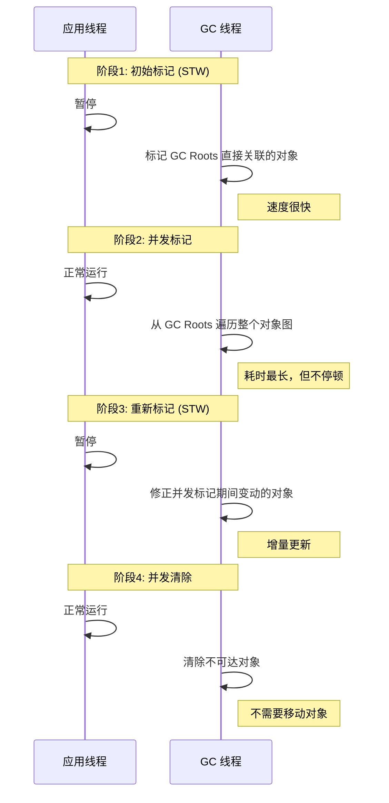
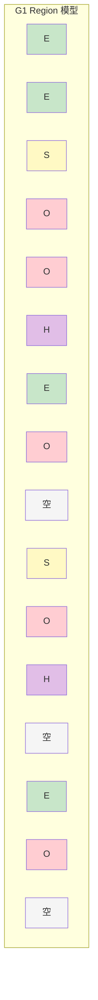

# GC 算法与收集器

## 概念说明

垃圾回收（Garbage Collection）是 JVM 自动内存管理的核心机制。Java 程序员不需要手动释放内存，GC 会自动回收不再使用的对象。但理解 GC 的工作原理，对于性能调优和线上问题排查至关重要。

核心问题：**哪些对象需要回收？什么时候回收？怎么回收？**

## 核心原理

### 判断对象是否存活

#### 引用计数法（Reference Counting）

给对象添加一个引用计数器，每当有引用指向它时加 1，引用失效时减 1，计数为 0 时可回收。

**致命缺陷**：无法解决循环引用问题（A 引用 B，B 引用 A，但两者都不再被外部使用）。

#### 可达性分析（Reachability Analysis）— JVM 实际使用

从 **GC Roots** 出发，沿引用链向下搜索，不可达的对象即为可回收对象。



> 红色对象 F、G 虽然互相引用，但从 GC Roots 不可达，会被回收。

### 四种引用类型

| 引用类型 | 回收时机 | 使用场景 | 示例 |
|----------|----------|----------|------|
| 强引用（Strong） | 永远不回收（只要可达） | 普通对象引用 | `Object obj = new Object()` |
| 软引用（Soft） | 内存不足时回收 | 缓存 | `SoftReference<Object>` |
| 弱引用（Weak） | 下次 GC 时回收 | ThreadLocalMap 的 Entry | `WeakReference<Object>` |
| 虚引用（Phantom） | 随时可能被回收 | 跟踪对象被回收的时机 | `PhantomReference<Object>` |

### 三大基础 GC 算法



| 算法 | 优点 | 缺点 | 适用场景 |
|------|------|------|----------|
| 标记-清除 | 实现简单 | 内存碎片、效率不稳定 | CMS 老年代 |
| 标记-复制 | 无碎片、效率高 | 浪费一半空间 | 新生代（Eden + Survivor） |
| 标记-整理 | 无碎片 | 移动对象开销大、需要 STW | 老年代（Serial Old、Parallel Old） |

### 分代收集理论

基于两个假说：
1. **弱分代假说**：绝大多数对象都是朝生夕灭的（新生代用复制算法）
2. **强分代假说**：熬过越多次 GC 的对象越难以消亡（老年代用标记-整理/清除）

**跨代引用问题**：老年代对象引用新生代对象时，Minor GC 需要扫描整个老年代？
- 解决方案：**记忆集（Remembered Set）+ 卡表（Card Table）**，只记录存在跨代引用的内存区域

### 主流垃圾收集器



### CMS 收集器详解

CMS（Concurrent Mark Sweep）以获取**最短回收停顿时间**为目标，使用标记-清除算法。



**CMS 的缺点**：
1. **CPU 敏感**：并发阶段占用 CPU 资源，默认启动线程数 = (CPU 核数 + 3) / 4
2. **浮动垃圾**：并发清除阶段产生的新垃圾只能下次 GC 处理
3. **内存碎片**：标记-清除算法导致碎片，可能触发 Full GC 时的 Serial Old 压缩
4. **Concurrent Mode Failure**：并发收集期间老年代空间不足，退化为 Serial Old

### G1 收集器详解

G1（Garbage-First）将堆划分为大小相等的 **Region**，不再严格区分新生代和老年代。



> E = Eden, S = Survivor, O = Old, H = Humongous（大对象）, 空 = 空闲 Region

**G1 的核心特性**：
- **Region 大小**：1MB ~ 32MB，必须是 2 的幂，通过 `-XX:G1HeapRegionSize` 设置
- **Humongous Region**：超过 Region 大小一半的对象直接分配到 Humongous 区
- **Mixed GC**：可以选择性地回收部分老年代 Region（回收价值最高的优先）
- **可预测的停顿**：通过 `-XX:MaxGCPauseMillis`（默认 200ms）设置期望停顿时间

**G1 的 GC 模式**：

| GC 类型 | 触发条件 | 回收范围 |
|---------|----------|----------|
| Young GC | Eden 区满 | 所有 Eden + Survivor Region |
| Mixed GC | 老年代占比超过 `InitiatingHeapOccupancyPercent`（默认 45%） | Young + 部分 Old Region |
| Full GC | Mixed GC 跟不上分配速度 | 整个堆（退化为 Serial，应尽量避免） |

### ZGC 收集器详解

ZGC 是 JDK 11 引入的超低延迟收集器，目标是将 GC 停顿控制在 **10ms 以内**（实际通常 < 1ms）。

**核心技术**：
- **着色指针（Colored Pointers）**：在 64 位指针中借用 4 个 bit 存储 GC 元数据（Marked0、Marked1、Remapped、Finalizable）
- **读屏障（Load Barrier）**：在对象引用加载时插入屏障代码，实现并发转移
- **Region 动态大小**：小型（2MB）、中型（32MB）、大型（N×2MB）

**ZGC vs G1 对比**：

| 对比项 | G1 | ZGC |
|--------|-----|-----|
| 最大停顿 | 几十~几百 ms | < 10ms（通常 < 1ms） |
| 堆大小支持 | TB 级 | TB 级（最大 16TB） |
| 并发整理 | 不支持 | 支持 |
| JDK 版本 | JDK 9 默认 | JDK 15 生产就绪 |
| 适用场景 | 通用 | 超低延迟要求 |

### Shenandoah 收集器

Shenandoah 是 OpenJDK 的低延迟收集器（非 Oracle JDK），与 ZGC 目标类似但实现不同：
- 使用**转发指针（Brooks Pointer）**而非着色指针
- 使用**读屏障 + 写屏障**
- 支持并发整理，停顿时间与堆大小无关

### 收集器选型建议

| 场景 | 推荐收集器 | JVM 参数 |
|------|-----------|----------|
| 小内存（< 4GB）、单核 | Serial + Serial Old | `-XX:+UseSerialGC` |
| 吞吐量优先（批处理） | Parallel Scavenge + Parallel Old | `-XX:+UseParallelGC`（JDK 8 默认） |
| 低延迟（Web 应用） | G1 | `-XX:+UseG1GC`（JDK 9+ 默认） |
| 超低延迟（金融交易） | ZGC | `-XX:+UseZGC` |
| 大堆 + 低延迟 | ZGC 或 Shenandoah | `-XX:+UseZGC` 或 `-XX:+UseShenandoahGC` |

## 代码示例

```java
// 触发 Young GC — 快速填满 Eden 区
byte[] allocation;
for (int i = 0; i < 20; i++) {
    allocation = new byte[1024 * 1024]; // 1MB
}

// 软引用 — 内存不足时回收
SoftReference<byte[]> softRef = new SoftReference<>(new byte[10 * 1024 * 1024]);
System.out.println("GC 前: " + softRef.get()); // 非 null
System.gc();
System.out.println("GC 后: " + softRef.get()); // 内存充足时仍非 null

// 弱引用 — 下次 GC 即回收
WeakReference<byte[]> weakRef = new WeakReference<>(new byte[1024]);
System.gc();
System.out.println("GC 后: " + weakRef.get()); // null
```

> 💻 完整可运行代码：[code-examples/01-java-core/jvm-deep-dive/.../gc/GCDemo.java](https://github.com/skyhe58/guide-java/tree/main/code-examples/01-java-core/jvm-deep-dive/src/main/java/com/example/jvm/02-gc/GCDemo.java)
> <!-- 本地路径：code-examples/01-java-core/jvm-deep-dive/src/main/java/com/example/jvm/02-gc/GCDemo.java -->

## 常见面试题

### Q1: 说说 CMS 和 G1 的区别？

**难度**：⭐⭐⭐ | **频率**：🔥🔥🔥

**答题思路**：从内存布局、算法、停顿时间、适用场景四个维度对比。

**标准答案**：

| 对比维度 | CMS | G1 |
|----------|-----|-----|
| 内存布局 | 传统分代（新生代+老年代） | Region 模型，逻辑分代 |
| 算法 | 标记-清除 | 标记-复制（整体）+ 标记-整理（局部） |
| 碎片 | 有碎片，可能触发 Full GC | 基本无碎片 |
| 停顿控制 | 不可预测 | 可设置期望停顿时间 |
| 适用堆大小 | 中小堆（< 8GB） | 大堆（> 6GB） |
| JDK 状态 | JDK 9 标记废弃，JDK 14 移除 | JDK 9 默认收集器 |

**深入追问**：
- G1 的 Mixed GC 是怎么触发的？（`InitiatingHeapOccupancyPercent` 默认 45%）
- G1 的 Region 大小怎么确定？（1~32MB，2 的幂，`-XX:G1HeapRegionSize`）
- CMS 的 Concurrent Mode Failure 是什么？怎么解决？

### Q2: 什么是 ZGC？它是怎么实现低延迟的？

**难度**：⭐⭐⭐ | **频率**：🔥🔥

**标准答案**：

ZGC 通过两个核心技术实现超低延迟：
1. **着色指针**：在 64 位对象指针中借用 4 个 bit 存储 GC 状态信息，避免额外的内存开销
2. **读屏障**：在加载对象引用时检查指针颜色，如果对象已被移动则自动修正引用，实现并发转移

这使得 ZGC 几乎所有阶段都可以与应用线程并发执行，STW 时间通常 < 1ms，且与堆大小无关。

**深入追问**：
- ZGC 的着色指针用了哪几个 bit？分别代表什么？
- 为什么 ZGC 不需要记忆集？（着色指针 + 读屏障可以处理跨 Region 引用）

## 参考资料

- [深入理解 Java 虚拟机（第 3 版）— 第 3 章](https://book.douban.com/subject/34907497/)
- [JEP 333: ZGC: A Scalable Low-Latency Garbage Collector](https://openjdk.org/jeps/333)
- [Getting Started with Z Garbage Collector](https://docs.oracle.com/en/java/javase/21/gctuning/z-garbage-collector.html)
