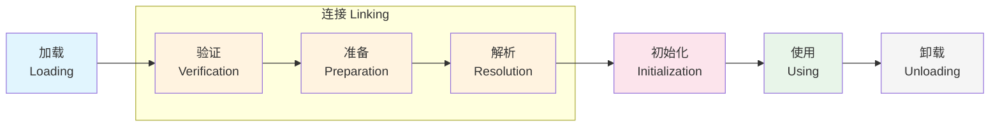
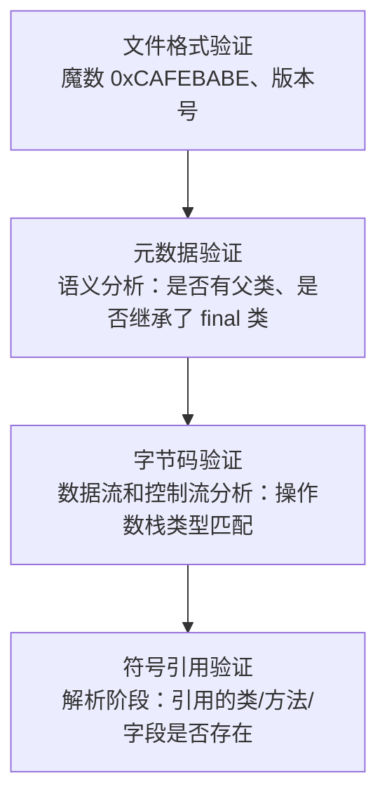
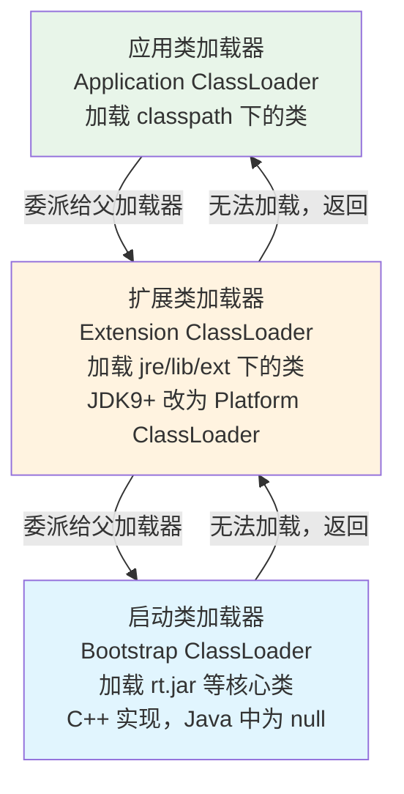
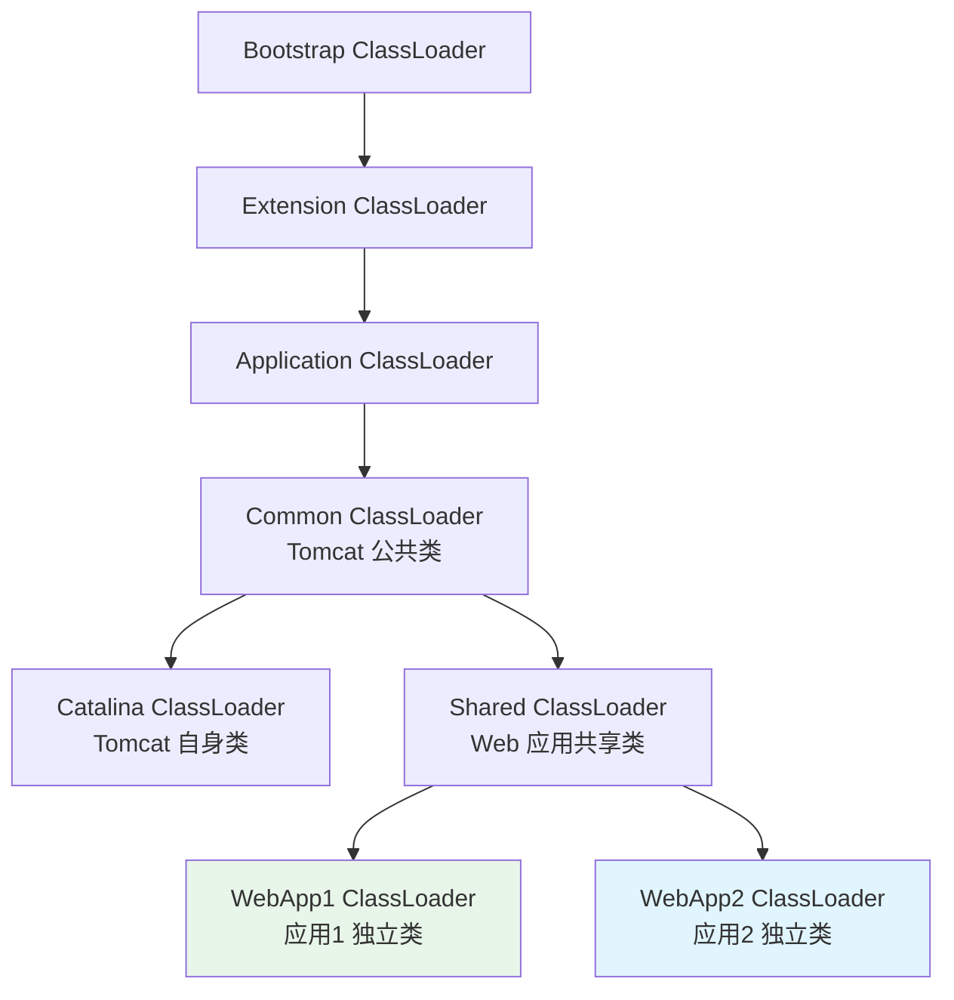

# 类加载过程

## 概念说明

类加载机制是 JVM 将 `.class` 文件中的字节码加载到内存，并转换为运行时数据结构的过程。理解类加载机制，是理解 Spring IoC、SPI、热部署、Tomcat 类隔离等高级特性的基础。

核心问题：**一个 `.class` 文件是如何变成可以使用的 `Class` 对象的？**

## 核心原理

### 类的生命周期

一个类从加载到卸载，经历 7 个阶段：



### 五个阶段详解

#### 1. 加载（Loading）

| 步骤 | 说明 |
|------|------|
| 获取字节流 | 通过类的全限定名获取定义此类的二进制字节流（不限于 .class 文件，可以来自 JAR、网络、动态生成等） |
| 转换为方法区数据结构 | 将字节流代表的静态存储结构转化为方法区的运行时数据结构 |
| 生成 Class 对象 | 在堆中生成一个 `java.lang.Class` 对象，作为方法区数据的访问入口 |

#### 2. 验证（Verification）

确保 Class 文件的字节流符合 JVM 规范，不会危害虚拟机安全：



#### 3. 准备（Preparation）

为**类变量**（static 变量）分配内存并设置**零值**：

```java
// 准备阶段：value = 0（零值）
// 初始化阶段：value = 123（赋值）
public static int value = 123;

// 特殊情况：final static 在准备阶段就赋值
// 准备阶段：CONSTANT = 456（ConstantValue 属性）
public static final int CONSTANT = 456;
```

| 数据类型 | 零值 |
|----------|------|
| int | 0 |
| long | 0L |
| boolean | false |
| float | 0.0f |
| double | 0.0d |
| char | '\u0000' |
| 引用类型 | null |

#### 4. 解析（Resolution）

将常量池中的**符号引用**替换为**直接引用**：
- **符号引用**：用一组符号来描述引用的目标（如 `java/lang/Object`）
- **直接引用**：直接指向目标的指针、相对偏移量或句柄

解析主要针对：类/接口、字段、方法、接口方法、方法类型、方法句柄、调用点限定符。

#### 5. 初始化（Initialization）

执行类构造器 `<clinit>()` 方法，这是类加载的最后一步：

```java
// <clinit>() 由编译器自动收集以下内容合并产生：
// 1. 所有类变量的赋值动作
// 2. 所有 static 代码块

public class InitDemo {
    static int a = 1;           // 类变量赋值
    static {
        a = 2;                  // static 代码块
        System.out.println("类初始化");
    }
    // <clinit>() 执行后 a = 2
}
```

**触发类初始化的 6 种场景**（主动引用）：
1. `new` 实例化对象、读取/设置静态字段、调用静态方法
2. 反射调用（`Class.forName()`）
3. 初始化子类时，父类未初始化则先初始化父类
4. JVM 启动时的主类（包含 `main()` 的类）
5. JDK 7 的 `MethodHandle` 解析结果为 `REF_getStatic` 等
6. JDK 8 接口中定义了 default 方法，实现类初始化时接口先初始化

**不会触发初始化的场景**（被动引用）：
- 通过子类引用父类的静态字段 → 只初始化父类
- 通过数组定义引用类 → `MyClass[] arr = new MyClass[10]` 不会初始化 MyClass
- 引用类的常量 → 常量在编译期进入调用类的常量池

### 双亲委派模型



**工作流程**：
1. 收到类加载请求时，先委派给父加载器
2. 父加载器继续向上委派，直到 Bootstrap ClassLoader
3. 如果父加载器无法加载（在其搜索范围内找不到），子加载器才尝试自己加载

**核心代码**（`ClassLoader.loadClass()`）：

```java
protected Class<?> loadClass(String name, boolean resolve) throws ClassNotFoundException {
    synchronized (getClassLoadingLock(name)) {
        // 1. 检查类是否已加载
        Class<?> c = findLoadedClass(name);
        if (c == null) {
            try {
                // 2. 委派给父加载器
                if (parent != null) {
                    c = parent.loadClass(name, false);
                } else {
                    c = findBootstrapClassOrNull(name);
                }
            } catch (ClassNotFoundException e) {
                // 父加载器无法加载
            }
            if (c == null) {
                // 3. 父加载器无法加载，自己加载
                c = findClass(name);
            }
        }
        return c;
    }
}
```

**双亲委派的好处**：
1. **安全性**：防止核心类被篡改（如自定义 `java.lang.String` 不会被加载）
2. **唯一性**：保证同一个类只被加载一次，避免类的重复加载

### 打破双亲委派的场景

| 场景 | 原因 | 实现方式 |
|------|------|----------|
| **SPI 机制** | Bootstrap ClassLoader 加载的接口（如 JDBC Driver）需要加载 classpath 下的实现类 | 线程上下文类加载器（Thread Context ClassLoader） |
| **Tomcat** | 不同 Web 应用需要加载不同版本的同名类（类隔离） | 每个 WebApp 有独立的 WebAppClassLoader，优先加载自己的类 |
| **OSGi** | 模块化热部署，每个 Bundle 有独立的类加载器 | 网状委派模型 |
| **热加载/热部署** | 运行时替换类的实现 | 自定义 ClassLoader，每次加载创建新的 ClassLoader 实例 |

**Tomcat 类加载器架构**：



> WebAppClassLoader 打破双亲委派：优先加载 `/WEB-INF/classes` 和 `/WEB-INF/lib` 下的类，找不到再委派给父加载器。

### 自定义 ClassLoader

继承 `ClassLoader`，重写 `findClass()` 方法：

```java
public class MyClassLoader extends ClassLoader {
    private String classPath;

    public MyClassLoader(String classPath) {
        this.classPath = classPath;
    }

    @Override
    protected Class<?> findClass(String name) throws ClassNotFoundException {
        byte[] data = loadClassData(name);
        if (data == null) {
            throw new ClassNotFoundException(name);
        }
        // defineClass 将字节数组转换为 Class 对象
        return defineClass(name, data, 0, data.length);
    }

    private byte[] loadClassData(String name) {
        // 从指定路径读取 .class 文件的字节数组
        String fileName = classPath + "/" + name.replace('.', '/') + ".class";
        // ... 读取文件内容
        return null;
    }
}
```

**注意**：
- 重写 `findClass()` 保持双亲委派
- 重写 `loadClass()` 可以打破双亲委派（不推荐，除非有特殊需求）

## 代码示例

```java
// 验证双亲委派 — 查看各类加载器
System.out.println("String 的类加载器: " + String.class.getClassLoader());
// 输出: null（Bootstrap ClassLoader）

System.out.println("当前类的类加载器: " + ClassLoaderDemo.class.getClassLoader());
// 输出: jdk.internal.loader.ClassLoaders$AppClassLoader

// 打印类加载器层级
ClassLoader cl = ClassLoaderDemo.class.getClassLoader();
while (cl != null) {
    System.out.println(cl);
    cl = cl.getParent();
}
```

> 💻 完整可运行代码：[code-examples/01-java-core/jvm-deep-dive/.../classloading/ClassLoaderDemo.java](https://github.com/skyhe58/guide-java/tree/main/code-examples/01-java-core/jvm-deep-dive/src/main/java/com/example/jvm/03-classloading/ClassLoaderDemo.java)
> <!-- 本地路径：code-examples/01-java-core/jvm-deep-dive/src/main/java/com/example/jvm/03-classloading/ClassLoaderDemo.java -->

## 常见面试题

### Q1: 说说类加载的过程？

**难度**：⭐⭐⭐ | **频率**：🔥🔥🔥

**答题思路**：按五个阶段逐一说明，重点说准备阶段的零值和初始化阶段的触发条件。

**标准答案**：

类加载分为五个阶段：
1. **加载**：通过全限定名获取字节流 → 转化为方法区数据结构 → 在堆中生成 Class 对象
2. **验证**：文件格式验证 → 元数据验证 → 字节码验证 → 符号引用验证
3. **准备**：为类变量分配内存并设置零值（`static final` 常量直接赋值）
4. **解析**：将符号引用替换为直接引用
5. **初始化**：执行 `<clinit>()` 方法（类变量赋值 + static 代码块）

**深入追问**：
- `static int a = 1` 在准备阶段和初始化阶段分别是什么值？（0 → 1）
- 什么情况下不会触发类初始化？（被动引用的三种场景）

### Q2: 什么是双亲委派模型？为什么要打破它？

**难度**：⭐⭐⭐ | **频率**：🔥🔥🔥

**标准答案**：

双亲委派模型要求类加载器收到加载请求时，先委派给父加载器，父加载器无法加载时才自己加载。好处是保证核心类的安全性和唯一性。

打破双亲委派的典型场景：
- **SPI**：核心类需要加载 classpath 下的实现类，通过线程上下文类加载器解决
- **Tomcat**：不同 Web 应用需要类隔离，WebAppClassLoader 优先加载自己的类
- **热部署**：需要卸载旧类加载新类，每次创建新的 ClassLoader 实例

**深入追问**：
- JDBC 是怎么通过 SPI 打破双亲委派的？
- Tomcat 的类加载器架构是怎样的？
- 如何实现一个自定义 ClassLoader？

**易错点**：
- 认为打破双亲委派是重写 `findClass()` — 实际上是重写 `loadClass()`
- 混淆"类加载器"和"类加载过程"

## 参考资料

- [深入理解 Java 虚拟机（第 3 版）— 第 7 章](https://book.douban.com/subject/34907497/)
- [JVM Specification - Loading, Linking, and Initializing](https://docs.oracle.com/javase/specs/jvms/se21/html/jvms-5.html)
- [Understanding Java Class Loading](https://docs.oracle.com/javase/tutorial/ext/basics/load.html)
