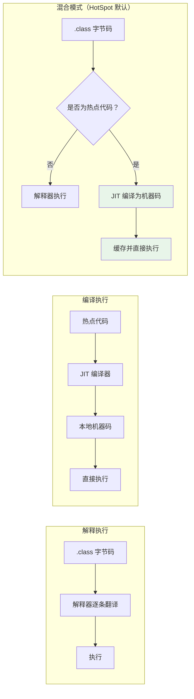
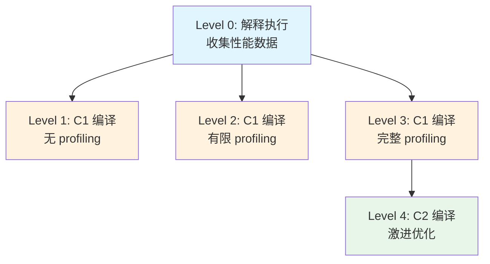
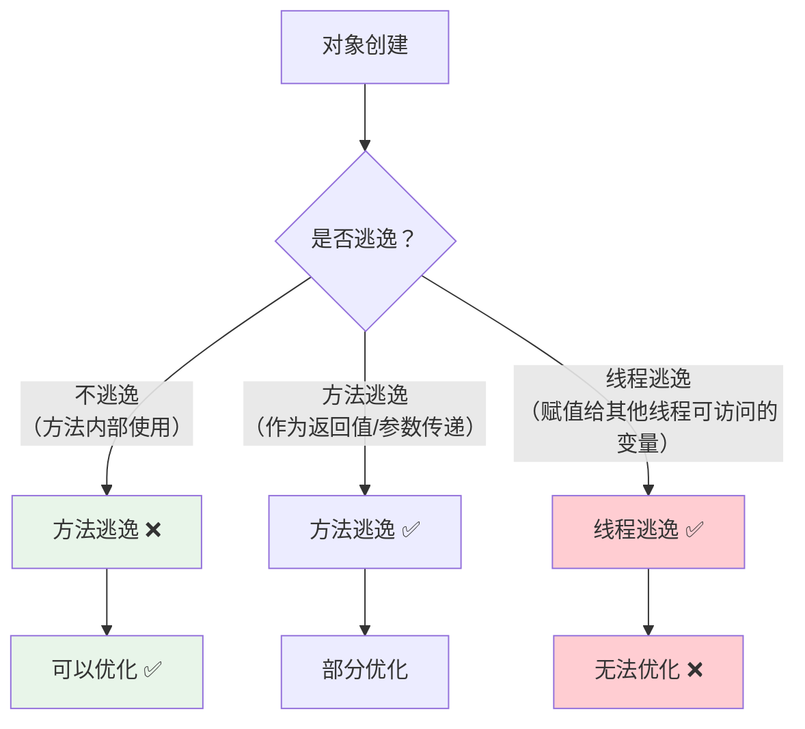

# JIT 编译与逃逸分析

## 概念说明

Java 程序的执行并非纯解释执行，也非纯编译执行，而是采用**混合模式**：先解释执行字节码，当发现某段代码被频繁执行（热点代码）时，JIT（Just-In-Time）编译器会将其编译为本地机器码，后续直接执行机器码以提升性能。

逃逸分析（Escape Analysis）是 JIT 编译器最重要的优化技术之一，它分析对象的作用域，决定是否可以进行栈上分配、标量替换、锁消除等优化。

## 核心原理

### 解释执行 vs 编译执行



**为什么不全部编译？**
- 编译需要时间，启动时全部编译会导致启动慢
- 大部分代码只执行一次，编译是浪费
- 解释器可以快速启动，JIT 编译器负责优化热点代码

### 热点代码检测

JVM 通过**方法调用计数器**和**回边计数器**来检测热点代码：

| 计数器 | 作用 | 阈值（Server 模式） |
|--------|------|---------------------|
| 方法调用计数器 | 统计方法被调用的次数 | 10,000 次（`-XX:CompileThreshold`） |
| 回边计数器 | 统计循环体执行的次数 | 触发 OSR 编译（On-Stack Replacement） |

### C1 和 C2 编译器

HotSpot 包含两个 JIT 编译器：

| 编译器 | 别名 | 优化程度 | 编译速度 | 适用场景 |
|--------|------|----------|----------|----------|
| C1 | Client Compiler | 简单优化（方法内联、去虚拟化、冗余消除） | 快 | 启动速度敏感 |
| C2 | Server Compiler | 激进优化（逃逸分析、循环展开、向量化） | 慢 | 长期运行的服务端应用 |

### 分层编译（Tiered Compilation）

JDK 7+ 默认开启分层编译（`-XX:+TieredCompilation`），结合 C1 和 C2 的优势：



**典型路径**：L0 → L3 → L4（先用 C1 快速编译并收集 profiling 数据，再用 C2 深度优化）

### 逃逸分析（Escape Analysis）

逃逸分析判断一个对象是否会"逃逸"出方法或线程的作用域：



**三种逃逸状态**：

```java
// 1. 不逃逸 — 对象只在方法内部使用
public int noEscape() {
    Point p = new Point(1, 2);  // p 不逃逸
    return p.x + p.y;
}

// 2. 方法逃逸 — 对象作为返回值或参数传递
public Point methodEscape() {
    Point p = new Point(1, 2);
    return p;  // p 逃逸到方法外
}

// 3. 线程逃逸 — 对象被其他线程访问
public static Point sharedPoint;
public void threadEscape() {
    sharedPoint = new Point(1, 2);  // p 逃逸到其他线程
}
```

### 逃逸分析的三大优化

#### 1. 栈上分配（Stack Allocation）

如果对象不逃逸，可以在栈上分配而非堆上，方法结束时自动回收，无需 GC。

```java
// 开启逃逸分析：-XX:+DoEscapeAnalysis（JDK 8+ 默认开启）
// 关闭逃逸分析：-XX:-DoEscapeAnalysis
public void stackAllocation() {
    for (int i = 0; i < 10_000_000; i++) {
        Point p = new Point(i, i);  // 不逃逸，可能在栈上分配
        // p 在循环结束后自动回收，不会触发 GC
    }
}
```

> 注意：HotSpot 实际上通过**标量替换**来实现类似栈上分配的效果，而非真正的栈上分配。

#### 2. 标量替换（Scalar Replacement）

将对象拆解为基本类型（标量），直接在栈上使用，避免创建对象：

```java
// 优化前
Point p = new Point(1, 2);
int sum = p.x + p.y;

// 标量替换后（编译器优化）
int x = 1;
int y = 2;
int sum = x + y;
// Point 对象根本不会被创建！
```

- 开启标量替换：`-XX:+EliminateAllocations`（默认开启）

#### 3. 锁消除（Lock Elimination）

如果对象不逃逸到其他线程，对该对象的同步操作可以消除：

```java
// 优化前 — StringBuffer 内部有 synchronized
public String lockElimination() {
    StringBuffer sb = new StringBuffer();  // sb 不逃逸
    sb.append("a");
    sb.append("b");
    sb.append("c");
    return sb.toString();
}

// 锁消除后 — 编译器去掉了 synchronized
// 因为 sb 只在方法内部使用，不可能被其他线程访问
```

- 开启锁消除：`-XX:+EliminateLocks`（默认开启）

### 方法内联（Method Inlining）

方法内联是 JIT 最重要的优化之一，将被调用方法的代码直接嵌入调用者中，消除方法调用开销：

```java
// 优化前
public int add(int a, int b) { return a + b; }
public int calculate() { return add(1, 2); }

// 内联后
public int calculate() { return 1 + 2; }  // 进一步优化为 return 3
```

**内联条件**：
- 方法体足够小（`-XX:MaxInlineSize=35` 字节，热点方法 `-XX:FreqInlineSize=325` 字节）
- 调用频率足够高
- 非虚方法（`static`、`private`、`final`）或可以去虚拟化的虚方法

## 代码示例

```java
/**
 * 逃逸分析效果验证
 * 对比开启/关闭逃逸分析时的 GC 次数和耗时
 *
 * 开启逃逸分析：-XX:+DoEscapeAnalysis -XX:+PrintGCDetails
 * 关闭逃逸分析：-XX:-DoEscapeAnalysis -XX:+PrintGCDetails
 */
public static void escapeAnalysisTest() {
    long start = System.currentTimeMillis();
    for (int i = 0; i < 10_000_000; i++) {
        createPoint(i);
    }
    long end = System.currentTimeMillis();
    System.out.println("耗时: " + (end - start) + "ms");
}

private static void createPoint(int i) {
    Point p = new Point(i, i);  // 不逃逸
    // p 在方法结束后不再使用
}

static class Point {
    int x, y;
    Point(int x, int y) { this.x = x; this.y = y; }
}
```

> 💻 完整可运行代码：[code-examples/01-java-core/jvm-deep-dive/.../jit/JITDemo.java](https://github.com/skyhe58/guide-java/tree/main/code-examples/01-java-core/jvm-deep-dive/src/main/java/com/example/jvm/04-jit/JITDemo.java)
> <!-- 本地路径：code-examples/01-java-core/jvm-deep-dive/src/main/java/com/example/jvm/04-jit/JITDemo.java -->

## 常见面试题

### Q1: 什么是逃逸分析？有什么优化？

**难度**：⭐⭐⭐ | **频率**：🔥🔥

**答题思路**：先解释逃逸分析的概念，再说三种优化。

**标准答案**：

逃逸分析是 JIT 编译器的一种优化技术，分析对象的动态作用域，判断对象是否会逃逸出方法或线程。

基于逃逸分析的三种优化：
1. **栈上分配/标量替换**：不逃逸的对象可以拆解为标量在栈上分配，避免堆分配和 GC
2. **锁消除**：不逃逸到其他线程的对象，其同步操作可以消除
3. **标量替换**：将对象拆解为基本类型直接使用，对象不会被创建

**深入追问**：
- Java 对象一定在堆上分配吗？（不一定，逃逸分析后可能栈上分配）
- 逃逸分析默认开启吗？（JDK 8+ 默认开启）
- HotSpot 真的实现了栈上分配吗？（实际通过标量替换实现类似效果）

### Q2: 说说 JIT 编译器的 C1 和 C2？

**难度**：⭐⭐ | **频率**：🔥🔥

**标准答案**：

HotSpot 有两个 JIT 编译器：
- **C1（Client Compiler）**：编译速度快，优化程度低，适合启动速度敏感的场景
- **C2（Server Compiler）**：编译速度慢，优化程度高（逃逸分析、循环展开等），适合长期运行的服务端应用

JDK 7+ 默认开启分层编译，先用 C1 快速编译并收集 profiling 数据，再用 C2 进行深度优化，兼顾启动速度和峰值性能。

**深入追问**：
- 什么是 OSR 编译？（On-Stack Replacement，循环体内触发编译替换）
- 分层编译有几个层级？（5 个：L0 解释执行 → L1-L3 C1 编译 → L4 C2 编译）

## 参考资料

- [深入理解 Java 虚拟机（第 3 版）— 第 11 章](https://book.douban.com/subject/34907497/)
- [JEP 295: Ahead-of-Time Compilation](https://openjdk.org/jeps/295)
- [Understanding JIT Compilation](https://docs.oracle.com/en/java/javase/21/vm/java-hotspot-virtual-machine-performance-enhancements.html)
