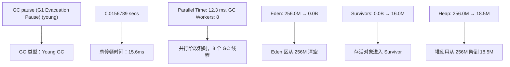
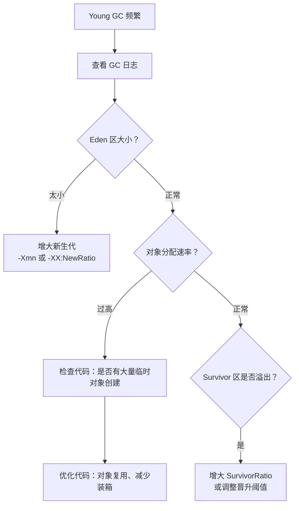
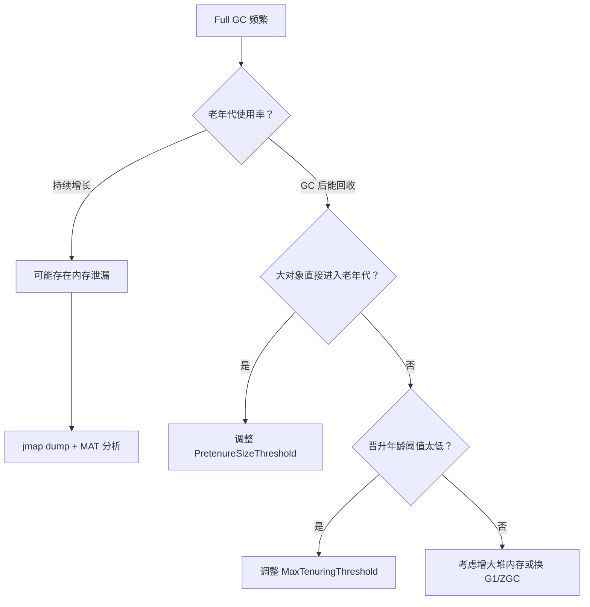

# JVM 调优参数与 GC 日志分析

## 概念说明

JVM 调优是将理论知识应用于实践的关键环节。面试中不仅会问 GC 原理，更会问"你在实际项目中是怎么调优的？"。掌握常用 JVM 参数、能读懂 GC 日志、能根据场景制定调优策略，是高级 Java 开发者的必备技能。

## 核心原理

### 常用 JVM 参数分类

#### 1. 内存相关参数

| 参数 | 说明 | 示例 |
|------|------|------|
| `-Xms` | 堆初始大小 | `-Xms512m` |
| `-Xmx` | 堆最大大小 | `-Xmx2g` |
| `-Xmn` | 新生代大小 | `-Xmn256m` |
| `-Xss` | 线程栈大小 | `-Xss512k` |
| `-XX:NewRatio` | 老年代/新生代比值 | `-XX:NewRatio=2`（老:新=2:1） |
| `-XX:SurvivorRatio` | Eden/Survivor 比值 | `-XX:SurvivorRatio=8`（Eden:S0:S1=8:1:1） |
| `-XX:MetaspaceSize` | 元空间初始大小 | `-XX:MetaspaceSize=256m` |
| `-XX:MaxMetaspaceSize` | 元空间最大大小 | `-XX:MaxMetaspaceSize=512m` |
| `-XX:MaxDirectMemorySize` | 直接内存最大大小 | `-XX:MaxDirectMemorySize=256m` |

> **最佳实践**：`-Xms` 和 `-Xmx` 设置为相同值，避免堆动态扩缩容带来的性能开销。

#### 2. GC 收集器选择参数

| 参数 | 收集器 | 说明 |
|------|--------|------|
| `-XX:+UseSerialGC` | Serial + Serial Old | 单线程，小内存 |
| `-XX:+UseParallelGC` | Parallel Scavenge + Parallel Old | JDK 8 默认，吞吐量优先 |
| `-XX:+UseConcMarkSweepGC` | ParNew + CMS | 低延迟（JDK 14 移除） |
| `-XX:+UseG1GC` | G1 | JDK 9+ 默认 |
| `-XX:+UseZGC` | ZGC | 超低延迟 |
| `-XX:+UseShenandoahGC` | Shenandoah | OpenJDK 低延迟 |

#### 3. GC 日志参数

**JDK 8 风格**：
```bash
-XX:+PrintGCDetails -XX:+PrintGCDateStamps -XX:+PrintGCTimeStamps
-Xloggc:/path/to/gc.log -XX:+UseGCLogFileRotation
-XX:NumberOfGCLogFiles=5 -XX:GCLogFileSize=20M
```

**JDK 9+ 统一日志框架（推荐）**：
```bash
-Xlog:gc*:file=/path/to/gc.log:time,uptime,level,tags:filecount=5,filesize=20M
```

#### 4. OOM 诊断参数

| 参数 | 说明 |
|------|------|
| `-XX:+HeapDumpOnOutOfMemoryError` | OOM 时自动生成堆转储 |
| `-XX:HeapDumpPath=/path/to/dump` | 堆转储文件路径 |
| `-XX:OnOutOfMemoryError="kill -9 %p"` | OOM 时执行指定命令 |
| `-XX:+ExitOnOutOfMemoryError` | OOM 时直接退出 JVM |

### GC 日志格式解读

#### JDK 8 GC 日志示例（G1）

```
2024-01-15T10:30:45.123+0800: 1.234: [GC pause (G1 Evacuation Pause) (young), 0.0156789 secs]
   [Parallel Time: 12.3 ms, GC Workers: 8]
      [GC Worker Start (ms): Min: 1234.0, Avg: 1234.1, Max: 1234.2, Diff: 0.2]
      [Ext Root Scanning (ms): Min: 0.1, Avg: 0.3, Max: 0.5, Diff: 0.4]
      [Update RS (ms): Min: 0.0, Avg: 0.1, Max: 0.2, Diff: 0.2]
      [Scan RS (ms): Min: 0.0, Avg: 0.1, Max: 0.1, Diff: 0.1]
      [Code Root Scanning (ms): Min: 0.0, Avg: 0.0, Max: 0.1, Diff: 0.1]
      [Object Copy (ms): Min: 10.1, Avg: 11.2, Max: 12.0, Diff: 1.9]
   [Code Root Fixup: 0.1 ms]
   [Code Root Purge: 0.0 ms]
   [Clear CT: 0.2 ms]
   [Other: 3.2 ms]
   [Eden: 256.0M(256.0M)->0.0B(240.0M) Survivors: 0.0B->16.0M Heap: 256.0M(512.0M)->18.5M(512.0M)]
 [Times: user=0.10 sys=0.01, real=0.02 secs]
```

**关键字段解读**：



#### JDK 17+ 统一日志格式

```
[2024-01-15T10:30:45.123+0800][1.234s][info][gc] GC(0) Pause Young (Normal) (G1 Evacuation Pause) 256M->18M(512M) 15.678ms
[2024-01-15T10:30:45.123+0800][1.234s][info][gc,phases] GC(0) Pre Evacuate Collection Set: 0.1ms
[2024-01-15T10:30:45.123+0800][1.234s][info][gc,phases] GC(0) Merge Heap Roots: 0.2ms
[2024-01-15T10:30:45.123+0800][1.234s][info][gc,phases] GC(0) Evacuate Collection Set: 12.3ms
[2024-01-15T10:30:45.123+0800][1.234s][info][gc,phases] GC(0) Post Evacuate Collection Set: 2.8ms
[2024-01-15T10:30:45.123+0800][1.234s][info][gc,phases] GC(0) Other: 0.3ms
```

### 调优实战案例

#### 案例一：Young GC 频繁

**现象**：Young GC 每秒触发多次，每次停顿 10-20ms，应用响应时间波动大。

**分析流程**：



**解决方案**：
```bash
# 原配置
-Xms512m -Xmx512m -Xmn128m

# 优化后：增大新生代，减少 Young GC 频率
-Xms1g -Xmx1g -Xmn384m -XX:SurvivorRatio=8
```

#### 案例二：Full GC 频繁

**现象**：Full GC 频繁触发，每次停顿 1-3 秒，系统出现明显卡顿。

**分析流程**：



**解决方案**：
```bash
# 切换到 G1，设置期望停顿时间
-XX:+UseG1GC -XX:MaxGCPauseMillis=200

# 如果是内存泄漏，先 dump 分析
-XX:+HeapDumpOnOutOfMemoryError -XX:HeapDumpPath=/tmp/heapdump.hprof
```

#### 案例三：OOM 排查

**现象**：应用运行一段时间后抛出 `OutOfMemoryError: Java heap space`。

**排查步骤**：
1. 确认 OOM 类型（heap space / Metaspace / GC overhead limit exceeded）
2. 获取堆转储文件（`-XX:+HeapDumpOnOutOfMemoryError`）
3. 使用 MAT（Memory Analyzer Tool）或 VisualVM 分析
4. 找到占用内存最大的对象，分析其 GC Root 引用链
5. 定位代码中的内存泄漏点

**常见 OOM 原因**：

| OOM 类型 | 常见原因 | 解决方案 |
|----------|----------|----------|
| Java heap space | 内存泄漏、堆太小 | 分析 dump、增大堆 |
| Metaspace | 动态生成大量类（CGLIB、反射） | 增大 MaxMetaspaceSize |
| GC overhead limit exceeded | GC 耗时超过 98% 但回收不到 2% 内存 | 增大堆或排查泄漏 |
| Direct buffer memory | NIO DirectByteBuffer 过多 | 增大 MaxDirectMemorySize |
| unable to create new native thread | 线程过多 | 减小 Xss 或增加系统线程限制 |

#### 案例四：容器环境下的 JVM 调优

在 Docker/K8s 环境中，JVM 需要感知容器的内存限制：

```bash
# JDK 8u191+ / JDK 10+ 自动感知容器内存限制
# 推荐配置
-XX:+UseContainerSupport          # 默认开启
-XX:MaxRAMPercentage=75.0         # 堆最大占容器内存的 75%
-XX:InitialRAMPercentage=75.0     # 堆初始大小
-XX:MinRAMPercentage=50.0         # 堆最小大小

# 容器内存 2GB 时，堆约 1.5GB
```

**容器调优注意事项**：
1. **不要用 `-Xms`/`-Xmx` 固定值**：容器内存可能动态调整，用百分比更灵活
2. **预留内存给非堆区域**：元空间、线程栈、直接内存、JIT 代码缓存等需要额外内存
3. **JDK 8u131 之前不感知容器限制**：会读取宿主机内存，导致 OOM

```
容器内存分配建议：
┌─────────────────────────────────────┐
│ 容器总内存 (如 2GB)                   │
│ ┌─────────────────────────────────┐ │
│ │ JVM 堆 (75%) = 1.5GB            │ │
│ ├─────────────────────────────────┤ │
│ │ 元空间 (~256MB)                  │ │
│ │ 线程栈 (线程数 × Xss)            │ │
│ │ 直接内存 (~128MB)                │ │
│ │ JIT 代码缓存 (~240MB)            │ │
│ │ GC 开销 + 其他                   │ │
│ └─────────────────────────────────┘ │
└─────────────────────────────────────┘
```

## 代码示例

```java
/**
 * GC 日志生成演示
 * 运行参数（JDK 17+）：
 * -Xms256m -Xmx256m -Xmn128m
 * -XX:+UseG1GC
 * -Xlog:gc*:file=gc.log:time,uptime,level,tags
 */
public static void generateGCLog() {
    List<byte[]> list = new ArrayList<>();
    for (int i = 0; i < 100; i++) {
        list.add(new byte[1024 * 1024]); // 1MB
        if (i % 10 == 0) {
            list.subList(0, list.size() / 2).clear(); // 释放一半
        }
    }
}
```

> 💻 完整可运行代码：[code-examples/01-java-core/jvm-deep-dive/.../tuning/TuningDemo.java](../../../code-examples/01-java-core/jvm-deep-dive/src/main/java/com/example/jvm/05-tuning/TuningDemo.java)

## 常见面试题

### Q1: 你在项目中是怎么做 JVM 调优的？

**难度**：⭐⭐⭐ | **频率**：🔥🔥🔥

**答题思路**：按"发现问题 → 分析问题 → 解决问题"的思路回答，结合实际案例。

**标准答案**：

JVM 调优的一般流程：
1. **监控**：通过 Prometheus + Grafana 监控 GC 频率、停顿时间、堆使用率
2. **分析**：发现异常后，查看 GC 日志，使用 jstat 观察实时 GC 情况
3. **定位**：如果是内存问题，jmap dump 后用 MAT 分析；如果是 GC 问题，分析 GC 日志中的停顿时间和回收效率
4. **调优**：根据分析结果调整参数（堆大小、收集器选择、新生代比例等）
5. **验证**：灰度发布，对比调优前后的指标

**深入追问**：
- `-Xms` 和 `-Xmx` 为什么要设置成一样？
- 容器环境下怎么设置 JVM 参数？
- G1 的 `MaxGCPauseMillis` 设置多少合适？

### Q2: 常见的 OOM 有哪些？怎么排查？

**难度**：⭐⭐⭐ | **频率**：🔥🔥🔥

**标准答案**：

常见 OOM 类型及排查方法：
1. **Java heap space**：堆内存不足。加 `-XX:+HeapDumpOnOutOfMemoryError`，用 MAT 分析 dump 文件，找到大对象和泄漏点
2. **Metaspace**：元空间不足，通常是动态生成了大量类。增大 `MaxMetaspaceSize`，排查是否有类加载器泄漏
3. **GC overhead limit exceeded**：GC 耗时过长但回收效果差。通常是堆太小或存在内存泄漏
4. **unable to create new native thread**：线程过多。减小 `-Xss` 或优化线程池配置

**易错点**：
- 不是所有 OOM 都是堆内存不足，要先确认 OOM 类型
- 增大堆内存不一定能解决问题，可能只是延迟了 OOM

## 参考资料

- [深入理解 Java 虚拟机（第 3 版）— 第 5 章](https://book.douban.com/subject/34907497/)
- [JDK 21 GC Tuning Guide](https://docs.oracle.com/en/java/javase/21/gctuning/)
- [Eclipse MAT](https://eclipse.dev/mat/)
