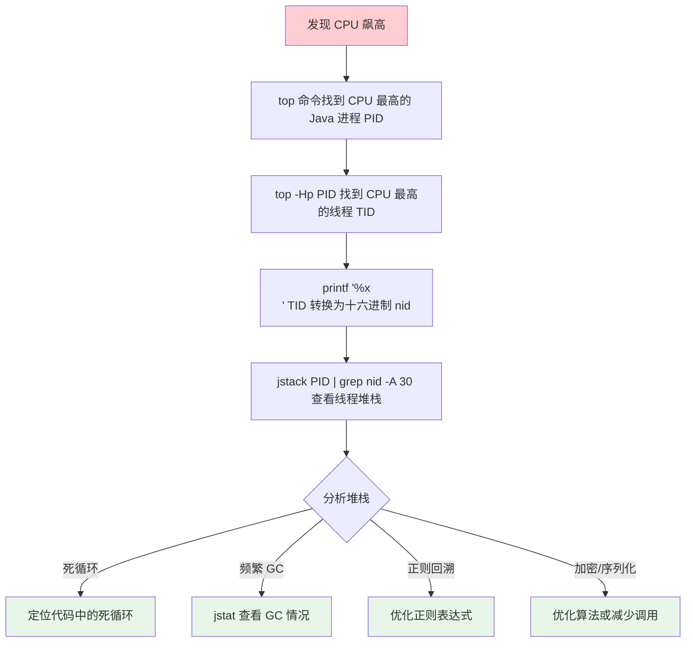
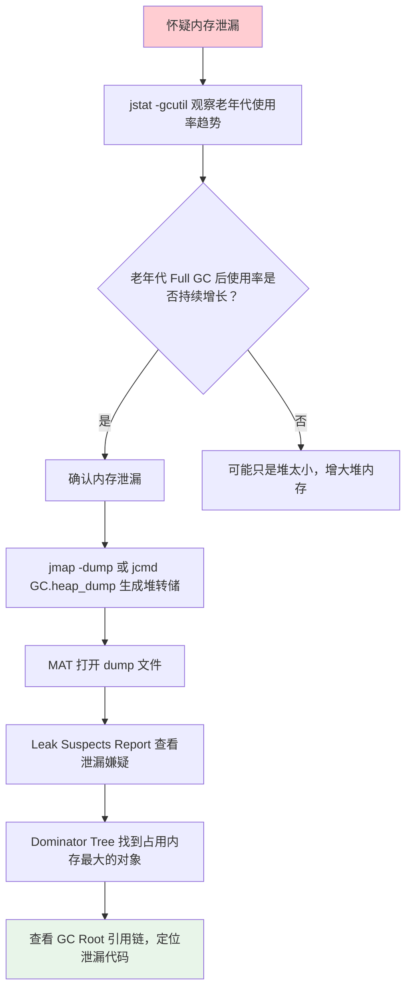
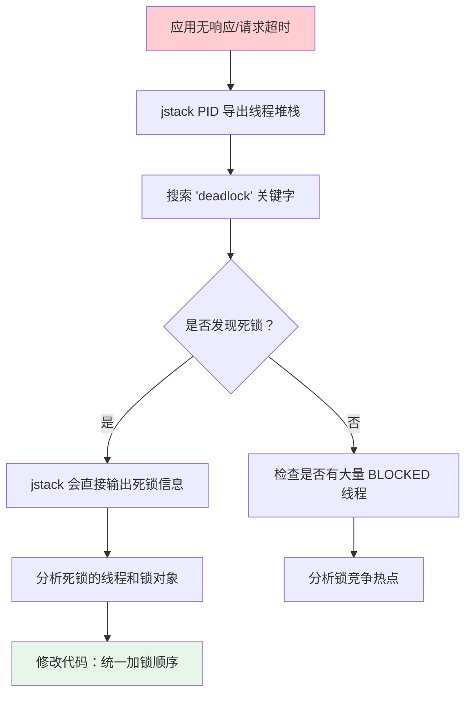

# 诊断工具与线上问题排查

## 概念说明

线上问题排查是高级 Java 开发者的核心能力。面试中经常会问"CPU 飙高怎么排查？"、"内存泄漏怎么定位？"、"线程死锁怎么发现？"。掌握 JDK 自带工具和第三方诊断工具的使用，是解决这些问题的关键。

## 核心原理

### JDK 自带诊断工具

#### 1. jps — 查看 Java 进程

```bash
# 列出所有 Java 进程
$ jps -l
12345 com.example.Application
12346 org.apache.catalina.startup.Bootstrap

# 显示 JVM 参数
$ jps -v
12345 Application -Xms512m -Xmx1g -XX:+UseG1GC

# 常用选项
# -l  显示主类全限定名
# -v  显示 JVM 参数
# -m  显示传递给 main 方法的参数
```

#### 2. jstat — 监控 GC 统计信息

```bash
# 查看 GC 统计（每 1 秒输出一次，共 10 次）
$ jstat -gcutil <pid> 1000 10
  S0     S1     E      O      M     CCS    YGC     YGCT    FGC    FGCT     GCT
  0.00  45.23  67.89  34.56  95.12  92.34    15    0.234     2    0.567   0.801

# 字段说明：
# S0/S1  — Survivor 0/1 使用率
# E      — Eden 区使用率
# O      — 老年代使用率
# M      — 元空间使用率
# YGC    — Young GC 次数
# YGCT   — Young GC 总耗时（秒）
# FGC    — Full GC 次数
# FGCT   — Full GC 总耗时（秒）
# GCT    — GC 总耗时

# 查看堆内存详情
$ jstat -gc <pid> 1000
 S0C    S1C    S0U    S1U      EC       EU        OC         OU       MC     MU
10240  10240   0.0   4632.0  81920.0  55678.0   204800.0   70912.0  52224.0 49876.0

# C = Capacity（容量），U = Used（已使用）
```

**关键指标判断**：
- `FGC` 持续增长 → Full GC 频繁，需要排查
- `O` 持续接近 100% → 老年代满，可能内存泄漏
- `FGCT/FGC` 平均值过大 → 单次 Full GC 耗时过长

#### 3. jstack — 线程堆栈分析

```bash
# 导出线程堆栈
$ jstack <pid> > thread_dump.txt

# 强制导出（进程无响应时）
$ jstack -F <pid>

# 输出示例：
"main" #1 prio=5 os_prio=0 tid=0x00007f8b0c009800 nid=0x1234 waiting on condition [0x00007f8b14567000]
   java.lang.Thread.State: TIMED_WAITING (sleeping)
        at java.lang.Thread.sleep(Native Method)
        at com.example.Application.main(Application.java:15)

"pool-1-thread-1" #12 prio=5 os_prio=0 tid=0x00007f8b0c234000 nid=0x1240 waiting for monitor entry [0x00007f8b12345000]
   java.lang.Thread.State: BLOCKED (on object monitor)
        at com.example.Service.process(Service.java:42)
        - waiting to lock <0x00000000d6789abc> (a java.lang.Object)
        - locked <0x00000000d6789def> (a java.lang.Object)
```

**线程状态关注点**：

| 状态 | 含义 | 是否需要关注 |
|------|------|-------------|
| RUNNABLE | 正在执行或等待 CPU | 大量 RUNNABLE 可能 CPU 飙高 |
| BLOCKED | 等待获取锁 | 大量 BLOCKED 可能死锁或锁竞争 |
| WAITING | 无限期等待 | 检查是否合理 |
| TIMED_WAITING | 有限期等待 | 通常正常（sleep/wait） |

#### 4. jmap — 堆内存分析

```bash
# 查看堆内存概况
$ jmap -heap <pid>
Heap Configuration:
   MinHeapFreeRatio         = 40
   MaxHeapFreeRatio         = 70
   MaxHeapSize              = 1073741824 (1024.0MB)
   NewSize                  = 357564416 (341.0MB)
   MaxNewSize               = 357564416 (341.0MB)
   OldSize                  = 716177408 (683.0MB)

# 查看对象统计（按实例数排序）
$ jmap -histo <pid> | head -20
 num     #instances         #bytes  class name
   1:       1234567       98765432  [B (byte[])
   2:        567890       45678900  java.lang.String
   3:        345678       27654240  java.util.HashMap$Node

# 生成堆转储文件（会触发 Full GC，线上慎用！）
$ jmap -dump:format=b,file=heapdump.hprof <pid>

# 只 dump 存活对象（先触发 GC）
$ jmap -dump:live,format=b,file=heapdump.hprof <pid>
```

> ⚠️ **线上注意**：`jmap -dump` 会导致 STW，大堆可能停顿数十秒。建议用 `jcmd` 替代。

#### 5. jcmd — 万能诊断工具（推荐）

```bash
# 查看可用命令
$ jcmd <pid> help

# 生成堆转储（推荐替代 jmap）
$ jcmd <pid> GC.heap_dump /tmp/heapdump.hprof

# 查看 GC 信息
$ jcmd <pid> GC.heap_info

# 查看线程堆栈
$ jcmd <pid> Thread.print

# 查看 JVM 参数
$ jcmd <pid> VM.flags

# 查看系统属性
$ jcmd <pid> VM.system_properties

# 触发 GC
$ jcmd <pid> GC.run

# 查看类加载统计
$ jcmd <pid> VM.classloader_stats
```

### Arthas — 阿里开源诊断工具

Arthas 是阿里巴巴开源的 Java 诊断工具，功能强大且无需重启应用。

```bash
# 安装并启动
$ curl -O https://arthas.aliyun.com/arthas-boot.jar
$ java -jar arthas-boot.jar

# 常用命令

# 1. dashboard — 实时面板
$ dashboard
# 显示线程、内存、GC 等实时信息

# 2. thread — 线程分析
$ thread              # 查看所有线程
$ thread -n 3         # 查看 CPU 占用最高的 3 个线程
$ thread -b           # 查看阻塞其他线程的线程（死锁检测）
$ thread <id>         # 查看指定线程的堆栈

# 3. jad — 反编译
$ jad com.example.Service  # 反编译查看运行时代码

# 4. watch — 方法监控
$ watch com.example.Service process "{params, returnObj, throwExp}" -x 3
# 监控方法的入参、返回值、异常

# 5. trace — 方法调用链路耗时
$ trace com.example.Service process
# 输出方法内部调用链路和每步耗时

# 6. sc/sm — 查看类和方法信息
$ sc -d com.example.Service    # 查看类详情
$ sm com.example.Service       # 查看类的所有方法

# 7. heapdump — 堆转储
$ heapdump /tmp/heapdump.hprof

# 8. profiler — 火焰图
$ profiler start       # 开始采样
$ profiler stop --format html --file /tmp/flamegraph.html  # 生成火焰图
```

### async-profiler — 火焰图分析

```bash
# 下载 async-profiler
# CPU 火焰图
$ ./profiler.sh -d 30 -f cpu_flamegraph.html <pid>

# 内存分配火焰图
$ ./profiler.sh -d 30 -e alloc -f alloc_flamegraph.html <pid>

# 锁竞争火焰图
$ ./profiler.sh -d 30 -e lock -f lock_flamegraph.html <pid>
```

**火焰图解读**：
- X 轴：函数调用栈（宽度代表 CPU 占用比例）
- Y 轴：调用深度（从下到上是调用链）
- 颜色：随机分配，无特殊含义
- **关注点**：顶部最宽的"平顶"就是 CPU 热点

### 线上问题排查流程

#### CPU 飙高排查流程



**完整命令示例**：
```bash
# 1. 找到 CPU 最高的 Java 进程
$ top -c
# 假设 PID = 12345

# 2. 找到该进程中 CPU 最高的线程
$ top -Hp 12345
# 假设 TID = 12378

# 3. 将线程 ID 转为十六进制
$ printf '%x\n' 12378
305a

# 4. 在 jstack 输出中查找该线程
$ jstack 12345 | grep '0x305a' -A 30

# 或者用 Arthas 一步到位
$ thread -n 3
```

#### 内存泄漏排查流程



**常见内存泄漏场景**：
1. **集合类持有对象引用**：`static List` 不断添加元素但不清理
2. **ThreadLocal 未清理**：线程池中的线程复用，ThreadLocal 值不会自动清理
3. **监听器/回调未注销**：注册了事件监听但忘记注销
4. **连接未关闭**：数据库连接、HTTP 连接未正确关闭
5. **ClassLoader 泄漏**：热部署时旧的 ClassLoader 未被回收

#### 线程死锁排查流程



**jstack 死锁输出示例**：
```
Found one Java-level deadlock:
=============================
"Thread-1":
  waiting to lock monitor 0x00007f8b0c001234 (object 0x00000000d6789abc, a java.lang.Object),
  which is held by "Thread-0"
"Thread-0":
  waiting to lock monitor 0x00007f8b0c005678 (object 0x00000000d6789def, a java.lang.Object),
  which is held by "Thread-1"

Java stack information for the threads listed above:
===================================================
"Thread-1":
        at com.example.DeadlockDemo.methodB(DeadlockDemo.java:30)
        - waiting to lock <0x00000000d6789abc>
        - locked <0x00000000d6789def>
"Thread-0":
        at com.example.DeadlockDemo.methodA(DeadlockDemo.java:20)
        - waiting to lock <0x00000000d6789def>
        - locked <0x00000000d6789abc>
```

## 代码示例

```java
// 模拟 CPU 飙高 — 死循环
public static void simulateHighCPU() {
    new Thread(() -> {
        while (true) { /* 空循环，CPU 100% */ }
    }, "high-cpu-thread").start();
}

// 模拟内存泄漏 — 不断添加到静态集合
static List<byte[]> leakList = new ArrayList<>();
public static void simulateMemoryLeak() {
    while (true) {
        leakList.add(new byte[1024 * 100]); // 100KB
        Thread.sleep(10);
    }
}

// 模拟死锁
public static void simulateDeadlock() {
    Object lockA = new Object(), lockB = new Object();
    new Thread(() -> { synchronized(lockA) { sleep(100); synchronized(lockB) {} } }).start();
    new Thread(() -> { synchronized(lockB) { sleep(100); synchronized(lockA) {} } }).start();
}
```

> 💻 完整可运行代码：[code-examples/01-java-core/jvm-deep-dive/.../diagnostic/DiagnosticDemo.java](https://github.com/skyhe58/guide-java/tree/main/code-examples/01-java-core/jvm-deep-dive/src/main/java/com/example/jvm/06-diagnostic/DiagnosticDemo.java)
> <!-- 本地路径：code-examples/01-java-core/jvm-deep-dive/src/main/java/com/example/jvm/06-diagnostic/DiagnosticDemo.java -->

## 常见面试题

### Q1: CPU 飙高怎么排查？

**难度**：⭐⭐⭐ | **频率**：🔥🔥🔥

**标准答案**：

1. `top` 找到 CPU 最高的 Java 进程 PID
2. `top -Hp PID` 找到 CPU 最高的线程 TID
3. `printf '%x\n' TID` 转为十六进制
4. `jstack PID | grep nid -A 30` 查看该线程堆栈
5. 分析堆栈定位问题代码（死循环、频繁 GC、正则回溯等）

或者直接用 Arthas：`thread -n 3` 查看 CPU 最高的 3 个线程。

### Q2: 内存泄漏怎么排查？

**难度**：⭐⭐⭐ | **频率**：🔥🔥🔥

**标准答案**：

1. `jstat -gcutil` 观察老年代使用率，确认 Full GC 后是否持续增长
2. `jmap -dump` 或 `jcmd GC.heap_dump` 生成堆转储
3. 用 MAT 打开 dump 文件，查看 Leak Suspects Report
4. 通过 Dominator Tree 找到占用内存最大的对象
5. 分析 GC Root 引用链，定位泄漏代码

**深入追问**：
- 常见的内存泄漏场景有哪些？
- ThreadLocal 为什么会导致内存泄漏？
- MAT 中的 Shallow Heap 和 Retained Heap 有什么区别？

## 参考资料

- [Arthas 官方文档](https://arthas.aliyun.com/doc/)
- [async-profiler GitHub](https://github.com/async-profiler/async-profiler)
- [Eclipse MAT 使用指南](https://eclipse.dev/mat/)
- [JDK Mission Control](https://www.oracle.com/java/technologies/jdk-mission-control.html)
