# JVM 面试指南

## 概述

JVM 是 Java 面试中的**重灾区**，几乎每场面试都会涉及。本指南按面试频率从高到低汇总 JVM 高频面试题，并提供追问链路，帮助你系统准备。

## 面试知识图谱

```mermaid
flowchart TD
    JVM["JVM 面试知识图谱"]

    JVM --> MEM["内存区域"]
    JVM --> GC["垃圾回收"]
    JVM --> CL["类加载"]
    JVM --> TUNE["调优与诊断"]
    JVM --> JIT["JIT 编译"]

    MEM --> MEM1["堆/栈/方法区/PC/本地方法栈"]
    MEM --> MEM2["对象创建过程"]
    MEM --> MEM3["对象内存布局 Mark Word"]
    MEM --> MEM4["元空间替代永久代"]

    GC --> GC1["GC Roots 可达性分析"]
    GC --> GC2["三大算法：标记清除/复制/整理"]
    GC --> GC3["收集器：CMS/G1/ZGC"]
    GC --> GC4["三色标记法"]
    GC --> GC5["四种引用类型"]

    CL --> CL1["五个阶段"]
    CL --> CL2["双亲委派模型"]
    CL --> CL3["打破双亲委派：SPI/Tomcat"]

    TUNE --> TUNE1["常用 JVM 参数"]
    TUNE --> TUNE2["GC 日志分析"]
    TUNE --> TUNE3["CPU 飙高排查"]
    TUNE --> TUNE4["OOM 排查"]
    TUNE --> TUNE5["死锁排查"]

    JIT --> JIT1["C1/C2 编译器"]
    JIT --> JIT2["逃逸分析"]
    JIT --> JIT3["栈上分配/标量替换/锁消除"]

    style JVM fill:#e1f5fe
    style MEM fill:#fff3e0
    style GC fill:#fce4ec
    style CL fill:#e8f5e9
    style TUNE fill:#f3e5f5
    style JIT fill:#fff9c4
```



## 高频面试题汇总（按频率排序）

---

### 🔥🔥🔥 第一梯队：必问题（出现率 > 80%）

#### Q1: 说说 JVM 的内存区域划分？

**难度**：⭐⭐⭐ | **频率**：🔥🔥🔥 | **详细解析**：[memory-model](./01-memory-model.md)

**答题思路**：
1. 先分两大类：线程共享 vs 线程私有
2. 逐个介绍每个区域的作用
3. 重点说堆的分代结构和方法区的演进

**标准答案**：

JVM 运行时数据区分为 5 个部分：
- **线程共享**：堆（存放对象实例，GC 主要区域）、方法区（存放类信息、常量、静态变量，JDK 8 后用元空间实现）
- **线程私有**：虚拟机栈（方法调用的栈帧）、本地方法栈（Native 方法）、程序计数器（字节码行号指示器）

堆分为新生代（Eden + 2 个 Survivor）和老年代，默认比例 1:2。

**追问链路**：
- → 为什么用元空间替代永久代？（永久代大小固定易 OOM，元空间用本地内存）
- → 对象一定在堆上分配吗？（不一定，逃逸分析后可能栈上分配/标量替换）
- → TLAB 是什么？（Thread Local Allocation Buffer，线程私有的 Eden 区缓冲）
- → 对象的创建过程？（类加载检查 → 内存分配 → 零值初始化 → 设置对象头 → 构造方法）
- → Mark Word 中存了什么？（哈希码、GC 年龄、锁状态标志，不同锁状态内容不同）

**易错点**：
- 混淆 JVM 内存区域和 Java 内存模型（JMM）— 两者是完全不同的概念
- 认为 JDK 8 之后没有方法区 — 方法区是规范，元空间是实现

---

#### Q2: 说说 CMS 和 G1 的区别？

**难度**：⭐⭐⭐ | **频率**：🔥🔥🔥 | **详细解析**：[gc](./02-gc.md)

**答题思路**：从内存布局、算法、停顿时间、适用场景四个维度对比。

**标准答案**：

| 对比维度 | CMS | G1 |
|----------|-----|-----|
| 内存布局 | 传统分代（新生代+老年代） | Region 模型，逻辑分代 |
| 算法 | 标记-清除 | 标记-复制（整体）+ 标记-整理（局部） |
| 碎片 | 有碎片，可能触发 Full GC | 基本无碎片 |
| 停顿控制 | 不可预测 | 可设置期望停顿时间（`-XX:MaxGCPauseMillis`） |
| 适用堆大小 | 中小堆（< 8GB） | 大堆（> 6GB） |
| JDK 状态 | JDK 9 标记废弃，JDK 14 移除 | JDK 9+ 默认收集器 |

**追问链路**：
- → CMS 的四个阶段？（初始标记 STW → 并发标记 → 重新标记 STW → 并发清除）
- → CMS 用什么解决并发标记期间的对象引用变化？（增量更新 Incremental Update）
- → G1 用什么解决？（SATB — Snapshot At The Beginning，原始快照）
- → 什么是三色标记法？（白色未访问、灰色已访问但子节点未完成、黑色已完成）
- → G1 的 Mixed GC 怎么触发？（老年代占比超过 `InitiatingHeapOccupancyPercent` 默认 45%）
- → G1 的 Region 大小怎么确定？（1~32MB，2 的幂）

---

#### Q3: 说说类加载的过程？双亲委派模型？

**难度**：⭐⭐⭐ | **频率**：🔥🔥🔥 | **详细解析**：[classloading](./03-classloading.md)

**标准答案**：

类加载分为五个阶段：加载 → 验证 → 准备 → 解析 → 初始化。

双亲委派模型：类加载器收到加载请求时，先委派给父加载器，父加载器无法加载时才自己加载。三层结构：Bootstrap ClassLoader → Extension/Platform ClassLoader → Application ClassLoader。

**追问链路**：
- → 准备阶段 `static int a = 1` 的值是什么？（0，初始化阶段才赋值为 1）
- → `static final int b = 1` 呢？（准备阶段就是 1，ConstantValue 属性）
- → 什么情况下不会触发类初始化？（被动引用：子类引用父类静态字段、数组定义、引用常量）
- → 为什么要打破双亲委派？举例？（SPI：线程上下文类加载器；Tomcat：WebAppClassLoader 类隔离）
- → JDBC 是怎么通过 SPI 打破双亲委派的？（DriverManager 在 rt.jar 中，但 Driver 实现在 classpath 下）
- → 自定义 ClassLoader 重写哪个方法？（`findClass()` 保持双亲委派，`loadClass()` 打破双亲委派）

---

#### Q4: CPU 飙高怎么排查？

**难度**：⭐⭐⭐ | **频率**：🔥🔥🔥 | **详细解析**：[diagnostic](./06-diagnostic.md)

**标准答案**：

1. `top` 找到 CPU 最高的 Java 进程 PID
2. `top -Hp PID` 找到 CPU 最高的线程 TID
3. `printf '%x\n' TID` 转为十六进制
4. `jstack PID | grep nid -A 30` 查看该线程堆栈
5. 分析堆栈定位问题代码

或者直接用 Arthas：`thread -n 3`。

**追问链路**：
- → 常见的 CPU 飙高原因？（死循环、频繁 GC、正则回溯、加密/序列化计算密集）
- → 如果是频繁 GC 导致的怎么办？（jstat 查看 GC 情况，分析是 Young GC 还是 Full GC）
- → Arthas 还有哪些常用命令？（dashboard、trace、watch、jad、profiler）

---

#### Q5: 内存泄漏怎么排查？常见的 OOM 有哪些？

**难度**：⭐⭐⭐ | **频率**：🔥🔥🔥 | **详细解析**：[diagnostic](./06-diagnostic.md)、[tuning](./05-tuning.md)

**标准答案**：

排查流程：
1. `jstat -gcutil` 观察老年代使用率趋势
2. `jmap -dump` 或 `jcmd GC.heap_dump` 生成堆转储
3. MAT 打开 dump → Leak Suspects → Dominator Tree → GC Root 引用链

常见 OOM 类型：

| 类型 | 原因 |
|------|------|
| Java heap space | 堆内存不足/内存泄漏 |
| Metaspace | 动态生成大量类 |
| GC overhead limit exceeded | GC 耗时 > 98% 但回收 < 2% |
| unable to create new native thread | 线程过多 |

**追问链路**：
- → 常见的内存泄漏场景？（静态集合、ThreadLocal 未清理、监听器未注销、连接未关闭）
- → ThreadLocal 为什么会内存泄漏？（线程池复用线程，Entry 的 key 是弱引用被回收但 value 还在）
- → MAT 中 Shallow Heap 和 Retained Heap 的区别？（Shallow 是对象自身大小，Retained 是对象被回收后能释放的总大小）

---

### 🔥🔥 第二梯队：常问题（出现率 40%-80%）

#### Q6: 说说 GC Roots 有哪些？什么是可达性分析？

**难度**：⭐⭐⭐ | **频率**：🔥🔥 | **详细解析**：[gc](./02-gc.md)

**标准答案**：

可达性分析：从 GC Roots 出发，沿引用链向下搜索，不可达的对象即为可回收对象。

GC Roots 包括：
1. 虚拟机栈中的引用（局部变量）
2. 方法区中的静态属性引用
3. 方法区中的常量引用
4. 本地方法栈中的 JNI 引用
5. synchronized 持有的对象
6. JVM 内部引用（基本类型的 Class 对象、系统类加载器等）

**追问链路**：
- → 引用计数法为什么不行？（无法解决循环引用）
- → 四种引用类型？（强 → 软 → 弱 → 虚，回收时机不同）
- → 软引用和弱引用的使用场景？（软引用做缓存，弱引用如 ThreadLocalMap 的 Entry）

---

#### Q7: 三大 GC 算法的区别？分别用在哪里？

**难度**：⭐⭐ | **频率**：🔥🔥 | **详细解析**：[gc](./02-gc.md)

**标准答案**：

| 算法 | 优点 | 缺点 | 适用场景 |
|------|------|------|----------|
| 标记-清除 | 实现简单 | 内存碎片 | CMS 老年代 |
| 标记-复制 | 无碎片、效率高 | 浪费一半空间 | 新生代（Eden + Survivor） |
| 标记-整理 | 无碎片 | 移动对象开销大 | 老年代（Serial Old、Parallel Old） |

**追问链路**：
- → 新生代为什么用复制算法？（朝生夕灭，存活对象少，复制开销小）
- → 什么是分代收集理论？（弱分代假说 + 强分代假说）
- → 跨代引用怎么处理？（记忆集 + 卡表）

---

#### Q8: 什么是逃逸分析？对象一定在堆上分配吗？

**难度**：⭐⭐⭐ | **频率**：🔥🔥 | **详细解析**：[jit](./04-jit.md)

**标准答案**：

逃逸分析判断对象是否会逃逸出方法或线程作用域。不逃逸的对象可以进行三种优化：
1. **标量替换**：将对象拆解为基本类型，对象不会被创建
2. **栈上分配**：在栈上分配而非堆上，方法结束自动回收（HotSpot 通过标量替换实现）
3. **锁消除**：不逃逸到其他线程的对象，同步操作可以消除

所以对象不一定在堆上分配，逃逸分析后可能在栈上分配。

**追问链路**：
- → 逃逸分析默认开启吗？（JDK 8+ 默认开启，`-XX:+DoEscapeAnalysis`）
- → HotSpot 真的实现了栈上分配吗？（实际通过标量替换实现类似效果）
- → 什么是方法内联？（将被调用方法的代码嵌入调用者中，消除调用开销）

---

#### Q9: 你在项目中是怎么做 JVM 调优的？

**难度**：⭐⭐⭐ | **频率**：🔥🔥 | **详细解析**：[tuning](./05-tuning.md)

**标准答案**：

调优流程：
1. **监控**：Prometheus + Grafana 监控 GC 频率、停顿时间、堆使用率
2. **分析**：查看 GC 日志，jstat 观察实时 GC 情况
3. **定位**：内存问题用 jmap dump + MAT；GC 问题分析日志中的停顿时间
4. **调优**：调整堆大小、收集器选择、新生代比例等
5. **验证**：灰度发布，对比调优前后指标

**追问链路**：
- → `-Xms` 和 `-Xmx` 为什么设成一样？（避免堆动态扩缩容的性能开销）
- → 容器环境下怎么设置 JVM 参数？（`-XX:MaxRAMPercentage=75.0`，不用固定值）
- → G1 的 `MaxGCPauseMillis` 设多少合适？（默认 200ms，根据业务 SLA 调整）

---

#### Q10: 什么是 ZGC？它是怎么实现低延迟的？

**难度**：⭐⭐⭐ | **频率**：🔥🔥 | **详细解析**：[gc](./02-gc.md)

**标准答案**：

ZGC 通过两个核心技术实现超低延迟（STW < 1ms）：
1. **着色指针（Colored Pointers）**：在 64 位指针中借用 4 个 bit 存储 GC 元数据
2. **读屏障（Load Barrier）**：加载对象引用时检查指针颜色，实现并发转移

几乎所有阶段都与应用线程并发执行，停顿时间与堆大小无关。

**追问链路**：
- → ZGC 和 G1 的主要区别？（ZGC 支持并发整理，停顿 < 1ms vs G1 几十~几百 ms）
- → ZGC 为什么不需要记忆集？（着色指针 + 读屏障可以处理跨 Region 引用）
- → 什么时候选 ZGC？（超低延迟要求，如金融交易系统，JDK 15+ 生产就绪）

---

### 🔥 第三梯队：偶尔问（出现率 < 40%）

#### Q11: 什么是三色标记法？CMS 和 G1 分别怎么处理并发标记的问题？

**难度**：⭐⭐⭐ | **频率**：🔥

**标准答案**：

三色标记法将对象分为三种颜色：
- **白色**：未被访问，GC 结束后仍为白色的对象将被回收
- **灰色**：已被访问，但其引用的对象还未全部扫描完
- **黑色**：已被访问，且其引用的对象都已扫描完

并发标记期间，应用线程可能修改引用关系，导致两个问题：
- **浮动垃圾**：本应回收的对象被标记为存活（可接受，下次 GC 回收）
- **对象消失**：存活对象被错误回收（不可接受！）

**对象消失的条件**（同时满足）：
1. 赋值器插入了一条从黑色对象到白色对象的新引用
2. 赋值器删除了所有从灰色对象到该白色对象的直接或间接引用

**解决方案**：

| 方案 | 破坏条件 | 使用者 | 实现 |
|------|----------|--------|------|
| 增量更新（Incremental Update） | 破坏条件 1 | CMS | 写屏障记录新增引用，重新标记阶段重新扫描 |
| 原始快照（SATB） | 破坏条件 2 | G1 | 写屏障记录删除的引用，保留引用删除前的快照 |

**追问链路**：
- → SATB 为什么比增量更新效率高？（SATB 只需记录删除的引用，重新标记阶段扫描量更少）
- → 什么是安全点（Safepoint）？（程序执行到特定位置才能暂停进行 GC，如方法调用、循环回边）

---

#### Q12: 什么是安全点（Safepoint）和安全区域（Safe Region）？

**难度**：⭐⭐⭐ | **频率**：🔥

**标准答案**：

**安全点**：程序执行中的特定位置，在这些位置上 GC 可以安全地暂停线程。常见安全点包括：方法调用、循环回边、异常跳转等。

GC 发生时，JVM 需要让所有线程都到达安全点才能开始 STW。两种方式：
- **抢先式中断**：先中断所有线程，不在安全点的恢复执行到安全点（几乎不用）
- **主动式中断**：设置标志位，线程轮询到标志位时主动中断（主流方式）

**安全区域**：线程处于 Sleep 或 Blocked 状态时无法主动到达安全点，安全区域是引用关系不会变化的代码片段，线程进入安全区域后标记自己，GC 时不需要等待这些线程。

---

#### Q13: 堆内存的分配策略有哪些？

**难度**：⭐⭐ | **频率**：🔥

**标准答案**：

1. **对象优先在 Eden 区分配**：大多数对象在 Eden 区创建
2. **大对象直接进入老年代**：超过 `-XX:PretenureSizeThreshold` 的对象直接分配到老年代
3. **长期存活的对象进入老年代**：对象年龄达到 `-XX:MaxTenuringThreshold`（默认 15）后晋升
4. **动态年龄判断**：Survivor 区中相同年龄的对象大小总和超过 Survivor 空间的一半，则该年龄及以上的对象直接进入老年代
5. **空间分配担保**：Minor GC 前检查老年代最大可用连续空间是否大于新生代所有对象总空间

---

## 面试场景模拟

### 场景一：大厂一面（基础 + 原理）

```
面试官：说说 JVM 的内存区域？
你：（回答 Q1）
面试官：对象一定在堆上分配吗？
你：不一定，逃逸分析后可能栈上分配...（引出 Q8）
面试官：说说 GC 算法和收集器？
你：（回答 Q7 + Q2）
面试官：CMS 和 G1 怎么处理并发标记的问题？
你：三色标记法...（回答 Q11）
```

### 场景二：大厂二面（实战 + 调优）

```
面试官：线上 CPU 飙高怎么排查？
你：（回答 Q4）
面试官：如果是频繁 GC 导致的呢？
你：jstat 查看 GC 情况...（引出 Q9）
面试官：你在项目中做过 JVM 调优吗？
你：（回答 Q9，结合实际案例）
面试官：容器环境下怎么设置 JVM 参数？
你：-XX:MaxRAMPercentage=75.0...
```

### 场景三：中厂面试（广度优先）

```
面试官：说说类加载过程？
你：（回答 Q3）
面试官：什么情况下会打破双亲委派？
你：SPI、Tomcat、热部署...
面试官：常见的 OOM 有哪些？怎么排查？
你：（回答 Q5）
```

## 复习检查清单

| 知识点 | 掌握程度 | 对应文档 |
|--------|----------|----------|
| JVM 内存区域（5 个区域 + 分代结构） | ☐ | [memory-model](./01-memory-model.md) |
| 对象创建过程（6 步） | ☐ | [memory-model](./01-memory-model.md) |
| 对象内存布局（Mark Word） | ☐ | [memory-model](./01-memory-model.md) |
| GC Roots + 可达性分析 | ☐ | [gc](./02-gc.md) |
| 三大 GC 算法 | ☐ | [gc](./02-gc.md) |
| CMS 四个阶段 | ☐ | [gc](./02-gc.md) |
| G1 Region 模型 + Mixed GC | ☐ | [gc](./02-gc.md) |
| ZGC 着色指针 + 读屏障 | ☐ | [gc](./02-gc.md) |
| 三色标记法 + SATB/增量更新 | ☐ | [gc](./02-gc.md) |
| 类加载五个阶段 | ☐ | [classloading](./03-classloading.md) |
| 双亲委派 + 打破场景 | ☐ | [classloading](./03-classloading.md) |
| 逃逸分析三大优化 | ☐ | [jit](./04-jit.md) |
| C1/C2 + 分层编译 | ☐ | [jit](./04-jit.md) |
| 常用 JVM 参数 | ☐ | [tuning](./05-tuning.md) |
| GC 日志解读 | ☐ | [tuning](./05-tuning.md) |
| CPU 飙高排查流程 | ☐ | [diagnostic](./06-diagnostic.md) |
| OOM 排查流程 | ☐ | [diagnostic](./06-diagnostic.md) |
| 死锁排查流程 | ☐ | [diagnostic](./06-diagnostic.md) |
| Arthas 常用命令 | ☐ | [diagnostic](./06-diagnostic.md) |

## 参考资料

- [深入理解 Java 虚拟机（第 3 版）— 周志明](https://book.douban.com/subject/34907497/)
- [JDK 21 JVM 规范](https://docs.oracle.com/javase/specs/jvms/se21/html/index.html)
- [JDK 21 GC Tuning Guide](https://docs.oracle.com/en/java/javase/21/gctuning/)
