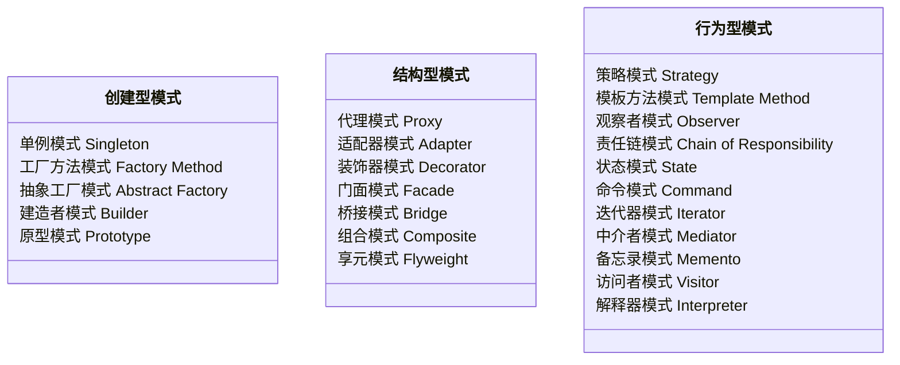
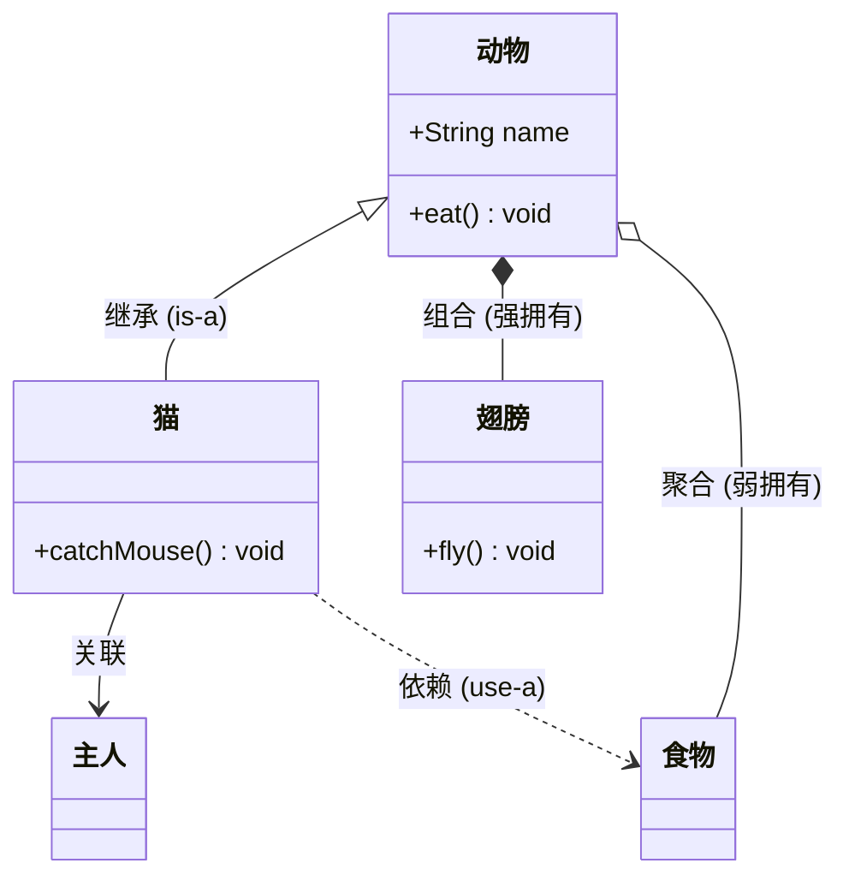
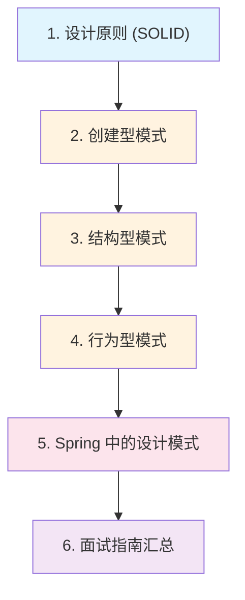

# 设计模式

## 概念说明

设计模式（Design Patterns）是软件开发中经过反复验证的、解决特定问题的**通用方案模板**。GoF（Gang of Four）在《设计模式：可复用面向对象软件的基础》中总结了 23 种经典设计模式，按用途分为三大类：**创建型**、**结构型**、**行为型**。

掌握设计模式不仅是面试的高频考点，更是写出高质量、可维护代码的基础。Spring 框架本身就是设计模式的集大成者。

## 23 种设计模式分类

| 分类 | 数量 | 关注点 | 面试重点 |
|------|------|--------|----------|
| 创建型 | 5 种 | 对象的创建方式 | 单例（5 种实现）、工厂方法 |
| 结构型 | 7 种 | 类和对象的组合 | 代理（3 种实现）、装饰器 |
| 行为型 | 11 种 | 对象之间的通信 | 策略、模板方法、观察者、责任链 |

## UML 类图基础

理解设计模式需要掌握 UML 类图中的 6 种关系：

| 关系 | 符号 | 强度 | 说明 |
|------|------|------|------|
| 继承 | `──▷` | 最强 | is-a 关系 |
| 实现 | `--▷` | 强 | 接口实现 |
| 组合 | `◆──` | 强 | 整体与部分，生命周期一致 |
| 聚合 | `◇──` | 中 | 整体与部分，生命周期独立 |
| 关联 | `──>` | 弱 | 长期持有引用 |
| 依赖 | `-->` | 最弱 | 临时使用 |

## 知识点列表

| 序号 | 知识点 | 难度 | 面试频率 | 文档链接 |
|------|--------|------|----------|----------|
| 1 | 创建型模式 | ⭐⭐⭐ | 🔥🔥🔥 | [creational](./01-creational.md) |
| 2 | 结构型模式 | ⭐⭐⭐ | 🔥🔥🔥 | [structural](./02-structural.md) |
| 3 | 行为型模式 | ⭐⭐⭐ | 🔥🔥🔥 | [behavioral](./03-behavioral.md) |
| 4 | Spring 中的设计模式 | ⭐⭐⭐ | 🔥🔥🔥 | [spring-patterns](./04-spring-patterns.md) |
| 5 | 设计原则 | ⭐⭐ | 🔥🔥🔥 | [principles](./05-principles.md) |
| 6 | 设计模式面试指南 | ⭐⭐⭐ | 🔥🔥🔥 | [interview](./99-interview.md) |

## 推荐学习顺序

**学习路线说明**：
- 🔵 **原则先行**（1）：先理解 SOLID 等设计原则，这是模式的理论基础
- 🟠 **三大分类**（2-4）：按创建型→结构型→行为型顺序学习
- 🔴 **框架应用**（5）：结合 Spring 源码理解模式的实际应用
- 🟣 **面试冲刺**（6）：系统复习，查漏补缺

## 相关模块链接

- [Java 基础 - 面向对象](/1-java-core/1.1-java-basics/04-oop) — 设计模式的语言基础
- [Java 进阶 - 动态代理](/1-java-core/1.2-java-advanced/03-dynamic-proxy) — 代理模式的底层实现
- [并发编程](/1-java-core/1.3-concurrent/) — 模板方法模式在 AQS 中的应用
- [Spring Boot](/springboot/) — 设计模式在框架中的大量应用

## 参考资料

- [Design Patterns: Elements of Reusable Object-Oriented Software (GoF)](https://www.amazon.com/Design-Patterns-Elements-Reusable-Object-Oriented/dp/0201633612)
- [Head First Design Patterns](https://www.oreilly.com/library/view/head-first-design/0596007124/)
- [Refactoring.Guru - 设计模式](https://refactoring.guru/design-patterns)
