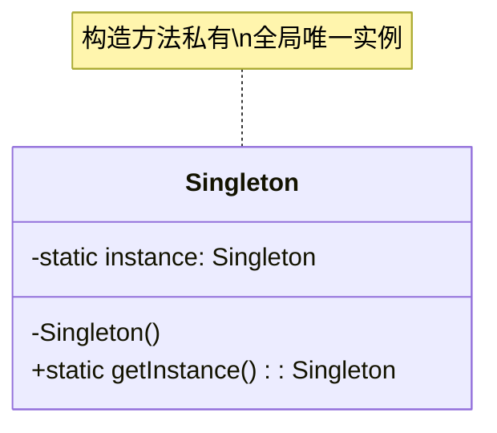
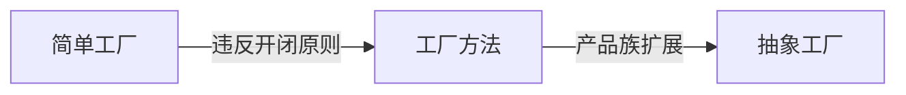
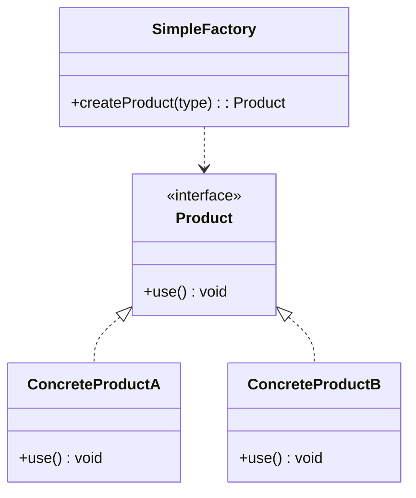
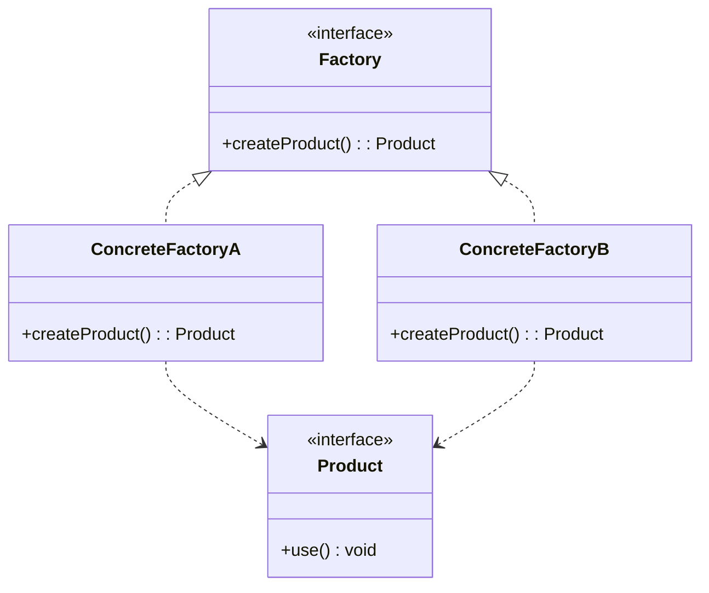
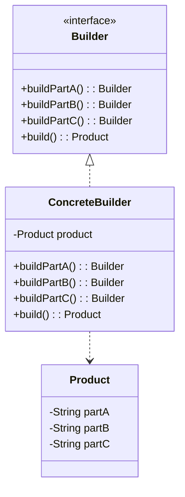
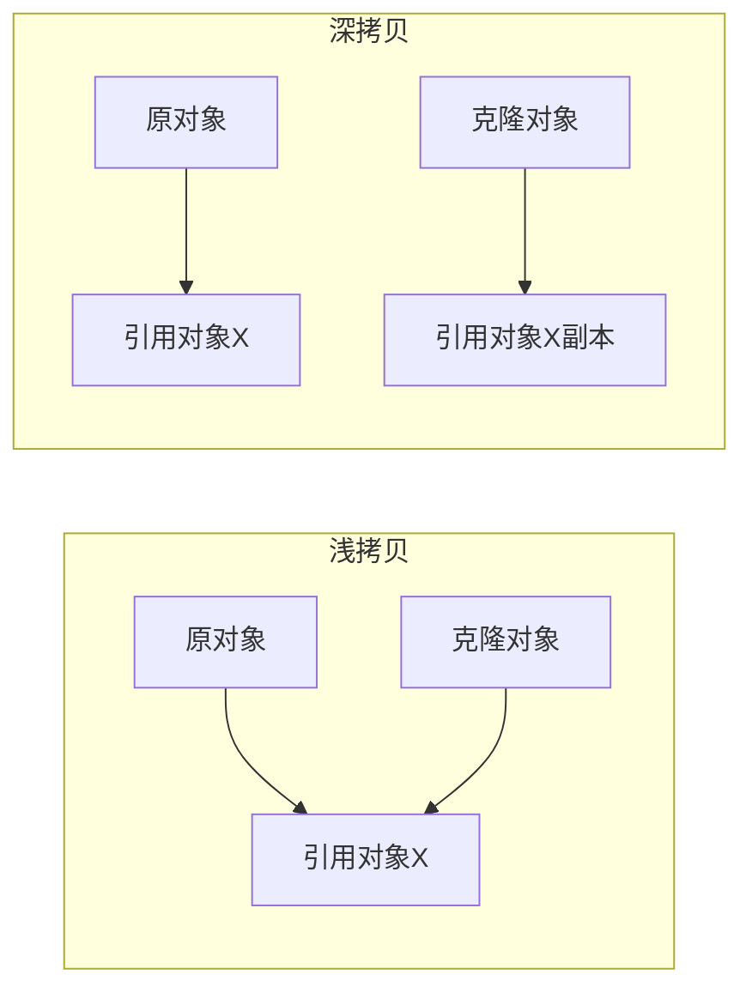

# 创建型模式

## 概念说明

创建型模式关注**对象的创建过程**，将对象的创建与使用分离，降低系统耦合度。核心思想是：不直接 `new` 对象，而是通过特定方式控制对象的创建。

| 模式 | 核心思想 | 典型应用 |
|------|----------|----------|
| 单例 | 全局唯一实例 | Spring Bean、Runtime |
| 工厂方法 | 子类决定创建哪个对象 | Collection.iterator() |
| 抽象工厂 | 创建一族相关对象 | 数据库驱动 |
| 建造者 | 分步构建复杂对象 | StringBuilder、Lombok @Builder |
| 原型 | 通过克隆创建对象 | Object.clone()、BeanUtils.copyProperties |

## 一、单例模式（Singleton）

### 核心原理

单例模式确保一个类只有一个实例，并提供全局访问点。面试中最常考的模式，重点在于**5 种实现方式的优缺点对比**。



### 5 种实现方式对比

| 实现方式 | 线程安全 | 懒加载 | 性能 | 防反射 | 防序列化 | 推荐度 |
|----------|----------|--------|------|--------|----------|--------|
| 饿汉式 | ✅ | ❌ | 高 | ❌ | ❌ | ⭐⭐⭐ |
| 懒汉式（synchronized） | ✅ | ✅ | 低 | ❌ | ❌ | ⭐ |
| DCL（双重检查锁） | ✅ | ✅ | 高 | ❌ | ❌ | ⭐⭐⭐⭐ |
| 静态内部类 | ✅ | ✅ | 高 | ❌ | ❌ | ⭐⭐⭐⭐ |
| 枚举 | ✅ | ❌ | 高 | ✅ | ✅ | ⭐⭐⭐⭐⭐ |

#### 1. 饿汉式

```java
public class EagerSingleton {
    // 类加载时就创建实例，JVM 保证线程安全
    private static final EagerSingleton INSTANCE = new EagerSingleton();
    private EagerSingleton() {}
    public static EagerSingleton getInstance() { return INSTANCE; }
}
```

- 优点：实现简单，类加载时由 JVM 保证线程安全
- 缺点：不支持懒加载，类加载即创建实例，可能浪费内存

#### 2. 懒汉式（synchronized）

```java
public class LazySingleton {
    private static LazySingleton instance;
    private LazySingleton() {}
    public static synchronized LazySingleton getInstance() {
        if (instance == null) {
            instance = new LazySingleton();
        }
        return instance;
    }
}
```

- 优点：支持懒加载
- 缺点：每次调用都加锁，性能差

#### 3. DCL（双重检查锁）

```java
public class DCLSingleton {
    // volatile 防止指令重排序
    private static volatile DCLSingleton instance;
    private DCLSingleton() {}
    public static DCLSingleton getInstance() {
        if (instance == null) {           // 第一次检查，避免不必要的加锁
            synchronized (DCLSingleton.class) {
                if (instance == null) {   // 第二次检查，防止重复创建
                    instance = new DCLSingleton();
                }
            }
        }
        return instance;
    }
}
```

- 为什么需要 volatile？`instance = new DCLSingleton()` 不是原子操作，包含三步：分配内存→初始化→赋值引用。指令重排可能导致其他线程拿到未初始化的对象。

#### 4. 静态内部类

```java
public class InnerClassSingleton {
    private InnerClassSingleton() {}
    private static class Holder {
        private static final InnerClassSingleton INSTANCE = new InnerClassSingleton();
    }
    public static InnerClassSingleton getInstance() {
        return Holder.INSTANCE; // 触发 Holder 类加载
    }
}
```

- 利用 JVM 类加载机制保证线程安全，Holder 类只有在 `getInstance()` 被调用时才会加载

#### 5. 枚举（推荐）

```java
public enum EnumSingleton {
    INSTANCE;
    public void doSomething() { /* 业务方法 */ }
}
```

- Effective Java 推荐方式，天然防止反射和序列化破坏

### 反射和序列化如何破坏单例

```java
// 反射破坏：通过反射调用私有构造方法
Constructor<DCLSingleton> constructor = DCLSingleton.class.getDeclaredConstructor();
constructor.setAccessible(true);
DCLSingleton newInstance = constructor.newInstance(); // 创建了新实例！

// 序列化破坏：序列化后反序列化得到新对象
ObjectOutputStream oos = new ObjectOutputStream(new FileOutputStream("singleton.ser"));
oos.writeObject(instance);
ObjectInputStream ois = new ObjectInputStream(new FileInputStream("singleton.ser"));
DCLSingleton deserialized = (DCLSingleton) ois.readObject(); // 新实例！
```

**防护措施**：
- 反射防护：在构造方法中检查实例是否已存在，已存在则抛异常
- 序列化防护：实现 `readResolve()` 方法返回已有实例

> 💻 完整可运行代码：[SingletonDemo.java](https://github.com/skyhe58/guide-java/tree/main/code-examples/01-java-core/design-patterns/src/main/java/com/example/patterns/creational/SingletonDemo.java)
> <!-- 本地路径：code-examples/01-java-core/design-patterns/src/main/java/com/example/patterns/creational/SingletonDemo.java -->

## 二、工厂模式（Factory）

### 核心原理

工厂模式将对象的创建逻辑封装到工厂类中，客户端不需要知道具体创建细节。分为三个层次：



#### 简单工厂



```java
// 简单工厂：一个工厂方法根据参数创建不同产品
public class SimpleFactory {
    public static Product create(String type) {
        return switch (type) {
            case "A" -> new ConcreteProductA();
            case "B" -> new ConcreteProductB();
            default -> throw new IllegalArgumentException("Unknown type: " + type);
        };
    }
}
```

#### 工厂方法



- 每个产品对应一个工厂，新增产品只需新增工厂类，符合开闭原则
- JDK 中的应用：`Collection.iterator()` — 每个集合实现自己的迭代器工厂

#### 抽象工厂

- 创建一族相关产品（如：MySQL 的 Connection + Statement + ResultSet）
- 适用于产品族的场景，但新增产品类型时需要修改所有工厂

> 💻 完整可运行代码：[FactoryDemo.java](https://github.com/skyhe58/guide-java/tree/main/code-examples/01-java-core/design-patterns/src/main/java/com/example/patterns/creational/FactoryDemo.java)
> <!-- 本地路径：code-examples/01-java-core/design-patterns/src/main/java/com/example/patterns/creational/FactoryDemo.java -->

## 三、建造者模式（Builder）

### 核心原理

将复杂对象的构建过程与表示分离，通过链式调用分步构建对象。



```java
// 链式调用构建复杂对象
User user = User.builder()
    .name("张三")
    .age(25)
    .email("zhangsan@example.com")
    .build();
```

**实际应用**：
- `StringBuilder.append().append().toString()`
- Lombok `@Builder` 注解
- `Stream.builder()`
- `HttpRequest.newBuilder().uri(...).header(...).build()`

> 💻 完整可运行代码：[BuilderDemo.java](https://github.com/skyhe58/guide-java/tree/main/code-examples/01-java-core/design-patterns/src/main/java/com/example/patterns/creational/BuilderDemo.java)
> <!-- 本地路径：code-examples/01-java-core/design-patterns/src/main/java/com/example/patterns/creational/BuilderDemo.java -->

## 四、原型模式（Prototype）

### 核心原理

通过复制已有对象来创建新对象，避免重复的初始化操作。

#### 浅拷贝 vs 深拷贝

| 对比项 | 浅拷贝 | 深拷贝 |
|--------|--------|--------|
| 基本类型 | 值复制 | 值复制 |
| 引用类型 | 复制引用（共享对象） | 递归复制（独立对象） |
| 实现方式 | `Object.clone()` | 序列化/手动递归克隆 |
| 性能 | 快 | 慢 |



**实际应用**：
- `Object.clone()`
- `BeanUtils.copyProperties()`
- `ArrayList` 的 `clone()` 方法（浅拷贝）

## 常见面试题

### Q1: 单例模式有几种实现方式？各有什么优缺点？

**难度**：⭐⭐⭐ | **频率**：🔥🔥🔥

**答题思路**：

1. 列举 5 种实现方式
2. 从线程安全、懒加载、性能三个维度对比
3. 重点说明 DCL 为什么需要 volatile
4. 推荐枚举方式

**标准答案**：

5 种实现方式：饿汉式、懒汉式（synchronized）、DCL、静态内部类、枚举。推荐枚举方式，因为它天然防止反射和序列化破坏，代码最简洁。DCL 需要 volatile 是因为 `new` 操作不是原子的，指令重排可能导致其他线程获取到未初始化的对象。

**深入追问**：
- DCL 中 volatile 的具体作用？（防止指令重排序）
- 反射如何破坏单例？如何防护？
- Spring 的单例 Bean 是哪种实现？（ConcurrentHashMap 缓存，非传统单例模式）

### Q2: 简单工厂、工厂方法、抽象工厂的区别？

**难度**：⭐⭐ | **频率**：🔥🔥🔥

**答题思路**：

1. 简单工厂：一个工厂类，通过参数决定创建哪个产品
2. 工厂方法：每个产品对应一个工厂，符合开闭原则
3. 抽象工厂：创建一族相关产品

**标准答案**：

简单工厂通过参数决定创建哪个产品，新增产品需要修改工厂代码，违反开闭原则。工厂方法让每个产品有自己的工厂，新增产品只需新增工厂类。抽象工厂用于创建一族相关产品，如数据库驱动中的 Connection、Statement、ResultSet 都由同一个工厂创建。

### Q3: 深拷贝和浅拷贝的区别？如何实现深拷贝？

**难度**：⭐⭐ | **频率**：🔥🔥

**答题思路**：

1. 浅拷贝只复制引用，深拷贝递归复制所有对象
2. 深拷贝实现方式：序列化反序列化、手动递归克隆、第三方工具

**标准答案**：

浅拷贝复制对象时，基本类型复制值，引用类型只复制引用地址，原对象和克隆对象共享引用对象。深拷贝会递归复制所有引用对象，两者完全独立。实现深拷贝的常用方式：实现 Serializable 接口通过序列化/反序列化、手动递归调用 clone()、使用 Apache Commons 的 SerializationUtils。

## 参考资料

- [Effective Java - Item 3: Enforce the singleton property](https://www.oreilly.com/library/view/effective-java/9780134686097/)
- [Refactoring.Guru - Creational Patterns](https://refactoring.guru/1-java-core/1.5-design-patterns/01-creational-patterns)
