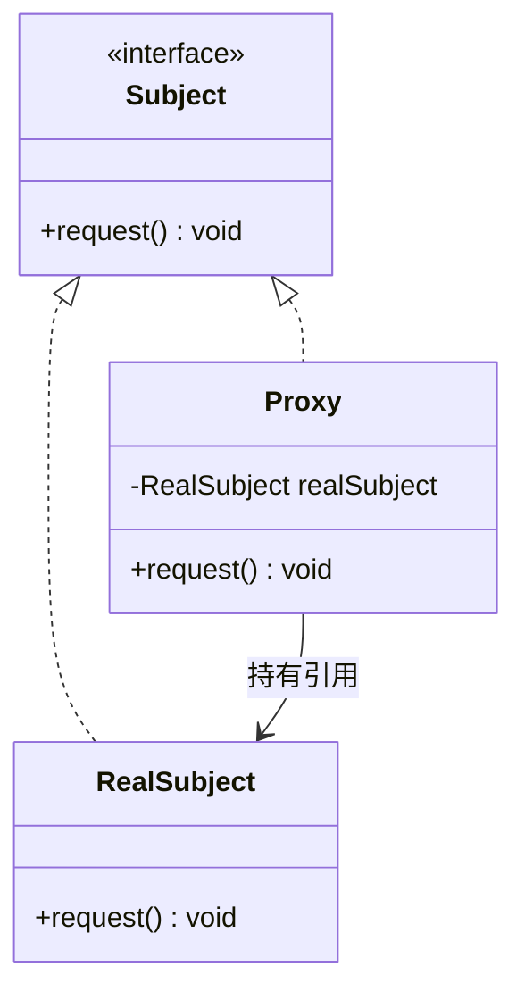
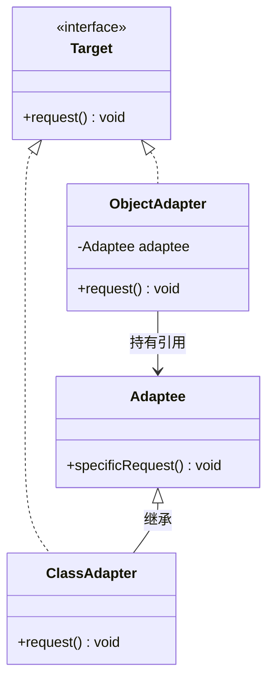
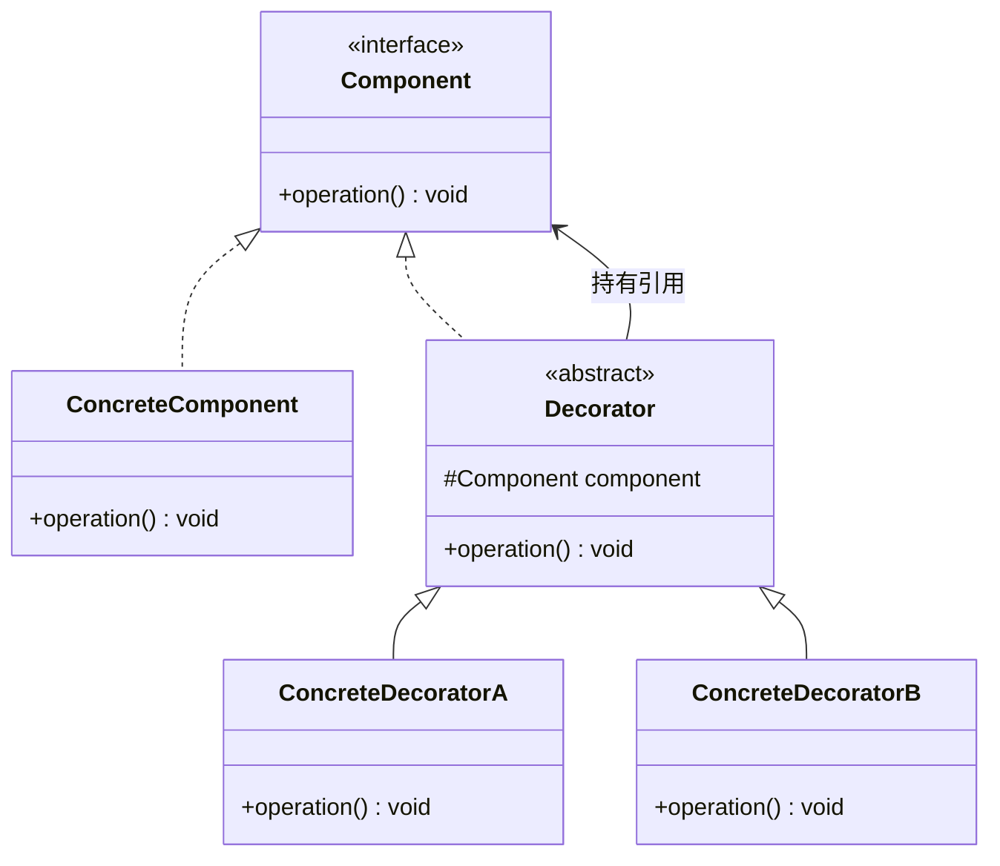
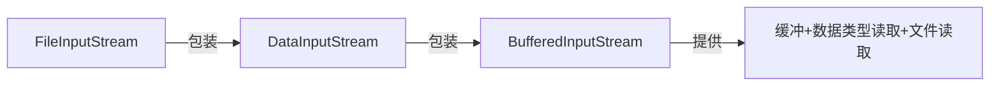

# 结构型模式

## 概念说明

结构型模式关注**类和对象的组合方式**，通过组合而非继承来实现新功能。核心思想是：通过包装、组合、桥接等手段，让不同的类协同工作。

| 模式 | 核心思想 | 典型应用 |
|------|----------|----------|
| 代理 | 控制对象访问 | Spring AOP、MyBatis Mapper |
| 适配器 | 接口转换 | HandlerAdapter、InputStreamReader |
| 装饰器 | 动态增强功能 | Java IO 流、HttpServletRequestWrapper |
| 门面/外观 | 简化复杂子系统 | SLF4J、Spring JdbcTemplate |
| 桥接 | 抽象与实现分离 | JDBC Driver |
| 组合 | 树形结构 | 文件系统、菜单树 |
| 享元 | 共享细粒度对象 | Integer 缓存池、String Pool |

## 一、代理模式（Proxy）

### 核心原理

代理模式为目标对象提供一个代理对象，通过代理对象控制对目标对象的访问。代理可以在不修改目标对象的前提下，增加额外的功能（如日志、权限、事务）。



### 三种代理实现方式

| 对比项 | 静态代理 | JDK 动态代理 | CGLIB 代理 |
|--------|----------|-------------|-----------|
| 实现方式 | 手动编写代理类 | `Proxy.newProxyInstance()` | 字节码生成子类 |
| 要求 | 目标类实现接口 | 目标类实现接口 | 目标类不能是 final |
| 原理 | 编译期确定 | 运行时反射 | 运行时生成子类 |
| 性能 | 最高 | 中等 | 高（方法拦截） |
| Spring 使用 | — | 有接口时默认使用 | 无接口时使用 |

#### 静态代理

```java
// 代理类和目标类实现同一接口
public class UserServiceProxy implements UserService {
    private final UserService target;
    public UserServiceProxy(UserService target) { this.target = target; }

    @Override
    public void save(String name) {
        System.out.println("[日志] 开始保存用户");
        target.save(name);  // 委托给目标对象
        System.out.println("[日志] 保存用户完成");
    }
}
```

#### JDK 动态代理

```java
// 基于 InvocationHandler + Proxy.newProxyInstance
UserService proxy = (UserService) Proxy.newProxyInstance(
    target.getClass().getClassLoader(),
    target.getClass().getInterfaces(),
    (proxyObj, method, args) -> {
        System.out.println("[日志] 调用方法: " + method.getName());
        Object result = method.invoke(target, args);
        System.out.println("[日志] 方法执行完成");
        return result;
    }
);
```

#### CGLIB 代理

```java
// 基于字节码生成目标类的子类
Enhancer enhancer = new Enhancer();
enhancer.setSuperclass(UserServiceImpl.class);
enhancer.setCallback((MethodInterceptor) (obj, method, args, proxy) -> {
    System.out.println("[日志] 调用方法: " + method.getName());
    Object result = proxy.invokeSuper(obj, args);
    System.out.println("[日志] 方法执行完成");
    return result;
});
UserServiceImpl proxy = (UserServiceImpl) enhancer.create();
```

**Spring AOP 的代理选择策略**：
- 目标类实现了接口 → 默认使用 JDK 动态代理
- 目标类没有实现接口 → 使用 CGLIB 代理
- 可通过 `@EnableAspectJAutoProxy(proxyTargetClass = true)` 强制使用 CGLIB

> 💻 完整可运行代码：[ProxyPatternDemo.java](https://github.com/skyhe58/guide-java/tree/main/code-examples/01-java-core/design-patterns/src/main/java/com/example/patterns/structural/ProxyPatternDemo.java)
> <!-- 本地路径：code-examples/01-java-core/design-patterns/src/main/java/com/example/patterns/structural/ProxyPatternDemo.java -->

## 二、适配器模式（Adapter）

### 核心原理

将一个类的接口转换成客户端期望的另一个接口，使原本不兼容的类可以协同工作。



| 类型 | 实现方式 | 优点 | 缺点 |
|------|----------|------|------|
| 类适配器 | 继承 Adaptee | 可以重写 Adaptee 方法 | Java 单继承限制 |
| 对象适配器 | 组合 Adaptee | 更灵活，可适配多个类 | 不能重写 Adaptee 方法 |

**实际应用**：
- `InputStreamReader`：将字节流适配为字符流
- Spring MVC `HandlerAdapter`：适配不同类型的 Controller
- `Arrays.asList()`：将数组适配为 List

> 💻 完整可运行代码：[AdapterDemo.java](https://github.com/skyhe58/guide-java/tree/main/code-examples/01-java-core/design-patterns/src/main/java/com/example/patterns/structural/AdapterDemo.java)
> <!-- 本地路径：code-examples/01-java-core/design-patterns/src/main/java/com/example/patterns/structural/AdapterDemo.java -->

## 三、装饰器模式（Decorator）

### 核心原理

动态地给对象添加额外的职责，比继承更灵活。装饰器和被装饰对象实现同一接口，可以层层嵌套。



### 装饰器 vs 继承

| 对比项 | 装饰器模式 | 继承 |
|--------|-----------|------|
| 扩展方式 | 运行时动态组合 | 编译时静态确定 |
| 灵活性 | 可任意组合装饰器 | 类爆炸问题 |
| 开闭原则 | 符合 | 可能违反 |
| 典型场景 | Java IO 流 | 简单的功能扩展 |

### Java IO 中的装饰器模式

```java
// Java IO 是装饰器模式的经典应用
// InputStream 是 Component
// FileInputStream 是 ConcreteComponent
// FilterInputStream 是 Decorator
// BufferedInputStream、DataInputStream 是 ConcreteDecorator

InputStream in = new BufferedInputStream(    // 装饰器：缓冲功能
    new DataInputStream(                      // 装饰器：数据类型读取
        new FileInputStream("data.txt")       // 被装饰对象：文件读取
    )
);
```



> 💻 完整可运行代码：[DecoratorDemo.java](https://github.com/skyhe58/guide-java/tree/main/code-examples/01-java-core/design-patterns/src/main/java/com/example/patterns/structural/DecoratorDemo.java)
> <!-- 本地路径：code-examples/01-java-core/design-patterns/src/main/java/com/example/patterns/structural/DecoratorDemo.java -->

## 四、门面/外观模式（Facade）

### 核心原理

为复杂的子系统提供一个简化的统一接口，降低客户端与子系统的耦合。

**实际应用**：
- SLF4J：统一日志门面，屏蔽 Log4j/Logback 等实现细节
- Spring `JdbcTemplate`：封装 JDBC 的复杂操作
- `Runtime.getRuntime().exec()`：封装进程管理

## 五、桥接模式（Bridge）

### 核心原理

将抽象部分与实现部分分离，使它们可以独立变化。

**实际应用**：
- JDBC：`DriverManager`（抽象）与具体数据库驱动（实现）分离
- 日志框架：SLF4J（抽象）与 Logback/Log4j（实现）分离

## 六、组合模式（Composite）

### 核心原理

将对象组合成树形结构，使客户端对单个对象和组合对象的使用具有一致性。

**实际应用**：
- 文件系统：File 和 Directory 统一处理
- UI 组件树：Container 和 Component
- 组织架构：部门和员工

## 七、享元模式（Flyweight）

### 核心原理

运用共享技术有效地支持大量细粒度对象的复用，减少内存占用。

```java
// Integer 缓存池就是享元模式的典型应用
Integer a = 127;
Integer b = 127;
System.out.println(a == b);  // true，来自缓存池

Integer c = 128;
Integer d = 128;
System.out.println(c == d);  // false，超出缓存范围
```

**实际应用**：
- `Integer.valueOf()` 缓存 -128~127
- `String.intern()` 字符串常量池
- `Boolean.valueOf()` 缓存 TRUE/FALSE
- 数据库连接池（池化思想）

## 常见面试题

### Q1: 代理模式的三种实现方式及区别？

**难度**：⭐⭐⭐ | **频率**：🔥🔥🔥

**答题思路**：

1. 静态代理：编译期确定，手动编写代理类
2. JDK 动态代理：基于接口 + 反射，运行时生成
3. CGLIB：基于字节码生成子类，不需要接口

**标准答案**：

静态代理在编译期确定代理关系，需要手动编写代理类，代码量大但性能最好。JDK 动态代理基于 `InvocationHandler` 和 `Proxy.newProxyInstance()`，要求目标类实现接口，通过反射调用。CGLIB 通过 ASM 字节码框架在运行时生成目标类的子类，不需要接口但目标类不能是 final。Spring AOP 默认有接口用 JDK 代理，无接口用 CGLIB。

**深入追问**：
- Spring AOP 默认使用哪种代理？如何切换？
- JDK 动态代理为什么必须基于接口？

### Q2: 装饰器模式和代理模式的区别？

**难度**：⭐⭐ | **频率**：🔥🔥

**标准答案**：

两者结构相似，都是通过包装对象来增强功能，但意图不同。装饰器模式的目的是**动态增强功能**，客户端知道被装饰的对象，可以自由组合装饰器。代理模式的目的是**控制访问**，客户端通常不知道代理的存在。Java IO 流是装饰器模式，Spring AOP 是代理模式。

### Q3: Integer 缓存池的范围是多少？为什么这样设计？

**难度**：⭐⭐ | **频率**：🔥🔥

**标准答案**：

Integer 缓存池默认范围是 -128 到 127。这是享元模式的应用，因为这个范围的整数使用频率最高，缓存可以减少对象创建和内存占用。上界可以通过 JVM 参数 `-XX:AutoBoxCacheMax` 调整，但下界固定为 -128。

## 参考资料

- [Refactoring.Guru - Structural Patterns](https://refactoring.guru/1-java-core/1.5-design-patterns/02-structural-patterns)
- [Spring AOP 官方文档](https://docs.spring.io/spring-framework/reference/core/aop.html)
