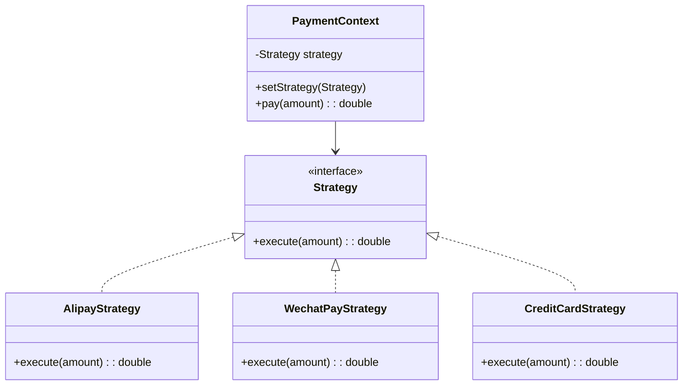
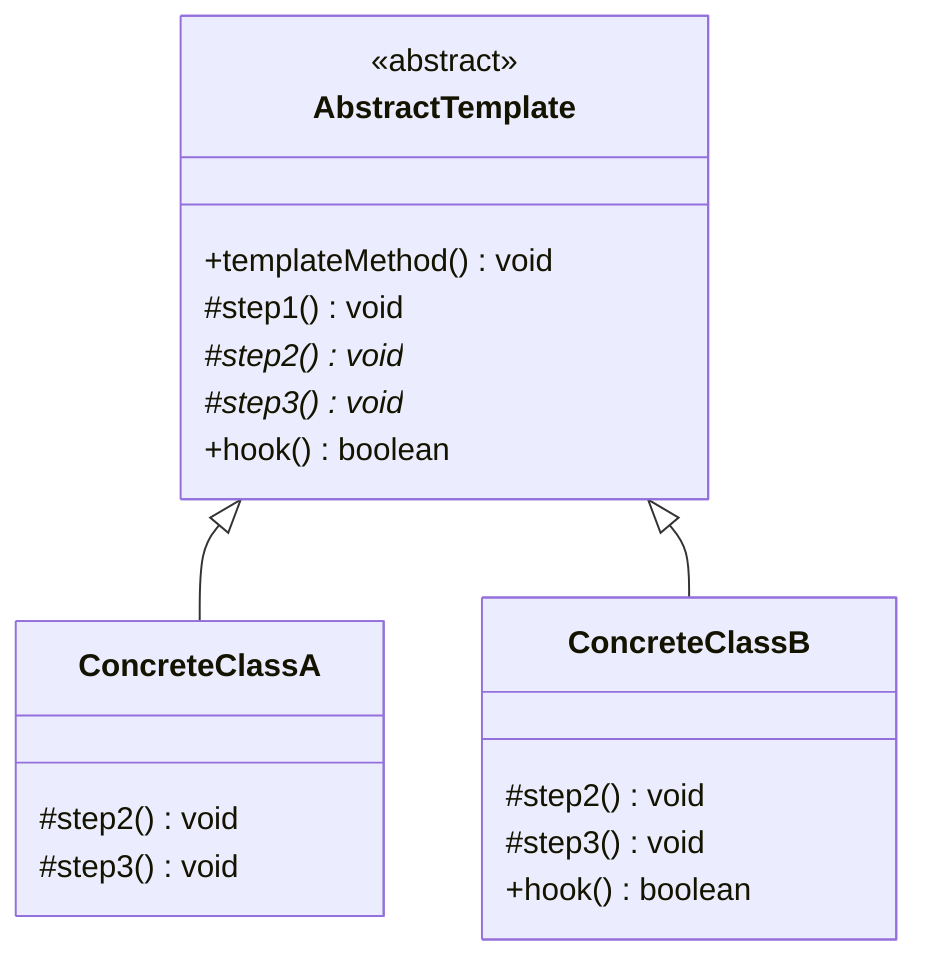
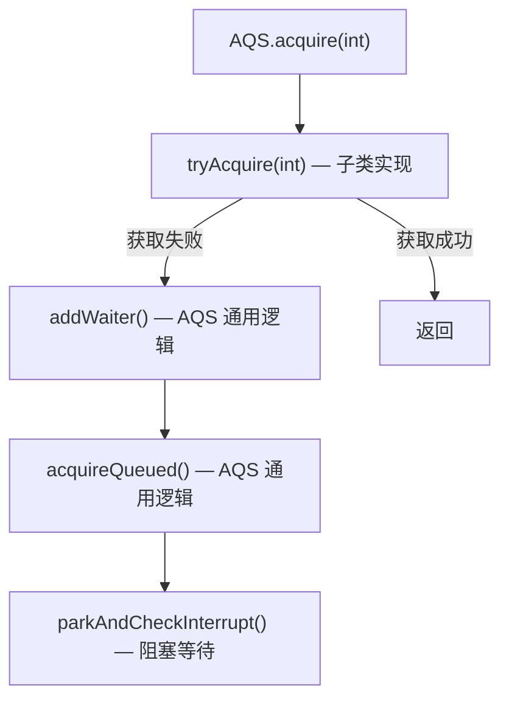
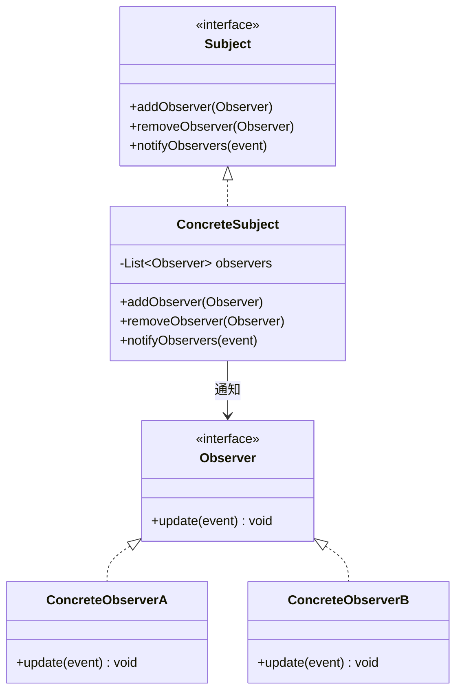
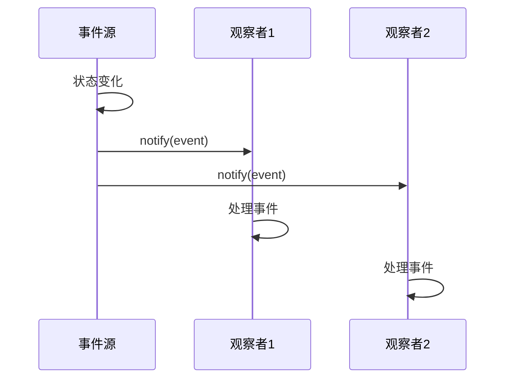
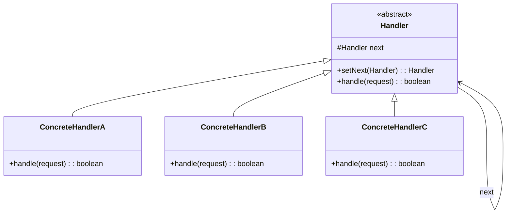
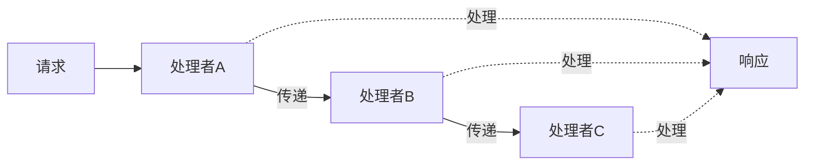

# 行为型模式

## 概念说明

行为型模式关注**对象之间的通信和职责分配**，描述对象如何协作完成单个对象无法独立完成的任务。核心思想是：通过合理的职责划分和通信机制，让系统更灵活、更易扩展。

| 模式 | 核心思想 | 典型应用 |
|------|----------|----------|
| 策略 | 算法可替换 | 支付方式选择、排序策略 |
| 模板方法 | 定义算法骨架 | AQS、JdbcTemplate |
| 观察者 | 事件通知 | EventListener、MQ |
| 责任链 | 请求逐级传递 | Filter 链、Sentinel 规则链 |
| 状态 | 状态驱动行为 | 订单状态机 |
| 命令 | 请求封装为对象 | Runnable、事务回滚 |
| 迭代器 | 统一遍历方式 | Iterator、Stream |

## 一、策略模式（Strategy）

### 核心原理

定义一系列算法，将每个算法封装成独立的策略类，使它们可以互相替换。策略模式是**替代 if-else / switch 的最佳方案**。



### 策略模式替代 if-else

```java
// ❌ 传统 if-else 方式（违反开闭原则）
public double pay(String type, double amount) {
    if ("alipay".equals(type)) {
        return amount * 0.95; // 支付宝 95 折
    } else if ("wechat".equals(type)) {
        return amount * 0.98; // 微信 98 折
    } else if ("credit".equals(type)) {
        return amount + amount * 0.01; // 信用卡手续费
    }
    throw new IllegalArgumentException("不支持的支付方式");
}

// ✅ 策略模式（符合开闭原则）
public interface PayStrategy {
    double pay(double amount);
}

// 新增支付方式只需新增策略类，无需修改已有代码
public class AlipayStrategy implements PayStrategy {
    @Override
    public double pay(double amount) { return amount * 0.95; }
}
```

**实际应用**：
- `Comparator` 接口：不同的排序策略
- `ThreadPoolExecutor` 的拒绝策略：`AbortPolicy`、`CallerRunsPolicy` 等
- Spring `Resource` 接口：`ClassPathResource`、`FileSystemResource` 等

> 💻 完整可运行代码：[StrategyDemo.java](https://github.com/skyhe58/guide-java/tree/main/code-examples/01-java-core/design-patterns/src/main/java/com/example/patterns/behavioral/StrategyDemo.java)
> <!-- 本地路径：code-examples/01-java-core/design-patterns/src/main/java/com/example/patterns/behavioral/StrategyDemo.java -->

## 二、模板方法模式（Template Method）

### 核心原理

在父类中定义算法的骨架（模板方法），将某些步骤延迟到子类实现。子类可以重写特定步骤，但不能改变算法的整体结构。



```java
public abstract class AbstractTemplate {
    // 模板方法：定义算法骨架，final 防止子类重写
    public final void templateMethod() {
        step1();        // 通用步骤
        step2();        // 子类实现
        if (hook()) {   // 钩子方法
            step3();    // 子类实现
        }
    }
    private void step1() { /* 通用逻辑 */ }
    protected abstract void step2();  // 抽象方法，子类必须实现
    protected abstract void step3();
    protected boolean hook() { return true; } // 钩子方法，子类可选重写
}
```

### AQS 就是模板方法模式

`AbstractQueuedSynchronizer`（AQS）是模板方法模式的经典应用：



```java
// AQS 定义了获取锁的模板方法
public final void acquire(int arg) {
    if (!tryAcquire(arg) &&                    // 子类实现
        acquireQueued(addWaiter(Node.EXCLUSIVE), arg))  // AQS 通用逻辑
        selfInterrupt();
}

// ReentrantLock 的 FairSync 实现 tryAcquire
protected final boolean tryAcquire(int acquires) {
    // 公平锁的获取逻辑
}
```

**实际应用**：
- `AbstractQueuedSynchronizer`：`tryAcquire()`、`tryRelease()` 由子类实现
- `JdbcTemplate`：`execute()` 定义模板，回调接口由调用方实现
- `HttpServlet`：`service()` 是模板方法，`doGet()`、`doPost()` 由子类实现
- `AbstractList`：`get()` 由子类实现，`iterator()` 等基于 `get()` 实现

> 💻 完整可运行代码：[TemplateMethodDemo.java](https://github.com/skyhe58/guide-java/tree/main/code-examples/01-java-core/design-patterns/src/main/java/com/example/patterns/behavioral/TemplateMethodDemo.java)
> <!-- 本地路径：code-examples/01-java-core/design-patterns/src/main/java/com/example/patterns/behavioral/TemplateMethodDemo.java -->

## 三、观察者模式（Observer）

### 核心原理

定义对象间的一对多依赖关系，当一个对象状态改变时，所有依赖它的对象都会收到通知并自动更新。也称为**发布-订阅模式**。





**实际应用**：
- Java `EventListener` 体系
- Spring `ApplicationEvent` + `ApplicationListener`
- Google Guava `EventBus`
- 消息队列（RabbitMQ/Kafka）本质上也是观察者模式的分布式实现

> 💻 完整可运行代码：[ObserverDemo.java](https://github.com/skyhe58/guide-java/tree/main/code-examples/01-java-core/design-patterns/src/main/java/com/example/patterns/behavioral/ObserverDemo.java)
> <!-- 本地路径：code-examples/01-java-core/design-patterns/src/main/java/com/example/patterns/behavioral/ObserverDemo.java -->

## 四、责任链模式（Chain of Responsibility）

### 核心原理

将请求沿着处理者链传递，每个处理者决定是否处理请求以及是否传递给下一个处理者。





**实际应用**：
- Servlet `Filter` 链：`FilterChain.doFilter()`
- Spring `HandlerInterceptor` 链
- Sentinel 规则链：`FlowSlot` → `DegradeSlot` → `AuthoritySlot`
- Netty `ChannelPipeline`：`ChannelHandler` 链
- 审批流程：组长→经理→总监→VP

> 💻 完整可运行代码：[ChainOfResponsibilityDemo.java](https://github.com/skyhe58/guide-java/tree/main/code-examples/01-java-core/design-patterns/src/main/java/com/example/patterns/behavioral/ChainOfResponsibilityDemo.java)
> <!-- 本地路径：code-examples/01-java-core/design-patterns/src/main/java/com/example/patterns/behavioral/ChainOfResponsibilityDemo.java -->

## 五、状态模式（State）

### 核心原理

允许对象在内部状态改变时改变其行为，看起来像是改变了类。将状态相关的行为封装到独立的状态类中。

**实际应用**：
- 订单状态机：待支付→已支付→已发货→已完成
- TCP 连接状态：LISTEN→SYN_SENT→ESTABLISHED→CLOSE_WAIT

## 六、命令模式（Command）

### 核心原理

将请求封装为对象，使你可以用不同的请求参数化客户端，支持请求排队、日志记录和撤销操作。

**实际应用**：
- `Runnable` 接口：将任务封装为命令对象
- 数据库事务回滚：将操作封装为可撤销的命令
- GUI 按钮事件：将点击操作封装为命令

## 七、迭代器模式（Iterator）

### 核心原理

提供一种方法顺序访问聚合对象中的元素，而不暴露其内部表示。

**实际应用**：
- `java.util.Iterator` 接口
- `Stream API`
- `ResultSet`

## 常见面试题

### Q1: 策略模式如何替代 if-else？实际项目中怎么用？

**难度**：⭐⭐ | **频率**：🔥🔥🔥

**答题思路**：

1. 定义策略接口
2. 每个分支逻辑封装为一个策略实现类
3. 通过 Map 或 Spring 注入管理策略
4. 运行时根据条件选择策略

**标准答案**：

策略模式将每个 if-else 分支的逻辑抽取为独立的策略类，通过策略接口统一调用。在 Spring 项目中，可以将所有策略类注册为 Bean，通过 `Map<String, Strategy>` 自动注入，运行时根据类型选择对应策略。新增分支只需新增策略类，无需修改已有代码，符合开闭原则。

**深入追问**：
- 策略模式和工厂模式的区别？
- 如何结合 Spring 实现策略模式的自动注册？

### Q2: 模板方法模式在 JDK 和 Spring 中有哪些应用？

**难度**：⭐⭐⭐ | **频率**：🔥🔥🔥

**标准答案**：

JDK 中：AQS 的 `acquire()`/`release()` 是模板方法，`tryAcquire()`/`tryRelease()` 由子类（如 ReentrantLock）实现；`AbstractList` 的 `get()` 由子类实现，`iterator()` 基于 `get()` 实现；`HttpServlet` 的 `service()` 是模板方法，`doGet()`/`doPost()` 由子类实现。Spring 中：`JdbcTemplate` 的 `execute()` 定义了获取连接→执行 SQL→处理结果→释放连接的模板，具体 SQL 执行通过回调接口传入；`RestTemplate` 同理。

### Q3: 责任链模式在 Servlet Filter 中是如何实现的？

**难度**：⭐⭐ | **频率**：🔥🔥

**标准答案**：

Servlet Filter 链通过 `FilterChain` 实现责任链模式。每个 Filter 实现 `doFilter(request, response, chain)` 方法，在方法内部调用 `chain.doFilter()` 将请求传递给下一个 Filter。FilterChain 内部维护一个 Filter 数组和当前索引，每次 `doFilter()` 调用递增索引并执行下一个 Filter。请求先经过所有 Filter 的前置处理，到达 Servlet 后再反向经过所有 Filter 的后置处理。

**深入追问**：
- Sentinel 的规则链是如何实现的？
- 责任链模式和装饰器模式的区别？

## 参考资料

- [Refactoring.Guru - Behavioral Patterns](https://refactoring.guru/1-java-core/1.5-design-patterns/03-behavioral-patterns)
- [Doug Lea - AQS 论文](http://gee.cs.oswego.edu/dl/papers/aqs.pdf)
