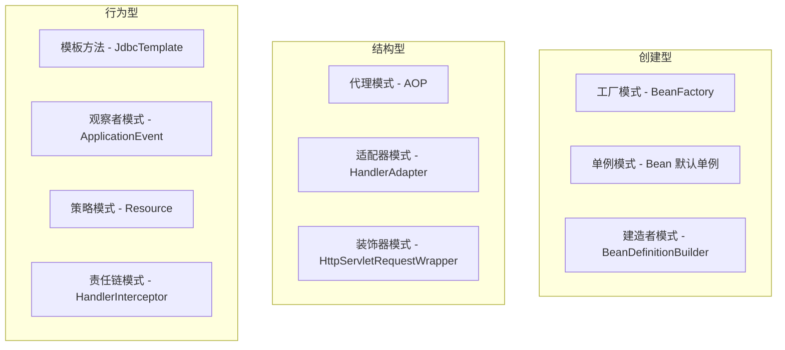
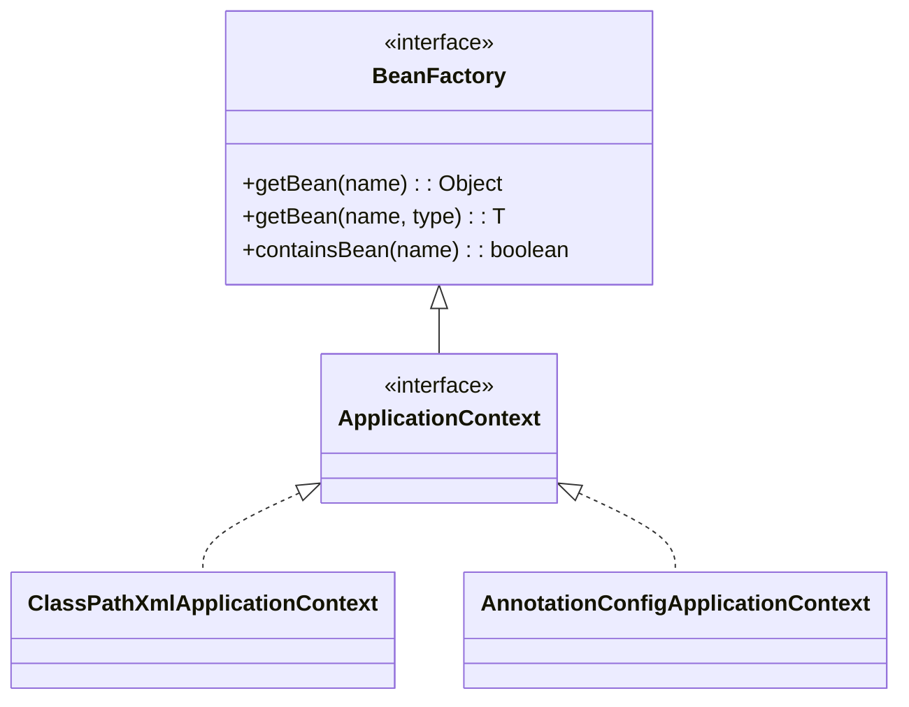
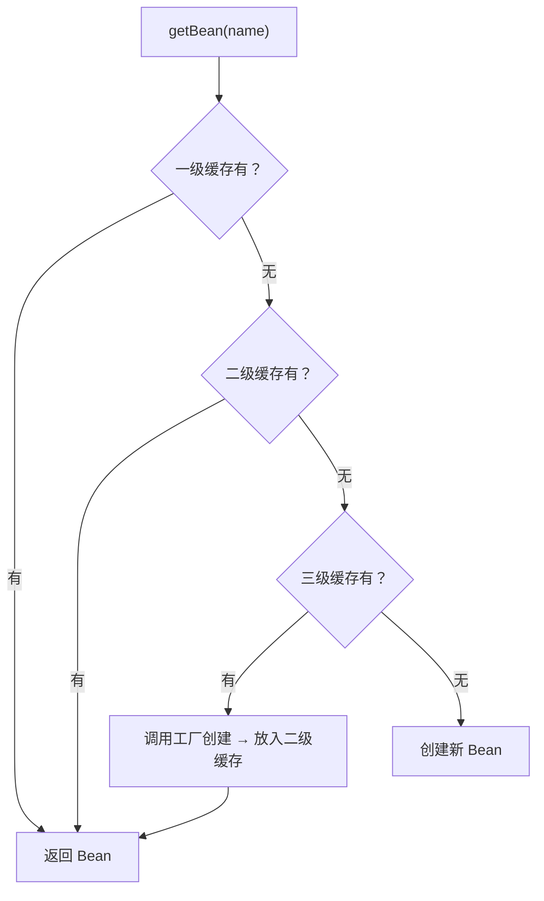
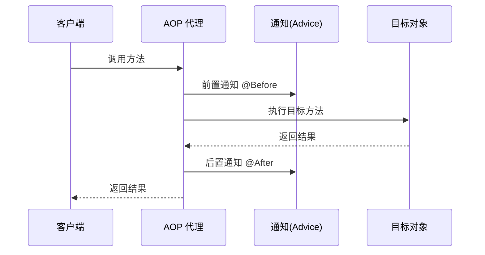
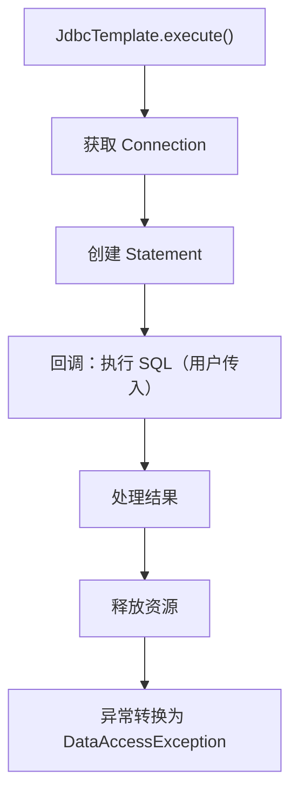
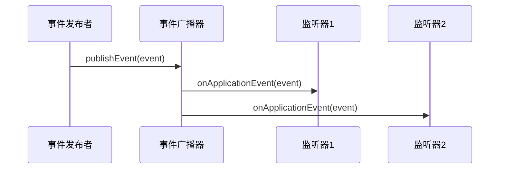
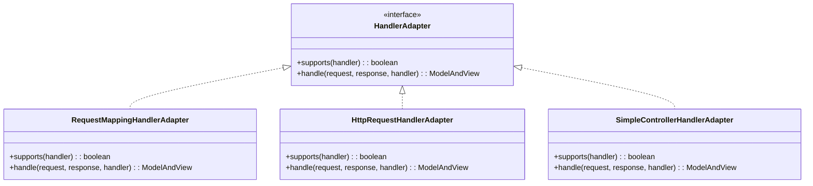

# Spring 中的设计模式

## 概念说明

Spring 框架是设计模式的集大成者，几乎每个核心功能都运用了经典设计模式。理解 Spring 中的设计模式应用，既能加深对模式的理解，也是面试中的高频考点。

## Spring 设计模式全景图



## 一、工厂模式 — BeanFactory

### 源码位置

`org.springframework.beans.factory.BeanFactory`

### 应用说明

Spring 的 IoC 容器本质上就是一个大工厂，`BeanFactory` 是最基础的容器接口，负责创建和管理所有 Bean 对象。



```java
// BeanFactory 是工厂接口
BeanFactory factory = new AnnotationConfigApplicationContext(AppConfig.class);
UserService userService = factory.getBean(UserService.class);

// 内部通过 BeanDefinition 决定如何创建 Bean
// AbstractAutowireCapableBeanFactory.createBean() 是核心创建逻辑
```

**工厂模式的体现**：
- `BeanFactory.getBean()` — 工厂方法，根据名称/类型创建 Bean
- `FactoryBean` 接口 — 自定义工厂，`getObject()` 返回实际对象
- `AbstractBeanFactory.getBean()` → `doGetBean()` → `createBean()` — 创建流程

## 二、单例模式 — Bean 默认单例

### 源码位置

`org.springframework.beans.factory.support.DefaultSingletonBeanRegistry`

### 应用说明

Spring Bean 默认作用域是 `singleton`，但 Spring 的单例实现不是传统的私有构造方法方式，而是通过**注册表模式**（ConcurrentHashMap 缓存）实现。

```java
// DefaultSingletonBeanRegistry 中的三级缓存
// 一级缓存：存放完全初始化好的单例 Bean
private final Map<String, Object> singletonObjects = new ConcurrentHashMap<>(256);
// 二级缓存：存放早期暴露的 Bean（未完成属性注入）
private final Map<String, Object> earlySingletonObjects = new ConcurrentHashMap<>(16);
// 三级缓存：存放 Bean 工厂（用于创建代理对象）
private final Map<String, ObjectFactory<?>> singletonFactories = new HashMap<>(16);
```



**与传统单例的区别**：
- 传统单例：类自身控制实例唯一性（私有构造方法）
- Spring 单例：容器控制实例唯一性（注册表缓存），同一个类可以注册多个不同名称的 Bean

## 三、代理模式 — AOP

### 源码位置

`org.springframework.aop.framework.JdkDynamicAopProxy`
`org.springframework.aop.framework.CglibAopProxy`

### 应用说明

Spring AOP 的核心就是代理模式，通过动态代理在不修改业务代码的前提下，织入横切关注点（事务、日志、权限等）。



```java
// Spring AOP 代理选择逻辑
// DefaultAopProxyFactory.createAopProxy()
public AopProxy createAopProxy(AdvisedSupport config) {
    if (config.isOptimize() || config.isProxyTargetClass()
            || hasNoUserSuppliedProxyInterfaces(config)) {
        // 使用 CGLIB 代理
        return new ObjenesisCglibAopProxy(config);
    } else {
        // 使用 JDK 动态代理
        return new JdkDynamicAopProxy(config);
    }
}
```

**代理选择规则**：
- 目标类实现了接口 → JDK 动态代理（默认）
- 目标类没有实现接口 → CGLIB 代理
- 设置 `proxyTargetClass=true` → 强制 CGLIB

## 四、模板方法模式 — JdbcTemplate / RestTemplate

### 源码位置

`org.springframework.jdbc.core.JdbcTemplate`

### 应用说明

`JdbcTemplate` 将 JDBC 操作的通用流程（获取连接→创建 Statement→执行 SQL→处理结果→释放资源）封装为模板方法，具体的 SQL 执行和结果映射通过回调接口传入。



```java
// JdbcTemplate.execute() 是模板方法
public <T> T execute(StatementCallback<T> action) {
    Connection con = DataSourceUtils.getConnection(obtainDataSource());  // 通用
    Statement stmt = con.createStatement();                              // 通用
    T result = action.doInStatement(stmt);                               // 回调（用户实现）
    // ... 释放资源（通用）
    return result;
}

// 使用方式
jdbcTemplate.query("SELECT * FROM users", (rs, rowNum) -> {
    return new User(rs.getLong("id"), rs.getString("name"));
});
```

**同类应用**：
- `RestTemplate`：HTTP 请求的模板方法
- `TransactionTemplate`：事务管理的模板方法
- `RedisTemplate`：Redis 操作的模板方法

## 五、观察者模式 — ApplicationEvent

### 源码位置

`org.springframework.context.ApplicationEvent`
`org.springframework.context.ApplicationListener`
`org.springframework.context.ApplicationEventPublisher`

### 应用说明

Spring 的事件机制是观察者模式的典型实现，支持应用内的事件发布和监听。



```java
// 1. 定义事件
public class OrderCreatedEvent extends ApplicationEvent {
    private final String orderId;
    public OrderCreatedEvent(Object source, String orderId) {
        super(source);
        this.orderId = orderId;
    }
}

// 2. 发布事件
@Service
public class OrderService {
    @Autowired
    private ApplicationEventPublisher publisher;

    public void createOrder(String orderId) {
        // 业务逻辑...
        publisher.publishEvent(new OrderCreatedEvent(this, orderId));
    }
}

// 3. 监听事件
@Component
public class EmailNotificationListener {
    @EventListener
    public void onOrderCreated(OrderCreatedEvent event) {
        // 发送邮件通知
    }
}
```

**Spring 内置事件**：
- `ContextRefreshedEvent`：容器刷新完成
- `ContextClosedEvent`：容器关闭
- `ContextStartedEvent`：容器启动
- `RequestHandledEvent`：HTTP 请求处理完成

## 六、适配器模式 — HandlerAdapter

### 源码位置

`org.springframework.web.servlet.HandlerAdapter`

### 应用说明

Spring MVC 中，不同类型的 Controller（注解、接口、HttpRequestHandler）通过 `HandlerAdapter` 适配为统一的处理方式。



```java
// DispatcherServlet 中的适配器调用
// 遍历所有 HandlerAdapter，找到支持当前 Handler 的适配器
HandlerAdapter ha = getHandlerAdapter(mappedHandler.getHandler());
ModelAndView mv = ha.handle(request, response, mappedHandler.getHandler());
```

## 七、策略模式 — Resource 接口

### 源码位置

`org.springframework.core.io.Resource`

### 应用说明

Spring 的 `Resource` 接口是策略模式的应用，不同的资源加载策略对应不同的实现类。

```java
// 根据前缀自动选择策略
Resource resource1 = resourceLoader.getResource("classpath:config.yml");  // ClassPathResource
Resource resource2 = resourceLoader.getResource("file:/etc/config.yml");  // FileSystemResource
Resource resource3 = resourceLoader.getResource("https://example.com/config.yml"); // UrlResource
```

## 汇总对照表

| 设计模式 | Spring 中的应用 | 核心类/接口 |
|----------|----------------|------------|
| 工厂模式 | IoC 容器 | `BeanFactory`、`FactoryBean` |
| 单例模式 | Bean 默认作用域 | `DefaultSingletonBeanRegistry` |
| 代理模式 | AOP | `JdkDynamicAopProxy`、`CglibAopProxy` |
| 模板方法 | 数据访问/HTTP | `JdbcTemplate`、`RestTemplate` |
| 观察者模式 | 事件机制 | `ApplicationEvent`、`ApplicationListener` |
| 适配器模式 | MVC Handler | `HandlerAdapter` |
| 策略模式 | 资源加载 | `Resource`、`ResourceLoader` |
| 责任链模式 | 拦截器 | `HandlerInterceptor` |
| 装饰器模式 | 请求包装 | `HttpServletRequestWrapper` |
| 建造者模式 | Bean 定义 | `BeanDefinitionBuilder` |

## 常见面试题

### Q1: Spring 中用到了哪些设计模式？

**难度**：⭐⭐⭐ | **频率**：🔥🔥🔥

**答题思路**：

按创建型、结构型、行为型分类回答，每种给出具体的类名和应用场景。

**标准答案**：

创建型：工厂模式（BeanFactory 创建 Bean）、单例模式（Bean 默认 singleton 作用域，通过三级缓存实现）。结构型：代理模式（AOP 通过 JDK 动态代理或 CGLIB 实现）、适配器模式（HandlerAdapter 适配不同类型的 Controller）。行为型：模板方法（JdbcTemplate 封装 JDBC 操作流程）、观察者模式（ApplicationEvent 事件机制）、策略模式（Resource 接口的不同实现）。

### Q2: Spring AOP 使用的是什么代理？如何选择？

**难度**：⭐⭐⭐ | **频率**：🔥🔥🔥

**标准答案**：

Spring AOP 使用 JDK 动态代理和 CGLIB 两种方式。默认情况下，如果目标类实现了接口，使用 JDK 动态代理；如果没有实现接口，使用 CGLIB。可以通过 `@EnableAspectJAutoProxy(proxyTargetClass = true)` 强制使用 CGLIB。Spring Boot 2.x 开始默认使用 CGLIB 代理。选择逻辑在 `DefaultAopProxyFactory.createAopProxy()` 中。

### Q3: Spring 的单例 Bean 和设计模式中的单例有什么区别？

**难度**：⭐⭐⭐ | **频率**：🔥🔥

**标准答案**：

设计模式中的单例是类级别的，通过私有构造方法保证一个类只有一个实例。Spring 的单例是容器级别的，通过 `ConcurrentHashMap`（singletonObjects）缓存实现，同一个类可以注册多个不同名称的 Bean 实例。Spring 单例不需要私有构造方法，也不需要 static 方法，完全由容器管理生命周期。

> 💻 完整代码说明：[SpringPatternsDemo.java](https://github.com/skyhe58/guide-java/tree/main/code-examples/01-java-core/design-patterns/src/main/java/com/example/patterns/spring/SpringPatternsDemo.java)
> <!-- 本地路径：code-examples/01-java-core/design-patterns/src/main/java/com/example/patterns/spring/SpringPatternsDemo.java -->

## 参考资料

- [Spring Framework 官方文档](https://docs.spring.io/spring-framework/reference/)
- [Spring 源码 - GitHub](https://github.com/spring-projects/spring-framework)
