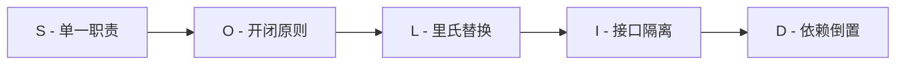
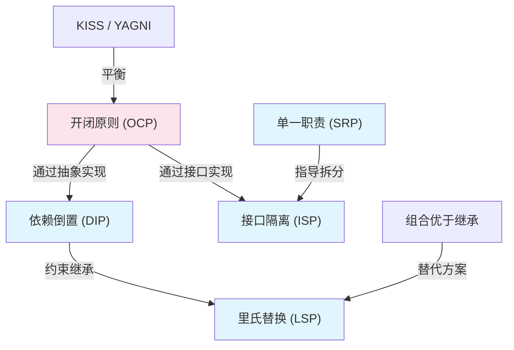

# 设计原则

## 概念说明

设计原则是设计模式的理论基础，是面向对象设计中应遵循的指导方针。掌握设计原则比记住 23 种模式更重要——原则是"道"，模式是"术"。

## SOLID 原则

SOLID 是面向对象设计的五大核心原则，由 Robert C. Martin（Uncle Bob）提出。



### 1. 单一职责原则（SRP - Single Responsibility Principle）

> 一个类应该只有一个引起它变化的原因。

```java
// ❌ 违反 SRP：一个类承担了多个职责
public class UserService {
    public void register(User user) { /* 注册逻辑 */ }
    public void sendEmail(String email) { /* 发邮件 */ }
    public String exportToExcel(List<User> users) { /* 导出 Excel */ }
}

// ✅ 遵循 SRP：每个类只负责一个职责
public class UserService { public void register(User user) { } }
public class EmailService { public void sendEmail(String email) { } }
public class UserExporter { public String exportToExcel(List<User> users) { } }
```

**判断标准**：如果你能用"和"来描述一个类的职责（如"用户管理和邮件发送和数据导出"），说明它违反了 SRP。

### 2. 开闭原则（OCP - Open/Closed Principle）

> 对扩展开放，对修改关闭。

```java
// ❌ 违反 OCP：新增支付方式需要修改已有代码
public double calculate(String type, double amount) {
    if ("alipay".equals(type)) return amount * 0.95;
    else if ("wechat".equals(type)) return amount * 0.98;
    // 新增支付方式需要在这里加 else if...
}

// ✅ 遵循 OCP：通过策略模式扩展
public interface PayStrategy { double calculate(double amount); }
// 新增支付方式只需新增实现类
public class AlipayStrategy implements PayStrategy {
    public double calculate(double amount) { return amount * 0.95; }
}
```

**核心思想**：通过抽象（接口/抽象类）来实现扩展，而不是修改已有代码。策略模式、工厂模式都是 OCP 的典型应用。

### 3. 里氏替换原则（LSP - Liskov Substitution Principle）

> 子类对象必须能够替换父类对象，且程序行为不变。

```java
// ❌ 违反 LSP：正方形继承长方形，但行为不一致
class Rectangle {
    protected int width, height;
    public void setWidth(int w) { this.width = w; }
    public void setHeight(int h) { this.height = h; }
    public int area() { return width * height; }
}
class Square extends Rectangle {
    @Override
    public void setWidth(int w) { this.width = w; this.height = w; } // 改变了父类行为！
}

// ✅ 遵循 LSP：使用组合或独立的接口
interface Shape { int area(); }
class Rectangle implements Shape { /* ... */ }
class Square implements Shape { /* ... */ }
```

**判断标准**：如果子类重写父类方法后改变了方法的语义（前置条件更严格或后置条件更宽松），就违反了 LSP。

### 4. 接口隔离原则（ISP - Interface Segregation Principle）

> 客户端不应该被迫依赖它不使用的接口。

```java
// ❌ 违反 ISP：胖接口，强迫实现不需要的方法
public interface Animal {
    void eat();
    void fly();   // 狗不会飞！
    void swim();  // 鸟不会游泳！
}

// ✅ 遵循 ISP：拆分为细粒度接口
public interface Eatable { void eat(); }
public interface Flyable { void fly(); }
public interface Swimmable { void swim(); }

public class Dog implements Eatable, Swimmable { /* ... */ }
public class Bird implements Eatable, Flyable { /* ... */ }
```

### 5. 依赖倒置原则（DIP - Dependency Inversion Principle）

> 高层模块不应该依赖低层模块，两者都应该依赖抽象。

```java
// ❌ 违反 DIP：高层直接依赖低层实现
public class OrderService {
    private MySQLOrderDao dao = new MySQLOrderDao(); // 直接依赖具体实现
}

// ✅ 遵循 DIP：依赖抽象接口
public class OrderService {
    private final OrderDao dao; // 依赖抽象
    public OrderService(OrderDao dao) { this.dao = dao; } // 构造器注入
}
```

**Spring 的 DI（依赖注入）就是 DIP 的最佳实践**：通过 `@Autowired` 注入接口，运行时由容器决定具体实现。

## 其他重要原则

### DRY（Don't Repeat Yourself）

> 不要重复自己。每一个知识点在系统中都应该有一个唯一、明确的表示。

- 重复代码 → 抽取公共方法/工具类
- 重复逻辑 → 使用模板方法模式
- 重复配置 → 使用约定优于配置

### KISS（Keep It Simple, Stupid）

> 保持简单。优先选择最简单的方案，不要过度设计。

- 能用 if-else 解决的简单场景，不需要策略模式
- 能用组合解决的，不需要复杂的继承体系
- 代码的可读性比"优雅"更重要

### YAGNI（You Ain't Gonna Need It）

> 你不会需要它。不要为未来可能的需求提前编码。

- 不要提前抽象，等到第三次重复时再重构
- 不要为"可能的扩展"预留接口
- 先让代码工作，再让代码优雅

### 组合优于继承（Composition over Inheritance）

> 优先使用对象组合，而不是类继承。

```java
// ❌ 继承：紧耦合，类爆炸
class CoffeeWithMilk extends Coffee { }
class CoffeeWithSugar extends Coffee { }
class CoffeeWithMilkAndSugar extends Coffee { } // 组合爆炸！

// ✅ 组合：灵活组合，装饰器模式
Coffee coffee = new SugarDecorator(new MilkDecorator(new SimpleCoffee()));
```

**为什么组合优于继承**：
- 继承是编译时确定的，组合是运行时确定的
- 继承破坏封装性（子类依赖父类实现细节）
- Java 只支持单继承，组合没有限制

### 迪米特法则（Law of Demeter / 最少知识原则）

> 一个对象应该对其他对象有最少的了解。只与直接朋友通信。

```java
// ❌ 违反迪米特法则：链式调用暴露了内部结构
String cityName = order.getCustomer().getAddress().getCity().getName();

// ✅ 遵循迪米特法则：封装内部细节
String cityName = order.getCustomerCityName();
```

## 原则之间的关系



**开闭原则是核心**，其他原则都是为了更好地实现开闭原则。

## 常见面试题

### Q1: 请解释 SOLID 原则？

**难度**：⭐⭐ | **频率**：🔥🔥🔥

**答题思路**：

逐个解释，每个原则给一个简短的例子。

**标准答案**：

S（单一职责）：一个类只负责一个功能领域。O（开闭原则）：对扩展开放，对修改关闭，通过抽象实现。L（里氏替换）：子类必须能替换父类且行为不变。I（接口隔离）：接口要细粒度，客户端不应依赖不需要的方法。D（依赖倒置）：依赖抽象而非具体实现，Spring DI 就是最佳实践。其中开闭原则是核心，其他原则都是为了更好地实现开闭原则。

**深入追问**：
- 在实际项目中如何应用这些原则？
- 过度设计和设计不足如何平衡？

### Q2: 组合和继承的区别？为什么推荐组合优于继承？

**难度**：⭐⭐ | **频率**：🔥🔥

**标准答案**：

继承是 is-a 关系，编译时确定，Java 只支持单继承，子类与父类紧耦合。组合是 has-a 关系，运行时确定，可以组合多个对象，更灵活。推荐组合的原因：继承破坏封装性（子类依赖父类实现细节），容易导致类爆炸，而组合通过委托实现功能复用，更符合开闭原则。装饰器模式就是组合优于继承的典型应用。

### Q3: 迪米特法则是什么？违反它会有什么问题？

**难度**：⭐⭐ | **频率**：🔥🔥

**标准答案**：

迪米特法则也叫最少知识原则，一个对象应该对其他对象有最少的了解，只与直接朋友通信。违反迪米特法则（如 `a.getB().getC().doSomething()`）会导致类之间的耦合度过高，一旦中间某个类的结构发生变化，所有调用链都需要修改。解决方式是在中间类中封装方法，隐藏内部结构。

## 参考资料

- [Clean Architecture - Robert C. Martin](https://www.amazon.com/Clean-Architecture-Craftsmans-Software-Structure/dp/0134494164)
- [Agile Software Development - Robert C. Martin](https://www.amazon.com/Agile-Software-Development-Principles-Patterns/dp/0135974445)
