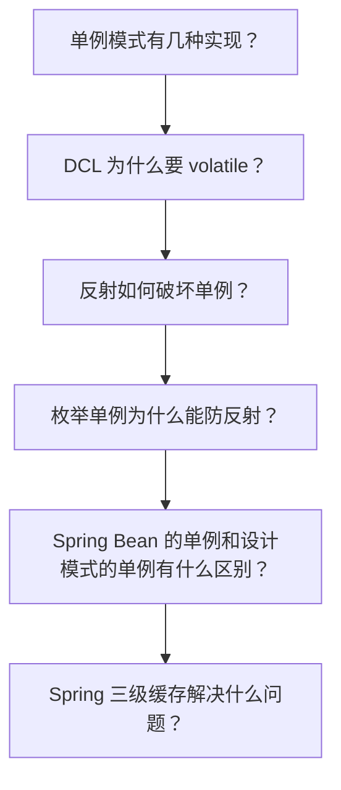
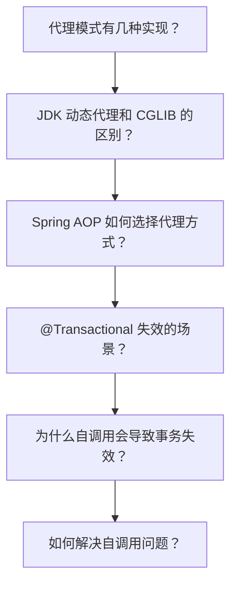
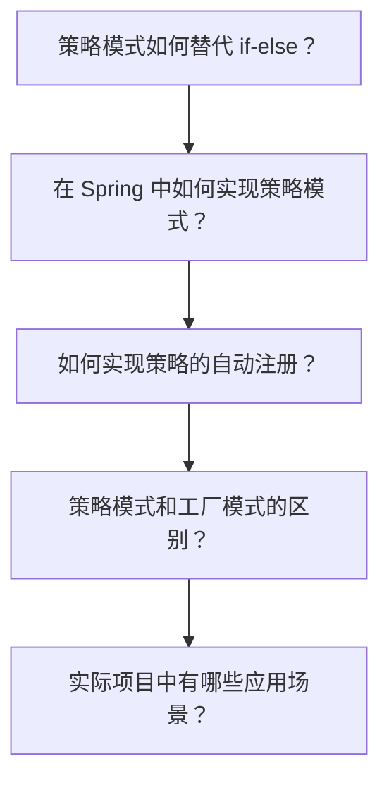
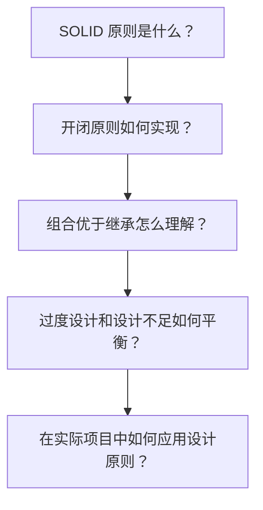

# 设计模式面试指南

## 概念说明

设计模式是 Java 面试中的常考模块，尤其在大厂面试中，经常结合 Spring 源码、JDK 源码来考察。本指南按面试频率排序，汇总设计模式的高频面试题和追问链路。

## 高频面试题汇总（按频率排序）

### 🔥🔥🔥 超高频（几乎必问）

| 序号 | 面试题 | 关联知识点 | 详细解析 |
|------|--------|-----------|----------|
| 1 | 单例模式有几种实现方式？ | [creational](./01-creational.md) | 5 种实现 + 优缺点对比 |
| 2 | Spring 中用到了哪些设计模式？ | [spring-patterns](./04-spring-patterns.md) | 至少说出 5 种 |
| 3 | 代理模式的三种实现方式？ | [structural](./02-structural.md) | 静态/JDK 动态/CGLIB |
| 4 | 策略模式如何替代 if-else？ | [behavioral](./03-behavioral.md) | 接口 + Map 注册 |
| 5 | SOLID 原则是什么？ | [principles](./05-principles.md) | 逐个解释 + 举例 |
| 6 | 工厂模式的三种形式？ | [creational](./01-creational.md) | 简单工厂/工厂方法/抽象工厂 |
| 7 | 装饰器模式和代理模式的区别？ | [structural](./02-structural.md) | 意图不同：增强 vs 控制 |

### 🔥🔥 高频（经常出现）

| 序号 | 面试题 | 关联知识点 |
|------|--------|-----------|
| 8 | DCL 单例为什么要加 volatile？ | [creational](./01-creational.md) |
| 9 | 模板方法模式在 AQS 中的应用？ | [behavioral](./03-behavioral.md) |
| 10 | 观察者模式在 Spring 中的应用？ | [spring-patterns](./04-spring-patterns.md) |
| 11 | 责任链模式在 Filter 中的应用？ | [behavioral](./03-behavioral.md) |
| 12 | 组合优于继承怎么理解？ | [principles](./05-principles.md) |
| 13 | 适配器模式在 Spring MVC 中的应用？ | [spring-patterns](./04-spring-patterns.md) |
| 14 | 建造者模式的使用场景？ | [creational](./01-creational.md) |

### 🔥 中频（偶尔出现）

| 序号 | 面试题 | 关联知识点 |
|------|--------|-----------|
| 15 | 深拷贝和浅拷贝的区别？ | [creational](./01-creational.md) |
| 16 | Integer 缓存池是什么模式？ | [structural](./02-structural.md) |
| 17 | 迪米特法则是什么？ | [principles](./05-principles.md) |
| 18 | 状态模式和策略模式的区别？ | [behavioral](./03-behavioral.md) |

## 面试追问链路

### 链路一：单例模式深入

### 链路二：代理模式 → Spring AOP

### 链路三：策略模式 → 实际应用

### 链路四：设计原则 → 实践

## 按公司类型的面试重点

### 大厂（阿里、字节、美团等）

重点考察**源码级理解**：
- Spring 中设计模式的具体应用（要说出源码类名）
- AQS 中的模板方法模式（tryAcquire/tryRelease）
- Spring AOP 的代理选择策略（DefaultAopProxyFactory）
- Spring 三级缓存与单例模式的关系
- 结合实际项目说明设计模式的应用

### 中厂

重点考察**理解和应用**：
- 单例模式的 5 种实现和优缺点
- 策略模式替代 if-else 的实际案例
- 工厂模式的三种形式
- SOLID 原则的理解

### 创业公司

重点考察**实际应用能力**：
- 在项目中使用过哪些设计模式？
- 如何用设计模式解决实际问题？
- 设计原则的基本理解

## 设计模式速记表

| 模式 | 一句话总结 | 记忆关键词 |
|------|-----------|-----------|
| 单例 | 全局唯一实例 | private 构造 + static |
| 工厂方法 | 子类决定创建什么 | 接口 + 多个工厂 |
| 抽象工厂 | 创建一族产品 | 产品族 |
| 建造者 | 分步构建复杂对象 | 链式调用 + build() |
| 原型 | 克隆创建对象 | clone() + 深浅拷贝 |
| 代理 | 控制对象访问 | AOP + 动态代理 |
| 适配器 | 接口转换 | 旧接口 → 新接口 |
| 装饰器 | 动态增强 | IO 流 + 层层包装 |
| 门面 | 简化子系统 | SLF4J |
| 策略 | 算法可替换 | 替代 if-else |
| 模板方法 | 定义算法骨架 | AQS + abstract |
| 观察者 | 事件通知 | EventListener |
| 责任链 | 请求逐级传递 | Filter 链 |

## 参考资料

- [Design Patterns: Elements of Reusable Object-Oriented Software (GoF)](https://www.amazon.com/Design-Patterns-Elements-Reusable-Object-Oriented/dp/0201633612)
- [Head First Design Patterns](https://www.oreilly.com/library/view/head-first-design/0596007124/)
- [Refactoring.Guru - 设计模式](https://refactoring.guru/design-patterns)
